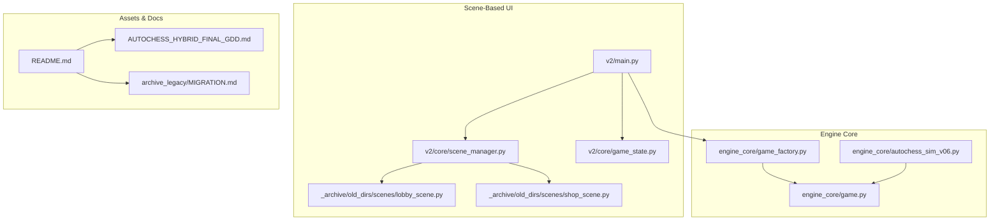
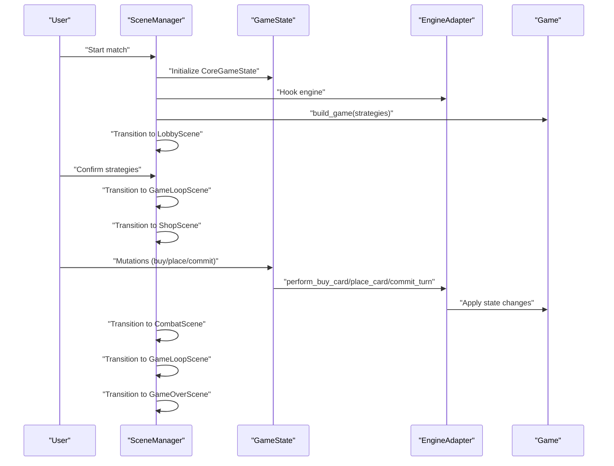
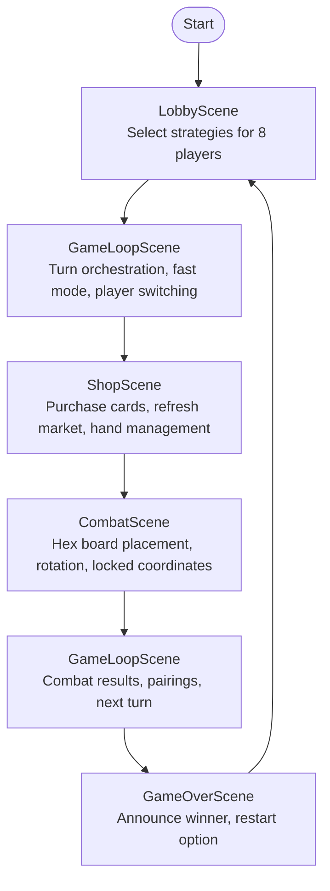
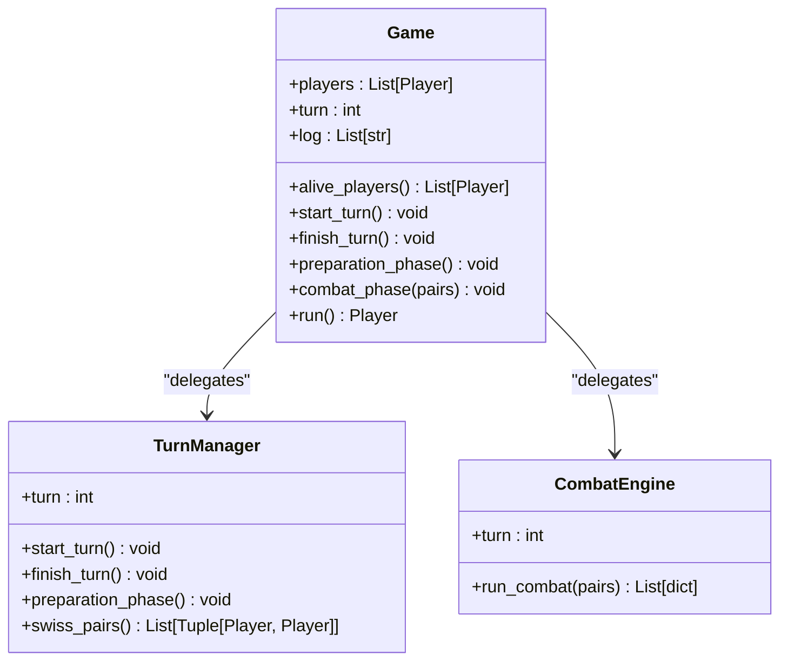
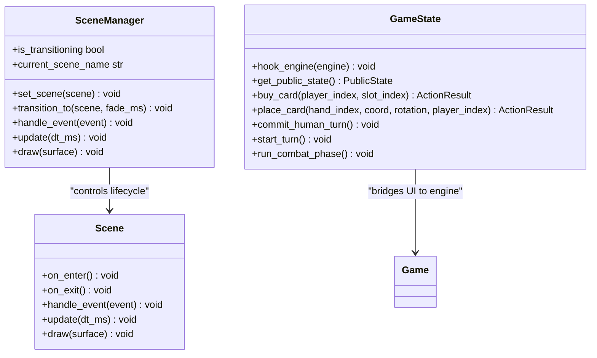
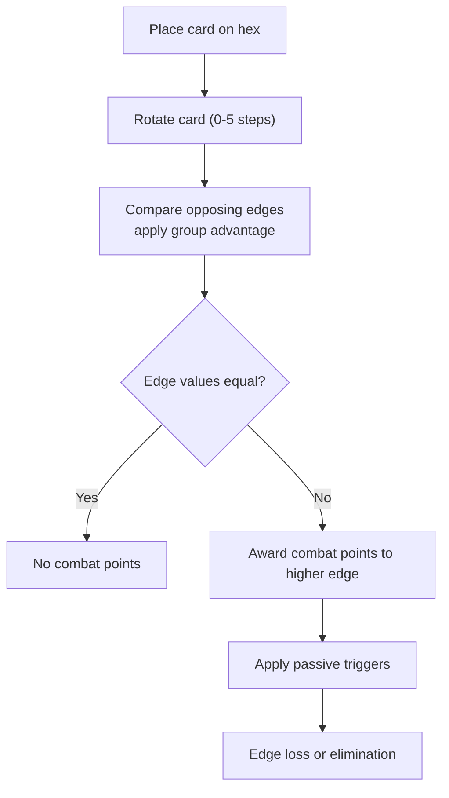
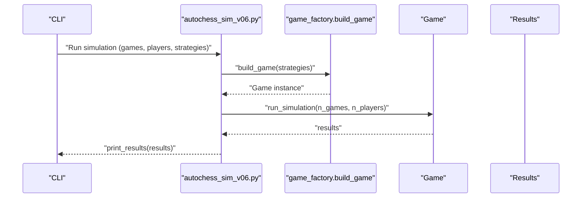
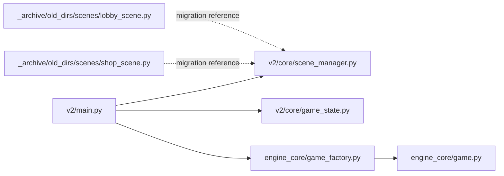

# Project Overview

<cite>
**Referenced Files in This Document**
- [README.md](file://README.md)
- [AUTOCHESS_HYBRID_FINAL_GDD.md](file://AUTOCHESS_HYBRID_FINAL_GDD.md)
- [engine_core/autochess_sim_v06.py](file://engine_core/autochess_sim_v06.py)
- [engine_core/game.py](file://engine_core/game.py)
- [engine_core/game_factory.py](file://engine_core/game_factory.py)
- [v2/main.py](file://v2/main.py)
- [v2/core/scene_manager.py](file://v2/core/scene_manager.py)
- [v2/core/game_state.py](file://v2/core/game_state.py)
- [archive_legacy/MIGRATION.md](file://archive_legacy/MIGRATION.md)
- [_archive/old_dirs/scenes/lobby_scene.py](file://_archive/old_dirs/scenes/lobby_scene.py)
- [_archive/old_dirs/scenes/shop_scene.py](file://_archive/old_dirs/scenes/shop_scene.py)
</cite>

## Table of Contents
1. [Introduction](#introduction)
2. [Project Structure](#project-structure)
3. [Core Components](#core-components)
4. [Architecture Overview](#architecture-overview)
5. [Detailed Component Analysis](#detailed-component-analysis)
6. [Dependency Analysis](#dependency-analysis)
7. [Performance Considerations](#performance-considerations)
8. [Troubleshooting Guide](#troubleshooting-guide)
9. [Conclusion](#conclusion)

## Introduction
Autochess Hybrid is a hex-grid based autochess simulation engine designed to run 8-player strategic combat simulations. It models a competitive autochess environment where each of eight players selects from a 101-card pool, places units on a 37-hex board using a hex-grid, and engages in turn-based combat governed by group synergies, combos, and a rich passive ability system. The project’s mission is to provide a robust, AI-driven framework for strategy game simulation, enabling reproducible matches, KPI tracking, and extensive experimentation with AI strategies.

The project occupies a significant role in the gaming AI research ecosystem by offering:
- A deterministic, rule-specified autochess engine suitable for AI training and evaluation
- A modular, scene-based architecture that cleanly separates UI, game orchestration, and simulation logic
- A comprehensive GDD defining turn structure, board mechanics, economy, combat resolution, and passive taxonomy
- Extensive documentation, testing, and simulation tooling for reproducibility and performance analysis

## Project Structure
The repository organizes functionality into distinct layers:
- Engine core: simulation logic, game orchestration, board mechanics, combat engine, AI strategies, and economy
- Scene-based UI: modular scenes for lobby, shop, combat, and game over, orchestrated by a scene manager
- Assets and data: card definitions, passive descriptions, and UI resources
- Scripts and tools: simulation runners, batch analyzers, and QA/validation utilities
- Documentation: GDD, migration reports, and design specs

**Diagram sources**
- [v2/main.py:37-74](file://v2/main.py#L37-L74)
- [v2/core/scene_manager.py:28-156](file://v2/core/scene_manager.py#L28-L156)
- [v2/core/game_state.py:14-173](file://v2/core/game_state.py#L14-L173)
- [_archive/old_dirs/scenes/lobby_scene.py:66-462](file://_archive/old_dirs/scenes/lobby_scene.py#L66-L462)
- [_archive/old_dirs/scenes/shop_scene.py:287-1054](file://_archive/old_dirs/scenes/shop_scene.py#L287-L1054)
- [engine_core/game_factory.py:30-70](file://engine_core/game_factory.py#L30-L70)
- [engine_core/game.py:35-224](file://engine_core/game.py#L35-L224)
- [engine_core/autochess_sim_v06.py:78-107](file://engine_core/autochess_sim_v06.py#L78-L107)
- [README.md:143-189](file://README.md#L143-L189)
- [AUTOCHESS_HYBRID_FINAL_GDD.md:1-50](file://AUTOCHESS_HYBRID_FINAL_GDD.md#L1-L50)
- [archive_legacy/MIGRATION.md:18-96](file://archive_legacy/MIGRATION.md#L18-L96)

**Section sources**
- [README.md:7-58](file://README.md#L7-L58)
- [README.md:143-189](file://README.md#L143-L189)
- [AUTOCHESS_HYBRID_FINAL_GDD.md:1-50](file://AUTOCHESS_HYBRID_FINAL_GDD.md#L1-L50)
- [archive_legacy/MIGRATION.md:18-96](file://archive_legacy/MIGRATION.md#L18-L96)

## Core Components
- Simulation engine: orchestrates 8-player matches, turn phases, market windows, preparation and combat phases, and win condition checks
- Scene manager: manages modular scenes (lobby, shop, combat, game over) with smooth transitions and input routing
- Game factory: constructs Game instances with configured strategies and dependencies
- UI bridge: GameState exposes mutation APIs for UI interactions and caches public state for rendering

Key capabilities:
- Hex-grid board with axial coordinates and 37-hex capacity
- Turn structure with preparation and combat phases
- Market system with rarity-weighted windows and refresh mechanics
- Synergy and combo scoring, passive triggers, and combat resolution pipeline
- AI strategies and KPI aggregation for simulation runs

**Section sources**
- [engine_core/game.py:35-224](file://engine_core/game.py#L35-L224)
- [engine_core/game_factory.py:30-70](file://engine_core/game_factory.py#L30-L70)
- [v2/core/scene_manager.py:28-156](file://v2/core/scene_manager.py#L28-L156)
- [v2/core/game_state.py:14-173](file://v2/core/game_state.py#L14-L173)
- [engine_core/autochess_sim_v06.py:78-107](file://engine_core/autochess_sim_v06.py#L78-L107)

## Architecture Overview
Autochess Hybrid evolved from a monolithic legacy system to a modern scene-based architecture. The legacy run_game.py (over 730 lines) is being decomposed into specialized scenes while preserving all game logic. The new architecture centers around:
- SceneManager coordinating scene lifecycles and transitions
- CoreGameState holding persistent state across scenes
- UI adapters bridging GameState to rendering and user input
- EngineAdapter exposing mutation methods to the UI layer

**Diagram sources**
- [v2/main.py:37-74](file://v2/main.py#L37-L74)
- [v2/core/scene_manager.py:28-156](file://v2/core/scene_manager.py#L28-L156)
- [v2/core/game_state.py:37-173](file://v2/core/game_state.py#L37-L173)
- [engine_core/game_factory.py:30-70](file://engine_core/game_factory.py#L30-L70)
- [engine_core/game.py:35-224](file://engine_core/game.py#L35-L224)
- [archive_legacy/MIGRATION.md:22-37](file://archive_legacy/MIGRATION.md#L22-L37)

**Section sources**
- [archive_legacy/MIGRATION.md:18-96](file://archive_legacy/MIGRATION.md#L18-L96)
- [v2/main.py:14-74](file://v2/main.py#L14-L74)
- [v2/core/scene_manager.py:28-156](file://v2/core/scene_manager.py#L28-L156)
- [v2/core/game_state.py:14-173](file://v2/core/game_state.py#L14-L173)

## Detailed Component Analysis

### Simulation Workflow: From Lobby Selection to Combat Resolution
This workflow demonstrates the end-to-end flow from strategy selection through combat resolution, highlighting the scene-based architecture and engine orchestration.

Practical example steps:
- Strategy selection: Players choose AI strategies in the lobby; transitions pass strategies to the game loop
- Turn orchestration: GameLoopScene advances turns, handles fast mode, and displays combat results
- Shop phase: Players buy cards from weighted windows; hand overflow is managed; market refresh costs gold
- Combat placement: Players select cards from hand, rotate hexes, and place on the 37-hex board with placement limits and locked coordinates
- Combat resolution: Pairwise combat resolves per-edge strengths, applying group advantages, combos, synergy bonuses, and passive triggers; damage computed and HP updated
- Game over: Winner determined by HP; restart returns to lobby

**Diagram sources**
- [archive_legacy/MIGRATION.md:31-89](file://archive_legacy/MIGRATION.md#L31-L89)
- [AUTOCHESS_HYBRID_FINAL_GDD.md:104-190](file://AUTOCHESS_HYBRID_FINAL_GDD.md#L104-L190)
- [v2/core/scene_manager.py:28-156](file://v2/core/scene_manager.py#L28-L156)

**Section sources**
- [archive_legacy/MIGRATION.md:31-89](file://archive_legacy/MIGRATION.md#L31-L89)
- [AUTOCHESS_HYBRID_FINAL_GDD.md:104-190](file://AUTOCHESS_HYBRID_FINAL_GDD.md#L104-L190)
- [_archive/old_dirs/scenes/lobby_scene.py:140-156](file://_archive/old_dirs/scenes/lobby_scene.py#L140-L156)
- [_archive/old_dirs/scenes/shop_scene.py:444-532](file://_archive/old_dirs/scenes/shop_scene.py#L444-L532)

### Engine Orchestration and Turn Management
The Game class centralizes turn orchestration, delegating preparation and combat phases to TurnManager and CombatEngine respectively. It coordinates Swiss pairing, passive triggers, and post-combat cleanup.

**Diagram sources**
- [engine_core/game.py:35-224](file://engine_core/game.py#L35-L224)

**Section sources**
- [engine_core/game.py:35-224](file://engine_core/game.py#L35-L224)

### Scene-Based Architecture and State Management
The scene-based architecture cleanly separates persistent state (CoreGameState) from transient UI state (UIState). Scenes communicate via SceneManager and receive data through transition kwargs.

**Diagram sources**
- [v2/core/scene_manager.py:4-156](file://v2/core/scene_manager.py#L4-L156)
- [v2/core/game_state.py:14-173](file://v2/core/game_state.py#L14-L173)

**Section sources**
- [v2/core/scene_manager.py:28-156](file://v2/core/scene_manager.py#L28-L156)
- [v2/core/game_state.py:14-173](file://v2/core/game_state.py#L14-L173)
- [archive_legacy/MIGRATION.md:96-156](file://archive_legacy/MIGRATION.md#L96-L156)

### Hex-Grid and Board Mechanics
The hex-grid system uses axial coordinates with a radius of three, yielding a 37-hex board. Cards are placed with rotation affecting which stat faces which direction, and edge loss occurs when stats reach zero.

**Diagram sources**
- [AUTOCHESS_HYBRID_FINAL_GDD.md:195-275](file://AUTOCHESS_HYBRID_FINAL_GDD.md#L195-L275)

**Section sources**
- [AUTOCHESS_HYBRID_FINAL_GDD.md:195-275](file://AUTOCHESS_HYBRID_FINAL_GDD.md#L195-L275)

### AI Strategy Integration and Simulation
The engine supports multiple AI strategies and can run large-scale simulations with configurable parameters. The simulation runner validates card pools, initializes strategies, and aggregates results.

**Diagram sources**
- [engine_core/autochess_sim_v06.py:78-107](file://engine_core/autochess_sim_v06.py#L78-L107)
- [engine_core/game_factory.py:30-70](file://engine_core/game_factory.py#L30-L70)
- [engine_core/game.py:203-224](file://engine_core/game.py#L203-L224)

**Section sources**
- [engine_core/autochess_sim_v06.py:78-107](file://engine_core/autochess_sim_v06.py#L78-L107)
- [engine_core/game_factory.py:30-70](file://engine_core/game_factory.py#L30-L70)
- [engine_core/game.py:203-224](file://engine_core/game.py#L203-L224)

## Dependency Analysis
The project exhibits clean separation of concerns:
- v2/main.py depends on engine_core/game_factory to construct Game instances and on v2/core/scene_manager to orchestrate scenes
- v2/core/game_state.py bridges UI mutations to engine operations via EngineAdapter
- engine_core/game.py delegates turn and combat logic to TurnManager and CombatEngine
- Legacy scenes (lobby_scene.py, shop_scene.py) demonstrate the prior monolithic approach and inform the migration

**Diagram sources**
- [v2/main.py:14-74](file://v2/main.py#L14-L74)
- [v2/core/scene_manager.py:28-156](file://v2/core/scene_manager.py#L28-L156)
- [v2/core/game_state.py:14-173](file://v2/core/game_state.py#L14-L173)
- [engine_core/game_factory.py:30-70](file://engine_core/game_factory.py#L30-L70)
- [engine_core/game.py:35-224](file://engine_core/game.py#L35-L224)
- [_archive/old_dirs/scenes/lobby_scene.py:66-462](file://_archive/old_dirs/scenes/lobby_scene.py#L66-L462)
- [_archive/old_dirs/scenes/shop_scene.py:287-1054](file://_archive/old_dirs/scenes/shop_scene.py#L287-L1054)

**Section sources**
- [v2/main.py:14-74](file://v2/main.py#L14-L74)
- [engine_core/game_factory.py:30-70](file://engine_core/game_factory.py#L30-L70)
- [engine_core/game.py:35-224](file://engine_core/game.py#L35-L224)
- [archive_legacy/MIGRATION.md:18-96](file://archive_legacy/MIGRATION.md#L18-L96)

## Performance Considerations
- Scene-based architecture improves maintainability and testability, enabling incremental development and UI responsiveness
- GameState caching avoids expensive recomputation of public state; cache invalidation occurs on mutations
- Simulation runner supports batch processing and verbosity controls for performance profiling
- Hex-grid operations and passive triggers are optimized through efficient data structures and minimal allocations

[No sources needed since this section provides general guidance]

## Troubleshooting Guide
Common issues and remedies:
- Scene transitions: Ensure transitions occur at safe points; avoid input during fade transitions
- State duplication: Persist only saveable state in CoreGameState; throwaway state belongs in UIState
- Legacy compatibility: Use the feature flag to switch between legacy and scene-based architectures during migration
- Card pool validation: Run card pool verification before simulations to catch stat/cost violations
- UI responsiveness: Use GameState mutation APIs to trigger cache invalidation and redraw updates

**Section sources**
- [archive_legacy/MIGRATION.md:116-156](file://archive_legacy/MIGRATION.md#L116-L156)
- [engine_core/autochess_sim_v06.py:53-71](file://engine_core/autochess_sim_v06.py#L53-L71)
- [v2/core/game_state.py:55-65](file://v2/core/game_state.py#L55-L65)

## Conclusion
Autochess Hybrid delivers a mature, scene-based autochess simulation engine capable of 8-player strategic combat with rich mechanics spanning hex-grid placement, synergy and combo scoring, passive abilities, and turn-based economy. Its evolution from a monolithic legacy system to a modular architecture positions it as a strong foundation for AI strategy research, enabling reproducible simulations, detailed KPI tracking, and extensible experimentation. The combination of a comprehensive GDD, robust engine orchestration, and clean UI bridges makes it a valuable resource for both researchers and developers working on strategy game simulation frameworks.