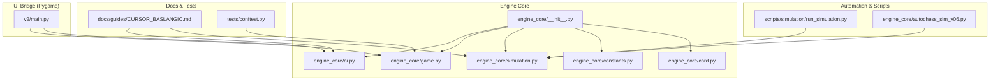
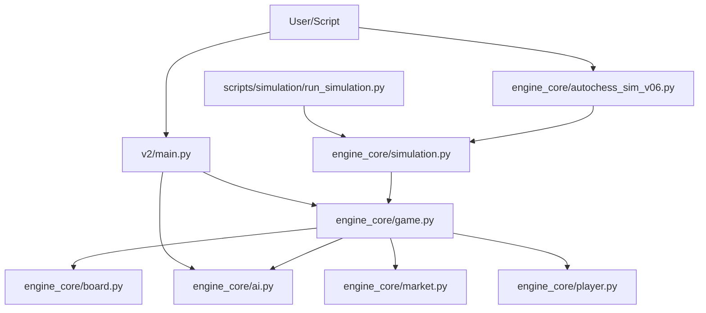
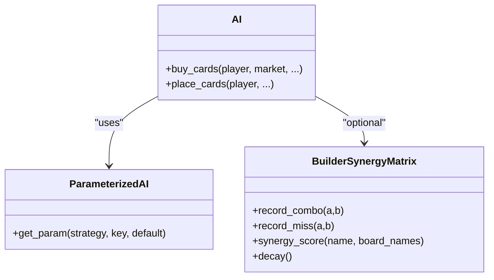
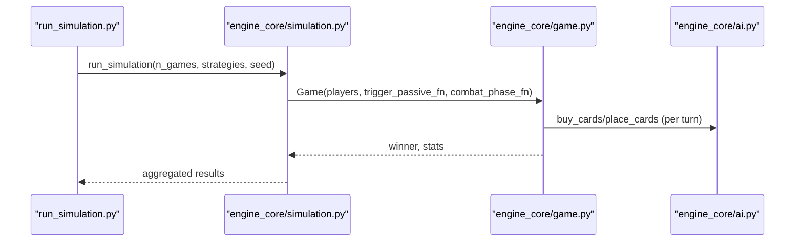
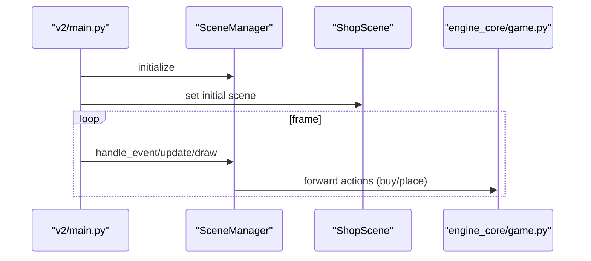
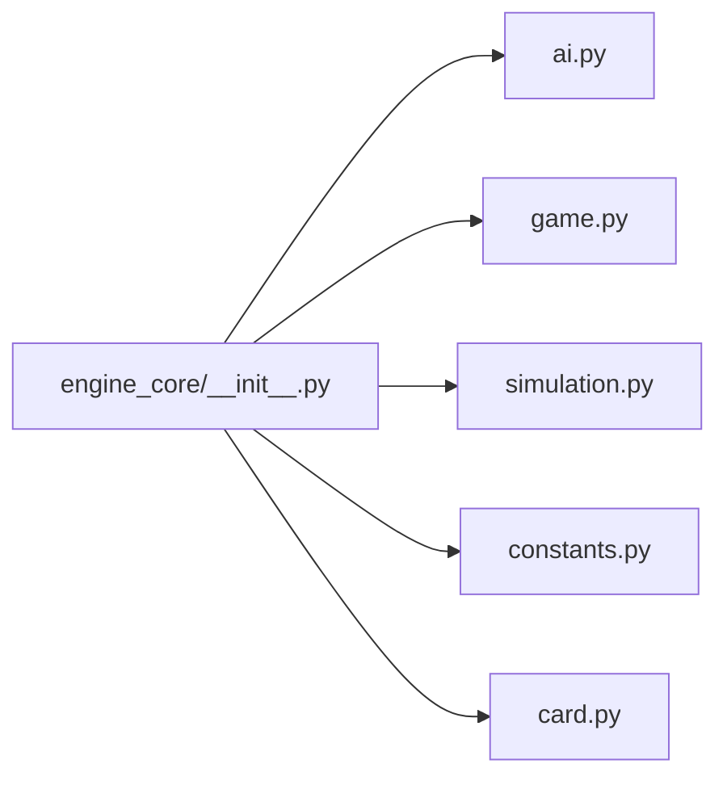

# Target Audience

<cite>
**Referenced Files in This Document**
- [README.md](file://README.md)
- [AUTOCHESS_HYBRID_FINAL_GDD.md](file://AUTOCHESS_HYBRID_FINAL_GDD.md)
- [engine_core/__init__.py](file://engine_core/__init__.py)
- [engine_core/constants.py](file://engine_core/constants.py)
- [engine_core/card.py](file://engine_core/card.py)
- [engine_core/ai.py](file://engine_core/ai.py)
- [engine_core/simulation.py](file://engine_core/simulation.py)
- [engine_core/game.py](file://engine_core/game.py)
- [engine_core/autochess_sim_v06.py](file://engine_core/autochess_sim_v06.py)
- [scripts/simulation/run_simulation.py](file://scripts/simulation/run_simulation.py)
- [v2/main.py](file://v2/main.py)
- [docs/guides/CURSOR_BASLANGIC.md](file://docs/guides/CURSOR_BASLANGIC.md)
- [tests/conftest.py](file://tests/conftest.py)
</cite>

## Table of Contents
1. [Introduction](#introduction)
2. [Project Structure](#project-structure)
3. [Core Components](#core-components)
4. [Architecture Overview](#architecture-overview)
5. [Detailed Component Analysis](#detailed-component-analysis)
6. [Dependency Analysis](#dependency-analysis)
7. [Performance Considerations](#performance-considerations)
8. [Troubleshooting Guide](#troubleshooting-guide)
9. [Conclusion](#conclusion)
10. [Appendices](#appendices)

## Introduction
Autochess Hybrid is a hex-grid autochess simulation engine designed for experimentation, research, and practical game development. It supports:
- Automated multi-strategy matches with 8 players
- A 37-hex hex grid board
- Rich mechanics: combos, synergies, passives, economy, evolution, and card rotation
- A robust simulation framework for statistical analysis
- A modern scene-based architecture with a Pygame-based UI bridge

This document focuses on the target audience and how different user groups can engage with the project effectively.

## Project Structure
The repository is organized around a modular engine core, a scene-based UI bridge, and extensive tooling for simulation, testing, and documentation.

**Diagram sources**
- [engine_core/__init__.py:1-46](file://engine_core/__init__.py#L1-L46)
- [engine_core/ai.py:1-120](file://engine_core/ai.py#L1-L120)
- [engine_core/game.py:1-120](file://engine_core/game.py#L1-L120)
- [engine_core/simulation.py:1-120](file://engine_core/simulation.py#L1-L120)
- [engine_core/constants.py:1-145](file://engine_core/constants.py#L1-L145)
- [engine_core/card.py:1-120](file://engine_core/card.py#L1-L120)
- [v2/main.py:1-74](file://v2/main.py#L1-L74)
- [scripts/simulation/run_simulation.py:1-120](file://scripts/simulation/run_simulation.py#L1-L120)
- [engine_core/autochess_sim_v06.py:1-107](file://engine_core/autochess_sim_v06.py#L1-L107)
- [docs/guides/CURSOR_BASLANGIC.md:1-120](file://docs/guides/CURSOR_BASLANGIC.md#L1-L120)
- [tests/conftest.py:1-27](file://tests/conftest.py#L1-L27)

**Section sources**
- [README.md:1-120](file://README.md#L1-L120)
- [engine_core/__init__.py:1-46](file://engine_core/__init__.py#L1-L46)

## Core Components
- Engine core exports a concise public API for consumers, including Card, Board, Player, Market, Game, run_simulation, and strategy logging utilities.
- AI module defines multiple strategies (random, warrior, builder, evolver, economist, balancer, rare_hunter, tempo) with parameterized behavior and synergy matrices.
- Simulation module orchestrates multi-game runs, aggregates statistics, and writes structured logs.
- Game module coordinates turn lifecycle, market, combat, and player states with injected dependencies.
- UI bridge integrates the engine with Pygame scenes for interactive play.

Key entry points:
- Automated simulation: [engine_core/autochess_sim_v06.py:78-107](file://engine_core/autochess_sim_v06.py#L78-L107)
- Scripted 500-game reliability test: [scripts/simulation/run_simulation.py:65-120](file://scripts/simulation/run_simulation.py#L65-L120)
- Scene-based UI bootstrap: [v2/main.py:14-40](file://v2/main.py#L14-L40)

**Section sources**
- [engine_core/__init__.py:1-46](file://engine_core/__init__.py#L1-L46)
- [engine_core/ai.py:1-120](file://engine_core/ai.py#L1-L120)
- [engine_core/simulation.py:113-218](file://engine_core/simulation.py#L113-L218)
- [engine_core/game.py:35-120](file://engine_core/game.py#L35-L120)
- [engine_core/autochess_sim_v06.py:78-107](file://engine_core/autochess_sim_v06.py#L78-L107)
- [scripts/simulation/run_simulation.py:65-120](file://scripts/simulation/run_simulation.py#L65-L120)
- [v2/main.py:14-40](file://v2/main.py#L14-L40)

## Architecture Overview
The system separates concerns across engine core, AI strategies, simulation, and UI bridge. The engine exposes a stable API, while the UI and scripts consume it for automation and interactivity.

**Diagram sources**
- [engine_core/autochess_sim_v06.py:78-107](file://engine_core/autochess_sim_v06.py#L78-L107)
- [engine_core/simulation.py:113-218](file://engine_core/simulation.py#L113-L218)
- [engine_core/game.py:35-120](file://engine_core/game.py#L35-L120)
- [engine_core/ai.py:1-120](file://engine_core/ai.py#L1-L120)
- [v2/main.py:14-40](file://v2/main.py#L14-L40)
- [scripts/simulation/run_simulation.py:65-120](file://scripts/simulation/run_simulation.py#L65-L120)

**Section sources**
- [engine_core/__init__.py:1-46](file://engine_core/__init__.py#L1-L46)
- [engine_core/game.py:35-120](file://engine_core/game.py#L35-L120)
- [v2/main.py:14-40](file://v2/main.py#L14-L40)

## Detailed Component Analysis

### AI Strategies for Researchers and Engineers
Researchers can study strategy performance, parameter sensitivity, and emergent behaviors. Engineers can tune strategies for competitive balance or benchmarking.

- Strategy parameters are loaded from JSON and applied consistently across runs.
- Builder synergy matrix learns adjacency benefits per session and decays over time.
- Placement logic balances combo potential with power and center control depending on strategy.

Practical usage:
- Automated tuning and evaluation via [engine_core/ai.py:78-120](file://engine_core/ai.py#L78-L120) and [engine_core/simulation.py:113-218](file://engine_core/simulation.py#L113-L218).
- Strategy logging for analytics via [engine_core/simulation.py:135-140](file://engine_core/simulation.py#L135-L140).

**Diagram sources**
- [engine_core/ai.py:78-210](file://engine_core/ai.py#L78-L210)
- [engine_core/simulation.py:135-140](file://engine_core/simulation.py#L135-L140)

**Section sources**
- [engine_core/ai.py:78-210](file://engine_core/ai.py#L78-L210)
- [engine_core/simulation.py:113-218](file://engine_core/simulation.py#L113-L218)

### Simulation Engine for Experimentation and Benchmarking
The simulation runner executes many games, aggregates statistics, and writes logs for downstream analysis.

- Determinism checks and structured outputs are supported for reproducible research.
- Logs include evolution summaries, passive triggers, combat ratios, and card survival.

Entry points:
- CLI entrypoint: [engine_core/autochess_sim_v06.py:78-107](file://engine_core/autochess_sim_v06.py#L78-L107)
- Scripted reliability test: [scripts/simulation/run_simulation.py:65-120](file://scripts/simulation/run_simulation.py#L65-L120)

**Diagram sources**
- [scripts/simulation/run_simulation.py:65-120](file://scripts/simulation/run_simulation.py#L65-L120)
- [engine_core/simulation.py:113-218](file://engine_core/simulation.py#L113-L218)
- [engine_core/game.py:203-224](file://engine_core/game.py#L203-L224)
- [engine_core/ai.py:350-380](file://engine_core/ai.py#L350-L380)

**Section sources**
- [engine_core/simulation.py:113-218](file://engine_core/simulation.py#L113-L218)
- [scripts/simulation/run_simulation.py:65-120](file://scripts/simulation/run_simulation.py#L65-L120)
- [engine_core/autochess_sim_v06.py:78-107](file://engine_core/autochess_sim_v06.py#L78-L107)

### UI Bridge for Interactive Play and Prototyping
The scene-based UI integrates the engine with Pygame, enabling interactive demos and prototyping.

- Bootstrap loads assets and builds a game with human and AI strategies.
- The scene manager coordinates transitions and delegates events to the current scene.

Entry point:
- [v2/main.py:14-74](file://v2/main.py#L14-L74)

**Diagram sources**
- [v2/main.py:14-74](file://v2/main.py#L14-L74)

**Section sources**
- [v2/main.py:14-74](file://v2/main.py#L14-L74)

### Game Mechanics for Strategy Analysts
Strategy analysts can leverage the Game orchestration and documented mechanics to evaluate meta shifts, balance, and deck archetypes.

Key mechanics:
- Turn structure, preparation and combat phases, Swiss pairing, and win condition.
- Hex grid, combos, synergies, passives, economy, and evolution.

Reference:
- [AUTOCHESS_HYBRID_FINAL_GDD.md:99-189](file://AUTOCHESS_HYBRID_FINAL_GDD.md#L99-L189)

**Section sources**
- [AUTOCHESS_HYBRID_FINAL_GDD.md:99-189](file://AUTOCHESS_HYBRID_FINAL_GDD.md#L99-L189)
- [engine_core/game.py:203-224](file://engine_core/game.py#L203-L224)

## Dependency Analysis
The engine core exposes a focused API surface. Consumers import from engine_core and rely on internal modules for mechanics.

**Diagram sources**
- [engine_core/__init__.py:1-46](file://engine_core/__init__.py#L1-L46)

**Section sources**
- [engine_core/__init__.py:1-46](file://engine_core/__init__.py#L1-L46)

## Performance Considerations
- Simulation throughput: The 500-game script measures runtime and games per second to monitor regressions.
- Determinism: Reproducible seeds and deterministic strategies ensure consistent results across runs.
- Strategy logging: Enables post-run analytics without runtime overhead in production simulations.

[No sources needed since this section provides general guidance]

## Troubleshooting Guide
Common issues and remedies:
- Environment setup: Ensure Python 3.14+ and virtual environment activation before installing dependencies.
- Headless testing: Pytest fixtures initialize a dummy SDL driver to avoid hardware-dependent failures.
- Determinism verification: Use the 500-game script’s determinism check to detect non-repeatable behavior.

Entry points:
- Environment and testing setup: [tests/conftest.py:15-27](file://tests/conftest.py#L15-L27)
- Determinism check: [scripts/simulation/run_simulation.py:34-63](file://scripts/simulation/run_simulation.py#L34-L63)

**Section sources**
- [tests/conftest.py:15-27](file://tests/conftest.py#L15-L27)
- [scripts/simulation/run_simulation.py:34-63](file://scripts/simulation/run_simulation.py#L34-L63)

## Conclusion
Autochess Hybrid offers a versatile platform for multiple audiences:
- AI researchers can tune and evaluate strategies, run large-scale simulations, and analyze logs.
- Game developers can prototype mechanics, validate balance, and integrate the engine into tools or UIs.
- Strategy analysts can study meta trends, deck archetypes, and competitive dynamics.
- Simulation engineers can automate reliability tests, benchmark performance, and generate structured reports.

The project’s modular architecture, clear entry points, and comprehensive documentation facilitate both beginner-friendly exploration and advanced experimentation.

[No sources needed since this section summarizes without analyzing specific files]

## Appendices

### Target Audience Segmentation and Entry Points

- AI researchers
  - Skill level: Intermediate to advanced; comfort with Python, statistics, and optimization.
  - Prerequisites: Python fundamentals, familiarity with simulation and logging pipelines.
  - Entry points:
    - Strategy parameterization and tuning: [engine_core/ai.py:78-120](file://engine_core/ai.py#L78-L120)
    - Simulation runs and analytics: [engine_core/simulation.py:113-218](file://engine_core/simulation.py#L113-L218), [scripts/simulation/run_simulation.py:65-120](file://scripts/simulation/run_simulation.py#L65-L120)
    - Determinism and reliability: [scripts/simulation/run_simulation.py:34-63](file://scripts/simulation/run_simulation.py#L34-L63)

- Game developers
  - Skill level: Intermediate to advanced; comfortable with game loops, state machines, and UI integration.
  - Prerequisites: Python, basic understanding of hex-grid systems and turn-based mechanics.
  - Entry points:
    - Engine API and mechanics: [engine_core/__init__.py:1-46](file://engine_core/__init__.py#L1-L46), [AUTOCHESS_HYBRID_FINAL_GDD.md:99-189](file://AUTOCHESS_HYBRID_FINAL_GDD.md#L99-L189)
    - Scene-based UI bridge: [v2/main.py:14-74](file://v2/main.py#L14-L74)
    - Constants and balancing: [engine_core/constants.py:144-145](file://engine_core/constants.py#L144-L145)

- Strategy analysts
  - Skill level: Intermediate; ability to interpret logs and KPIs.
  - Prerequisites: Basic statistics and spreadsheet analysis.
  - Entry points:
    - Simulation outputs and logs: [engine_core/simulation.py:32-107](file://engine_core/simulation.py#L32-L107), [scripts/simulation/run_simulation.py:214-227](file://scripts/simulation/run_simulation.py#L214-L227)
    - Game design reference: [AUTOCHESS_HYBRID_FINAL_GDD.md:99-189](file://AUTOCHESS_HYBRID_FINAL_GDD.md#L99-L189)

- Simulation engineers
  - Skill level: Advanced; experienced with CI, benchmarking, and reproducibility.
  - Prerequisites: Automation, logging, and performance profiling.
  - Entry points:
    - Determinism and throughput: [scripts/simulation/run_simulation.py:34-63](file://scripts/simulation/run_simulation.py#L34-L63), [scripts/simulation/run_simulation.py:229-269](file://scripts/simulation/run_simulation.py#L229-L269)
    - Public API and constants: [engine_core/__init__.py:1-46](file://engine_core/__init__.py#L1-L46), [engine_core/constants.py:144-145](file://engine_core/constants.py#L144-L145)

### Beginner vs Advanced Guidance
- Beginners
  - Start with the CLI entrypoint and documentation guide:
    - [engine_core/autochess_sim_v06.py:78-107](file://engine_core/autochess_sim_v06.py#L78-L107)
    - [docs/guides/CURSOR_BASLANGIC.md:19-34](file://docs/guides/CURSOR_BASLANGIC.md#L19-L34)
  - Explore the scene-based UI for interactive play:
    - [v2/main.py:14-74](file://v2/main.py#L14-L74)

- Advanced users
  - Extend AI strategies and synergy matrices:
    - [engine_core/ai.py:135-210](file://engine_core/ai.py#L135-L210)
  - Build custom simulations and logs:
    - [engine_core/simulation.py:113-218](file://engine_core/simulation.py#L113-L218)
  - Integrate with external tools and CI:
    - [scripts/simulation/run_simulation.py:229-269](file://scripts/simulation/run_simulation.py#L229-L269)

### Accessibility for Different Developer Profiles
- Python developers familiar with Pygame
  - Use the scene-based UI bridge and Pygame integration:
    - [v2/main.py:14-74](file://v2/main.py#L14-L74)
  - Leverage the engine core API for game logic:
    - [engine_core/__init__.py:1-46](file://engine_core/__init__.py#L1-L46)

- Researchers focusing on AI optimization
  - Utilize parameterized strategies and strategy logging:
    - [engine_core/ai.py:78-120](file://engine_core/ai.py#L78-L120)
    - [engine_core/simulation.py:135-140](file://engine_core/simulation.py#L135-L140)
  - Validate card pools and constants:
    - [engine_core/autochess_sim_v06.py:53-72](file://engine_core/autochess_sim_v06.py#L53-L72)
    - [engine_core/constants.py:144-145](file://engine_core/constants.py#L144-L145)

### Practical Engagement Pathways
- Academic research and experimentation
  - Run large-scale simulations and analyze logs:
    - [engine_core/simulation.py:113-218](file://engine_core/simulation.py#L113-L218)
    - [scripts/simulation/run_simulation.py:65-120](file://scripts/simulation/run_simulation.py#L65-L120)
  - Study mechanics and balance:
    - [AUTOCHESS_HYBRID_FINAL_GDD.md:99-189](file://AUTOCHESS_HYBRID_FINAL_GDD.md#L99-L189)

- Commercial game development and competitive analysis
  - Prototype mechanics and UI:
    - [v2/main.py:14-74](file://v2/main.py#L14-L74)
  - Evaluate strategy performance and meta:
    - [engine_core/ai.py:350-380](file://engine_core/ai.py#L350-L380)
    - [engine_core/simulation.py:225-284](file://engine_core/simulation.py#L225-L284)