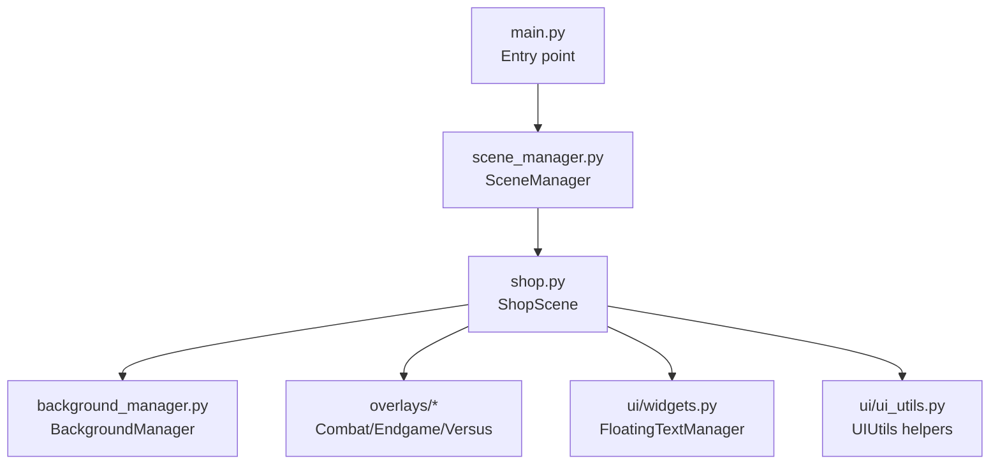
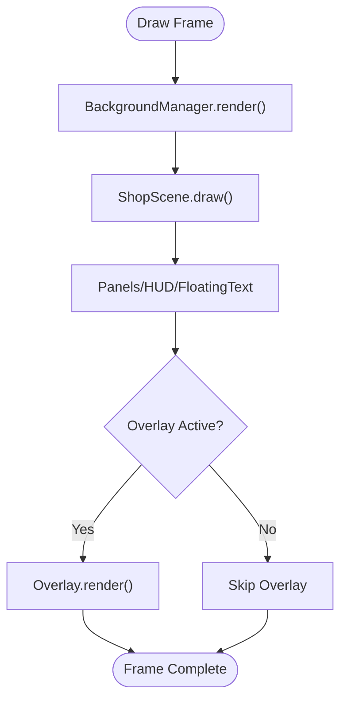
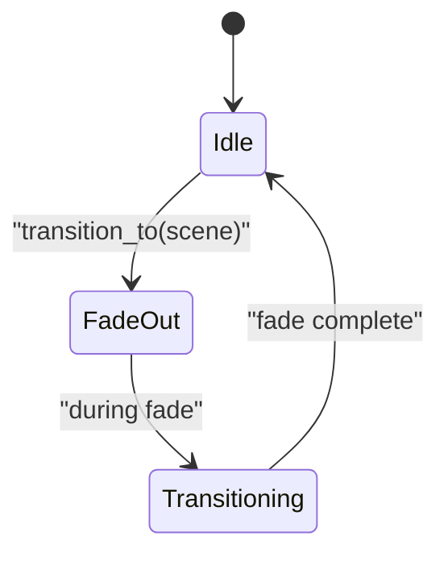
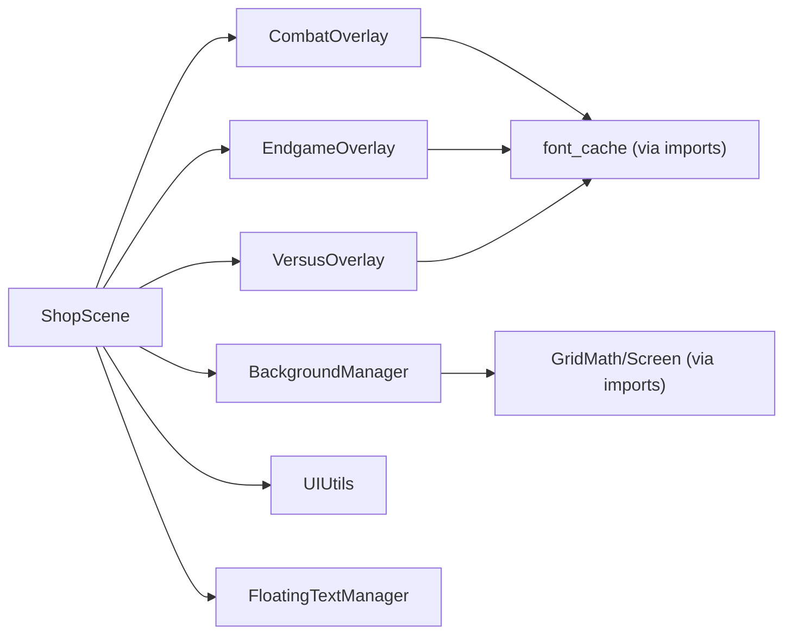

# Overlay Systems

<cite>
**Referenced Files in This Document**
- [combat_overlay.py](file://v2/ui/overlays/combat_overlay.py)
- [endgame_overlay.py](file://v2/ui/overlays/endgame_overlay.py)
- [versus_overlay.py](file://v2/ui/overlays/versus_overlay.py)
- [background_manager.py](file://v2/ui/background_manager.py)
- [shop.py](file://v2/scenes/shop.py)
- [scene_manager.py](file://v2/core/scene_manager.py)
- [main.py](file://v2/main.py)
- [ui_utils.py](file://v2/ui/ui_utils.py)
- [widgets.py](file://v2/ui/widgets.py)
</cite>

## Table of Contents
1. [Introduction](#introduction)
2. [Project Structure](#project-structure)
3. [Core Components](#core-components)
4. [Architecture Overview](#architecture-overview)
5. [Detailed Component Analysis](#detailed-component-analysis)
6. [Dependency Analysis](#dependency-analysis)
7. [Performance Considerations](#performance-considerations)
8. [Troubleshooting Guide](#troubleshooting-guide)
9. [Conclusion](#conclusion)

## Introduction
This document explains the Overlay Systems used in the game’s UI, focusing on combat overlays, endgame displays, versus splash screens, and background management. It covers overlay rendering hierarchy, transparency handling, user interaction blocking, lifecycle and transitions, state management, and integration with the main UI and scene transitions. Practical examples are provided via code paths to help both beginners and advanced developers customize and troubleshoot overlays effectively.

## Project Structure
Overlays are lightweight, self-contained UI components that render on top of the active scene. They receive input events, update their internal state, and draw themselves after the base scene content. Background rendering is handled separately and layered beneath overlays.



**Diagram sources**
- [main.py:37-74](file://v2/main.py#L37-L74)
- [scene_manager.py:28-156](file://v2/core/scene_manager.py#L28-L156)
- [shop.py:23-682](file://v2/scenes/shop.py#L23-L682)
- [background_manager.py:5-84](file://v2/ui/background_manager.py#L5-L84)
- [widgets.py:169-279](file://v2/ui/widgets.py#L169-L279)
- [ui_utils.py:3-90](file://v2/ui/ui_utils.py#L3-L90)

**Section sources**
- [main.py:37-74](file://v2/main.py#L37-L74)
- [scene_manager.py:28-156](file://v2/core/scene_manager.py#L28-L156)
- [shop.py:23-682](file://v2/scenes/shop.py#L23-L682)

## Core Components
- Overlay base behavior: Each overlay implements handle_event, update, and render. They manage their own timers, visibility, and user interactions.
- ShopScene orchestrates overlays per phase and forwards events to the active overlay.
- BackgroundManager renders a dynamic hex pattern with vignette, drawn before overlays.
- UI utilities provide reusable drawing helpers for gradients and glows.

Key responsibilities:
- Rendering order: BackgroundManager → scene content → overlays
- Event routing: ShopScene routes events to the active overlay based on current phase
- Lifecycle: Overlays are created on phase transitions and destroyed when finished or when transitioning away

**Section sources**
- [combat_overlay.py:5-86](file://v2/ui/overlays/combat_overlay.py#L5-L86)
- [endgame_overlay.py:5-113](file://v2/ui/overlays/endgame_overlay.py#L5-L113)
- [versus_overlay.py:5-66](file://v2/ui/overlays/versus_overlay.py#L5-L66)
- [background_manager.py:19-84](file://v2/ui/background_manager.py#L19-L84)
- [shop.py:127-149](file://v2/scenes/shop.py#L127-L149)
- [ui_utils.py:3-90](file://v2/ui/ui_utils.py#L3-L90)

## Architecture Overview
The overlay system integrates with the scene manager and ShopScene. The scene manager handles cross-fade transitions and blocks input during transitions. ShopScene manages overlay instances per phase and delegates rendering and updates to overlays.

```mermaid
sequenceDiagram
participant Game as "main.py"
participant SM as "scene_manager.py"
participant Shop as "shop.py"
participant BG as "background_manager.py"
participant Over as "overlays/*"
Game->>SM : Initialize and run loop
SM->>Shop : set_scene(ShopScene)
Shop->>BG : render(surface, zoom, offset)
Shop->>Shop : draw()/render()
Shop->>Over : render() if active
Game->>SM : handle_event(event)
SM->>Shop : forward event if idle
Shop->>Over : handle_event(event) if active
Shop->>Over : update(dt) if active
```

**Diagram sources**
- [main.py:37-74](file://v2/main.py#L37-L74)
- [scene_manager.py:88-126](file://v2/core/scene_manager.py#L88-L126)
- [shop.py:525-602](file://v2/scenes/shop.py#L525-L602)
- [background_manager.py:19-35](file://v2/ui/background_manager.py#L19-L35)

## Detailed Component Analysis

### BackgroundManager
Responsibilities:
- Renders a dark blue base color for the scene background
- Draws an infinite hexagonal grid aligned to camera zoom and offset
- Applies a vignette overlay using cached scaled surfaces for performance

Rendering pipeline:
- Base fill
- Dynamic hex grid with camera-aware bounds
- Vignette multiply-blended onto the surface

Transparency and blending:
- Uses a cached vignette surface and smoothscale for quality
- Uses BLEND_RGBA_MULT for vignette multiplication

Performance:
- Pre-allocates default vignette
- Limits hex drawing to visible range based on zoom
- Reuses surfaces sized to the current window

**Section sources**
- [background_manager.py:19-84](file://v2/ui/background_manager.py#L19-L84)

### VersusOverlay
Purpose:
- Displays a centered “VS” splash between preparation and combat
- Provides a timed dismissal and optional click/keypress to skip

Lifecycle and state:
- Tracks elapsed time against a configured duration
- Marks itself finished to trigger phase transition
- Blocks input outside its button area and consumes clicks inside the panel

Rendering:
- Semi-transparent overlay
- Centered panel with left/right player names and central “VS”
- Uses bold fonts and color-coded names

Interaction:
- Mouse click or spacebar dismisses early
- Clicks outside the panel are consumed to prevent background interaction

**Section sources**
- [versus_overlay.py:5-66](file://v2/ui/overlays/versus_overlay.py#L5-L66)
- [shop.py:127-133](file://v2/scenes/shop.py#L127-L133)
- [shop.py:369-372](file://v2/scenes/shop.py#L369-L372)

### CombatOverlay
Purpose:
- Renders a terminal-style combat log with auto-scroll and color-coded entries
- Provides fast-forward via click or spacebar

Lifecycle and state:
- Maintains visible lines and a post-combat timer
- Finishes automatically after all logs are shown and a delay

Rendering:
- A background rectangle positioned below the screen center
- Monospaced text rendered bottom-to-top with per-line color selection
- Highlights results and outcomes with distinct colors

Animation and timing:
- Line-by-line reveal controlled by a configurable delay
- Optional instantaneous completion when input accelerates

**Section sources**
- [combat_overlay.py:5-86](file://v2/ui/overlays/combat_overlay.py#L5-L86)
- [shop.py:135-141](file://v2/scenes/shop.py#L135-L141)
- [shop.py:373-381](file://v2/scenes/shop.py#L373-L381)

### EndgameOverlay
Purpose:
- Presents a ranked summary of players and their stats
- Provides a restart button that triggers a new game

Lifecycle and state:
- Displays a centered panel with a semi-transparent dark background
- Captures restart button clicks and signals restart to the scene

Rendering:
- Title header and column headers for rank, name, strategy, score, and state
- Row data with color-coded highlights based on rank and health
- A rounded restart button with hover feedback

Interaction:
- Consumes clicks inside the panel to block background interactions
- Exits when restart is clicked

**Section sources**
- [endgame_overlay.py:5-113](file://v2/ui/overlays/endgame_overlay.py#L5-L113)
- [shop.py:143-149](file://v2/scenes/shop.py#L143-L149)
- [shop.py:382-385](file://v2/scenes/shop.py#L382-L385)

### Overlay Rendering Hierarchy and Transparency
- BackgroundManager draws first, establishing the base scene
- ShopScene draws UI panels, HUD, and floating text
- Overlays render last, on top of everything else
- Transparency is achieved via per-overlay surfaces with SRCALPHA and alpha blending



**Diagram sources**
- [background_manager.py:19-35](file://v2/ui/background_manager.py#L19-L35)
- [shop.py:525-602](file://v2/scenes/shop.py#L525-L602)
- [combat_overlay.py:56-86](file://v2/ui/overlays/combat_overlay.py#L56-L86)
- [versus_overlay.py:38-66](file://v2/ui/overlays/versus_overlay.py#L38-L66)
- [endgame_overlay.py:38-113](file://v2/ui/overlays/endgame_overlay.py#L38-L113)

### Scene Transitions and Input Blocking
- The scene manager performs fade-out/fade-in transitions and blocks input while transitioning
- Overlays themselves do not block input during transitions; input is blocked at the scene manager level
- Overlays consume input within their bounds to prevent background interactions



**Diagram sources**
- [scene_manager.py:75-126](file://v2/core/scene_manager.py#L75-L126)

**Section sources**
- [scene_manager.py:88-94](file://v2/core/scene_manager.py#L88-L94)
- [scene_manager.py:136-142](file://v2/core/scene_manager.py#L136-L142)
- [versus_overlay.py:19-28](file://v2/ui/overlays/versus_overlay.py#L19-L28)
- [endgame_overlay.py:26-33](file://v2/ui/overlays/endgame_overlay.py#L26-L33)

## Dependency Analysis
- ShopScene depends on overlay classes and creates them on phase transitions
- Overlays depend on font caches and constants for layout and colors
- BackgroundManager depends on constants for screen size and grid math
- UI utilities provide reusable drawing primitives used across overlays and panels



**Diagram sources**
- [shop.py:127-149](file://v2/scenes/shop.py#L127-L149)
- [combat_overlay.py:1-4](file://v2/ui/overlays/combat_overlay.py#L1-L4)
- [endgame_overlay.py:1-4](file://v2/ui/overlays/endgame_overlay.py#L1-L4)
- [versus_overlay.py:1-4](file://v2/ui/overlays/versus_overlay.py#L1-L4)
- [background_manager.py:3-4](file://v2/ui/background_manager.py#L3-L4)
- [ui_utils.py:3-90](file://v2/ui/ui_utils.py#L3-L90)
- [widgets.py:169-279](file://v2/ui/widgets.py#L169-L279)

**Section sources**
- [shop.py:127-149](file://v2/scenes/shop.py#L127-L149)
- [combat_overlay.py:1-4](file://v2/ui/overlays/combat_overlay.py#L1-L4)
- [endgame_overlay.py:1-4](file://v2/ui/overlays/endgame_overlay.py#L1-L4)
- [versus_overlay.py:1-4](file://v2/ui/overlays/versus_overlay.py#L1-L4)
- [background_manager.py:3-4](file://v2/ui/background_manager.py#L3-L4)
- [ui_utils.py:3-90](file://v2/ui/ui_utils.py#L3-L90)
- [widgets.py:169-279](file://v2/ui/widgets.py#L169-L279)

## Performance Considerations
- Overlay rendering order: Keep overlay drawing minimal and localized to avoid overdraw
- Transparency costs: Prefer pre-multiplied alpha and minimize overlapping translucent regions
- BackgroundManager:
  - Reuse cached vignette surfaces and scale once per resolution change
  - Limit hex drawing to visible bounds based on zoom to reduce polygon draws
- Text rendering:
  - Use font caches to avoid repeated texture allocations
  - Batch text rendering and avoid per-character expensive operations
- Floating effects:
  - UIUtils provides optimized gradient and glow generation via single-pass scaling and additive blending

Practical tips:
- Avoid frequent surface resizes; reuse overlay surfaces when possible
- Use integer positions and sizes to reduce blitting overhead
- Keep overlay lifetimes bounded; finish overlays promptly to reduce per-frame checks

**Section sources**
- [background_manager.py:46-61](file://v2/ui/background_manager.py#L46-L61)
- [background_manager.py:63-83](file://v2/ui/background_manager.py#L63-L83)
- [ui_utils.py:13-66](file://v2/ui/ui_utils.py#L13-L66)
- [widgets.py:114-162](file://v2/ui/widgets.py#L114-L162)

## Troubleshooting Guide
Common issues and resolutions:
- Z-index conflicts:
  - Ensure overlays are drawn after all scene content and HUD
  - Verify BackgroundManager.render is called before ShopScene.draw
- Input handling during overlays:
  - Overlays consume clicks inside their interactive areas; clicks outside should be ignored
  - For versus and endgame overlays, ensure hit-testing rectangles are correct
- Performance regressions with animated overlays:
  - Reduce per-frame allocations; reuse surfaces and text caches
  - Limit the number of simultaneous overlays and their update cycles
- Transparency artifacts:
  - Use SRCALPHA surfaces and BLEND_ALPHA_BLEND or multiply modes appropriately
  - Ensure vignette and overlay blending orders are correct

Concrete examples from the codebase:
- Overlay creation and lifecycle:
  - VersusOverlay creation on phase transition: [shop.py:130-133](file://v2/scenes/shop.py#L130-L133)
  - CombatOverlay creation on phase transition: [shop.py:138-141](file://v2/scenes/shop.py#L138-L141)
  - EndgameOverlay creation on phase transition: [shop.py:146-149](file://v2/scenes/shop.py#L146-L149)
- Overlay rendering order:
  - Overlays drawn after ShopScene content: [shop.py:596-602](file://v2/scenes/shop.py#L596-L602)
- Input blocking during transitions:
  - Scene manager blocks input while fading: [scene_manager.py:88-94](file://v2/core/scene_manager.py#L88-L94)

**Section sources**
- [shop.py:130-133](file://v2/scenes/shop.py#L130-L133)
- [shop.py:138-141](file://v2/scenes/shop.py#L138-L141)
- [shop.py:146-149](file://v2/scenes/shop.py#L146-L149)
- [shop.py:596-602](file://v2/scenes/shop.py#L596-L602)
- [scene_manager.py:88-94](file://v2/core/scene_manager.py#L88-L94)

## Conclusion
The overlay system is intentionally modular and composable. Each overlay encapsulates its own lifecycle, rendering, and input handling, while being orchestrated by ShopScene and integrated under the scene manager’s transition framework. BackgroundManager provides a dynamic, camera-aware backdrop that complements overlays. By following the rendering hierarchy, managing transparency carefully, and keeping overlays lightweight, you can extend the system with new overlays and maintain excellent performance.