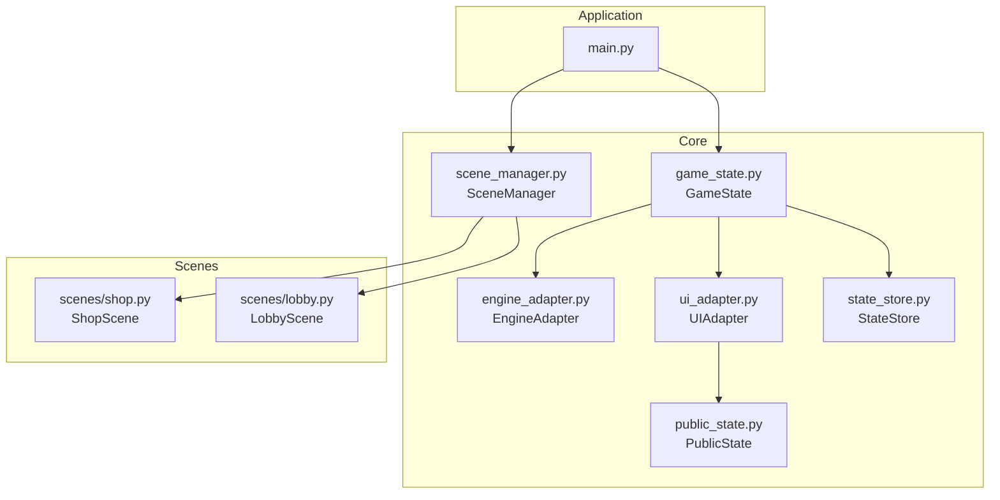
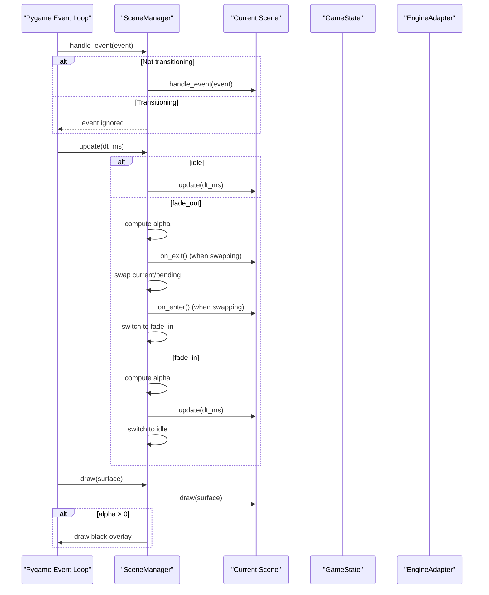
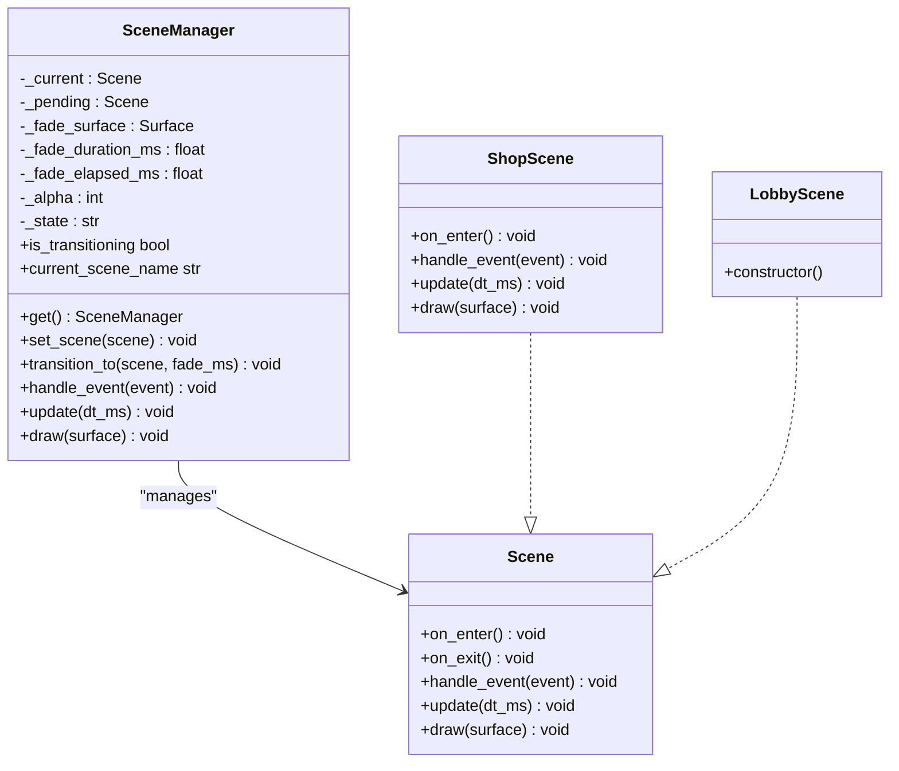
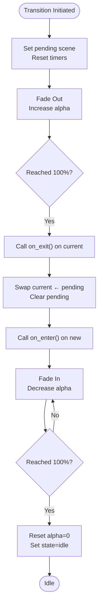
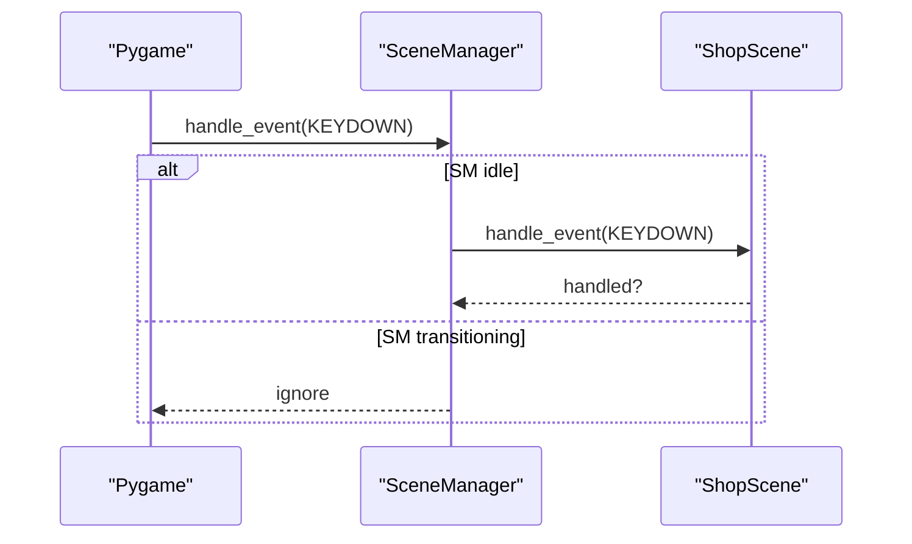
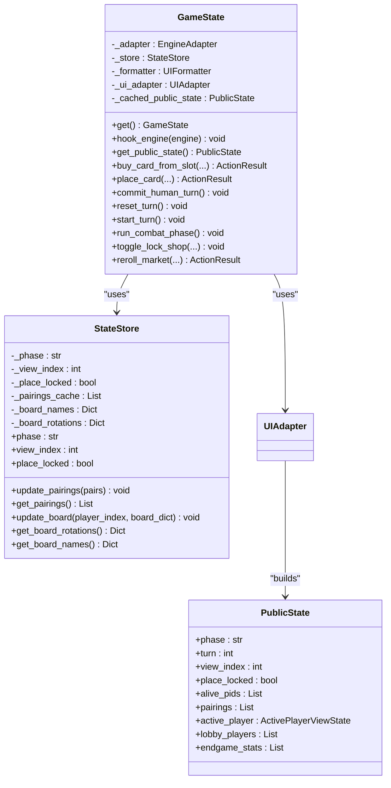
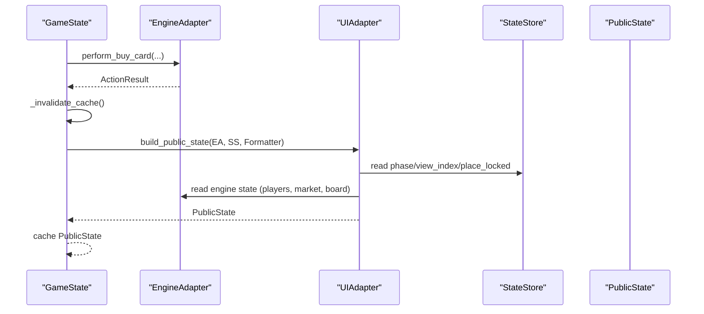
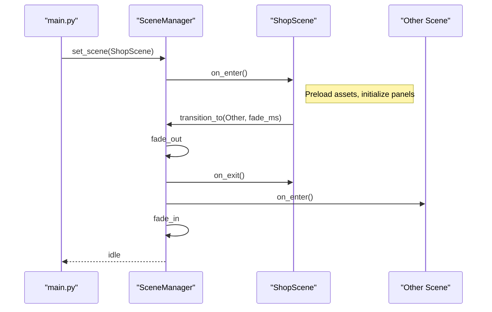
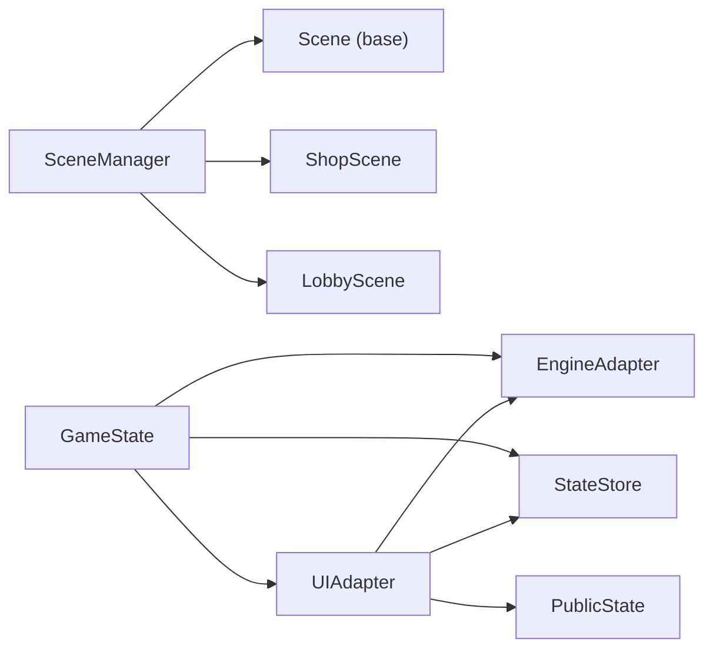

# Scene Management

<cite>
**Referenced Files in This Document**
- [scene_manager.py](file://v2/core/scene_manager.py)
- [state_store.py](file://v2/core/state_store.py)
- [public_state.py](file://v2/core/public_state.py)
- [game_state.py](file://v2/core/game_state.py)
- [engine_adapter.py](file://v2/core/engine_adapter.py)
- [ui_adapter.py](file://v2/core/ui_adapter.py)
- [shop.py](file://v2/scenes/shop.py)
- [lobby.py](file://v2/scenes/lobby.py)
- [main.py](file://v2/main.py)
</cite>

## Table of Contents
1. [Introduction](#introduction)
2. [Project Structure](#project-structure)
3. [Core Components](#core-components)
4. [Architecture Overview](#architecture-overview)
5. [Detailed Component Analysis](#detailed-component-analysis)
6. [Dependency Analysis](#dependency-analysis)
7. [Performance Considerations](#performance-considerations)
8. [Troubleshooting Guide](#troubleshooting-guide)
9. [Conclusion](#conclusion)

## Introduction
This document explains the Scene Management system used by the hybrid game engine. It covers the SceneManager singleton and scene lifecycle, the transition mechanism with fade overlays, and how shared state is modeled via StateStore and PublicState. It also documents the relationship with GameState and the engine adapter, and provides practical guidance for implementing new scenes, handling events, and avoiding common pitfalls like state corruption and memory leaks.

## Project Structure
The Scene Management system lives under v2/core and integrates with scenes under v2/scenes. The main application initializes assets, builds the engine, binds it to GameState, and starts the SceneManager with the first scene.

**Diagram sources**
- [main.py:37-74](file://v2/main.py#L37-L74)
- [scene_manager.py:28-156](file://v2/core/scene_manager.py#L28-L156)
- [game_state.py:14-173](file://v2/core/game_state.py#L14-L173)
- [engine_adapter.py:38-301](file://v2/core/engine_adapter.py#L38-L301)
- [ui_adapter.py:24-476](file://v2/core/ui_adapter.py#L24-L476)
- [state_store.py:3-56](file://v2/core/state_store.py#L3-L56)
- [public_state.py:118-128](file://v2/core/public_state.py#L118-L128)
- [shop.py:23-682](file://v2/scenes/shop.py#L23-L682)
- [lobby.py:5-17](file://v2/scenes/lobby.py#L5-L17)

**Section sources**
- [main.py:14-74](file://v2/main.py#L14-L74)
- [scene_manager.py:28-156](file://v2/core/scene_manager.py#L28-L156)

## Core Components
- SceneManager: Singleton that manages a single active scene, coordinates fade transitions, and dispatches events and updates to the current scene.
- Scene: Base interface that scenes implement (on_enter, on_exit, handle_event, update, draw).
- GameState: Central state holder that wraps EngineAdapter, StateStore, and UIAdapter; exposes get_public_state() and mutation methods.
- StateStore: Lightweight reactive-style store for UI-facing values (phase, view_index, place_locked, pairings cache, board caches).
- PublicState: Immutable data model representing the UI snapshot for rendering and interaction.
- EngineAdapter: Safe façade over the engine core to prevent direct attribute access and encapsulate error handling.
- UIAdapter: Builds PublicState from engine data and formatters; central place for UI-side transformations.
- Scenes: ShopScene and LobbyScene implement Scene and integrate with UI panels, overlays, and GameState.

**Section sources**
- [scene_manager.py:4-26](file://v2/core/scene_manager.py#L4-L26)
- [scene_manager.py:28-156](file://v2/core/scene_manager.py#L28-L156)
- [game_state.py:14-173](file://v2/core/game_state.py#L14-L173)
- [state_store.py:3-56](file://v2/core/state_store.py#L3-L56)
- [public_state.py:118-128](file://v2/core/public_state.py#L118-L128)
- [engine_adapter.py:38-301](file://v2/core/engine_adapter.py#L38-L301)
- [ui_adapter.py:24-476](file://v2/core/ui_adapter.py#L24-L476)
- [shop.py:23-682](file://v2/scenes/shop.py#L23-L682)
- [lobby.py:5-17](file://v2/scenes/lobby.py#L5-L17)

## Architecture Overview
The runtime loop is driven by main.py, which initializes assets and the engine, binds the engine to GameState, and runs the SceneManager update/draw loop. Scenes receive events only when not transitioning. During transitions, events are blocked and a black fade overlay is drawn.

**Diagram sources**
- [scene_manager.py:88-143](file://v2/core/scene_manager.py#L88-L143)
- [main.py:52-69](file://v2/main.py#L52-L69)

## Detailed Component Analysis

### SceneManager and Scene Lifecycle
- Singleton pattern: get() ensures a single instance is reused.
- Initial scene: set_scene(scene) loads the first scene without a fade, invokes on_enter, and sets state to idle.
- Transitions: transition_to(scene, fade_ms) starts a fade-out, swaps scenes on completion, then fades in and returns to idle.
- Event handling: handle_event forwards events only when idle; transitions block input.
- Drawing: draw renders the current scene and overlays a black surface sized to the window when alpha > 0.

**Diagram sources**
- [scene_manager.py:4-26](file://v2/core/scene_manager.py#L4-L26)
- [scene_manager.py:28-156](file://v2/core/scene_manager.py#L28-L156)
- [shop.py:23-682](file://v2/scenes/shop.py#L23-L682)
- [lobby.py:5-17](file://v2/scenes/lobby.py#L5-L17)

**Section sources**
- [scene_manager.py:28-156](file://v2/core/scene_manager.py#L28-L156)
- [main.py:45-69](file://v2/main.py#L45-L69)

### Scene Transition Logic and Fade Overlay
- Transition states: idle → fade_out → swap → on_exit/on_enter → fade_in → idle.
- Alpha progression: linear interpolation over fade duration; black overlay drawn with SRCALPHA.
- Event blocking: during fade_out and fade_in, handle_event is effectively ignored.
- Swap timing: occurs precisely when fade_out reaches 100% progress.

**Diagram sources**
- [scene_manager.py:75-126](file://v2/core/scene_manager.py#L75-L126)

**Section sources**
- [scene_manager.py:75-126](file://v2/core/scene_manager.py#L75-L126)

### Event Handling Coordination
- Input routing: handle_event routes to the current scene only when idle.
- Scene-specific handling: ShopScene processes keyboard, mouse, panel actions, and overlays; events are parsed and delegated accordingly.
- Blocking during transitions: No event delivery to scenes while fading prevents inconsistent state during scene swaps.

**Diagram sources**
- [scene_manager.py:88-94](file://v2/core/scene_manager.py#L88-L94)
- [shop.py:153-252](file://v2/scenes/shop.py#L153-L252)

**Section sources**
- [scene_manager.py:88-94](file://v2/core/scene_manager.py#L88-L94)
- [shop.py:153-252](file://v2/scenes/shop.py#L153-L252)

### State Persistence Mechanisms: StateStore and PublicState
- StateStore: Holds UI-facing state (phase, view_index, place_locked) and caches derived data (pairings, board names/rotations). It is updated by GameState mutations and used by UIAdapter to construct PublicState snapshots.
- PublicState: Immutable, UI-focused data model built by UIAdapter from engine data and StateStore. It includes active player view, lobby players, and endgame stats.
- GameState: Exposes get_public_state() as the single read path; mutations invalidate cache and rebuild PublicState on next access. It also exposes setters for StateStore properties that trigger cache invalidation.

**Diagram sources**
- [state_store.py:3-56](file://v2/core/state_store.py#L3-L56)
- [public_state.py:118-128](file://v2/core/public_state.py#L118-L128)
- [game_state.py:14-173](file://v2/core/game_state.py#L14-L173)
- [ui_adapter.py:97-121](file://v2/core/ui_adapter.py#L97-L121)

**Section sources**
- [state_store.py:3-56](file://v2/core/state_store.py#L3-L56)
- [public_state.py:118-128](file://v2/core/public_state.py#L118-L128)
- [game_state.py:59-84](file://v2/core/game_state.py#L59-L84)
- [ui_adapter.py:97-121](file://v2/core/ui_adapter.py#L97-L121)

### Engine Integration and Data Flow
- EngineAdapter: Encapsulates engine access, normalizes errors, and exposes safe methods for buying cards, rerolling, placing, and turn lifecycle.
- UIAdapter: Converts engine data into PublicState using StateStore and formatters; computes synergy, passive feed, and UI metadata.
- GameState: Hooks EngineAdapter, invalidates cache on mutations, and serves as the authoritative read/write hub for UI state.

**Diagram sources**
- [game_state.py:92-116](file://v2/core/game_state.py#L92-L116)
- [engine_adapter.py:81-115](file://v2/core/engine_adapter.py#L81-L115)
- [ui_adapter.py:97-121](file://v2/core/ui_adapter.py#L97-L121)
- [state_store.py:3-56](file://v2/core/state_store.py#L3-L56)

**Section sources**
- [engine_adapter.py:38-301](file://v2/core/engine_adapter.py#L38-L301)
- [ui_adapter.py:24-476](file://v2/core/ui_adapter.py#L24-L476)
- [game_state.py:37-65](file://v2/core/game_state.py#L37-L65)

### Example: Scene Initialization, Switching, and Cleanup
- Initialization: main.py initializes assets and engine, hooks GameState to the engine, and sets the initial scene (ShopScene) without fade.
- Switching: A scene triggers transition_to(scene) to initiate a fade transition; the SceneManager swaps scenes at the end of fade_out and resumes with fade_in.
- Cleanup: on_exit is called before swapping; ShopScene’s on_enter preloads audio and prepares UI overlays; during transitions, events are blocked to avoid inconsistent state.

**Diagram sources**
- [main.py:45-47](file://v2/main.py#L45-L47)
- [scene_manager.py:64-87](file://v2/core/scene_manager.py#L64-L87)
- [scene_manager.py:104-125](file://v2/core/scene_manager.py#L104-L125)
- [shop.py:76-98](file://v2/scenes/shop.py#L76-L98)

**Section sources**
- [main.py:45-47](file://v2/main.py#L45-L47)
- [scene_manager.py:64-87](file://v2/core/scene_manager.py#L64-L87)
- [scene_manager.py:104-125](file://v2/core/scene_manager.py#L104-L125)
- [shop.py:76-98](file://v2/scenes/shop.py#L76-L98)

### Implementing New Scenes
- Derive from Scene and implement on_enter, handle_event, update, draw.
- Use GameState.get_public_state() to read UI-facing state; avoid accessing engine internals directly.
- For transitions, call SceneManager.get().transition_to(NewScene()) with optional fade duration.
- Respect transition blocking: do not mutate state in response to events while transitioning.
- Clean up resources in on_exit; unload assets and cancel overlays.

**Section sources**
- [scene_manager.py:4-26](file://v2/core/scene_manager.py#L4-L26)
- [scene_manager.py:88-143](file://v2/core/scene_manager.py#L88-L143)
- [game_state.py:59-65](file://v2/core/game_state.py#L59-L65)

## Dependency Analysis
- SceneManager depends on Scene interface and Pygame surfaces for drawing.
- GameState depends on EngineAdapter, StateStore, and UIAdapter.
- UIAdapter depends on StateStore, EngineAdapter, and CardDatabase/formatters.
- Scenes depend on UI panels, overlays, and GameState for state synchronization.

**Diagram sources**
- [scene_manager.py:28-156](file://v2/core/scene_manager.py#L28-L156)
- [game_state.py:14-173](file://v2/core/game_state.py#L14-L173)
- [ui_adapter.py:24-476](file://v2/core/ui_adapter.py#L24-L476)
- [state_store.py:3-56](file://v2/core/state_store.py#L3-L56)
- [public_state.py:118-128](file://v2/core/public_state.py#L118-L128)
- [shop.py:23-682](file://v2/scenes/shop.py#L23-L682)
- [lobby.py:5-17](file://v2/scenes/lobby.py#L5-L17)

**Section sources**
- [scene_manager.py:28-156](file://v2/core/scene_manager.py#L28-L156)
- [game_state.py:14-173](file://v2/core/game_state.py#L14-L173)
- [ui_adapter.py:24-476](file://v2/core/ui_adapter.py#L24-L476)

## Performance Considerations
- Transition fade duration: tune fade_ms to balance perceived snappiness vs. smoothness; shorter durations reduce overhead but can feel abrupt.
- State caching: GameState caches PublicState; avoid unnecessary mutations to minimize recomputation.
- UI updates: Scenes should batch UI updates and avoid heavy computations in update/draw; defer expensive operations to after transitions.
- Asset preloading: Scenes should preload audio and visuals in on_enter to avoid stalls during gameplay.

[No sources needed since this section provides general guidance]

## Troubleshooting Guide
- Scene state corruption:
  - Cause: Mutating state in response to events during transitions.
  - Fix: Rely on on_enter/on_exit for state setup/cleanup; avoid reacting to events while is_transitioning is true.
- Memory leaks during transitions:
  - Cause: Retaining references to previous scene resources.
  - Fix: Clear overlays, timers, and temporary surfaces in on_exit; ensure references are dropped.
- Event handling during transitions:
  - Symptom: Inputs seem ignored during scene switches.
  - Explanation: Events are intentionally blocked during fade_out/fade_in.
- Inconsistent UI after placement:
  - Cause: Not invalidating cache after mutations.
  - Fix: Call _invalidate_cache() after engine mutations; use GameState mutation helpers.
- Audio not playing:
  - Cause: AssetLoader not initialized or exceptions thrown.
  - Fix: Wrap asset loading in try/catch and fall back gracefully.

**Section sources**
- [scene_manager.py:88-94](file://v2/core/scene_manager.py#L88-L94)
- [scene_manager.py:104-125](file://v2/core/scene_manager.py#L104-L125)
- [game_state.py:55-58](file://v2/core/game_state.py#L55-L58)
- [shop.py:76-98](file://v2/scenes/shop.py#L76-L98)

## Conclusion
The Scene Management system centers on a robust SceneManager singleton that enforces a clean lifecycle and smooth transitions, paired with a state model that separates engine concerns from UI rendering. GameState and UIAdapter mediate engine access and state building, while StateStore and PublicState provide efficient, immutable UI snapshots. Following the patterns documented here ensures reliable scene transitions, predictable state behavior, and maintainable UI logic.