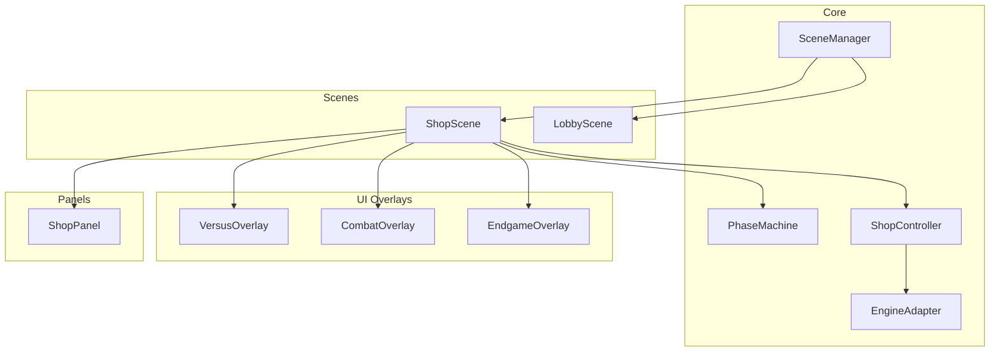
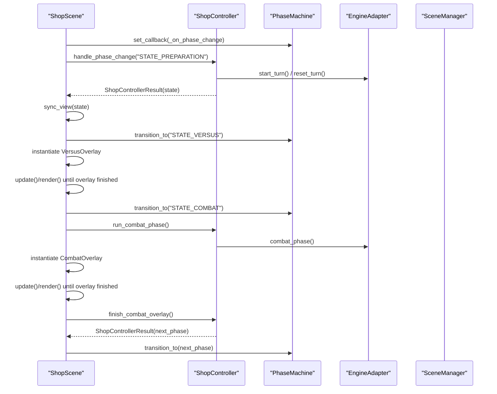
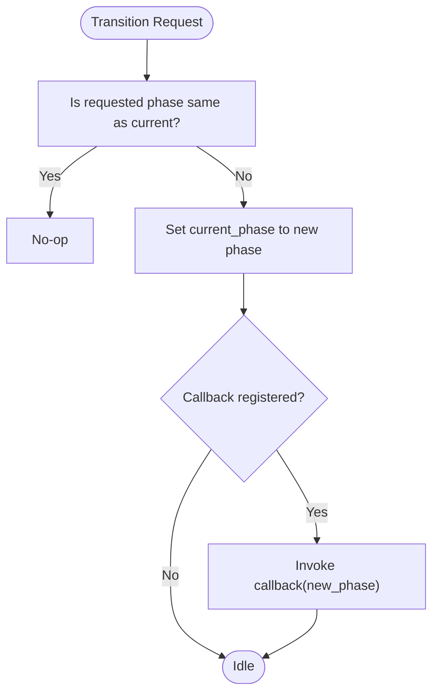
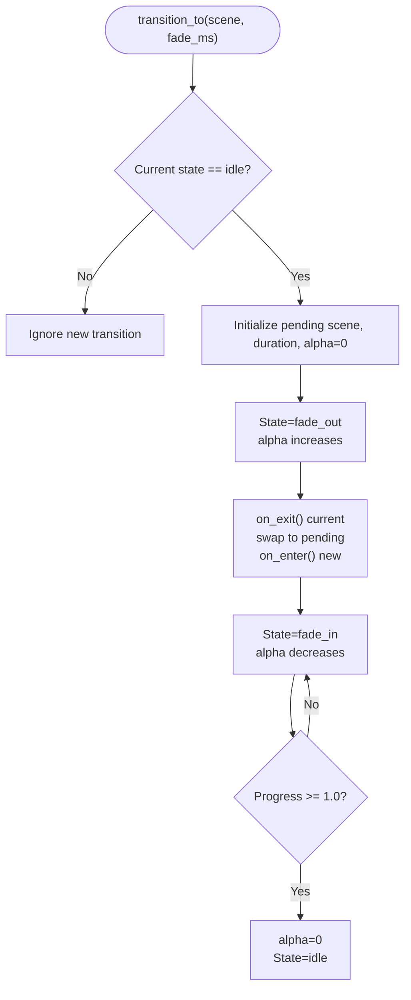
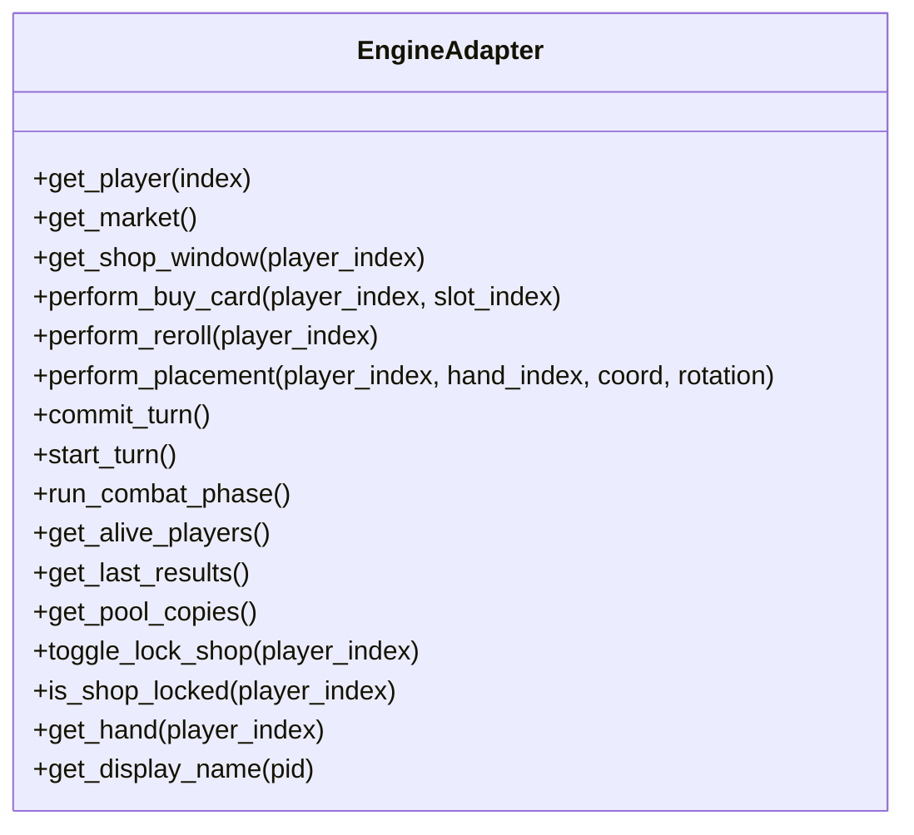
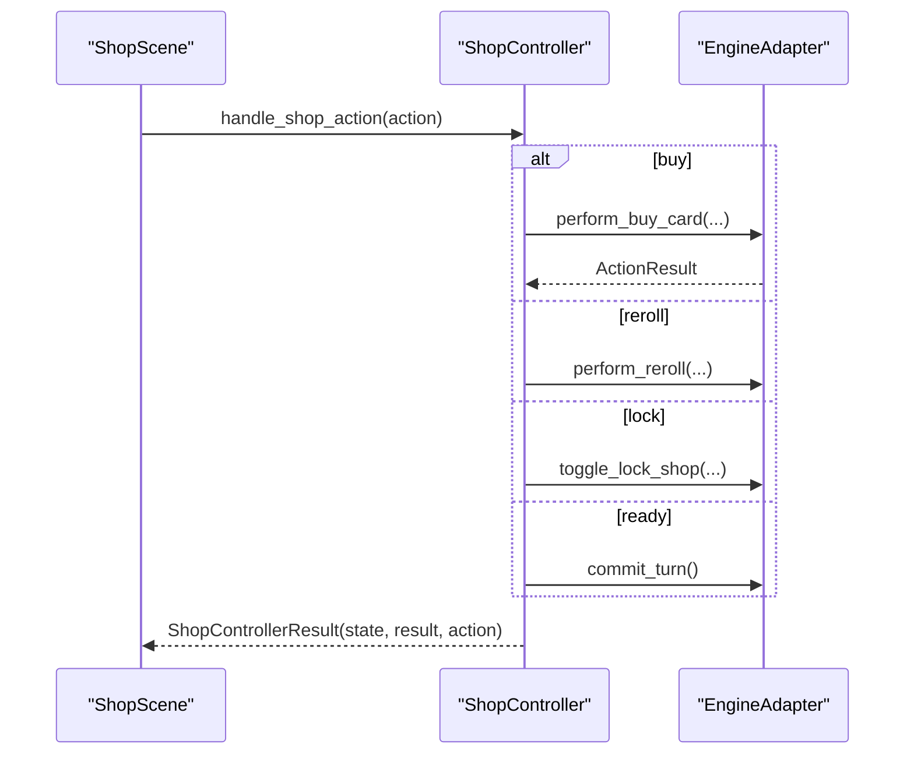
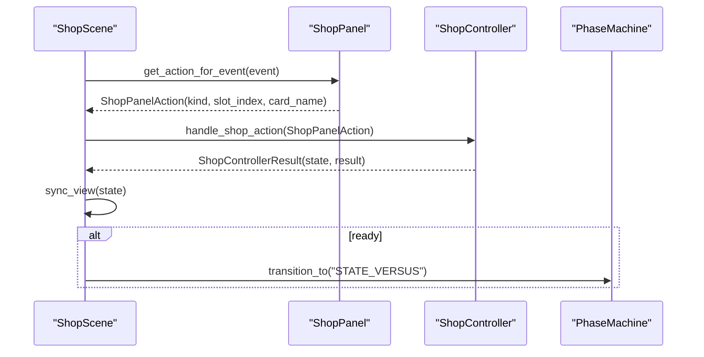
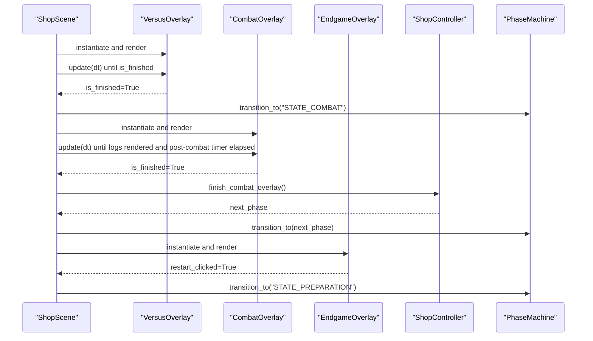
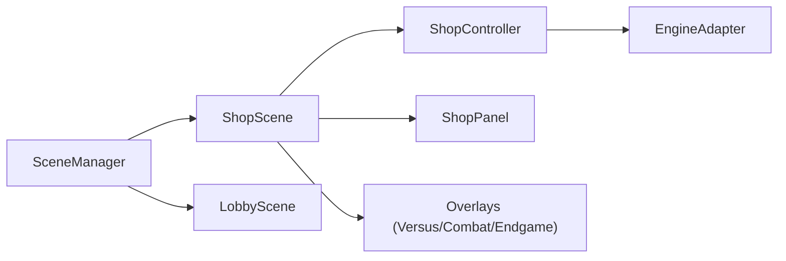

# Scene Transitions

<cite>
**Referenced Files in This Document**
- [phase_machine.py](file://v2/core/phase_machine.py)
- [scene_manager.py](file://v2/core/scene_manager.py)
- [engine_adapter.py](file://v2/core/engine_adapter.py)
- [shop_controller.py](file://v2/core/shop_controller.py)
- [shop.py](file://v2/scenes/shop.py)
- [lobby.py](file://v2/scenes/lobby.py)
- [shop_panel.py](file://v2/ui/shop_panel.py)
- [versus_overlay.py](file://v2/ui/overlays/versus_overlay.py)
- [combat_overlay.py](file://v2/ui/overlays/combat_overlay.py)
- [endgame_overlay.py](file://v2/ui/overlays/endgame_overlay.py)
</cite>

## Table of Contents
1. [Introduction](#introduction)
2. [Project Structure](#project-structure)
3. [Core Components](#core-components)
4. [Architecture Overview](#architecture-overview)
5. [Detailed Component Analysis](#detailed-component-analysis)
6. [Dependency Analysis](#dependency-analysis)
7. [Performance Considerations](#performance-considerations)
8. [Troubleshooting Guide](#troubleshooting-guide)
9. [Conclusion](#conclusion)

## Introduction
This document explains the Scene Transitions and Phase Management system used to coordinate UI scenes with the game engine across distinct phases of the game loop. It covers the PhaseMachine that drives turn-based transitions, the SceneManager that orchestrates smooth scene changes with fade effects, the EngineAdapter that bridges UI actions to engine operations, and the ShopScene and LobbyScene implementations that demonstrate proper setup, teardown, and data exchange patterns. Practical examples illustrate timing controls, state synchronization, and integration with overlays for versus, combat, and endgame phases. Common issues such as state persistence, resource loading during transitions, and error handling are addressed with concrete strategies.

## Project Structure
The scene transition and phase management system spans several modules:
- Core orchestration: PhaseMachine, SceneManager, EngineAdapter, ShopController
- Scenes: ShopScene, LobbyScene
- UI overlays: versus, combat, endgame
- Panels and HUD: ShopPanel and related UI components

**Diagram sources**
- [scene_manager.py:28-156](file://v2/core/scene_manager.py#L28-L156)
- [phase_machine.py:3-40](file://v2/core/phase_machine.py#L3-L40)
- [engine_adapter.py:38-301](file://v2/core/engine_adapter.py#L38-L301)
- [shop_controller.py:28-139](file://v2/core/shop_controller.py#L28-L139)
- [shop.py:23-71](file://v2/scenes/shop.py#L23-L71)
- [lobby.py:5-17](file://v2/scenes/lobby.py#L5-L17)
- [versus_overlay.py:5-66](file://v2/ui/overlays/versus_overlay.py#L5-L66)
- [combat_overlay.py:5-86](file://v2/ui/overlays/combat_overlay.py#L5-L86)
- [endgame_overlay.py:5-113](file://v2/ui/overlays/endgame_overlay.py#L5-L113)
- [shop_panel.py:42-341](file://v2/ui/shop_panel.py#L42-L341)

**Section sources**
- [scene_manager.py:28-156](file://v2/core/scene_manager.py#L28-L156)
- [phase_machine.py:3-40](file://v2/core/phase_machine.py#L3-L40)
- [engine_adapter.py:38-301](file://v2/core/engine_adapter.py#L38-L301)
- [shop_controller.py:28-139](file://v2/core/shop_controller.py#L28-L139)
- [shop.py:23-71](file://v2/scenes/shop.py#L23-L71)
- [lobby.py:5-17](file://v2/scenes/lobby.py#L5-L17)
- [versus_overlay.py:5-66](file://v2/ui/overlays/versus_overlay.py#L5-L66)
- [combat_overlay.py:5-86](file://v2/ui/overlays/combat_overlay.py#L5-L86)
- [endgame_overlay.py:5-113](file://v2/ui/overlays/endgame_overlay.py#L5-L113)
- [shop_panel.py:42-341](file://v2/ui/shop_panel.py#L42-L341)

## Core Components
- PhaseMachine: Defines and advances the canonical phases (PREPARATION, VERSUS, COMBAT, ENDGAME) and notifies listeners of transitions.
- SceneManager: Manages a single active scene with fade-out/fade-in transitions, blocks input during transitions, and coordinates lifecycle events (enter/exit/update/draw).
- EngineAdapter: Encapsulates engine interactions (buy, reroll, placement, turn commit, combat start), normalizes engine attributes, and returns structured results.
- ShopController: Mirrors phase changes and game actions in the public state, returning outcomes that drive UI updates and transitions.
- ShopScene: Implements the shop phase UI, integrates overlays, and triggers phase transitions based on user actions and overlay completion.
- LobbyScene: Preloads audio assets for the lobby scene to ensure smooth transitions from the shop.
- UI Overlays: VersusOverlay, CombatOverlay, and EndgameOverlay provide phase-specific presentation and completion conditions.

**Section sources**
- [phase_machine.py:3-40](file://v2/core/phase_machine.py#L3-L40)
- [scene_manager.py:28-156](file://v2/core/scene_manager.py#L28-L156)
- [engine_adapter.py:38-301](file://v2/core/engine_adapter.py#L38-L301)
- [shop_controller.py:28-139](file://v2/core/shop_controller.py#L28-L139)
- [shop.py:23-71](file://v2/scenes/shop.py#L23-L71)
- [lobby.py:5-17](file://v2/scenes/lobby.py#L5-L17)
- [versus_overlay.py:5-66](file://v2/ui/overlays/versus_overlay.py#L5-L66)
- [combat_overlay.py:5-86](file://v2/ui/overlays/combat_overlay.py#L5-L86)
- [endgame_overlay.py:5-113](file://v2/ui/overlays/endgame_overlay.py#L5-L113)

## Architecture Overview
The system follows a layered pattern:
- UI scenes depend on a PhaseMachine and a ShopController to reflect engine state and drive transitions.
- ShopScene coordinates with ShopPanel and multiple HUD panels, and instantiates overlays for versus, combat, and endgame.
- EngineAdapter isolates UI from engine internals, exposing safe, typed operations and normalized data.
- SceneManager ensures smooth transitions between scenes and prevents input during fade.

**Diagram sources**
- [shop.py:99-152](file://v2/scenes/shop.py#L99-L152)
- [shop_controller.py:38-66](file://v2/core/shop_controller.py#L38-L66)
- [phase_machine.py:19-40](file://v2/core/phase_machine.py#L19-L40)
- [engine_adapter.py:236-241](file://v2/core/engine_adapter.py#L236-L241)
- [versus_overlay.py:30-37](file://v2/ui/overlays/versus_overlay.py#L30-L37)
- [combat_overlay.py:34-55](file://v2/ui/overlays/combat_overlay.py#L34-L55)

## Detailed Component Analysis

### PhaseMachine
- Responsibilities: Tracks current phase, validates transitions, and invokes a registered callback upon change.
- Transition logic: Moves through PREPARATION → VERSUS → COMBAT → ENDGAME, with COMBAT looping back to PREPARATION unless only one player remains, in which case it proceeds to ENDGAME.

**Diagram sources**
- [phase_machine.py:19-27](file://v2/core/phase_machine.py#L19-L27)

**Section sources**
- [phase_machine.py:3-40](file://v2/core/phase_machine.py#L3-L40)

### SceneManager
- Responsibilities: Single active scene management, fade transitions, input blocking during transitions, and lifecycle hooks.
- Transition flow: fade_out → swap scenes → fade_in → idle. Prevents overlapping transitions and ensures on_exit/on_enter are called appropriately.

**Diagram sources**
- [scene_manager.py:75-126](file://v2/core/scene_manager.py#L75-L126)

**Section sources**
- [scene_manager.py:28-156](file://v2/core/scene_manager.py#L28-L156)

### EngineAdapter
- Responsibilities: Safe access to engine state and operations, including buying cards, rerolling windows, placing cards, committing turns, starting turns, running combat, and retrieving results/logs.
- Error handling: Returns structured ActionResult codes and logs exceptions to avoid UI crashes.

**Diagram sources**
- [engine_adapter.py:38-301](file://v2/core/engine_adapter.py#L38-L301)

**Section sources**
- [engine_adapter.py:38-301](file://v2/core/engine_adapter.py#L38-L301)

### ShopController
- Responsibilities: Mirrors UI actions and phase changes in the public state, invoking engine operations via EngineAdapter indirectly through GameState, and returning ShopControllerResult objects that carry state, outcomes, logs, and next-phase hints.
- Key flows: handle_shop_action (buy, reroll, lock, ready), place_card_from_hand, handle_phase_change, finish_combat_overlay.

**Diagram sources**
- [shop_controller.py:67-98](file://v2/core/shop_controller.py#L67-L98)
- [engine_adapter.py:81-114](file://v2/core/engine_adapter.py#L81-L114)
- [engine_adapter.py:116-127](file://v2/core/engine_adapter.py#L116-L127)

**Section sources**
- [shop_controller.py:28-139](file://v2/core/shop_controller.py#L28-L139)

### ShopScene
- Responsibilities: Integrates ShopPanel, HandPanel, PlayerHub, SynergyHUD, MinimapHUD, and overlays. Handles events, updates state, and triggers phase transitions based on user actions and overlay completion.
- Setup and teardown: Preloads audio on enter; on exit, resources are released implicitly by scene swap.
- Data exchange: Uses ShopController.refresh_public_state and sync_view to keep UI in sync with engine state.

**Diagram sources**
- [shop.py:223-248](file://v2/scenes/shop.py#L223-L248)
- [shop_panel.py:217-239](file://v2/ui/shop_panel.py#L217-L239)
- [shop_controller.py:67-98](file://v2/core/shop_controller.py#L67-L98)

**Section sources**
- [shop.py:23-71](file://v2/scenes/shop.py#L23-L71)
- [shop.py:153-252](file://v2/scenes/shop.py#L153-L252)
- [shop.py:355-407](file://v2/scenes/shop.py#L355-L407)
- [shop.py:445-456](file://v2/scenes/shop.py#L445-L456)

### LobbyScene
- Responsibilities: Preloads audio assets for the lobby scene to minimize latency during transitions from the shop scene.
- Integration: Works alongside SceneManager to ensure seamless scene swaps.

**Section sources**
- [lobby.py:5-17](file://v2/scenes/lobby.py#L5-L17)

### UI Overlays
- VersusOverlay: Presents a versus screen for a fixed duration or until user input; signals completion to advance to combat.
- CombatOverlay: Renders combat logs progressively with configurable delay and a post-combat pause; signals completion to advance to preparation or endgame.
- EndgameOverlay: Displays final rankings and stats; restart button triggers a restart transition.

**Diagram sources**
- [versus_overlay.py:30-37](file://v2/ui/overlays/versus_overlay.py#L30-L37)
- [combat_overlay.py:34-55](file://v2/ui/overlays/combat_overlay.py#L34-L55)
- [endgame_overlay.py:26-33](file://v2/ui/overlays/endgame_overlay.py#L26-L33)
- [shop_controller.py:130-138](file://v2/core/shop_controller.py#L130-L138)

**Section sources**
- [versus_overlay.py:5-66](file://v2/ui/overlays/versus_overlay.py#L5-L66)
- [combat_overlay.py:5-86](file://v2/ui/overlays/combat_overlay.py#L5-L86)
- [endgame_overlay.py:5-113](file://v2/ui/overlays/endgame_overlay.py#L5-L113)
- [shop_controller.py:130-138](file://v2/core/shop_controller.py#L130-L138)

## Dependency Analysis
- ShopScene depends on ShopController for state mirroring and EngineAdapter for engine operations.
- ShopController depends on GameState (via imports) to compute public state and invoke engine actions.
- EngineAdapter encapsulates engine access, reducing coupling between UI and engine internals.
- SceneManager couples UI scenes to a unified transition mechanism, ensuring consistent UX.

**Diagram sources**
- [shop.py:23-71](file://v2/scenes/shop.py#L23-L71)
- [shop_controller.py:28-34](file://v2/core/shop_controller.py#L28-L34)
- [engine_adapter.py:38-46](file://v2/core/engine_adapter.py#L38-L46)
- [scene_manager.py:28-42](file://v2/core/scene_manager.py#L28-L42)

**Section sources**
- [shop.py:23-71](file://v2/scenes/shop.py#L23-L71)
- [shop_controller.py:28-34](file://v2/core/shop_controller.py#L28-L34)
- [engine_adapter.py:38-46](file://v2/core/engine_adapter.py#L38-L46)
- [scene_manager.py:28-42](file://v2/core/scene_manager.py#L28-L42)

## Performance Considerations
- Transition timing: SceneManager’s fade duration is configurable and clamped to a minimum to prevent stalls. Use moderate durations (e.g., 200 ms) to balance smoothness and responsiveness.
- State caching: ShopScene caches public state between frames to avoid repeated recomputation; refresh only after actions or phase changes.
- Overlay rendering: Overlays are lightweight and only active during their respective phases; ensure minimal work in update loops to maintain frame stability.
- Asset preloading: Preload audio assets during scene enter to avoid stalls during transitions.

[No sources needed since this section provides general guidance]

## Troubleshooting Guide
Common issues and remedies:
- State not persisting across transitions
  - Ensure ShopScene caches public state and refreshes it only after actions or phase changes. Verify that sync_view is called consistently after controller outcomes.
  - Confirm that on_exit/on_enter are invoked by SceneManager during transitions.
  - Section sources
    - [shop.py:102-111](file://v2/scenes/shop.py#L102-L111)
    - [scene_manager.py:64-74](file://v2/core/scene_manager.py#L64-L74)
    - [scene_manager.py:108-116](file://v2/core/scene_manager.py#L108-L116)

- Resource loading delays during transitions
  - Preload audio assets in scene enter (e.g., LobbyScene preloads lobby music and SFX). For ShopScene, preload shop and combat sounds on enter.
  - Section sources
    - [lobby.py:7-16](file://v2/scenes/lobby.py#L7-L16)
    - [shop.py:76-93](file://v2/scenes/shop.py#L76-L93)

- Error handling for failed scene changes
  - Wrap engine interactions in EngineAdapter with try/except and return structured ActionResult codes. Log exceptions to aid debugging without crashing the UI.
  - Section sources
    - [engine_adapter.py:81-114](file://v2/core/engine_adapter.py#L81-L114)
    - [engine_adapter.py:116-127](file://v2/core/engine_adapter.py#L116-L127)

- Overlays not advancing phases
  - Verify overlay completion conditions (e.g., versus duration elapsed, combat logs fully rendered, endgame restart clicked). Ensure ShopScene checks overlay.is_finished and calls phase_machine.transition_to accordingly.
  - Section sources
    - [versus_overlay.py:30-37](file://v2/ui/overlays/versus_overlay.py#L30-L37)
    - [combat_overlay.py:34-55](file://v2/ui/overlays/combat_overlay.py#L34-L55)
    - [endgame_overlay.py:26-33](file://v2/ui/overlays/endgame_overlay.py#L26-L33)
    - [shop.py:369-385](file://v2/scenes/shop.py#L369-L385)

- Turn-based transitions not firing
  - Confirm that ShopScene triggers transition_to("STATE_VERSUS") after a successful ready action and that ShopController.handle_shop_action returns the appropriate result.
  - Section sources
    - [shop.py:226-229](file://v2/scenes/shop.py#L226-L229)
    - [shop_controller.py:67-73](file://v2/core/shop_controller.py#L67-L73)

## Conclusion
The Scene Transitions and Phase Management system cleanly separates UI concerns from engine logic through EngineAdapter and ShopController, while SceneManager guarantees smooth scene changes. ShopScene orchestrates the shop phase, overlays manage versus, combat, and endgame presentations, and PhaseMachine enforces canonical transitions. By following the patterns documented—state caching, overlay-driven completion, and preloaded assets—you can implement robust, responsive transitions across all game phases.