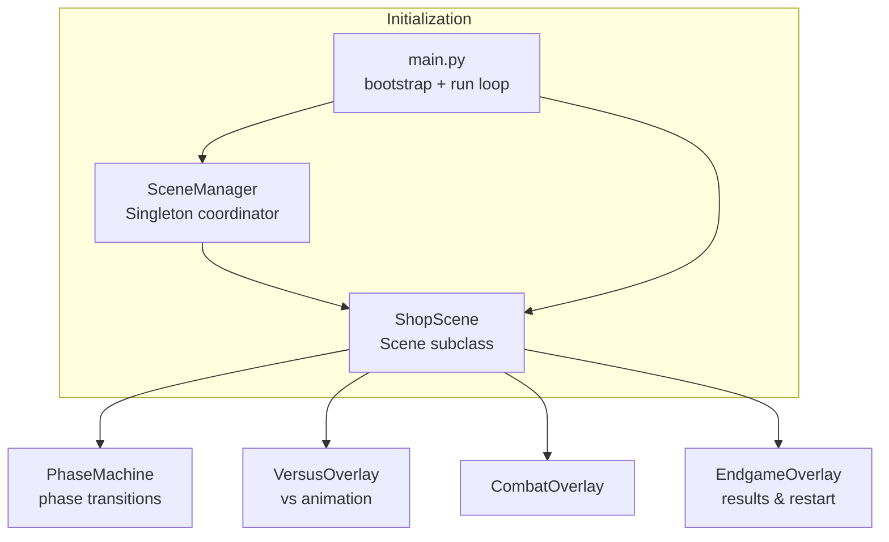
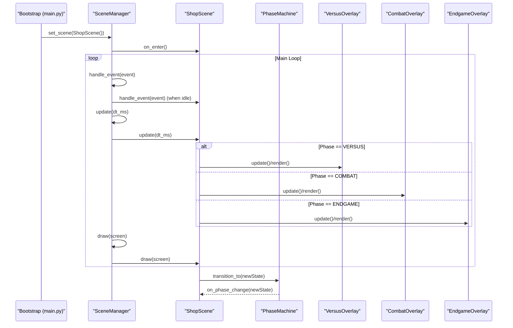
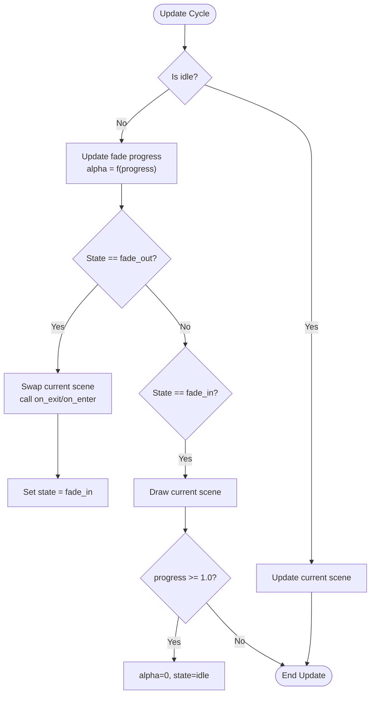
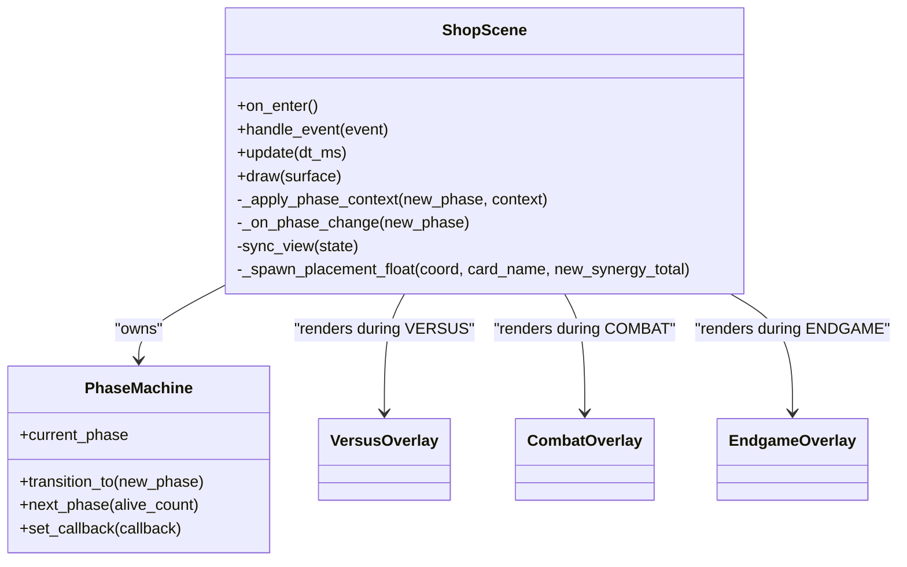
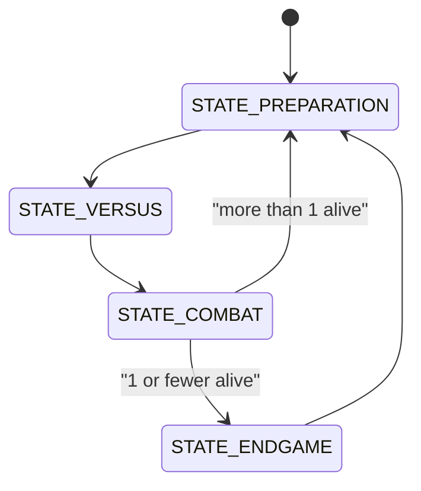
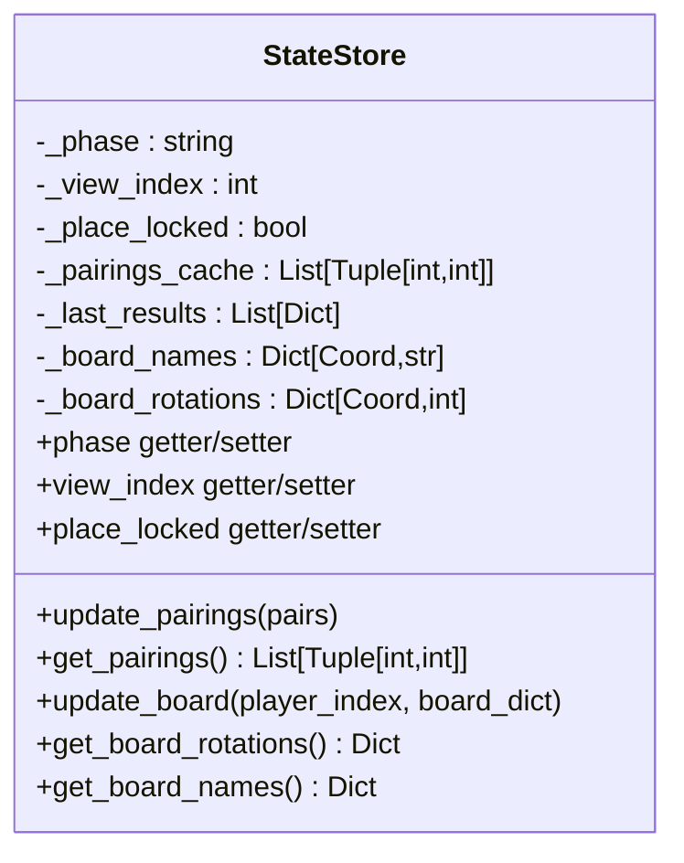
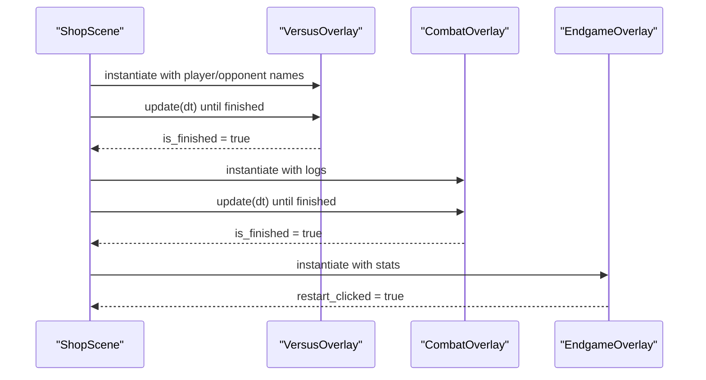
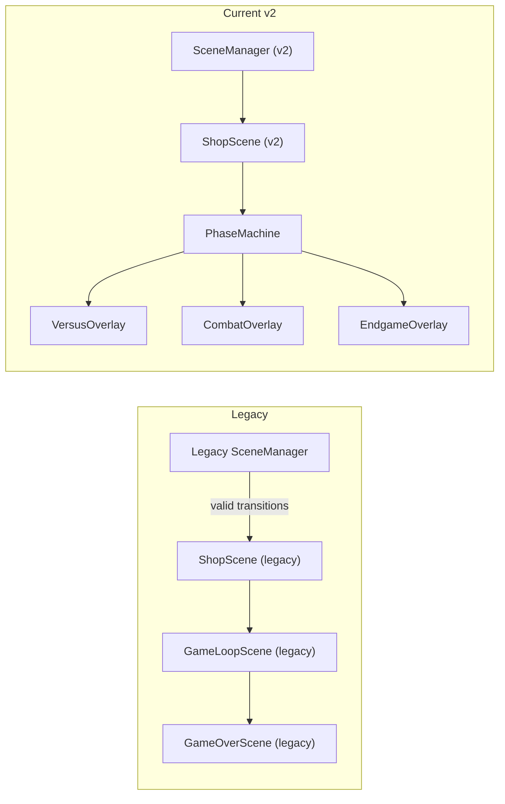
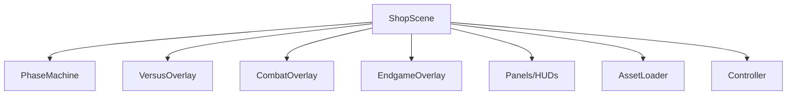

# Scene-Based Architecture

<cite>
**Referenced Files in This Document**
- [scene_manager.py](file://v2/core/scene_manager.py)
- [phase_machine.py](file://v2/core/phase_machine.py)
- [state_store.py](file://v2/core/state_store.py)
- [shop.py](file://v2/scenes/shop.py)
- [lobby.py](file://v2/scenes/lobby.py)
- [combat_overlay.py](file://v2/ui/overlays/combat_overlay.py)
- [versus_overlay.py](file://v2/ui/overlays/versus_overlay.py)
- [endgame_overlay.py](file://v2/ui/overlays/endgame_overlay.py)
- [main.py](file://v2/main.py)
- [scene_manager.py (legacy)](file://_archive/old_dirs/core/scene_manager.py)
- [lobby_scene.py (legacy)](file://_archive/old_dirs/scenes/lobby_scene.py)
- [shop_scene.py (legacy)](file://_archive/old_dirs/scenes/shop_scene.py)
- [game_over_scene.py (legacy)](file://_archive/old_dirs/scenes/game_over_scene.py)
</cite>

## Table of Contents
1. [Introduction](#introduction)
2. [Project Structure](#project-structure)
3. [Core Components](#core-components)
4. [Architecture Overview](#architecture-overview)
5. [Detailed Component Analysis](#detailed-component-analysis)
6. [Dependency Analysis](#dependency-analysis)
7. [Performance Considerations](#performance-considerations)
8. [Troubleshooting Guide](#troubleshooting-guide)
9. [Conclusion](#conclusion)
10. [Appendices](#appendices)

## Introduction
This document explains the Scene-Based Architecture used in the v2 runtime. It covers the modular scene system (lobby, shop, combat, and game-over), the scene manager implementation, scene transitions, and state management. It also documents the migration from the legacy architecture, scene lifecycle management, and event handling patterns. Both conceptual overviews for beginners and technical details for advanced developers are included, using terminology consistent with the codebase such as "scene manager", "phase machine", and "state store".

## Project Structure
The scene system centers around a lightweight scene interface and a singleton scene manager that coordinates transitions and rendering. Scenes encapsulate UI panels, overlays, and controller logic. The shop scene integrates a "phase machine" to orchestrate preparation, versus, combat, and endgame phases, and uses overlays to present animated sequences.

**Diagram sources**
- [scene_manager.py:28-156](file://v2/core/scene_manager.py#L28-L156)
- [shop.py:23-151](file://v2/scenes/shop.py#L23-L151)
- [versus_overlay.py:5-37](file://v2/ui/overlays/versus_overlay.py#L5-L37)
- [combat_overlay.py:5-44](file://v2/ui/overlays/combat_overlay.py#L5-L44)
- [endgame_overlay.py:5-36](file://v2/ui/overlays/endgame_overlay.py#L5-L36)
- [main.py:37-69](file://v2/main.py#L37-L69)

**Section sources**
- [scene_manager.py:28-156](file://v2/core/scene_manager.py#L28-L156)
- [shop.py:23-151](file://v2/scenes/shop.py#L23-L151)
- [versus_overlay.py:5-37](file://v2/ui/overlays/versus_overlay.py#L5-L37)
- [combat_overlay.py:5-44](file://v2/ui/overlays/combat_overlay.py#L5-L44)
- [endgame_overlay.py:5-36](file://v2/ui/overlays/endgame_overlay.py#L5-L36)
- [main.py:37-69](file://v2/main.py#L37-L69)

## Core Components
- Scene base class: Defines the lifecycle hooks on_enter, on_exit, handle_event, update, and draw.
- SceneManager: Singleton that manages the single active scene, handles transitions with fade overlays, and forwards events during idle periods.
- ShopScene: Implements the shop scene with panels, overlays, and a PhaseMachine to drive state transitions.
- PhaseMachine: Manages game phases (PREPARATION → VERSUS → COMBAT → ENDGAME) and notifies listeners of changes.
- StateStore: Reactive-style store for UI-facing state with cached board data and view indices.
- Overlays: VersusOverlay, CombatOverlay, and EndgameOverlay provide animated UI sequences during transitions.

**Section sources**
- [scene_manager.py:4-26](file://v2/core/scene_manager.py#L4-L26)
- [scene_manager.py:28-156](file://v2/core/scene_manager.py#L28-L156)
- [shop.py:23-151](file://v2/scenes/shop.py#L23-L151)
- [phase_machine.py:3-40](file://v2/core/phase_machine.py#L3-L40)
- [state_store.py:3-56](file://v2/core/state_store.py#L3-L56)
- [versus_overlay.py:5-37](file://v2/ui/overlays/versus_overlay.py#L5-L37)
- [combat_overlay.py:5-44](file://v2/ui/overlays/combat_overlay.py#L5-L44)
- [endgame_overlay.py:5-36](file://v2/ui/overlays/endgame_overlay.py#L5-L36)

## Architecture Overview
The v2 architecture separates concerns cleanly:
- Initialization bootstraps assets and engine, then sets the first scene.
- The scene manager runs the main loop, delegating events, updates, and draws to the active scene.
- Scenes own UI panels and overlays; shop scene additionally coordinates engine state via a controller and orchestrates phase transitions.
- Overlays are rendered on top of the active scene during phase transitions.

**Diagram sources**
- [main.py:37-69](file://v2/main.py#L37-L69)
- [scene_manager.py:88-143](file://v2/core/scene_manager.py#L88-L143)
- [shop.py:150-386](file://v2/scenes/shop.py#L150-L386)
- [versus_overlay.py:30-37](file://v2/ui/overlays/versus_overlay.py#L30-L37)
- [combat_overlay.py:34-44](file://v2/ui/overlays/combat_overlay.py#L34-L44)
- [endgame_overlay.py:35-36](file://v2/ui/overlays/endgame_overlay.py#L35-L36)

## Detailed Component Analysis

### Scene Manager
The scene manager is a singleton responsible for:
- Setting the initial scene without a fade.
- Initiating transitions with a fade-out/fade-in overlay.
- Blocking input during transitions and forwarding events only when idle.
- Rendering the active scene and applying the fade overlay.

Key behaviors:
- State transitions: idle → fade_out → swap scene → fade_in → idle.
- Event handling: events are forwarded to the current scene only when idle.
- Draw order: scene draw, then fade overlay.

**Diagram sources**
- [scene_manager.py:95-126](file://v2/core/scene_manager.py#L95-L126)

**Section sources**
- [scene_manager.py:28-156](file://v2/core/scene_manager.py#L28-L156)

### Shop Scene
ShopScene is the primary interactive scene:
- Composes UI panels (shop, hand, player hub, synergy HUD, minimap, lobby panel).
- Integrates a PhaseMachine to manage game phases.
- Handles input for dragging, hovering, and actions; delegates actions to a controller.
- Renders overlays (versus, combat, endgame) during respective phases.
- Syncs UI state from the engine via a cached public state.

Notable responsibilities:
- Event routing to overlays based on current phase.
- Camera controls and zoom during PREPARATION.
- Floating text feedback for placements and synergy changes.
- Audio cues via AssetLoader.

**Diagram sources**
- [shop.py:23-151](file://v2/scenes/shop.py#L23-L151)
- [versus_overlay.py:5-37](file://v2/ui/overlays/versus_overlay.py#L5-L37)
- [combat_overlay.py:5-44](file://v2/ui/overlays/combat_overlay.py#L5-L44)
- [endgame_overlay.py:5-36](file://v2/ui/overlays/endgame_overlay.py#L5-L36)

**Section sources**
- [shop.py:23-151](file://v2/scenes/shop.py#L23-L151)
- [versus_overlay.py:5-37](file://v2/ui/overlays/versus_overlay.py#L5-L37)
- [combat_overlay.py:5-44](file://v2/ui/overlays/combat_overlay.py#L5-L44)
- [endgame_overlay.py:5-36](file://v2/ui/overlays/endgame_overlay.py#L5-L36)

### Phase Machine
The phase machine drives the game flow:
- Phases: STATE_PREPARATION → STATE_VERSUS → STATE_COMBAT → STATE_ENDGAME.
- next_phase determines the next phase based on alive player count.
- Emits callbacks on phase changes for UI synchronization.

**Diagram sources**
- [phase_machine.py:19-40](file://v2/core/phase_machine.py#L19-L40)

**Section sources**
- [phase_machine.py:3-40](file://v2/core/phase_machine.py#L3-L40)

### State Store
StateStore provides reactive-style UI state:
- Holds cached board names and rotations for the local player.
- Tracks pairings and last results.
- Offers getters/setters for phase, view index, and placement lock.

**Diagram sources**
- [state_store.py:3-56](file://v2/core/state_store.py#L3-L56)

**Section sources**
- [state_store.py:3-56](file://v2/core/state_store.py#L3-L56)

### Overlays
Overlays are rendered on top of the active scene during phase transitions:
- VersusOverlay: displays a vs animation and waits for user confirmation or timeout.
- CombatOverlay: streams combat logs with configurable delay and supports skipping.
- EndgameOverlay: shows final rankings and restart prompt.

**Diagram sources**
- [versus_overlay.py:30-37](file://v2/ui/overlays/versus_overlay.py#L30-L37)
- [combat_overlay.py:34-44](file://v2/ui/overlays/combat_overlay.py#L34-L44)
- [endgame_overlay.py:26-36](file://v2/ui/overlays/endgame_overlay.py#L26-L36)

**Section sources**
- [versus_overlay.py:5-66](file://v2/ui/overlays/versus_overlay.py#L5-L66)
- [combat_overlay.py:5-86](file://v2/ui/overlays/combat_overlay.py#L5-L86)
- [endgame_overlay.py:5-113](file://v2/ui/overlays/endgame_overlay.py#L5-L113)

### Legacy Architecture Migration
The current v2 architecture migrated from a scene manager that validated explicit transitions and preserved core game state across scene changes. The legacy manager:
- Registered scene factories and enforced a fixed set of valid transitions.
- Executed transitions at the start of the next update cycle to avoid double-updates.
- Preserved CoreGameState by reference and discarded UIState on exit.

Key differences in v2:
- Simplified to a fade-based transition without strict transition validation.
- Uses a PhaseMachine inside scenes to manage internal phase flow.
- Overlays are instantiated per phase and managed by the scene.

**Diagram sources**
- [scene_manager.py (legacy):16-231](file://_archive/old_dirs/core/scene_manager.py#L16-L231)
- [shop_scene.py (legacy):287-532](file://_archive/old_dirs/scenes/shop_scene.py#L287-L532)
- [game_over_scene.py (legacy):19-118](file://_archive/old_dirs/scenes/game_over_scene.py#L19-L118)
- [scene_manager.py:28-156](file://v2/core/scene_manager.py#L28-L156)
- [phase_machine.py:3-40](file://v2/core/phase_machine.py#L3-L40)

**Section sources**
- [scene_manager.py (legacy):16-231](file://_archive/old_dirs/core/scene_manager.py#L16-L231)
- [lobby_scene.py (legacy):66-150](file://_archive/old_dirs/scenes/lobby_scene.py#L66-L150)
- [shop_scene.py (legacy):287-532](file://_archive/old_dirs/scenes/shop_scene.py#L287-L532)
- [game_over_scene.py (legacy):19-118](file://_archive/old_dirs/scenes/game_over_scene.py#L19-L118)

## Dependency Analysis
The shop scene depends on:
- PhaseMachine for phase transitions.
- Overlays for animated UI during transitions.
- Panels and HUDs for rendering UI elements.
- AssetLoader for audio and card visuals.
- A controller for action handling and state refresh.

**Diagram sources**
- [shop.py:23-151](file://v2/scenes/shop.py#L23-L151)

**Section sources**
- [shop.py:23-151](file://v2/scenes/shop.py#L23-L151)

## Performance Considerations
- Scene transitions: The fade overlay uses a single pre-sized surface and alpha blending; reuse the surface when screen size remains unchanged.
- Overlay rendering: Overlays are only active during transitions; keep their update loops minimal.
- State caching: ShopScene caches the public state to reduce engine polling; refresh only after actions.
- Asset loading: Preload audio and card assets on scene enter to avoid stalls during gameplay.

## Troubleshooting Guide
Common issues and resolutions:
- Scene does not receive input during transitions: The scene manager blocks input while transitioning. Wait for idle state before sending input.
- Overlays not advancing: Ensure overlays are updated and checked for completion flags (is_finished or restart_clicked).
- Phase transitions stuck: Verify PhaseMachine.next_phase is invoked with correct alive counts and that ShopScene._on_phase_change applies the new context.
- Audio not playing: Confirm AssetLoader initialization and that SFX paths are valid.

**Section sources**
- [scene_manager.py:88-126](file://v2/core/scene_manager.py#L88-L126)
- [versus_overlay.py:19-37](file://v2/ui/overlays/versus_overlay.py#L19-L37)
- [combat_overlay.py:24-44](file://v2/ui/overlays/combat_overlay.py#L24-L44)
- [endgame_overlay.py:26-36](file://v2/ui/overlays/endgame_overlay.py#L26-L36)
- [phase_machine.py:28-40](file://v2/core/phase_machine.py#L28-L40)
- [shop.py:150-151](file://v2/scenes/shop.py#L150-L151)

## Conclusion
The v2 scene-based architecture cleanly separates UI rendering, input handling, and state transitions. The scene manager provides a simple yet robust foundation for scene lifecycle and transitions, while the shop scene integrates a phase machine and overlays to deliver a polished, phase-driven experience. The migration from the legacy architecture simplified transition logic and improved modularity, enabling easier extension and maintenance.

## Appendices

### Practical Examples

- Creating a new scene:
  - Subclass the Scene base class and implement on_enter, handle_event, update, and draw.
  - Register and set the scene via the scene manager singleton.

- Initiating a transition:
  - Call transition_to on the scene manager with a target scene and optional fade duration.
  - During transitions, input is blocked; events are queued for the next idle period.

- UI integration with overlays:
  - Instantiate overlays in response to phase changes.
  - Update overlays each frame and check completion flags to advance to the next phase.

- State management:
  - Use StateStore to cache board data and view indices for efficient UI updates.
  - Refresh the cached public state only after actions; otherwise, use the cached snapshot.

**Section sources**
- [scene_manager.py:64-87](file://v2/core/scene_manager.py#L64-L87)
- [scene_manager.py:88-126](file://v2/core/scene_manager.py#L88-L126)
- [shop.py:150-151](file://v2/scenes/shop.py#L150-L151)
- [state_store.py:3-56](file://v2/core/state_store.py#L3-L56)