# Combat Terminal

<cite>
**Referenced Files in This Document**
- [combat_terminal.py](file://v2/ui/combat_terminal.py)
- [combat_overlay.py](file://v2/ui/overlays/combat_overlay.py)
- [hex_grid.py](file://v2/ui/hex_grid.py)
- [constants.py](file://v2/constants.py)
- [combat_engine.py](file://engine_core/combat_engine.py)
- [test_combat_terminal.py](file://tests/test_combat_terminal.py)
- [COMBAT_SCENE_RADICAL_OVERHAUL.md](file://docs/COMBAT_SCENE_RADICAL_OVERHAUL.md)
- [combat-scene-37hex-rebuild/design.md](file://.kiro/specs/combat-scene-37hex-rebuild/design.md)
- [implementation_plan_v2.md](file://implementation_plan_v2.md)
</cite>

## Table of Contents
1. [Introduction](#introduction)
2. [Project Structure](#project-structure)
3. [Core Components](#core-components)
4. [Architecture Overview](#architecture-overview)
5. [Detailed Component Analysis](#detailed-component-analysis)
6. [Dependency Analysis](#dependency-analysis)
7. [Performance Considerations](#performance-considerations)
8. [Troubleshooting Guide](#troubleshooting-guide)
9. [Conclusion](#conclusion)
10. [Appendices](#appendices)

## Introduction
This document describes the Combat Terminal component responsible for displaying combat results, streaming battle logs, and presenting tactical information during Autochess-style battles. It explains how the terminal integrates with the combat overlay system, renders hex-grid combat visuals, and synchronizes real-time state updates from the combat engine. It also documents the visual design, animation systems for combat events, and user interaction patterns during combat sequences.

## Project Structure
The Combat Terminal is part of the v2 UI layer and works alongside the combat overlay, hex grid renderer, and constants/configuration. The combat engine produces structured results and logs consumed by the terminal and overlay.

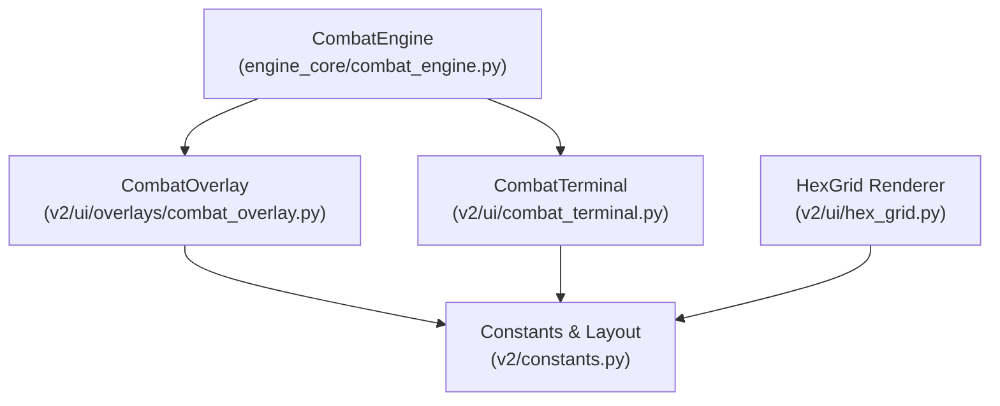

**Diagram sources**
- [combat_engine.py:1-271](file://engine_core/combat_engine.py#L1-L271)
- [combat_terminal.py:1-3](file://v2/ui/combat_terminal.py#L1-L3)
- [combat_overlay.py:1-86](file://v2/ui/overlays/combat_overlay.py#L1-L86)
- [hex_grid.py:1-472](file://v2/ui/hex_grid.py#L1-L472)
- [constants.py:1-168](file://v2/constants.py#L1-L168)

**Section sources**
- [combat_engine.py:1-271](file://engine_core/combat_engine.py#L1-L271)
- [combat_terminal.py:1-3](file://v2/ui/combat_terminal.py#L1-L3)
- [combat_overlay.py:1-86](file://v2/ui/overlays/combat_overlay.py#L1-L86)
- [hex_grid.py:1-472](file://v2/ui/hex_grid.py#L1-L472)
- [constants.py:1-168](file://v2/constants.py#L1-L168)

## Core Components
- CombatEngine: Computes combat outcomes, applies passive triggers, and emits structured results and logs.
- CombatOverlay: Streams combat logs to the terminal area with timing controls and post-battle persistence.
- HexGrid: Renders the 37-hex radial board, synergy lines, and interactive hover previews.
- Constants: Defines screen layout, colors, fonts, and timing for terminal rendering and animations.
- CombatTerminal: A placeholder widget intended to receive preformatted lines and footer content, stream them with a terminal-like behavior, and render them non-interactively.

**Section sources**
- [combat_engine.py:106-271](file://engine_core/combat_engine.py#L106-L271)
- [combat_overlay.py:5-86](file://v2/ui/overlays/combat_overlay.py#L5-L86)
- [hex_grid.py:327-472](file://v2/ui/hex_grid.py#L327-L472)
- [constants.py:23-168](file://v2/constants.py#L23-L168)
- [combat_terminal.py:1-3](file://v2/ui/combat_terminal.py#L1-L3)

## Architecture Overview
The combat lifecycle flows from the engine to the terminal and overlay. The engine computes results and logs, the overlay streams them into the terminal region, and the hex grid renders the tactical board with synergy highlights and hover feedback. The terminal consumes preformatted lines and a footer, then renders them in a non-interactive, bottom-up scrolling terminal style.

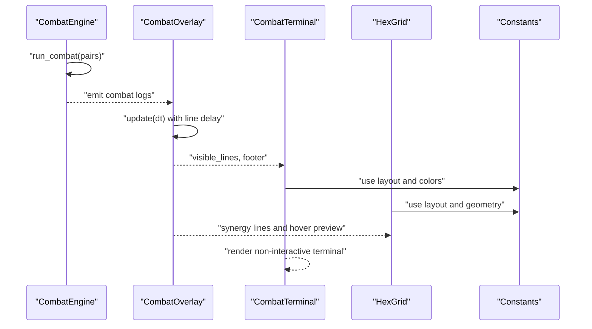

**Diagram sources**
- [combat_engine.py:106-271](file://engine_core/combat_engine.py#L106-L271)
- [combat_overlay.py:34-86](file://v2/ui/overlays/combat_overlay.py#L34-L86)
- [combat_terminal.py:1-3](file://v2/ui/combat_terminal.py#L1-L3)
- [hex_grid.py:327-472](file://v2/ui/hex_grid.py#L327-L472)
- [constants.py:27-168](file://v2/constants.py#L27-L168)

## Detailed Component Analysis

### CombatEngine
- Responsibilities:
  - Resolve pair-based combat outcomes.
  - Trigger pre-combat and combat-phase effects.
  - Compute scores from kills, combos, and synergies.
  - Apply damage calculations and update player HP and stats.
  - Emit structured results and logs for downstream consumers.
- Outputs:
  - Results list with winner, damage, HP before/after, and stats.
  - Verbose logs suitable for terminal streaming.

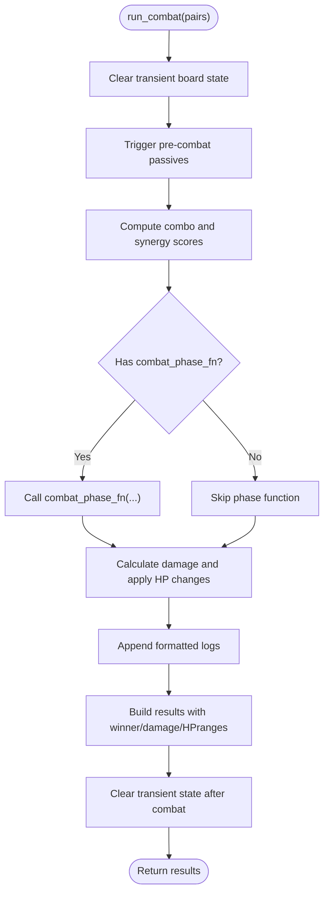

**Diagram sources**
- [combat_engine.py:106-271](file://engine_core/combat_engine.py#L106-L271)

**Section sources**
- [combat_engine.py:106-271](file://engine_core/combat_engine.py#L106-L271)

### CombatOverlay
- Purpose: Stream combat logs into the terminal region with controlled pacing and post-battle persistence.
- Behavior:
  - Accumulates elapsed time and appends lines at a configurable delay.
  - Supports early finish via input (click or space).
  - Maintains a post-combat timer before marking finished.
  - Renders a terminal-style background and color-coded lines.

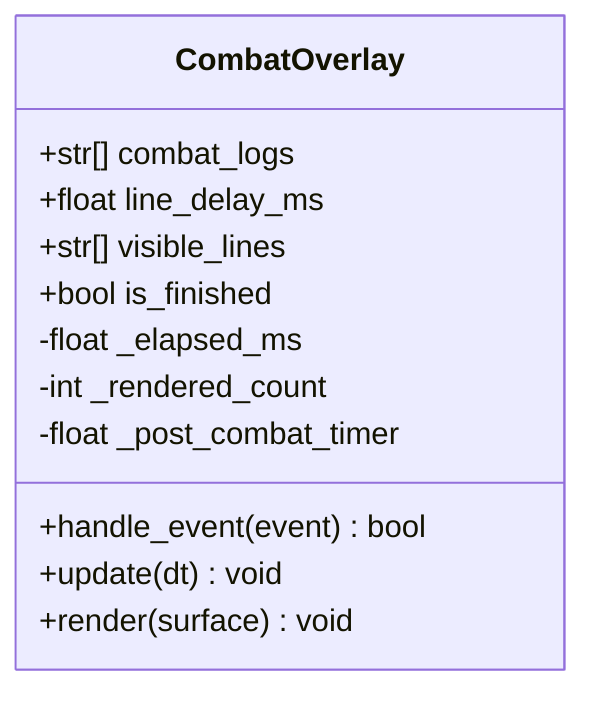

**Diagram sources**
- [combat_overlay.py:5-86](file://v2/ui/overlays/combat_overlay.py#L5-L86)

**Section sources**
- [combat_overlay.py:5-86](file://v2/ui/overlays/combat_overlay.py#L5-L86)

### HexGrid Renderer
- Purpose: Render the 37-hex radial board, synergy lines, and hover previews.
- Highlights:
  - Axial-to-pixel conversion with camera support.
  - Dynamic breathing glow for empty or hovered hexes.
  - Synergy lines with pulsing alpha and endpoint highlights.
  - Ghost preview for placement with edge stats overlay.

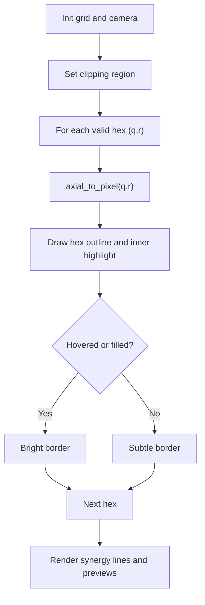

**Diagram sources**
- [hex_grid.py:327-472](file://v2/ui/hex_grid.py#L327-L472)

**Section sources**
- [hex_grid.py:327-472](file://v2/ui/hex_grid.py#L327-L472)

### Constants and Layout
- Defines screen size, layout regions, colors, fonts, and timing for terminal rendering and floating text.
- Terminal background and foreground colors are explicitly defined for contrast and readability.
- Timing constants govern floating text lifetimes and wagon delays.

**Section sources**
- [constants.py:23-168](file://v2/constants.py#L23-L168)

### CombatTerminal (Widget Contract)
- Current state: A minimal placeholder class.
- Contract expectations (from tests):
  - Accept preformatted lines and a footer.
  - Support streaming updates with a fixed tick rate.
  - Render non-interactively and remain safe against events.
  - Expose attributes for visible lines and footer visibility.

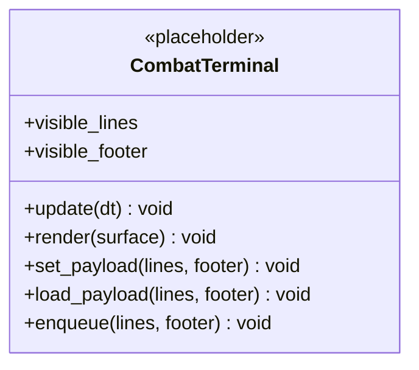

**Diagram sources**
- [combat_terminal.py:1-3](file://v2/ui/combat_terminal.py#L1-L3)
- [test_combat_terminal.py:7-85](file://tests/test_combat_terminal.py#L7-L85)

**Section sources**
- [combat_terminal.py:1-3](file://v2/ui/combat_terminal.py#L1-L3)
- [test_combat_terminal.py:7-85](file://tests/test_combat_terminal.py#L7-L85)

## Architecture Overview
The terminal sits at the intersection of combat data and UI rendering. The engine produces structured logs and results; the overlay streams them into the terminal region; the hex grid provides tactical context; and the terminal renders them in a non-interactive, bottom-up scrolling style.

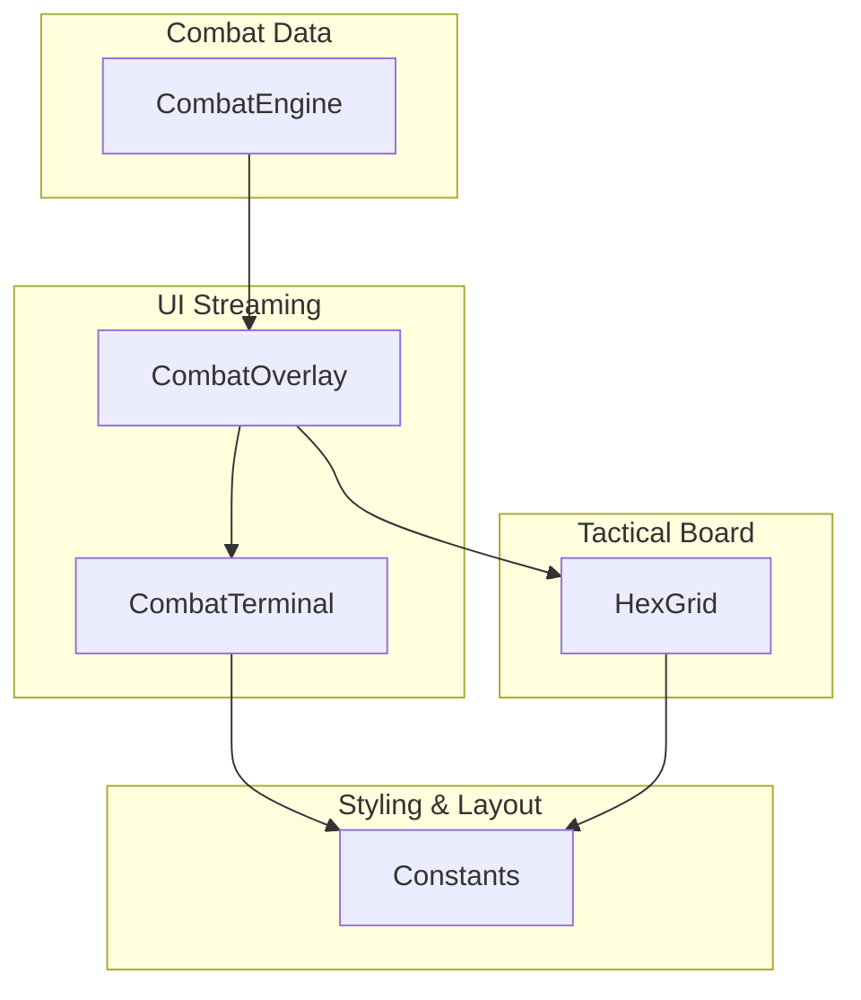

**Diagram sources**
- [combat_engine.py:106-271](file://engine_core/combat_engine.py#L106-L271)
- [combat_overlay.py:34-86](file://v2/ui/overlays/combat_overlay.py#L34-L86)
- [combat_terminal.py:1-3](file://v2/ui/combat_terminal.py#L1-L3)
- [hex_grid.py:327-472](file://v2/ui/hex_grid.py#L327-L472)
- [constants.py:27-168](file://v2/constants.py#L27-L168)

## Detailed Component Analysis

### Hex-Grid Combat Visualization
- Coordinate system: Axial (q, r) with flat-top orientation.
- Layout: 37-hex radial grid centered at origin with fixed margins.
- Rendering:
  - Breathing glow for empty or hovered hexes.
  - Synergy lines drawn between adjacent hexes when groups match.
  - Hover previews show potential synergy connections and edge stats.
- Integration: The overlay’s post-combat timer allows the board to remain visible while the terminal scrolls.

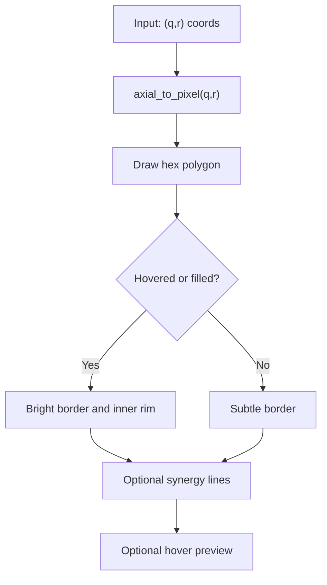

**Diagram sources**
- [hex_grid.py:415-472](file://v2/ui/hex_grid.py#L415-L472)
- [combat-scene-37hex-rebuild/design.md:104-314](file://.kiro/specs/combat-scene-37hex-rebuild/design.md#L104-L314)

**Section sources**
- [hex_grid.py:327-472](file://v2/ui/hex_grid.py#L327-L472)
- [combat-scene-37hex-rebuild/design.md:104-314](file://.kiro/specs/combat-scene-37hex-rebuild/design.md#L104-L314)

### Unit Health Displays and Damage Indicators
- Health bars and thresholds are defined in the strategic right panel specification.
- Floating text indicators (not part of the terminal widget) animate upward with fade-in/fade-out and hold durations.
- The terminal can present damage-dealt messages and unit-death events in a concise, filtered format.

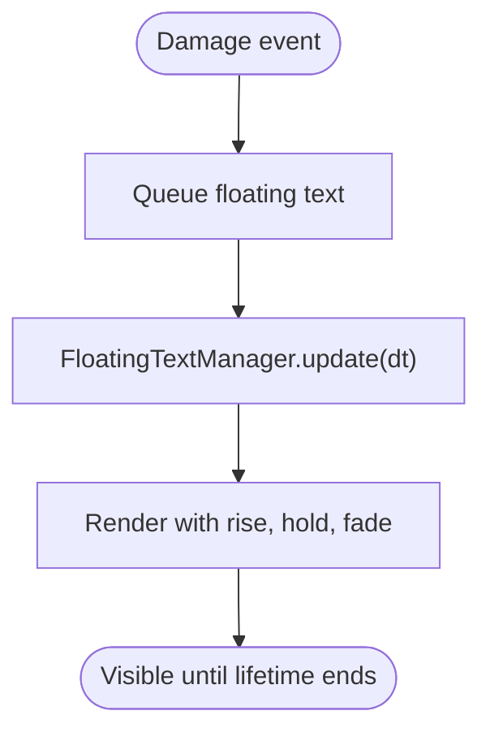

**Diagram sources**
- [COMBAT_SCENE_RADICAL_OVERHAUL.md:125-182](file://docs/COMBAT_SCENE_RADICAL_OVERHAUL.md#L125-L182)
- [constants.py:124-142](file://v2/constants.py#L124-L142)

**Section sources**
- [COMBAT_SCENE_RADICAL_OVERHAUL.md:125-182](file://docs/COMBAT_SCENE_RADICAL_OVERHAUL.md#L125-L182)
- [constants.py:124-142](file://v2/constants.py#L124-L142)

### Integration with Combat Overlay Systems and Real-Time Updates
- The overlay manages a background region and color-coded lines for victory/defeat/damage.
- The terminal consumes visible lines and footer content, updating at a fixed tick rate.
- The overlay supports early finish via input to accelerate the stream.

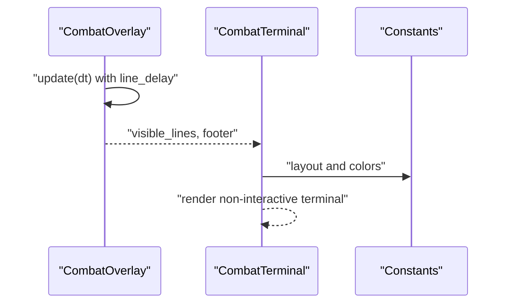

**Diagram sources**
- [combat_overlay.py:34-86](file://v2/ui/overlays/combat_overlay.py#L34-L86)
- [test_combat_terminal.py:44-85](file://tests/test_combat_terminal.py#L44-L85)
- [constants.py:27-168](file://v2/constants.py#L27-L168)

**Section sources**
- [combat_overlay.py:34-86](file://v2/ui/overlays/combat_overlay.py#L34-L86)
- [test_combat_terminal.py:44-85](file://tests/test_combat_terminal.py#L44-L85)
- [constants.py:27-168](file://v2/constants.py#L27-L168)

### Data Flow from Engine to Terminal Display
- Engine produces results and logs.
- Overlay streams logs into the terminal region with timing control.
- Terminal renders lines in a bottom-up, non-interactive manner.

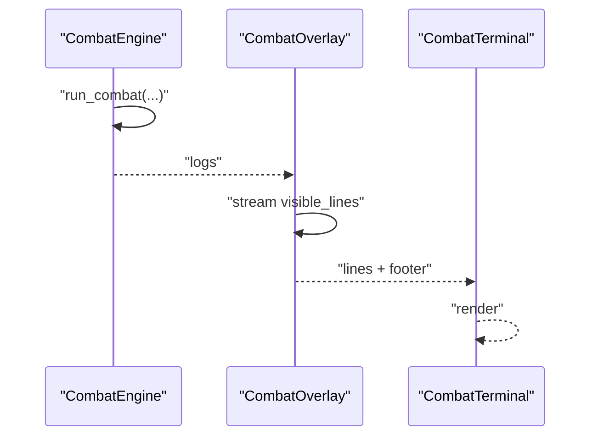

**Diagram sources**
- [combat_engine.py:106-271](file://engine_core/combat_engine.py#L106-L271)
- [combat_overlay.py:34-86](file://v2/ui/overlays/combat_overlay.py#L34-L86)
- [test_combat_terminal.py:44-85](file://tests/test_combat_terminal.py#L44-L85)

**Section sources**
- [combat_engine.py:106-271](file://engine_core/combat_engine.py#L106-L271)
- [combat_overlay.py:34-86](file://v2/ui/overlays/combat_overlay.py#L34-L86)
- [test_combat_terminal.py:44-85](file://tests/test_combat_terminal.py#L44-L85)

### State Synchronization and Performance Optimization
- Overlay pacing: Uses a fixed line delay and optional immediate finish to keep the stream responsive.
- Terminal rendering: Non-interactive, avoiding expensive event handling.
- Hex grid performance: Clipping to the central region, early exits for off-screen hexes, and minimal per-frame allocations.
- Floating text: Centralized manager with coordinated lifetimes and optional wagon delay to avoid visual clutter.

**Section sources**
- [combat_overlay.py:34-86](file://v2/ui/overlays/combat_overlay.py#L34-L86)
- [hex_grid.py:327-472](file://v2/ui/hex_grid.py#L327-L472)
- [constants.py:124-142](file://v2/constants.py#L124-L142)

### Examples of Combat State Rendering and Terminal Display Updates
- Example scenario: Two players clash, one deals damage, another dies, and the terminal streams these events with a fixed delay.
- Expected behavior: Lines appear progressively, the footer appears after the last line, and the overlay finishes after a post-combat delay.

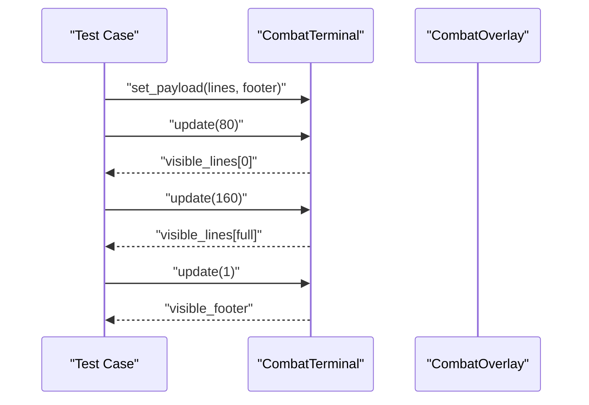

**Diagram sources**
- [test_combat_terminal.py:44-70](file://tests/test_combat_terminal.py#L44-L70)

**Section sources**
- [test_combat_terminal.py:44-70](file://tests/test_combat_terminal.py#L44-L70)

## Dependency Analysis
- CombatEngine depends on board utilities and constants for scoring and damage.
- CombatOverlay depends on constants for layout and colors and interacts with the terminal region.
- HexGrid depends on constants for geometry and rendering.
- CombatTerminal currently has no implementation but is expected to depend on constants for layout and fonts.

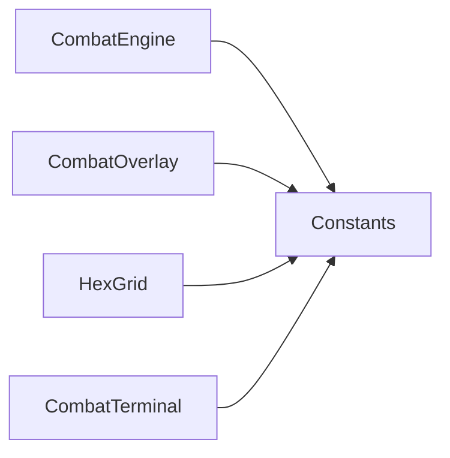

**Diagram sources**
- [combat_engine.py:16-40](file://engine_core/combat_engine.py#L16-L40)
- [combat_overlay.py:1-86](file://v2/ui/overlays/combat_overlay.py#L1-L86)
- [hex_grid.py:1-472](file://v2/ui/hex_grid.py#L1-L472)
- [constants.py:1-168](file://v2/constants.py#L1-L168)

**Section sources**
- [combat_engine.py:16-40](file://engine_core/combat_engine.py#L16-L40)
- [combat_overlay.py:1-86](file://v2/ui/overlays/combat_overlay.py#L1-L86)
- [hex_grid.py:1-472](file://v2/ui/hex_grid.py#L1-L472)
- [constants.py:1-168](file://v2/constants.py#L1-L168)

## Performance Considerations
- Use fixed-tick updates for the terminal to avoid frame-rate dependent rendering.
- Keep terminal rendering non-interactive to minimize event handling overhead.
- Clip hex grid rendering to the central region and skip off-screen hexes.
- Reuse surfaces and fonts via caching to reduce allocation overhead.
- Control floating text lifetimes and wagon delays to prevent visual congestion.

[No sources needed since this section provides general guidance]

## Troubleshooting Guide
- Terminal widget contract failures:
  - Ensure the widget exposes a payload-loading method (set_payload/load_payload/enqueue).
  - Ensure visible_lines and visible_footer attributes are accessible.
- Overlay pacing issues:
  - Verify line_delay_ms is configured appropriately.
  - Confirm early finish via input does not cause premature termination.
- Rendering artifacts:
  - Check clipping rectangles and camera offsets for hex grid.
  - Validate color and font choices for contrast in terminal background.

**Section sources**
- [test_combat_terminal.py:7-85](file://tests/test_combat_terminal.py#L7-L85)
- [combat_overlay.py:24-55](file://v2/ui/overlays/combat_overlay.py#L24-L55)
- [hex_grid.py:327-413](file://v2/ui/hex_grid.py#L327-L413)
- [constants.py:111-122](file://v2/constants.py#L111-L122)

## Conclusion
The Combat Terminal is designed to present combat results and battle logs in a terminal-like, non-interactive format synchronized with the combat overlay and hex-grid board. The CombatEngine supplies structured data and logs; the overlay streams them with controlled pacing; the hex grid provides tactical context; and the terminal renders them efficiently. Future implementation should focus on fulfilling the widget contract, integrating with the overlay’s streaming, and optimizing rendering performance.

[No sources needed since this section summarizes without analyzing specific files]

## Appendices

### Visual Design Elements
- Terminal background and foreground colors are defined for readability.
- Color-coded lines reflect outcomes (victory, defeat, damage).
- Fonts and sizes are standardized for legibility.

**Section sources**
- [constants.py:111-122](file://v2/constants.py#L111-L122)
- [combat_overlay.py:56-86](file://v2/ui/overlays/combat_overlay.py#L56-L86)

### Animation Systems for Combat Events
- Floating text manager coordinates lifetimes and movement for damage and effect indicators.
- Synergy lines pulse with alpha modulation for emphasis.
- Post-combat overlay timer ensures the board remains visible after the terminal finishes.

**Section sources**
- [constants.py:124-142](file://v2/constants.py#L124-L142)
- [hex_grid.py:51-129](file://v2/ui/hex_grid.py#L51-L129)
- [combat_overlay.py:34-44](file://v2/ui/overlays/combat_overlay.py#L34-L44)

### User Interaction Patterns During Combat Sequences
- Click or space accelerates the terminal stream.
- The terminal is non-interactive; hover and selection are handled by the hex grid.
- Post-combat delay allows players to absorb results before returning to gameplay.

**Section sources**
- [combat_overlay.py:24-32](file://v2/ui/overlays/combat_overlay.py#L24-L32)
- [hex_grid.py:327-413](file://v2/ui/hex_grid.py#L327-L413)