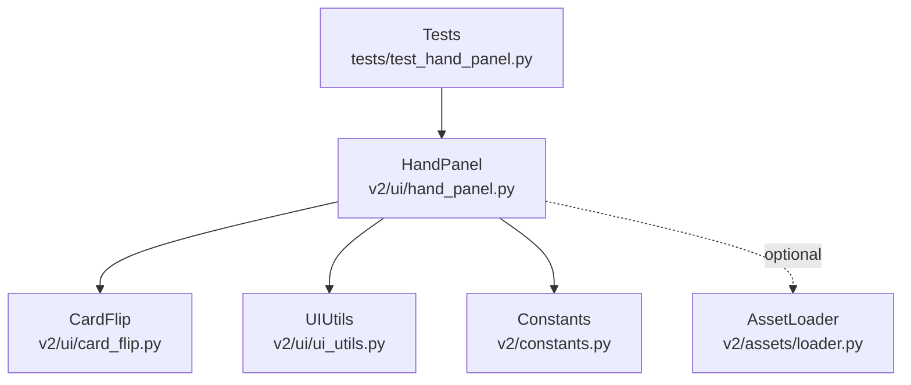
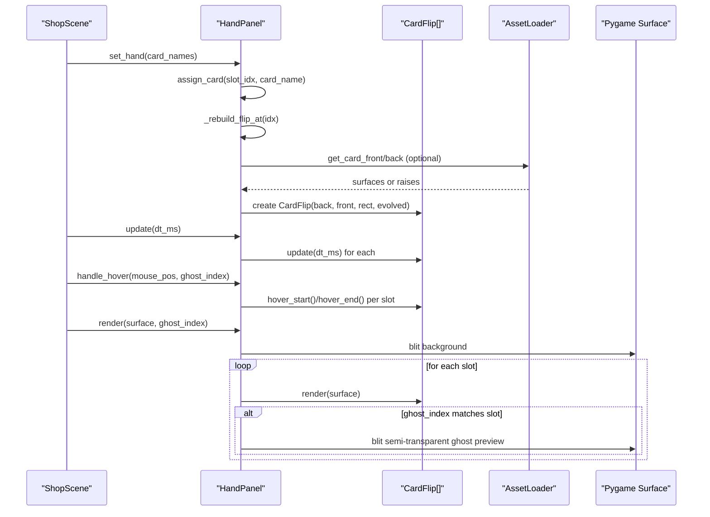
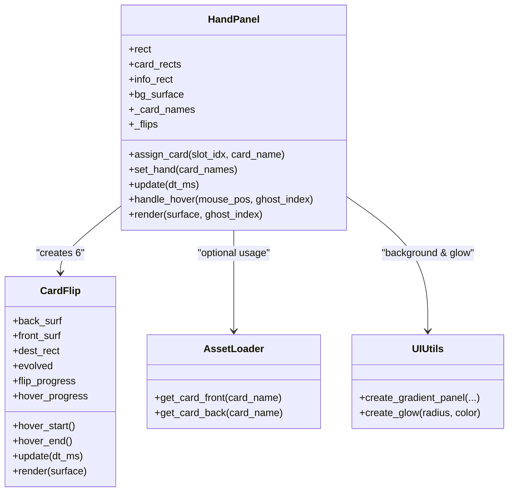

# Hand Panel

<cite>
**Referenced Files in This Document**
- [hand_panel.py](file://v2/ui/hand_panel.py)
- [card_flip.py](file://v2/ui/card_flip.py)
- [constants.py](file://v2/constants.py)
- [loader.py](file://v2/assets/loader.py)
- [ui_utils.py](file://v2/ui/ui_utils.py)
- [test_hand_panel.py](file://tests/test_hand_panel.py)
- [shop.py](file://v2/scenes/shop.py)
</cite>

## Table of Contents
1. [Introduction](#introduction)
2. [Project Structure](#project-structure)
3. [Core Components](#core-components)
4. [Architecture Overview](#architecture-overview)
5. [Detailed Component Analysis](#detailed-component-analysis)
6. [Dependency Analysis](#dependency-analysis)
7. [Performance Considerations](#performance-considerations)
8. [Troubleshooting Guide](#troubleshooting-guide)
9. [Conclusion](#conclusion)

## Introduction
This document describes the Hand Panel component responsible for rendering a player's hand in the top-center bar of the UI. It covers the visual design (gradient background, sci-fi styling, decorative elements), the card slot system (six positions, layout calculations, and positioning logic), the CardFlip animation system (hover and flip mechanics), evolution detection for platinum-colored cards, fallback rendering when assets are unavailable, hover detection and mouse interaction handling, ghost card rendering for drag operations, initialization parameters, update cycles, and the rendering pipeline. It also documents the relationship with AssetLoader for card art management and the fallback surface generation for offline scenarios, along with examples of hand state management, card assignment, and hover state handling.

## Project Structure
The Hand Panel lives in the UI layer and composes several subsystems:
- HandPanel orchestrates layout, background, and per-slot animations
- CardFlip handles hover and flip animations per card slot
- AssetLoader provides card front/back surfaces when available
- UIUtils supplies gradient backgrounds and glow effects
- Constants define layout, colors, and sizes
- Tests validate layout, hover behavior, and rendering

**Diagram sources**
- [hand_panel.py:25-221](file://v2/ui/hand_panel.py#L25-L221)
- [card_flip.py:27-178](file://v2/ui/card_flip.py#L27-L178)
- [loader.py:14-122](file://v2/assets/loader.py#L14-L122)
- [ui_utils.py:3-90](file://v2/ui/ui_utils.py#L3-L90)
- [constants.py:27-168](file://v2/constants.py#L27-L168)
- [test_hand_panel.py:1-90](file://tests/test_hand_panel.py#L1-L90)

**Section sources**
- [hand_panel.py:25-221](file://v2/ui/hand_panel.py#L25-L221)
- [constants.py:27-60](file://v2/constants.py#L27-L60)

## Core Components
- HandPanel: Creates the full-width hand panel, six card slots, background gradient, decorative elements, and initializes CardFlip instances per slot. It manages hand state, hover detection, and renders the panel and ghost previews during drag.
- CardFlip: Per-slot animation controller implementing hover lift/scale and card-flip reveal. Supports evolved-card effects with glow and border.
- AssetLoader: Centralized asset manager providing card front/back surfaces; used by HandPanel to build CardFlip instances.
- UIUtils: Provides gradient backgrounds and glow effects used by HandPanel and CardFlip.
- Constants: Defines screen geometry, panel dimensions, card sizes, gaps, and colors.

**Section sources**
- [hand_panel.py:25-221](file://v2/ui/hand_panel.py#L25-L221)
- [card_flip.py:27-178](file://v2/ui/card_flip.py#L27-L178)
- [loader.py:14-122](file://v2/assets/loader.py#L14-L122)
- [ui_utils.py:3-90](file://v2/ui/ui_utils.py#L3-L90)
- [constants.py:27-123](file://v2/constants.py#L27-L123)

## Architecture Overview
The Hand Panel composes a static background with animated card slots. Each slot is represented by a CardFlip instance that renders a hex-based card surface. When assets are available, CardFlip uses AssetLoader-provided front/back surfaces; otherwise, fallback hex surfaces are generated. Hover detection toggles per-slot flip/hover states, and during drag operations, a semi-transparent ghost preview is drawn.

**Diagram sources**
- [hand_panel.py:137-221](file://v2/ui/hand_panel.py#L137-L221)
- [card_flip.py:67-145](file://v2/ui/card_flip.py#L67-L145)
- [loader.py:52-58](file://v2/assets/loader.py#L52-L58)
- [shop.py:282-304](file://v2/scenes/shop.py#L282-L304)

## Detailed Component Analysis

### Hand Panel Visual Design and Background
- Gradient background: A vertical gradient panel is created with top/bottom colors and optional beveled edges. The panel spans the full width of the screen and sits at the bottom of the screen, aligned to the hand panel geometry.
- Decorative elements: A thin top line and a sci-fi label are drawn on the background surface. The label uses a monospaced font and is right-aligned near the top-right corner.
- Inset slot shadows: Each card slot area draws rounded inset rectangles to imply depth.

Key behaviors:
- Background creation uses UIUtils.create_gradient_panel with specified colors and border radius.
- A rim light line is drawn at the top edge.
- A subtle decorative line is drawn near the top edge.
- Slot areas receive rounded inset fills and outlines.

**Section sources**
- [hand_panel.py:47-83](file://v2/ui/hand_panel.py#L47-L83)
- [ui_utils.py:5-66](file://v2/ui/ui_utils.py#L5-L66)

### Card Slot System: Six Positions, Layout, and Positioning
- Six card slots are positioned horizontally centered within the hand panel.
- Layout parameters:
  - HAND_CARD_W/H define card width/height
  - HAND_CARD_GAP defines spacing between cards
  - CENTER_ORIGIN_X sets a starting offset from the left sidebar
  - HAND_PANEL_Y/H anchors the panel at the bottom of the screen
- Positioning logic:
  - Start x is offset from CENTER_ORIGIN_X
  - Each subsequent slot x is previous x + HAND_CARD_W + HAND_CARD_GAP
  - All slots share the same y, vertically centered within the panel

Validation:
- Tests confirm six slots, correct widths/heights, and sequential x positions.

**Section sources**
- [hand_panel.py:30-40](file://v2/ui/hand_panel.py#L30-L40)
- [constants.py:41-47](file://v2/constants.py#L41-L47)
- [test_hand_panel.py:17-26](file://tests/test_hand_panel.py#L17-L26)

### CardFlip Animation System: Hover and Flip Mechanics
- Hover physics:
  - Progress smoothly interpolates toward target (0.0–1.0)
  - Lift moves the card upward by a fixed amount
  - Scale increases card size for emphasis
- Flip mechanics:
  - Progress determines which half of the card is visible
  - Back half shrinks while Front half expands around the center
- Rendering:
  - Scaled surfaces are blitted at the slot center
  - Optional evolved glow and border are applied when appropriate

Evolved detection:
- HandPanel checks the card database for rarity markers and passes an evolved flag to CardFlip, enabling a glow and border effect.

**Section sources**
- [card_flip.py:27-178](file://v2/ui/card_flip.py#L27-L178)
- [hand_panel.py:91-102](file://v2/ui/hand_panel.py#L91-L102)

### Evolution Detection and Platinum Effects
- Evolution detection:
  - HandPanel queries the card database for a given card name and checks rarity/rarity level attributes
  - If detected as evolved, CardFlip is constructed with evolved=True and a platinum color
- Visual effects:
  - CardFlip optionally generates a glow surface and draws a colored border around the card when flip reveals the front portion

**Section sources**
- [hand_panel.py:91-102](file://v2/ui/hand_panel.py#L91-L102)
- [card_flip.py:126-144](file://v2/ui/card_flip.py#L126-L144)

### Fallback Rendering Without Assets
- Fallback surfaces:
  - When AssetLoader is unavailable or card assets are missing, HandPanel generates fallback hex surfaces
  - Fallback surfaces are hexagons with an outline and a subtle fill
- CardFlip construction:
  - HandPanel attempts to load front/back surfaces; on failure, it falls back to the generated surfaces
- Glow and border:
  - Even with fallbacks, evolved effects are preserved when the card is marked evolved

**Section sources**
- [hand_panel.py:116-136](file://v2/ui/hand_panel.py#L116-L136)
- [hand_panel.py:159-168](file://v2/ui/hand_panel.py#L159-L168)

### Hover Detection and Mouse Interaction Handling
- Hover detection:
  - For each frame, HandPanel checks if the mouse is colliding with a slot rectangle
  - If the slot matches the ghost_index (drag lock), hover is forced on that slot
  - Otherwise, hover is started for the hovered slot and ended for others
- Return value:
  - Returns the index of the currently hovered slot or -1 if none

Integration:
- ShopScene coordinates hover state and clears info panels when hovering transitions occur.

**Section sources**
- [hand_panel.py:178-192](file://v2/ui/hand_panel.py#L178-L192)
- [shop.py:282-298](file://v2/scenes/shop.py#L282-L298)

### Ghost Card Rendering for Drag Operations
- During drag:
  - HandPanel renders a semi-transparent overlay of the dragged slot’s CardFlip
  - The overlay uses a temporary surface with per-pixel alpha and reduced opacity
- Purpose:
  - Provides a smooth visual preview of the card being moved without interfering with hover physics

**Section sources**
- [hand_panel.py:197-218](file://v2/ui/hand_panel.py#L197-L218)

### Initialization Parameters, Update Cycles, and Rendering Pipeline
- Initialization:
  - Creates panel rect, six slot rects, info rect, gradient background, and inset slot shadows
  - Builds CardFlip instances per slot, attempting AssetLoader usage and falling back to generated surfaces
- Update cycle:
  - Called once per frame with dt_ms; forwards updates to each CardFlip
- Render pipeline:
  - Blits the cached background surface
  - Renders each CardFlip; if ghost_index matches, renders a semi-transparent ghost preview
  - Info panel rendering is delegated elsewhere

**Section sources**
- [hand_panel.py:26-90](file://v2/ui/hand_panel.py#L26-L90)
- [hand_panel.py:173-221](file://v2/ui/hand_panel.py#L173-L221)

### Relationship with AssetLoader and Offline Fallbacks
- AssetLoader integration:
  - HandPanel attempts to obtain AssetLoader; if available, loads card front/back surfaces and scales them to slot size
  - On exceptions or missing files, falls back to generated hex surfaces
- Offline behavior:
  - Fallback surfaces are generated with hexagonal shapes and outlines
  - Glow and border effects remain consistent for evolved cards

**Section sources**
- [hand_panel.py:109-136](file://v2/ui/hand_panel.py#L109-L136)
- [loader.py:52-58](file://v2/assets/loader.py#L52-L58)

### Examples: Hand State Management, Card Assignment, and Hover Handling
- Setting hand cards:
  - HandPanel.set_hand compares incoming names with current state and rebuilds only changed slots
- Assigning a single card:
  - HandPanel.assign_card updates a specific slot and rebuilds its CardFlip
- Hover handling:
  - HandPanel.handle_hover toggles hover states per slot and returns the hovered index
- Drag ghost handling:
  - Passing ghost_index locks hover on the dragged slot and renders a semi-transparent preview

**Section sources**
- [hand_panel.py:143-192](file://v2/ui/hand_panel.py#L143-L192)
- [hand_panel.py:197-218](file://v2/ui/hand_panel.py#L197-L218)

## Dependency Analysis

**Diagram sources**
- [hand_panel.py:25-221](file://v2/ui/hand_panel.py#L25-L221)
- [card_flip.py:27-178](file://v2/ui/card_flip.py#L27-L178)
- [loader.py:14-122](file://v2/assets/loader.py#L14-L122)
- [ui_utils.py:3-90](file://v2/ui/ui_utils.py#L3-L90)

**Section sources**
- [hand_panel.py:25-221](file://v2/ui/hand_panel.py#L25-L221)
- [card_flip.py:27-178](file://v2/ui/card_flip.py#L27-L178)
- [loader.py:14-122](file://v2/assets/loader.py#L14-L122)
- [ui_utils.py:3-90](file://v2/ui/ui_utils.py#L3-L90)

## Performance Considerations
- Background caching: The gradient background is precomputed and reused each frame via blitting.
- Minimal per-frame allocations: CardFlip uses smooth interpolation and transforms; avoid repeated rescaling by reusing surfaces when possible.
- Off-screen culling: While not implemented in HandPanel, consider skipping renders for cards that are too small after scaling to reduce overdraw.
- Asset caching: AssetLoader caches loaded sprites; avoid redundant loads by reusing the loader instance.

## Troubleshooting Guide
- Missing assets:
  - Symptom: Cards appear as fallback hexagons.
  - Cause: AssetLoader not initialized or card files missing.
  - Resolution: Ensure AssetLoader is available and card front/back files exist under the configured base directory.
- Hover not responding:
  - Symptom: No hover lift or flip.
  - Cause: Mouse outside slot rects or ghost_index locking hover.
  - Resolution: Verify mouse position collision and check ghost_index usage during drag.
- Drag preview not visible:
  - Symptom: No semi-transparent ghost preview.
  - Cause: ghost_index not matching the dragged slot or render order issues.
  - Resolution: Confirm ghost_index and ensure render is called after blitting the background.

**Section sources**
- [hand_panel.py:178-218](file://v2/ui/hand_panel.py#L178-L218)
- [loader.py:31-36](file://v2/assets/loader.py#L31-L36)

## Conclusion
The Hand Panel provides a visually rich, responsive interface for the player’s hand. Its design combines a sci-fi gradient background with precise slot layouts and smooth CardFlip animations. Evolution detection enables distinctive visual feedback for evolved cards, while AssetLoader integration ensures robust asset management with reliable fallbacks. Hover detection and ghost rendering support seamless drag-and-drop interactions, and the update/render pipeline keeps performance efficient.