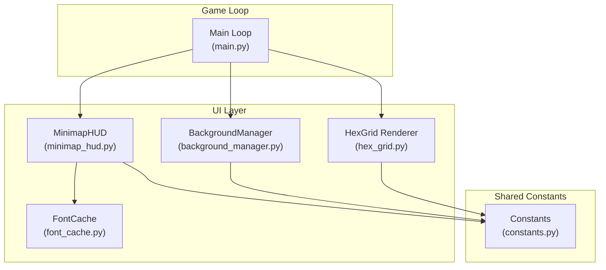
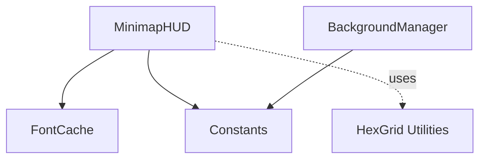
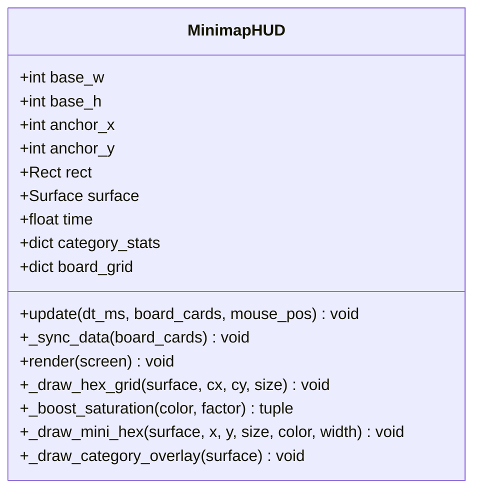
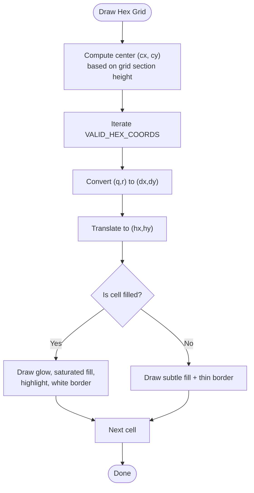
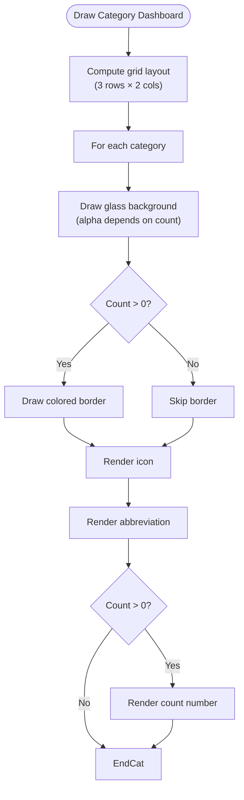
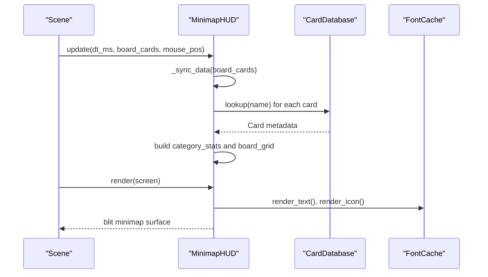
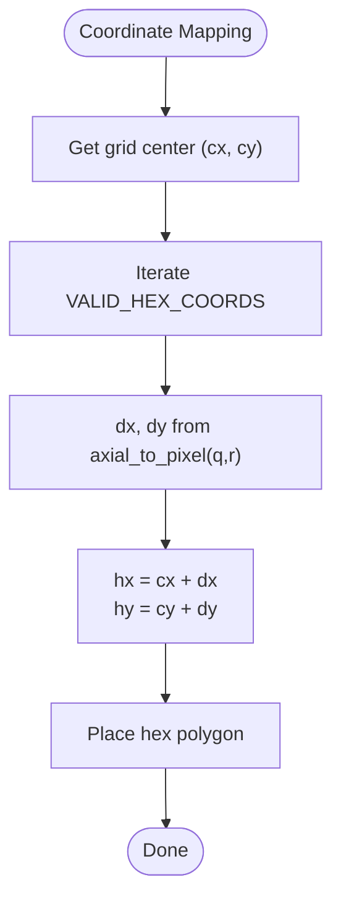
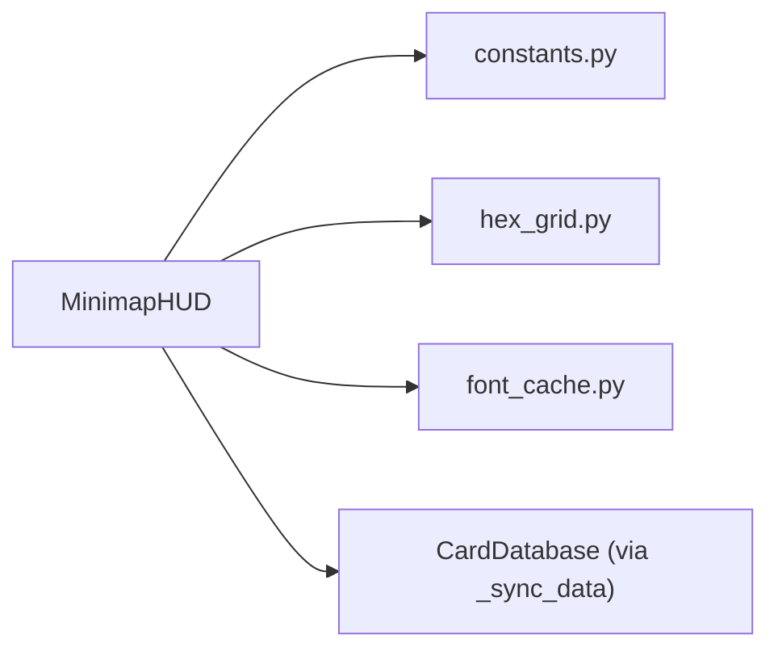

# Minimap HUD

<cite>
**Referenced Files in This Document**
- [minimap_hud.py](file://v2/ui/minimap_hud.py)
- [background_manager.py](file://v2/ui/background_manager.py)
- [hex_grid.py](file://v2/ui/hex_grid.py)
- [constants.py](file://v2/constants.py)
- [font_cache.py](file://v2/ui/font_cache.py)
- [minimap-hex-quality-improvement.md](file://memory/minimap-hex-quality-improvement.md)
- [minimap-hex-final-fix.md](file://memory/minimap-hex-final-fix.md)
- [minimap-optimization-log.md](file://memory/minimap-optimization-log.md)
- [main.py](file://v2/main.py)
</cite>

## Table of Contents
1. [Introduction](#introduction)
2. [Project Structure](#project-structure)
3. [Core Components](#core-components)
4. [Architecture Overview](#architecture-overview)
5. [Detailed Component Analysis](#detailed-component-analysis)
6. [Dependency Analysis](#dependency-analysis)
7. [Performance Considerations](#performance-considerations)
8. [Troubleshooting Guide](#troubleshooting-guide)
9. [Conclusion](#conclusion)
10. [Appendices](#appendices)

## Introduction
This document describes the Minimap HUD component responsible for the tactical overview display during gameplay. It covers the hex-grid minimap rendering, unit-position tracking, category dashboard, visual design, coordinate mapping, scaling, and performance characteristics. It also explains how the minimap integrates with the background manager and board state visualization, and how it maintains real-time updates.

## Project Structure
The Minimap HUD lives in the UI layer alongside the hex grid renderer and background manager. It relies on shared constants for geometry and camera state, and uses a font cache for typography.

**Diagram sources**
- [minimap_hud.py:16-232](file://v2/ui/minimap_hud.py#L16-L232)
- [background_manager.py:5-84](file://v2/ui/background_manager.py#L5-L84)
- [hex_grid.py:1-472](file://v2/ui/hex_grid.py#L1-L472)
- [constants.py:23-168](file://v2/constants.py#L23-L168)
- [font_cache.py:1-139](file://v2/ui/font_cache.py#L1-L139)
- [main.py:37-74](file://v2/main.py#L37-L74)

**Section sources**
- [minimap_hud.py:16-232](file://v2/ui/minimap_hud.py#L16-L232)
- [background_manager.py:5-84](file://v2/ui/background_manager.py#L5-L84)
- [hex_grid.py:1-472](file://v2/ui/hex_grid.py#L1-L472)
- [constants.py:23-168](file://v2/constants.py#L23-L168)
- [font_cache.py:1-139](file://v2/ui/font_cache.py#L1-L139)
- [main.py:37-74](file://v2/main.py#L37-L74)

## Core Components
- MinimapHUD: Renders a tactical overview with a hex grid and category dashboard. It consumes board state from the scene and renders it onto a dedicated surface.
- BackgroundManager: Provides the dynamic hex background and vignette effect, independent of board state.
- HexGrid: Provides coordinate conversions and rendering helpers used by MinimapHUD for hex placement.
- Constants: Defines screen, layout, grid math, camera state, and typography used across UI components.
- FontCache: Centralized font and icon rendering service used by MinimapHUD.

**Section sources**
- [minimap_hud.py:16-232](file://v2/ui/minimap_hud.py#L16-L232)
- [background_manager.py:5-84](file://v2/ui/background_manager.py#L5-L84)
- [hex_grid.py:1-472](file://v2/ui/hex_grid.py#L1-L472)
- [constants.py:23-168](file://v2/constants.py#L23-L168)
- [font_cache.py:1-139](file://v2/ui/font_cache.py#L1-L139)

## Architecture Overview
The Minimap HUD is a layered UI element anchored below the synergy HUD. It renders:
- A unified dark background with a subtle left border.
- A header label “TACTICAL OVERVIEW”.
- A hex grid section (65% of the minimap height) showing board layout and unit presence.
- A category dashboard (35% of the minimap height) showing counts per category.

It integrates with the background manager for the overall scene’s visual feel and with the hex grid utilities for coordinate mapping.

**Diagram sources**
- [minimap_hud.py:89-118](file://v2/ui/minimap_hud.py#L89-L118)
- [background_manager.py:19-35](file://v2/ui/background_manager.py#L19-L35)
- [hex_grid.py:415-448](file://v2/ui/hex_grid.py#L415-L448)
- [font_cache.py:42-48](file://v2/ui/font_cache.py#L42-L48)
- [constants.py:61-74](file://v2/constants.py#L61-L74)

## Detailed Component Analysis

### MinimapHUD Class
MinimapHUD encapsulates:
- Layout sizing and anchoring relative to the synergy HUD.
- A cached surface for efficient blitting.
- A category palette and mapping from card categories to colors.
- Data synchronization from board state to internal grid and category stats.
- Rendering pipeline for background, header, hex grid, separator, and category dashboard.

Key responsibilities:
- update(dt_ms, board_cards, mouse_pos): Accumulates time and syncs board data.
- _sync_data(board_cards): Maps card names to categories, aggregates counts, and builds the board grid map.
- render(screen): Draws the unified background, header, hex grid, separator, and category dashboard.

Rendering highlights:
- Hex grid: Uses a center anchor and a fixed hex size; draws filled hexes with multi-layer visuals and empty hexes with subtle outlines.
- Category dashboard: 3 rows × 2 columns grid with icons, abbreviations, and counts.

**Diagram sources**
- [minimap_hud.py:16-232](file://v2/ui/minimap_hud.py#L16-L232)

**Section sources**
- [minimap_hud.py:16-232](file://v2/ui/minimap_hud.py#L16-L232)

### Hex Grid Rendering and Scaling
MinimapHUD draws a hex grid centered within its grid section. It uses the same axial coordinate system as the main board and applies a fixed hex size tuned for the minimap’s layout.

- Center calculation: centers the grid within the upper 65% of the minimap area.
- Hex size: tuned to 24px for readability and spacing.
- Multi-layer rendering: filled hexes use a glow, saturated fill, highlight, and white border for depth and clarity; empty hexes use a subtle fill and thin border.

**Diagram sources**
- [minimap_hud.py:120-149](file://v2/ui/minimap_hud.py#L120-L149)
- [hex_grid.py:459-462](file://v2/ui/hex_grid.py#L459-L462)
- [hex_grid.py:415-448](file://v2/ui/hex_grid.py#L415-L448)

**Section sources**
- [minimap_hud.py:120-149](file://v2/ui/minimap_hud.py#L120-L149)
- [hex_grid.py:459-462](file://v2/ui/hex_grid.py#L459-L462)
- [hex_grid.py:415-448](file://v2/ui/hex_grid.py#L415-L448)

### Category Dashboard
The category dashboard displays six categories with:
- Icon, abbreviation, and count.
- Glass-like backgrounds with optional borders.
- Dynamic alpha for inactive states and active counts.

**Diagram sources**
- [minimap_hud.py:169-232](file://v2/ui/minimap_hud.py#L169-L232)

**Section sources**
- [minimap_hud.py:169-232](file://v2/ui/minimap_hud.py#L169-L232)

### Integration with Background Manager and Board State
- BackgroundManager: Renders the scene’s dynamic hex background and vignette independently of board state. MinimapHUD does not directly call it; it is part of the overall scene rendering pipeline.
- Board state visualization: MinimapHUD receives board_cards from the scene and maps them to category counts and board grid colors. It does not mutate the engine state; it only reads board_cards.

**Diagram sources**
- [minimap_hud.py:47-88](file://v2/ui/minimap_hud.py#L47-L88)
- [minimap_hud.py:89-118](file://v2/ui/minimap_hud.py#L89-L118)
- [font_cache.py:96-139](file://v2/ui/font_cache.py#L96-L139)

**Section sources**
- [minimap_hud.py:47-88](file://v2/ui/minimap_hud.py#L47-L88)
- [minimap_hud.py:89-118](file://v2/ui/minimap_hud.py#L89-L118)
- [font_cache.py:96-139](file://v2/ui/font_cache.py#L96-L139)

### Coordinate Mapping and Scaling
MinimapHUD uses axial coordinates (q, r) aligned with the main board. It computes hex positions using the same conversion utilities used elsewhere in the UI.

- Conversion: axial_to_pixel(q, r) with camera support is used by the main hex grid renderer. MinimapHUD computes local offsets for grid placement.
- Scaling: Hex size is fixed at 24px for the minimap grid. The grid section occupies 65% of the minimap height, ensuring adequate vertical space for the hexes.

**Diagram sources**
- [minimap_hud.py:120-127](file://v2/ui/minimap_hud.py#L120-L127)
- [hex_grid.py:415-448](file://v2/ui/hex_grid.py#L415-L448)
- [hex_grid.py:459-462](file://v2/ui/hex_grid.py#L459-L462)

**Section sources**
- [minimap_hud.py:120-127](file://v2/ui/minimap_hud.py#L120-L127)
- [hex_grid.py:415-448](file://v2/ui/hex_grid.py#L415-L448)
- [hex_grid.py:459-462](file://v2/ui/hex_grid.py#L459-L462)

### Visual Design Elements
- Unified dark background with a subtle left border.
- Header label with a separator line.
- Hex grid with multi-layer visuals for filled cells and subtle outlines for empty cells.
- Category dashboard with rounded glass backgrounds, borders, icons, abbreviations, and counts.
- Typography and icons via FontCache.

**Section sources**
- [minimap_hud.py:89-118](file://v2/ui/minimap_hud.py#L89-L118)
- [minimap_hud.py:120-149](file://v2/ui/minimap_hud.py#L120-L149)
- [minimap_hud.py:169-232](file://v2/ui/minimap_hud.py#L169-L232)
- [font_cache.py:42-48](file://v2/ui/font_cache.py#L42-L48)

## Dependency Analysis
MinimapHUD depends on:
- Constants for screen size, layout, grid math, and camera state.
- HexGrid utilities for axial-to-pixel conversion and the set of valid coordinates.
- FontCache for text and icon rendering.
- CardDatabase indirectly via _sync_data to resolve card categories.

**Diagram sources**
- [minimap_hud.py:3, 70-87:3-87](file://v2/ui/minimap_hud.py#L3-L87)
- [constants.py:23-74](file://v2/constants.py#L23-L74)
- [hex_grid.py:1-5, 415-448:1-5](file://v2/ui/hex_grid.py#L1-L5)
- [font_cache.py:1-139](file://v2/ui/font_cache.py#L1-L139)

**Section sources**
- [minimap_hud.py:3, 70-87:3-87](file://v2/ui/minimap_hud.py#L3-L87)
- [constants.py:23-74](file://v2/constants.py#L23-L74)
- [hex_grid.py:1-5, 415-448:1-5](file://v2/ui/hex_grid.py#L1-L5)
- [font_cache.py:1-139](file://v2/ui/font_cache.py#L1-L139)

## Performance Considerations
- Rendering cost: MinimapHUD draws a fixed set of hexes (37) with a small number of draw calls per filled hex. The multi-layer approach increases draw calls but remains negligible.
- Surface caching: MinimapHUD uses a cached surface and blits it once per frame, reducing per-frame computation.
- Update frequency: The minimap updates on every frame with minimal work—primarily mapping board_cards to internal structures.
- Memory: Minimal allocations; uses precomputed layouts and cached surfaces.

Optimization notes:
- The hex grid quality improvements increased saturation and alpha blending for visual fidelity with negligible CPU overhead.
- Category dashboard uses compact layouts and rounded rectangles with moderate alpha for readability.

**Section sources**
- [minimap-hex-quality-improvement.md:131-136](file://memory/minimap-hex-quality-improvement.md#L131-L136)
- [minimap-hex-final-fix.md:127-131](file://memory/minimap-hex-final-fix.md#L127-L131)
- [minimap-optimization-log.md:44-89](file://memory/minimap-optimization-log.md#L44-L89)
- [minimap_hud.py:36, 47-50:36-50](file://v2/ui/minimap_hud.py#L36-L50)

## Troubleshooting Guide
Common issues and resolutions:
- Missing card icons or text: Ensure FontCache has loaded the required fonts and icons. Verify minimap category fonts and icon keys.
- Incorrect hex positions: Confirm axial coordinates and conversion functions are consistent with the main board. Validate that VALID_HEX_COORDS and axial_to_pixel are used consistently.
- Category counts not updating: Verify that board_cards passed to update() contains the expected structure and that _sync_data resolves card categories via CardDatabase.
- Visual artifacts: Check alpha blending values for glow, highlight, and border layers. Ensure the order of drawing layers is preserved.

**Section sources**
- [font_cache.py:17-48](file://v2/ui/font_cache.py#L17-L48)
- [hex_grid.py:415-448](file://v2/ui/hex_grid.py#L415-L448)
- [minimap_hud.py:52-87](file://v2/ui/minimap_hud.py#L52-L87)
- [minimap_hud.py:120-149](file://v2/ui/minimap_hud.py#L120-L149)

## Conclusion
The Minimap HUD provides a compact, high-contrast tactical overview of the board and categories. Its design emphasizes clarity through layered hex rendering, saturated colors, and a balanced layout. It integrates cleanly with the rest of the UI stack, relying on shared constants and utilities while maintaining a focused rendering pipeline. Performance remains excellent due to surface caching, fixed geometry, and minimal per-frame work.

## Appendices

### Coordinate Transformation Logic
- Axial to pixel conversion: Uses GridMath.camera.zoom and offsets to compute screen-space positions.
- Pixel to axial conversion: Reverses the process to map mouse clicks to hex coordinates.

**Section sources**
- [hex_grid.py:415-448](file://v2/ui/hex_grid.py#L415-L448)

### Minimap State Updates
- update(dt_ms, board_cards, mouse_pos): Increments internal time and synchronizes data.
- _sync_data(board_cards): Resolves card categories, aggregates counts, and builds board_grid.

**Section sources**
- [minimap_hud.py:47-88](file://v2/ui/minimap_hud.py#L47-L88)

### Visual Design References
- Multi-layer hex rendering and saturation boost: See the improvement logs for details and rationale.
- Category dashboard layout and typography: See the optimization log for layout breakdown and visual improvements.

**Section sources**
- [minimap-hex-quality-improvement.md:1-150](file://memory/minimap-hex-quality-improvement.md#L1-L150)
- [minimap-hex-final-fix.md:1-137](file://memory/minimap-hex-final-fix.md#L1-L137)
- [minimap-optimization-log.md:44-89](file://memory/minimap-optimization-log.md#L44-L89)