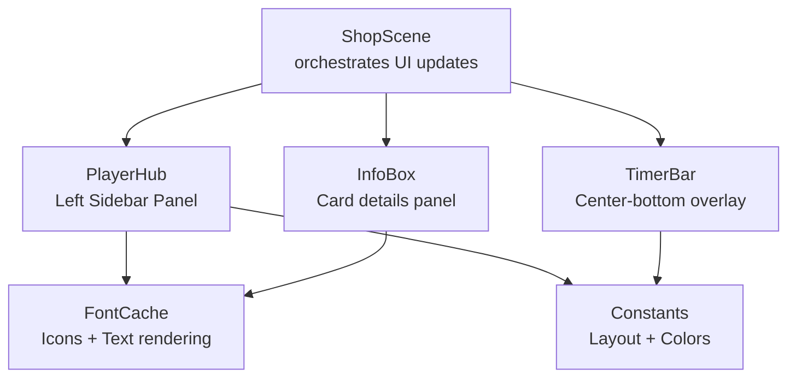
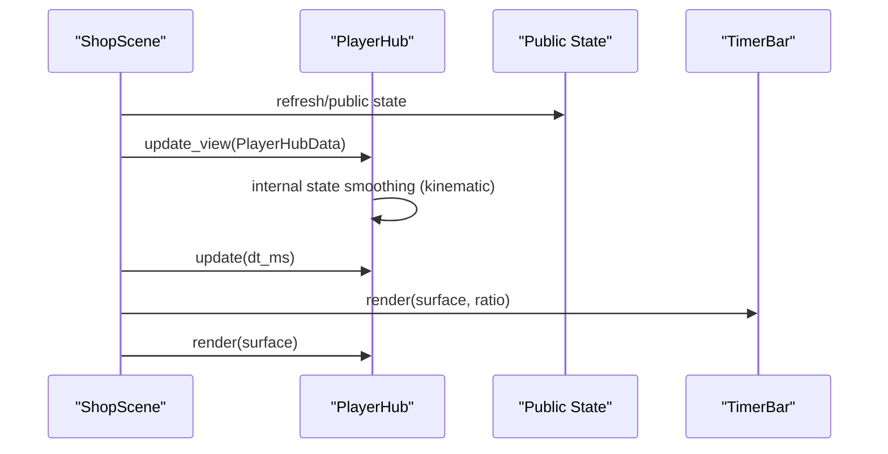
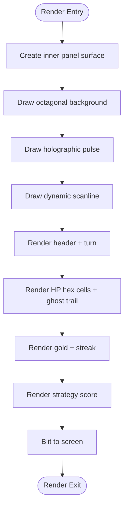
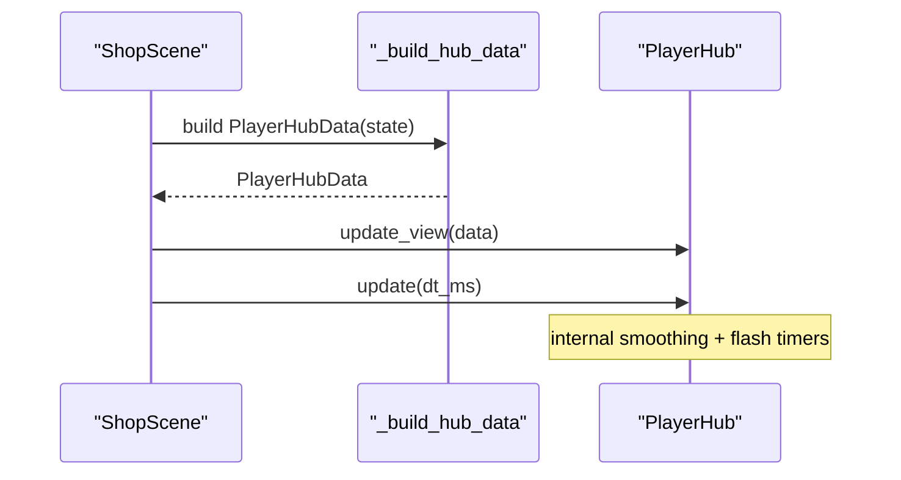
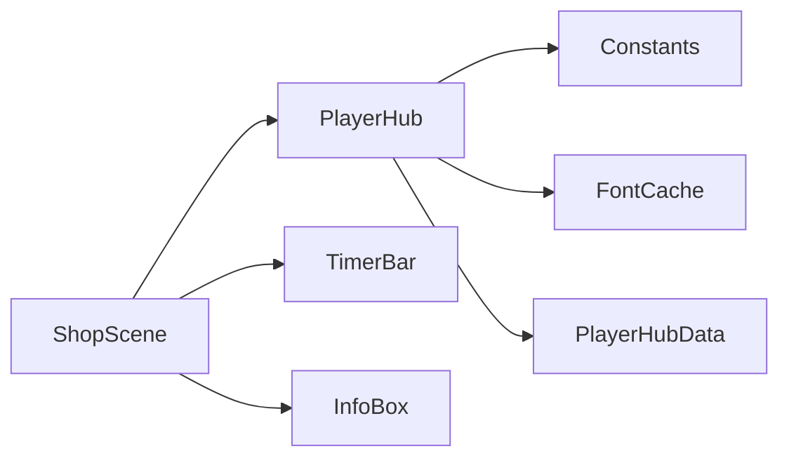

# Player Hub

<cite>
**Referenced Files in This Document**
- [player_hub.py](file://v2/ui/player_hub.py)
- [font_cache.py](file://v2/ui/font_cache.py)
- [constants.py](file://v2/constants.py)
- [timer_bar.py](file://v2/ui/timer_bar.py)
- [info_box.py](file://v2/ui/info_box.py)
- [shop.py](file://v2/scenes/shop.py)
- [test_player_hub.py](file://tests/test_player_hub.py)
- [ui-components-analysis.md](file://memory/ui-components-analysis.md)
</cite>

## Table of Contents
1. [Introduction](#introduction)
2. [Project Structure](#project-structure)
3. [Core Components](#core-components)
4. [Architecture Overview](#architecture-overview)
5. [Detailed Component Analysis](#detailed-component-analysis)
6. [Dependency Analysis](#dependency-analysis)
7. [Performance Considerations](#performance-considerations)
8. [Troubleshooting Guide](#troubleshooting-guide)
9. [Conclusion](#conclusion)

## Introduction
The Player Hub is a Digital Combat Interface (DCI)-themed left-sidebar panel that displays the active player’s critical statistics and state during gameplay. It visualizes health, gold, win/loss streak, strategy score, and turn information, while integrating with supporting UI elements such as the timer bar and info box. The hub emphasizes real-time updates, tactile feedback (flashes, shakes), and a cohesive visual language aligned with the game’s aesthetic.

## Project Structure
The Player Hub lives in the UI layer and is orchestrated by the ShopScene. It relies on shared constants for layout and colors, and uses a centralized font/icon cache for rendering. The hub is positioned in the left sidebar and rendered alongside other HUD components.

**Diagram sources**
- [shop.py:30-36](file://v2/scenes/shop.py#L30-L36)
- [player_hub.py:1-253](file://v2/ui/player_hub.py#L1-L253)
- [timer_bar.py:1-36](file://v2/ui/timer_bar.py#L1-L36)
- [info_box.py:55-92](file://v2/ui/info_box.py#L55-L92)
- [font_cache.py:1-139](file://v2/ui/font_cache.py#L1-L139)
- [constants.py:27-50](file://v2/constants.py#L27-L50)

**Section sources**
- [shop.py:23-71](file://v2/scenes/shop.py#L23-L71)
- [player_hub.py:24-64](file://v2/ui/player_hub.py#L24-L64)
- [constants.py:27-50](file://v2/constants.py#L27-L50)

## Core Components
- PlayerHub: Renders the left-panel HUD with HP bar (hex cells), gold, streak, strategy score, and header/footer elements. Implements kinematic smoothing, flashes, and critical HP shake.
- PlayerHubData: A data contract carrying the minimal set of player stats the hub needs.
- FontCache: Centralized icon/text rendering with caching and shadow support.
- Constants: Layout and color definitions used by the hub and surrounding UI.
- TimerBar: Center-bottom overlay bar indicating turn/phase timing.
- InfoBox: Hover/detail panel for cards and related information.

**Section sources**
- [player_hub.py:11-253](file://v2/ui/player_hub.py#L11-L253)
- [font_cache.py:50-139](file://v2/ui/font_cache.py#L50-L139)
- [constants.py:27-123](file://v2/constants.py#L27-L123)
- [timer_bar.py:1-36](file://v2/ui/timer_bar.py#L1-L36)
- [info_box.py:55-92](file://v2/ui/info_box.py#L55-L92)

## Architecture Overview
The Player Hub participates in a frame pipeline where ShopScene refreshes the public state, constructs PlayerHubData, and calls PlayerHub.update_view and PlayerHub.update. Rendering occurs after all updates, ensuring the hub reflects the latest game state with smooth animations.

**Diagram sources**
- [shop.py:389-394](file://v2/scenes/shop.py#L389-L394)
- [shop.py:505-515](file://v2/scenes/shop.py#L505-L515)
- [player_hub.py:65-114](file://v2/ui/player_hub.py#L65-L114)
- [timer_bar.py:14-36](file://v2/ui/timer_bar.py#L14-L36)

## Detailed Component Analysis

### PlayerHubData Contract
PlayerHubData defines the exact fields the hub consumes from the public state:
- Health points, current gold, win streak, total strategy points, current turn number, next gold threshold, and board usage count.

This contract isolates the hub from the broader game state, enabling predictable updates and testability.

**Section sources**
- [player_hub.py:11-23](file://v2/ui/player_hub.py#L11-L23)
- [shop.py:505-515](file://v2/scenes/shop.py#L505-L515)

### PlayerHub Rendering Pipeline
The hub renders a tactical octagonal panel with:
- Header: “SYSTEM.HUB” title and cycle/turn indicator.
- HP cell: 18 hex cells representing health, with a “ghost” trail for recent damage and optional shake at low HP.
- Economy row: gold display with flash feedback and streak indicator with icon and label.
- Footer: strategy score with gear icon.

Rendering uses a polygon background, scanline overlay, and synchronized pulse effect.

**Diagram sources**
- [player_hub.py:115-151](file://v2/ui/player_hub.py#L115-L151)
- [player_hub.py:153-252](file://v2/ui/player_hub.py#L153-L252)

**Section sources**
- [player_hub.py:24-64](file://v2/ui/player_hub.py#L24-L64)
- [player_hub.py:115-252](file://v2/ui/player_hub.py#L115-L252)

### HP Visualization and Ghost Trail
- Health is represented by 18 hexagonal cells. Each cell activates based on thresholds derived from the current displayed health ratio.
- A “ghost” health value follows the displayed health with slower damping, visually indicating recent damage.
- At very low HP, the entire HP region shimmers horizontally to emphasize danger.

**Section sources**
- [player_hub.py:159-214](file://v2/ui/player_hub.py#L159-L214)
- [player_hub.py:106-114](file://v2/ui/player_hub.py#L106-L114)

### Economy and Streak Indicators
- Gold display: centered numeric value with icon and optional flash feedback when gold increases or decreases.
- Streak indicator: colored box with an icon (fire for positive, bolt for negative, gear for neutral) and a concise label.

**Section sources**
- [player_hub.py:216-244](file://v2/ui/player_hub.py#L216-L244)

### Strategy Score and Turn Information
- Strategy score appears as a digital counter with a gear icon.
- Turn/cycle information is shown in the header, reflecting the current game turn.

**Section sources**
- [player_hub.py:245-252](file://v2/ui/player_hub.py#L245-L252)
- [player_hub.py:153-157](file://v2/ui/player_hub.py#L153-L157)

### Integration with Timer Bar System
- The TimerBar is rendered beneath the center canvas and serves as a turn/phase countdown indicator.
- While the Player Hub focuses on player stats, the TimerBar provides temporal context for the current phase.

**Section sources**
- [timer_bar.py:1-36](file://v2/ui/timer_bar.py#L1-L36)
- [shop.py:578-584](file://v2/scenes/shop.py#L578-L584)

### Integration with Info Box Functionality
- The InfoBox displays detailed card information and hover previews. It complements the Player Hub by providing deeper insights into cards and effects without cluttering the hub’s compact layout.

**Section sources**
- [info_box.py:55-92](file://v2/ui/info_box.py#L55-L92)

### Visual Design Elements and Status Icons
- Color palette: DCI-inspired deep background, subtle rim lighting, and translucent scanlines.
- Icons: Font Awesome-based glyphs for heart (health), gold coin (gold), fire/bolt/geared icons for streak, and gear for strategy score.
- Typography: Bold, mono, and icon fonts via FontCache with optional shadows for readability.

**Section sources**
- [player_hub.py:27-35](file://v2/ui/player_hub.py#L27-L35)
- [font_cache.py:50-74](file://v2/ui/font_cache.py#L50-L74)
- [font_cache.py:96-139](file://v2/ui/font_cache.py#L96-L139)

### Data Flow and State Synchronization
- ShopScene constructs PlayerHubData from the current public state and calls update_view and update on the hub each frame.
- Internal smoothing (kinematic lerp) and flash timers are updated independently, decoupling UI responsiveness from game state frequency.

**Diagram sources**
- [shop.py:505-515](file://v2/scenes/shop.py#L505-L515)
- [shop.py:389-394](file://v2/scenes/shop.py#L389-L394)
- [player_hub.py:65-114](file://v2/ui/player_hub.py#L65-L114)

**Section sources**
- [shop.py:389-403](file://v2/scenes/shop.py#L389-L403)
- [shop.py:505-515](file://v2/scenes/shop.py#L505-L515)
- [player_hub.py:65-114](file://v2/ui/player_hub.py#L65-L114)

### Real-Time Updates and User Interaction Patterns
- The hub reacts to immediate changes: flashing when gold changes, shaking when HP drops below a threshold, and smoothly interpolating numeric values.
- Users primarily interact indirectly: buying cards affects gold and HP, which the hub reflects immediately with visual feedback.

**Section sources**
- [player_hub.py:69-74](file://v2/ui/player_hub.py#L69-L74)
- [player_hub.py:106-114](file://v2/ui/player_hub.py#L106-L114)

### Examples of Player State Rendering Across Phases
- Preparation: Hub shows baseline stats and turn number; TimerBar indicates readiness countdown.
- Versus: Hub remains static while the versus overlay is active; focus shifts to match preview.
- Combat: Hub continues to show live stats; TimerBar may reflect combat duration or cooldowns.
- Endgame: Hub persists with final stats; overlay transitions to endgame summary.

Note: The hub itself does not change visuals per phase; it consistently renders the active player’s stats with appropriate feedback.

**Section sources**
- [shop.py:150-151](file://v2/scenes/shop.py#L150-L151)
- [shop.py:369-385](file://v2/scenes/shop.py#L369-L385)
- [timer_bar.py:14-36](file://v2/ui/timer_bar.py#L14-L36)

## Dependency Analysis
The Player Hub depends on:
- Constants for layout and colors.
- FontCache for icon/text rendering.
- Public state (via PlayerHubData) for data.
- TimerBar and InfoBox for adjacent UI context.

**Diagram sources**
- [player_hub.py:1-8](file://v2/ui/player_hub.py#L1-L8)
- [constants.py:27-123](file://v2/constants.py#L27-L123)
- [font_cache.py:1-139](file://v2/ui/font_cache.py#L1-L139)
- [shop.py:30-36](file://v2/scenes/shop.py#L30-L36)

**Section sources**
- [player_hub.py:1-8](file://v2/ui/player_hub.py#L1-L8)
- [constants.py:27-123](file://v2/constants.py#L27-L123)
- [font_cache.py:1-139](file://v2/ui/font_cache.py#L1-L139)
- [shop.py:30-36](file://v2/scenes/shop.py#L30-L36)

## Performance Considerations
- Kinematic smoothing: Uses simple exponential interpolation for numeric values, minimizing CPU overhead.
- Flash timers: Short-lived effects with rapid decay reduce per-frame branching.
- Rendering primitives: Polygon drawing and simple lines keep GPU cost low.
- Caching: FontCache avoids repeated TTF loads; icons are precomputed glyph codes.

[No sources needed since this section provides general guidance]

## Troubleshooting Guide
- If icons do not render, verify FontCache initialization and icon names.
- If numbers jitter excessively, adjust smoothing coefficients in update.
- If flashes do not fade, check flash timer decrement and removal logic.
- If layout is incorrect, confirm Layout constants and panel rects.

**Section sources**
- [font_cache.py:50-74](file://v2/ui/font_cache.py#L50-L74)
- [player_hub.py:84-95](file://v2/ui/player_hub.py#L84-L95)
- [constants.py:27-50](file://v2/constants.py#L27-L50)

## Conclusion
The Player Hub delivers a compact, responsive, and visually coherent view of the active player’s state. Its integration with the timer bar and info box creates a layered HUD that supports both immediate feedback and deeper insights. The use of a strict data contract, centralized rendering utilities, and smooth animations ensures maintainability and a polished user experience.