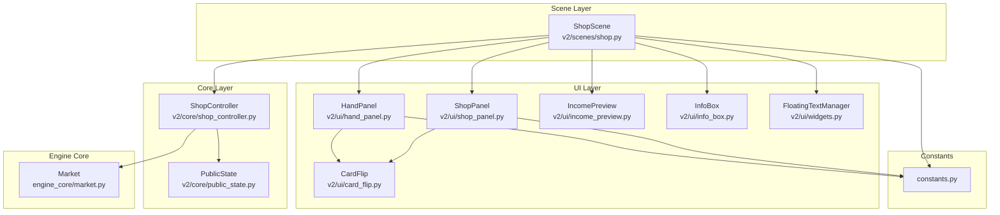
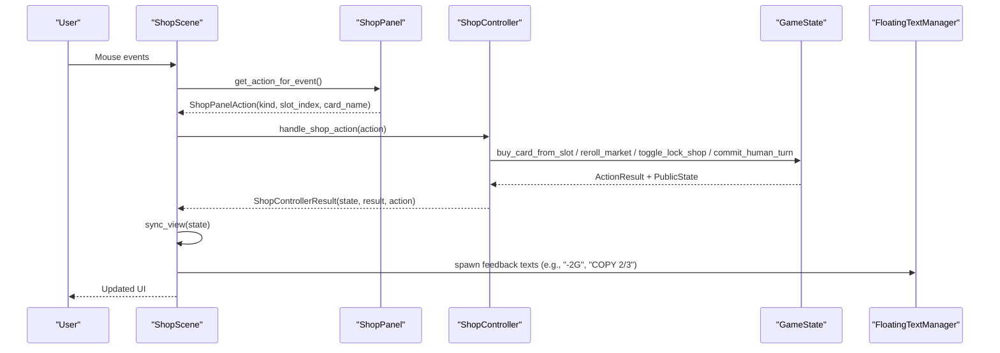
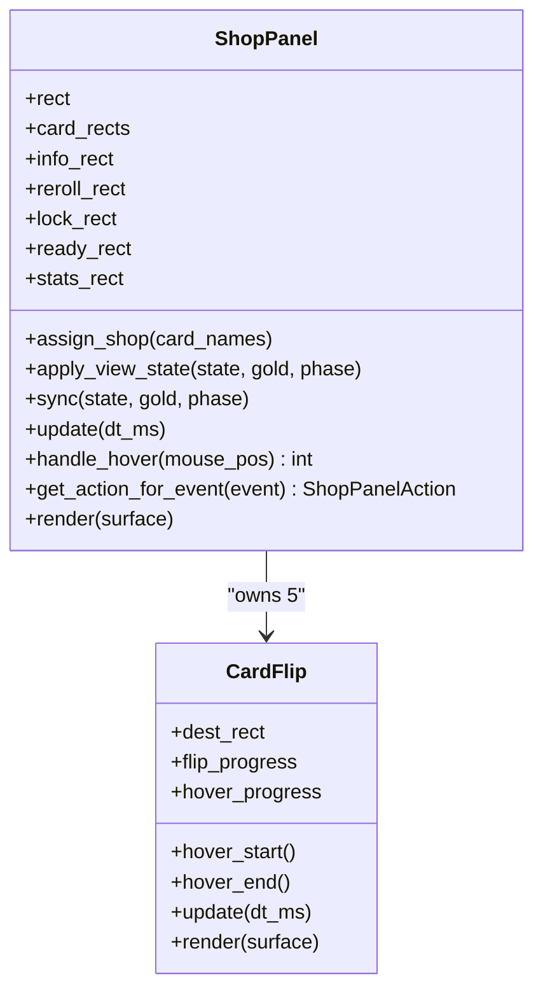
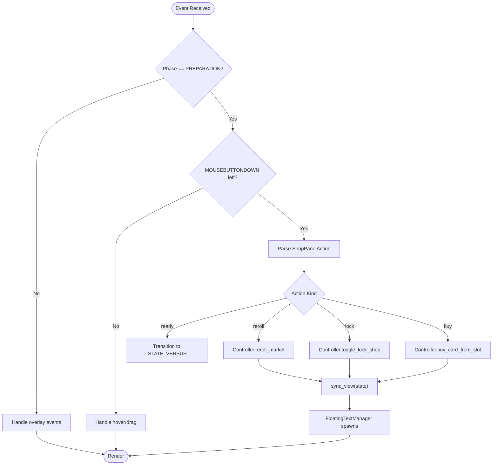
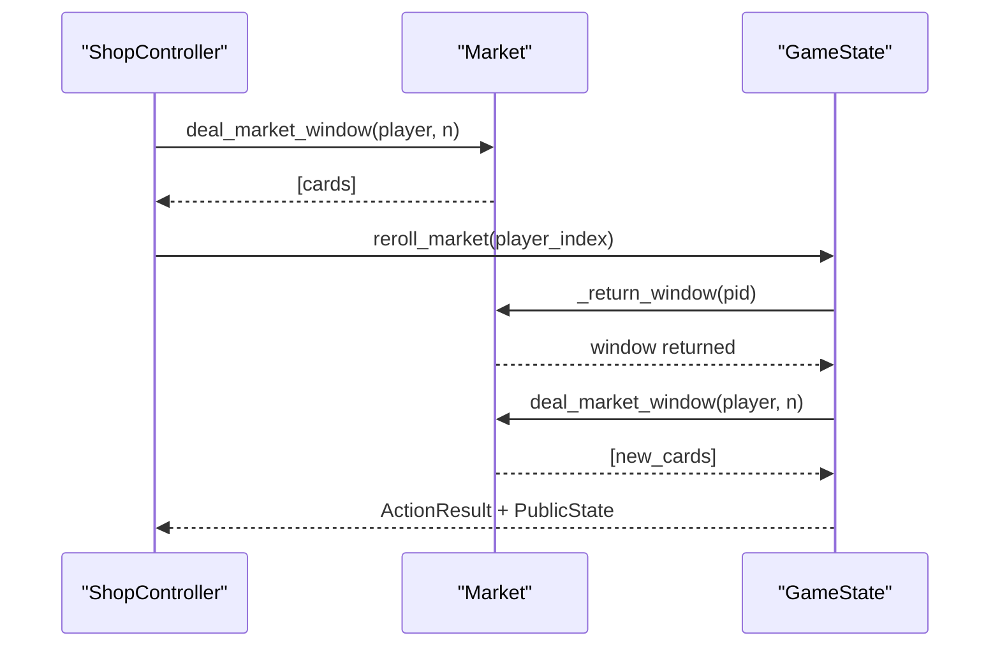
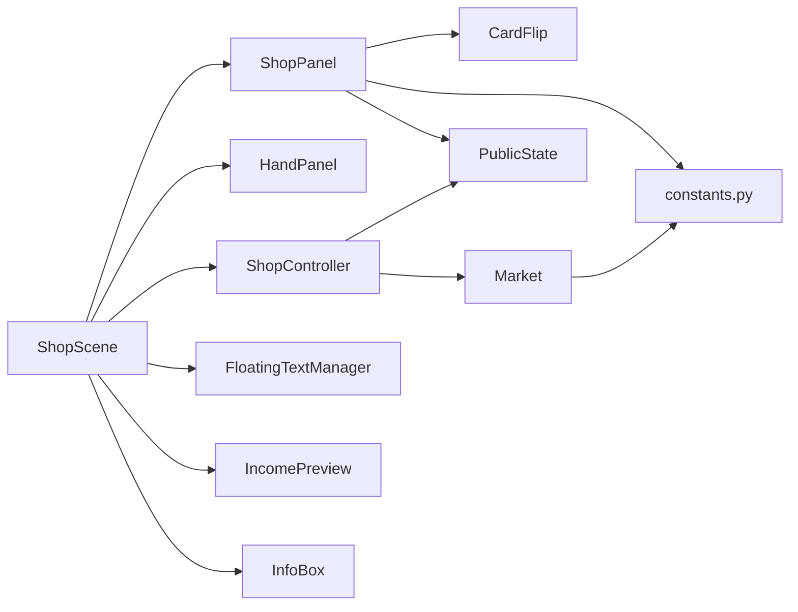

# Shop Panel

<cite>
**Referenced Files in This Document**
- [shop_panel.py](file://v2/ui/shop_panel.py)
- [shop.py](file://v2/scenes/shop.py)
- [shop_controller.py](file://v2/core/shop_controller.py)
- [public_state.py](file://v2/core/public_state.py)
- [card_flip.py](file://v2/ui/card_flip.py)
- [hand_panel.py](file://v2/ui/hand_panel.py)
- [income_preview.py](file://v2/ui/income_preview.py)
- [widgets.py](file://v2/ui/widgets.py)
- [constants.py](file://v2/constants.py)
- [market.py](file://engine_core/market.py)
- [info_box.py](file://v2/ui/info_box.py)
- [test_shop_panel.py](file://tests/test_shop_panel.py)
</cite>

## Table of Contents
1. [Introduction](#introduction)
2. [Project Structure](#project-structure)
3. [Core Components](#core-components)
4. [Architecture Overview](#architecture-overview)
5. [Detailed Component Analysis](#detailed-component-analysis)
6. [Dependency Analysis](#dependency-analysis)
7. [Performance Considerations](#performance-considerations)
8. [Troubleshooting Guide](#troubleshooting-guide)
9. [Conclusion](#conclusion)

## Introduction
This document describes the Shop Panel component in the hybrid AutoChess game. It covers the shop interface layout, card display system, gold management visualization, hover and selection mechanisms, integration with the Hand Panel for card placement, income preview functionality, and gold tracking display. It also documents shop state management, card refresh mechanics, deal generation, UI interaction patterns for purchasing and selling cards, navigation between shop states, visual feedback systems, animations, and responsive design elements. Finally, it includes examples of shop state updates, hover handling, and integration with the game engine’s market system.

## Project Structure
The Shop Panel is part of the UI layer and integrates with the scene manager, controller, and engine core. The primary files involved are:
- UI: ShopPanel, HandPanel, CardFlip, IncomePreview, InfoBox, Widgets
- Scenes: ShopScene orchestrating UI and controller
- Core: ShopController, PublicState
- Constants: Layout, Colors, Paths
- Engine Core: Market (deal generation and refresh cost)

**Diagram sources**
- [shop_panel.py:42-341](file://v2/ui/shop_panel.py#L42-L341)
- [shop.py:23-682](file://v2/scenes/shop.py#L23-L682)
- [shop_controller.py:28-139](file://v2/core/shop_controller.py#L28-L139)
- [public_state.py:10-128](file://v2/core/public_state.py#L10-L128)
- [card_flip.py:27-178](file://v2/ui/card_flip.py#L27-L178)
- [hand_panel.py:25-221](file://v2/ui/hand_panel.py#L25-L221)
- [income_preview.py:34-140](file://v2/ui/income_preview.py#L34-L140)
- [info_box.py:55-303](file://v2/ui/info_box.py#L55-L303)
- [widgets.py:169-279](file://v2/ui/widgets.py#L169-L279)
- [constants.py:27-168](file://v2/constants.py#L27-L168)
- [market.py:49-174](file://engine_core/market.py#L49-L174)

**Section sources**
- [shop_panel.py:42-341](file://v2/ui/shop_panel.py#L42-L341)
- [shop.py:23-682](file://v2/scenes/shop.py#L23-L682)
- [constants.py:27-168](file://v2/constants.py#L27-L168)

## Core Components
- ShopPanel: Renders the shop area, buttons, card slots, and rarity probability stats; handles hover and click events to produce ShopPanelAction intents consumed by the controller.
- HandPanel: Manages the player’s hand area for card placement into the board.
- CardFlip: Provides hover-triggered flip and lift/scale animations for cards.
- ShopScene: Coordinates UI, controller, audio, floating text, and hover info panels; routes actions to the controller and updates the view.
- ShopController: Translates UI ShopUIAction into engine GameState operations (buy, reroll, lock, ready).
- PublicState: Encapsulates shop state, gold, phase, and rarity probabilities for rendering and interaction.
- Market: Generates and refreshes shop deals with rarity-weighted sampling and refresh cost.
- IncomePreview: Displays next income computation with breakdown.
- InfoBox: Renders detailed card information on hover.
- Widgets: FloatingText/FloatingTextManager for visual feedback.

**Section sources**
- [shop_panel.py:42-341](file://v2/ui/shop_panel.py#L42-L341)
- [hand_panel.py:25-221](file://v2/ui/hand_panel.py#L25-L221)
- [card_flip.py:27-178](file://v2/ui/card_flip.py#L27-L178)
- [shop.py:23-682](file://v2/scenes/shop.py#L23-L682)
- [shop_controller.py:28-139](file://v2/core/shop_controller.py#L28-L139)
- [public_state.py:10-128](file://v2/core/public_state.py#L10-L128)
- [market.py:49-174](file://engine_core/market.py#L49-L174)
- [income_preview.py:34-140](file://v2/ui/income_preview.py#L34-L140)
- [info_box.py:55-303](file://v2/ui/info_box.py#L55-L303)
- [widgets.py:169-279](file://v2/ui/widgets.py#L169-L279)

## Architecture Overview
The Shop Panel participates in a layered architecture:
- UI layer: ShopPanel, HandPanel, CardFlip, IncomePreview, InfoBox, Widgets
- Scene layer: ShopScene orchestrates rendering, event handling, and controller integration
- Core layer: ShopController mediates between UI and GameState
- Engine Core: Market provides deal generation and refresh cost

**Diagram sources**
- [shop.py:223-248](file://v2/scenes/shop.py#L223-L248)
- [shop_panel.py:217-239](file://v2/ui/shop_panel.py#L217-L239)
- [shop_controller.py:67-98](file://v2/core/shop_controller.py#L67-L98)

## Detailed Component Analysis

### ShopPanel: Layout, Rendering, and Interactions
- Layout and Regions:
  - Full-width shop panel at the top of the screen.
  - Five card slots arranged horizontally with fixed size and gaps.
  - Stats panel showing rarity probabilities per tier.
  - Right-side control buttons: Reroll, Lock Shop, Ready (only in preparation).
  - Info panel region for hover details.
- Card Rendering:
  - Each slot uses a CardFlip instance with front/back surfaces; fallback rendering if assets are missing.
  - Evolved cards receive a platinum border and glow effect.
- Hover and Selection:
  - handle_hover activates hover on the hovered slot and deactivates others.
  - get_action_for_event maps clicks to ShopPanelAction intents:
    - Ready (preparation phase)
    - Reroll (cost depends on gold)
    - Lock Shop
    - Buy card from a slot
- State Synchronization:
  - apply_view_state updates internal state (gold, phase, lock, probabilities) and either rebuilds flips or replaces empty slots with placeholders.
  - sync is a convenience method delegating to apply_view_state.
- Visual Feedback:
  - Buttons render with hover highlights and icons.
  - Rarity probabilities are shown in the stats panel.

**Diagram sources**
- [shop_panel.py:42-341](file://v2/ui/shop_panel.py#L42-L341)
- [card_flip.py:27-178](file://v2/ui/card_flip.py#L27-L178)

**Section sources**
- [shop_panel.py:42-341](file://v2/ui/shop_panel.py#L42-L341)
- [card_flip.py:27-178](file://v2/ui/card_flip.py#L27-L178)

### HandPanel: Integration for Card Placement
- HandPanel mirrors the shop layout philosophy with six slots at the bottom of the screen.
- It supports hover and drag-to-place interactions into the board via ShopScene.
- Copy counters and hover info are coordinated with ShopScene.

**Section sources**
- [hand_panel.py:25-221](file://v2/ui/hand_panel.py#L25-L221)
- [shop.py:300-354](file://v2/scenes/shop.py#L300-L354)

### ShopScene: Orchestrating UI, Controller, and Feedback
- Event handling:
  - Handles mouse motion, clicks, and keyboard shortcuts during preparation.
  - Delegates shop actions to ShopPanel, then to ShopController.
- View synchronization:
  - sync_view pulls PublicState and updates ShopPanel, HandPanel, HUD, and board flips.
- Visual feedback:
  - Uses FloatingTextManager to show gold changes, copy milestones, and placement effects.
- Income preview:
  - Renders IncomePreview with computed next income values.

**Diagram sources**
- [shop.py:153-248](file://v2/scenes/shop.py#L153-L248)
- [widgets.py:169-279](file://v2/ui/widgets.py#L169-L279)

**Section sources**
- [shop.py:153-248](file://v2/scenes/shop.py#L153-L248)
- [widgets.py:169-279](file://v2/ui/widgets.py#L169-L279)

### ShopController: State Transitions and Actions
- Converts ShopUIAction into GameState operations:
  - Commit human turn (ready)
  - Reroll market (with refresh cost)
  - Toggle shop lock
  - Buy card from slot
- Returns ShopControllerResult containing state, result, and optional combat/endgame data.

**Section sources**
- [shop_controller.py:67-98](file://v2/core/shop_controller.py#L67-L98)

### PublicState: Shop State Model
- ShopViewState encapsulates:
  - slots: list of card names or None
  - is_locked: boolean shop lock state
  - rarity_probabilities: dict of tier probabilities
- ShopScene reads PublicState to populate ShopPanel and other UI components.

**Section sources**
- [public_state.py:10-15](file://v2/core/public_state.py#L10-L15)
- [shop.py:449-455](file://v2/scenes/shop.py#L449-L455)

### Market: Deal Generation and Refresh Mechanics
- Market generates weighted windows per turn, respecting rarity weights and pool availability.
- Provides refresh cost and returns unsold cards to the pool.
- ShopController uses reroll_market to refresh the shop window.

**Diagram sources**
- [market.py:105-130](file://engine_core/market.py#L105-L130)
- [shop_controller.py:75-81](file://v2/core/shop_controller.py#L75-L81)

**Section sources**
- [market.py:105-130](file://engine_core/market.py#L105-L130)
- [shop_controller.py:75-81](file://v2/core/shop_controller.py#L75-L81)

### Gold Management and Income Preview
- Gold tracking:
  - ShopPanel tracks gold internally for button enablement and rendering.
  - ShopScene passes gold to ShopPanel via sync_view.
- IncomePreview:
  - Computes next income based on base, interest (gold/10 capped), streak, and bailout thresholds.
  - Renders a two-line summary with color-coded breakdown.

**Section sources**
- [shop_panel.py:170-201](file://v2/ui/shop_panel.py#L170-L201)
- [shop.py:397-402](file://v2/scenes/shop.py#L397-L402)
- [income_preview.py:67-80](file://v2/ui/income_preview.py#L67-L80)
- [income_preview.py:84-140](file://v2/ui/income_preview.py#L84-L140)

### Hover and Info Panels
- Hover handling:
  - ShopScene.handle_hover checks hover over shop, hand, and board CardFlips.
  - On change, resets info boxes and triggers delayed info display.
- InfoBox:
  - Renders detailed card info with category accent, passive label, stats grid, and animated entrance.

**Section sources**
- [shop.py:271-298](file://v2/scenes/shop.py#L271-L298)
- [info_box.py:89-147](file://v2/ui/info_box.py#L89-L147)

### Visual Feedback and Animations
- CardFlip:
  - Smooth flip and hover lift/scale with configurable speeds.
  - Evolved card glow and border.
- FloatingTextManager:
  - 3-phase floating text: rise, hold, fade with wagon queue for coordinated spawns.
- ShopScene integrates feedback for reroll cost, buy outcomes, and synergy changes.

**Section sources**
- [card_flip.py:27-178](file://v2/ui/card_flip.py#L27-L178)
- [widgets.py:169-279](file://v2/ui/widgets.py#L169-L279)
- [shop.py:234-247](file://v2/scenes/shop.py#L234-L247)

## Dependency Analysis
- ShopPanel depends on:
  - CardFlip for per-slot animations
  - Constants for layout and colors
  - PublicState for shop state and probabilities
- ShopScene depends on:
  - ShopPanel and HandPanel for rendering
  - ShopController for actions
  - FloatingTextManager for feedback
  - IncomePreview for HUD element
  - InfoBox for hover details
- ShopController depends on:
  - GameState for state mutations
  - Market for deal generation
- Market depends on:
  - Card database and RNG for weighted sampling

**Diagram sources**
- [shop_panel.py:42-341](file://v2/ui/shop_panel.py#L42-L341)
- [shop.py:23-682](file://v2/scenes/shop.py#L23-L682)
- [shop_controller.py:28-139](file://v2/core/shop_controller.py#L28-L139)
- [market.py:49-174](file://engine_core/market.py#L49-L174)
- [constants.py:27-168](file://v2/constants.py#L27-L168)

**Section sources**
- [shop_panel.py:42-341](file://v2/ui/shop_panel.py#L42-L341)
- [shop.py:23-682](file://v2/scenes/shop.py#L23-L682)
- [shop_controller.py:28-139](file://v2/core/shop_controller.py#L28-L139)
- [market.py:49-174](file://engine_core/market.py#L49-L174)
- [constants.py:27-168](file://v2/constants.py#L27-L168)

## Performance Considerations
- Surface caching: Background gradients and fallback surfaces are created once and reused.
- Smart sync: ShopPanel rebuilds only changed slots to minimize asset loading.
- Lazy updates: CardFlip handles its own dirty regions and animations.
- Minimal redraws: Each frame performs a small number of blits and text renders.

[No sources needed since this section provides general guidance]

## Troubleshooting Guide
- Missing assets:
  - ShopPanel and HandPanel fall back to geometric shapes if assets are unavailable.
- Button enablement:
  - Reroll button is disabled when insufficient gold.
- Hover info:
  - Ensure InfoBox is positioned near the shop/hand areas and that hover delay logic is active.
- Action timing:
  - Shop actions are only processed in preparation phase for Ready; other actions are gated by phase and state.

**Section sources**
- [shop_panel.py:133-164](file://v2/ui/shop_panel.py#L133-L164)
- [hand_panel.py:106-136](file://v2/ui/hand_panel.py#L106-L136)
- [shop.py:221-229](file://v2/scenes/shop.py#L221-L229)
- [test_shop_panel.py:71-90](file://tests/test_shop_panel.py#L71-L90)

## Conclusion
The Shop Panel integrates tightly with the scene and controller layers to deliver a responsive, animated, and visually coherent shopping experience. It leverages PublicState for deterministic rendering, Market for fair deal generation, and CardFlip for engaging hover interactions. Visual feedback via FloatingTextManager and IncomePreview enhances player comprehension of economic decisions. The system balances performance with rich UI effects and remains extensible for future enhancements such as tooltips, cost badges, and richer animations.