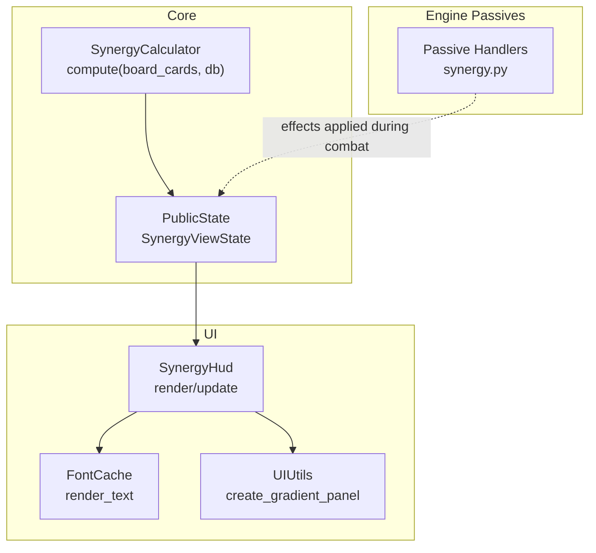
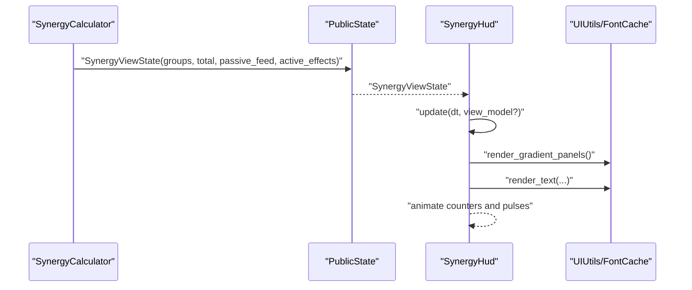
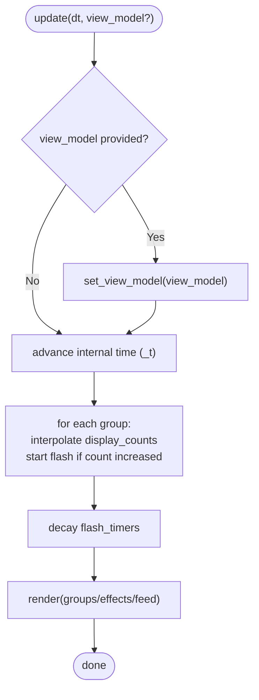
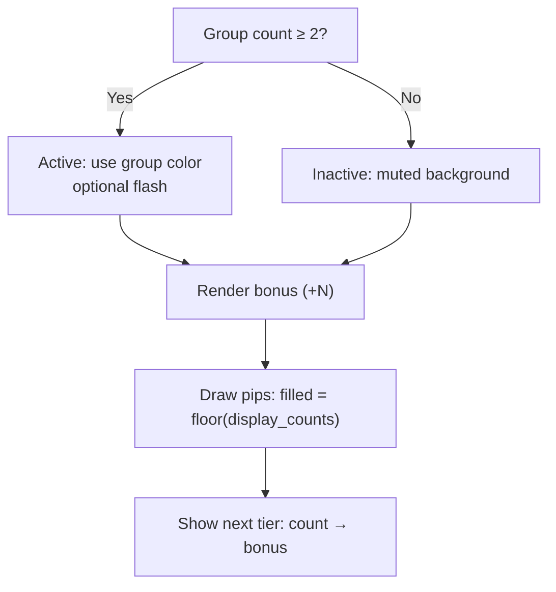
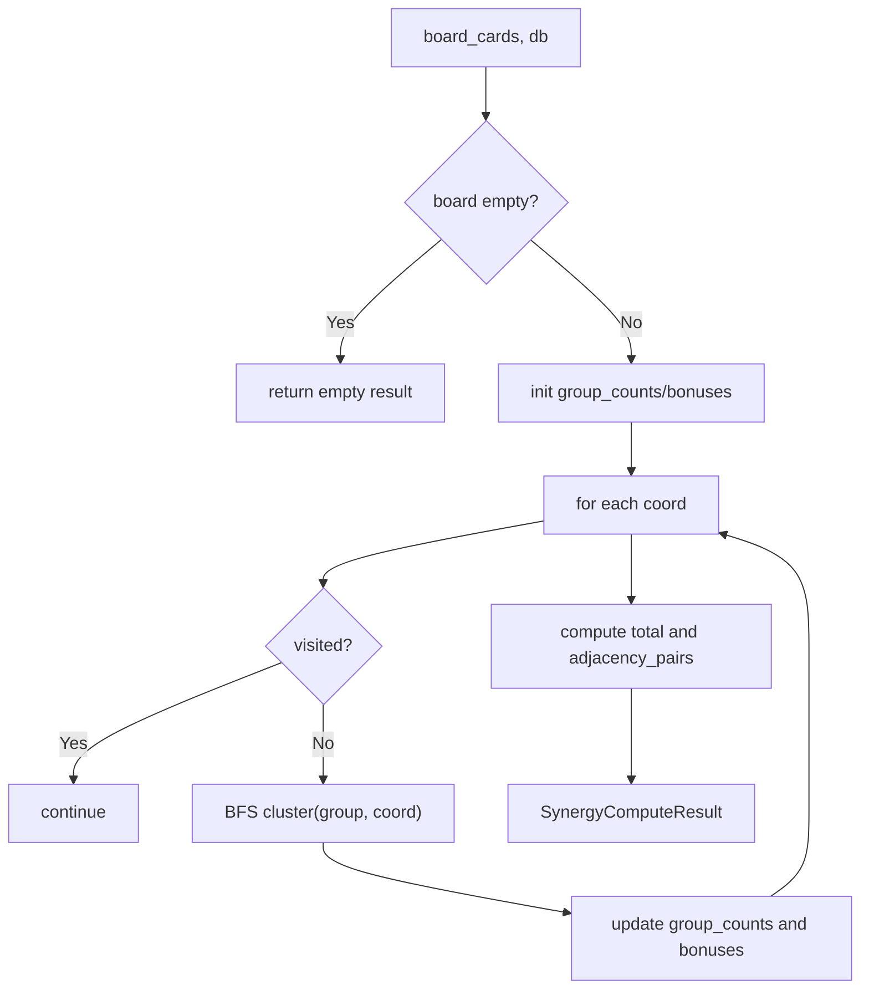
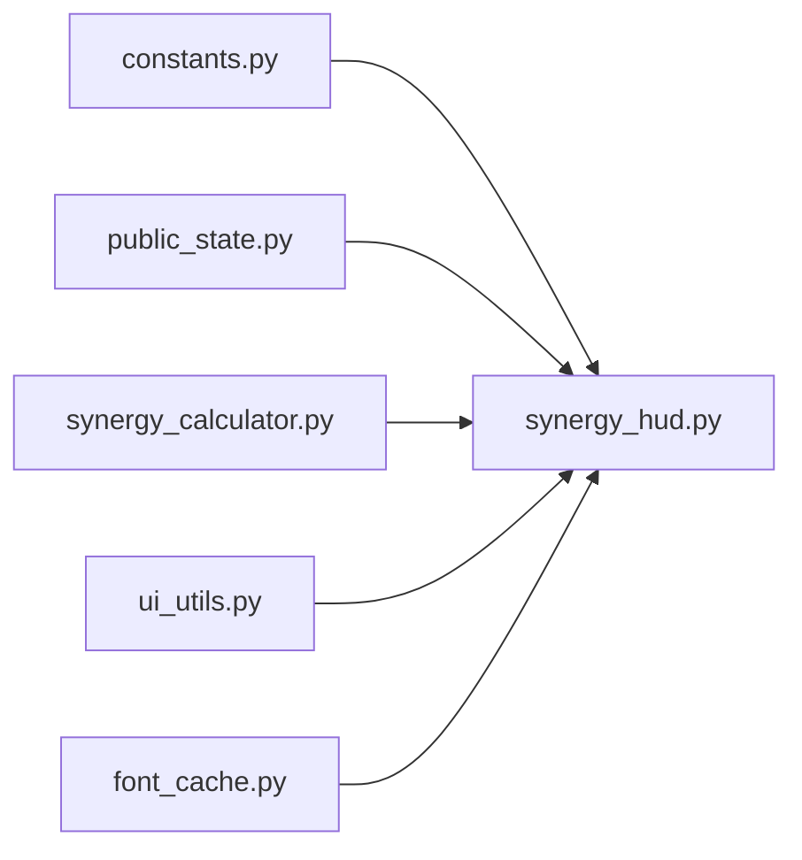

# Synergy HUD

<cite>
**Referenced Files in This Document**
- [synergy_hud.py](file://v2/ui/synergy_hud.py)
- [synergy_calculator.py](file://v2/core/synergy_calculator.py)
- [public_state.py](file://v2/core/public_state.py)
- [constants.py](file://v2/constants.py)
- [ui_utils.py](file://v2/ui/ui_utils.py)
- [font_cache.py](file://v2/ui/font_cache.py)
- [synergy.py](file://engine_core/passives/synergy.py)
- [test_synergy_hud.py](file://tests/test_synergy_hud.py)
</cite>

## Table of Contents
1. [Introduction](#introduction)
2. [Project Structure](#project-structure)
3. [Core Components](#core-components)
4. [Architecture Overview](#architecture-overview)
5. [Detailed Component Analysis](#detailed-component-analysis)
6. [Dependency Analysis](#dependency-analysis)
7. [Performance Considerations](#performance-considerations)
8. [Troubleshooting Guide](#troubleshooting-guide)
9. [Conclusion](#conclusion)

## Introduction
This document describes the Synergy HUD component responsible for displaying team composition synergies, active synergy totals, passive effect triggers, and team bonus indicators. It explains how synergy calculations integrate with the HUD, how passive effects are rendered, and how real-time updates keep the UI synchronized with the game state. It also documents the visual design, layout, and performance characteristics of the HUD.

## Project Structure
The Synergy HUD lives in the UI layer and consumes a structured view model produced by the core state and synergy calculation systems. It renders three primary areas:
- Synergy groups: per-group counts, activation states, tier thresholds, and bonuses
- Total and active effects: combined synergy points and currently active effect labels
- Passive feed: recent passive triggers with deltas and contextual labels

**Diagram sources**
- [synergy_calculator.py:67-99](file://v2/core/synergy_calculator.py#L67-L99)
- [public_state.py:71-76](file://v2/core/public_state.py#L71-L76)
- [synergy_hud.py:69-91](file://v2/ui/synergy_hud.py#L69-L91)
- [font_cache.py:96-139](file://v2/ui/font_cache.py#L96-L139)
- [ui_utils.py:5-66](file://v2/ui/ui_utils.py#L5-L66)
- [synergy.py:41-217](file://engine_core/passives/synergy.py#L41-L217)

**Section sources**
- [synergy_hud.py:16-61](file://v2/ui/synergy_hud.py#L16-L61)
- [public_state.py:40-76](file://v2/core/public_state.py#L40-L76)
- [constants.py:27-40](file://v2/constants.py#L27-L40)

## Core Components
- SynergyHud: The UI component that renders synergy groups, totals/effects, and passive feed. It maintains internal animation timers and cached gradient panels.
- SynergyCalculator: Central computation engine that performs BFS clustering, edge matching, and tier bonus calculation across hex-grid adjacency.
- PublicState dataclasses: View model structures consumed by the HUD, including SynergyGroupViewState, EffectViewState, and PassiveFeedEntryViewState.
- UI utilities: Gradient panel creation and font rendering helpers used by the HUD.
- Engine passive synergy handlers: Passive abilities that apply temporary combat effects and influence synergy-triggered mechanics.

**Section sources**
- [synergy_hud.py:16-61](file://v2/ui/synergy_hud.py#L16-L61)
- [synergy_calculator.py:57-99](file://v2/core/synergy_calculator.py#L57-L99)
- [public_state.py:40-76](file://v2/core/public_state.py#L40-L76)
- [ui_utils.py:5-66](file://v2/ui/ui_utils.py#L5-L66)
- [font_cache.py:96-139](file://v2/ui/font_cache.py#L96-L139)
- [synergy.py:41-217](file://engine_core/passives/synergy.py#L41-L217)

## Architecture Overview
The Synergy HUD integrates with the core as follows:
- The core computes synergy state from the serialized board state and database.
- The public state exposes a SynergyViewState to the UI.
- The HUD renders the state with smooth animations and responsive visuals.
- Passive triggers and active effects are reflected in the HUD’s passive feed and effects panel.

**Diagram sources**
- [synergy_calculator.py:67-99](file://v2/core/synergy_calculator.py#L67-L99)
- [public_state.py:71-76](file://v2/core/public_state.py#L71-L76)
- [synergy_hud.py:69-91](file://v2/ui/synergy_hud.py#L69-L91)
- [ui_utils.py:5-66](file://v2/ui/ui_utils.py#L5-L66)
- [font_cache.py:96-139](file://v2/ui/font_cache.py#L96-L139)

## Detailed Component Analysis

### SynergyHud: Rendering and Animation
Responsibilities:
- Compute and cache panel surfaces for efficient redraws.
- Render three regions: synergy groups, total/effects, and passive feed.
- Smoothly animate displayed counts and flash active groups.
- Use color-coded rows and pulsing pips to indicate activation and tier progress.

Key behaviors:
- Panel caching via gradient surfaces reduces per-frame drawing cost.
- Animated counters interpolate toward target counts; flash timers trigger visual feedback.
- Effects panel shows total synergy and active effect labels/values.
- Passive feed shows recent triggers with trigger-specific colors/icons and numeric deltas.

**Diagram sources**
- [synergy_hud.py:69-86](file://v2/ui/synergy_hud.py#L69-L86)

**Section sources**
- [synergy_hud.py:16-61](file://v2/ui/synergy_hud.py#L16-L61)
- [synergy_hud.py:69-91](file://v2/ui/synergy_hud.py#L69-L91)
- [synergy_hud.py:104-167](file://v2/ui/synergy_hud.py#L104-L167)
- [synergy_hud.py:168-193](file://v2/ui/synergy_hud.py#L168-L193)
- [synergy_hud.py:213-266](file://v2/ui/synergy_hud.py#L213-L266)

### Synergy Groups: Activation, Bonuses, and Tier Progression
Visual representation:
- Each group row displays:
  - Group name and color band
  - Current bonus amount
  - Pulsing pips indicating current cluster size
  - Next tier threshold and bonus
- Active groups (≥2 cards) show stronger backgrounds and optional flashing; inactive groups use muted styles.

Logic highlights:
- Cluster size interpolation smooths perceived changes.
- Flashing occurs when a new card activates a tier.
- Next-tier text shows threshold and bonus for the next milestone.

**Diagram sources**
- [synergy_hud.py:108-166](file://v2/ui/synergy_hud.py#L108-L166)

**Section sources**
- [synergy_hud.py:108-166](file://v2/ui/synergy_hud.py#L108-L166)

### Total and Active Effects
Highlights:
- Displays the total synergy points derived from the synergy calculation.
- Lists up to a fixed number of active effects with labels and values.
- Uses distinct colors per effect and monospace/value alignment for readability.

**Section sources**
- [synergy_hud.py:168-193](file://v2/ui/synergy_hud.py#L168-L193)
- [public_state.py:62-68](file://v2/core/public_state.py#L62-L68)

### Passive Feed: Triggers, Cards, and Deltas
Highlights:
- Shows recent passive triggers with trigger-specific colors and icons.
- Displays card name, optional numeric delta or residual value, and right-aligned labels.
- Limits visible entries to fit the available vertical space.

**Section sources**
- [synergy_hud.py:213-266](file://v2/ui/synergy_hud.py#L213-L266)
- [public_state.py:52-68](file://v2/core/public_state.py#L52-L68)

### Synergy Calculation Integration
The SynergyCalculator centralizes the BFS-based computation:
- Accepts a serialized board state and a card database.
- Performs BFS from each coordinate to find connected clusters of the same group.
- Counts edges matched between neighbors to compute bonuses.
- Produces a SynergyComputeResult with group counts, bonuses, and total points.
- Provides adjacency pairs for rendering synergy lines elsewhere.

**Diagram sources**
- [synergy_calculator.py:67-99](file://v2/core/synergy_calculator.py#L67-L99)
- [synergy_calculator.py:103-142](file://v2/core/synergy_calculator.py#L103-L142)
- [synergy_calculator.py:168-212](file://v2/core/synergy_calculator.py#L168-L212)
- [synergy_calculator.py:214-226](file://v2/core/synergy_calculator.py#L214-L226)

**Section sources**
- [synergy_calculator.py:57-99](file://v2/core/synergy_calculator.py#L57-L99)
- [constants.py:90-109](file://v2/constants.py#L90-L109)

### Passive System Integration
Passive synergy handlers apply temporary combat effects to adjacent or enemy cards. These effects appear in the active effects list and contribute to the total synergy display.

Examples of handler behaviors:
- Odin: Buffs neighboring “Mythology & Gods” cards’ “Meaning” and track stacks.
- Olympus: Buffs “Prestige” for neighbors if two or more are present.
- Medusa: Reduces enemy Speed for the combat.
- Black Hole: Reduces enemy center Gravity for the combat.
- Entropy: On specific turns, removes highest edge from neighbors.
- Gravity: Reduces neighbor Speed for the combat.
- Isaac Newton: Buffs “Intelligence” for Science cards if three or more are present.
- Nikola Tesla: Buffs neighboring Science cards’ “Intelligence.”
- Black Death: Reduces enemy Spread for the combat.
- French Revolution: On specific turns, reduces the enemy’s highest stat by one.

Effects are applied as temporary stat deltas layered on top of base stats during combat.

**Section sources**
- [synergy.py:41-217](file://engine_core/passives/synergy.py#L41-L217)

### Data Binding and Real-Time Updates
- The HUD accepts a SynergyViewState and updates its internal display counts and flash timers each frame.
- The view model is populated by the core’s synergy computation and public state aggregation.
- The UI caches gradient panels and uses a single shared font cache to minimize allocations and improve performance.

**Section sources**
- [synergy_hud.py:66-86](file://v2/ui/synergy_hud.py#L66-L86)
- [public_state.py:71-76](file://v2/core/public_state.py#L71-L76)
- [ui_utils.py:5-66](file://v2/ui/ui_utils.py#L5-L66)
- [font_cache.py:96-139](file://v2/ui/font_cache.py#L96-L139)

### UI Design Elements
- Panels: Rounded-corner gradient backgrounds with subtle borders.
- Typography: Bold headers, mono numbers for values, and readable labels.
- Colors: Group-specific accent colors; muted tones for inactive states.
- Icons: Trigger-specific icons and glyphs for passive feed entries.

**Section sources**
- [synergy_hud.py:17-27](file://v2/ui/synergy_hud.py#L17-L27)
- [synergy_hud.py:104-167](file://v2/ui/synergy_hud.py#L104-L167)
- [synergy_hud.py:168-193](file://v2/ui/synergy_hud.py#L168-L193)
- [synergy_hud.py:213-266](file://v2/ui/synergy_hud.py#L213-L266)
- [font_cache.py:96-139](file://v2/ui/font_cache.py#L96-L139)

## Dependency Analysis
The Synergy HUD depends on:
- Constants for layout and color definitions
- PublicState dataclasses for typed view model consumption
- SynergyCalculator for computed synergy metrics
- UI utilities for rendering gradients and text

**Diagram sources**
- [constants.py:27-40](file://v2/constants.py#L27-L40)
- [public_state.py:40-76](file://v2/core/public_state.py#L40-L76)
- [synergy_calculator.py:67-99](file://v2/core/synergy_calculator.py#L67-L99)
- [synergy_hud.py:6-9](file://v2/ui/synergy_hud.py#L6-L9)
- [ui_utils.py:5-66](file://v2/ui/ui_utils.py#L5-L66)
- [font_cache.py:96-139](file://v2/ui/font_cache.py#L96-L139)

**Section sources**
- [synergy_hud.py:6-9](file://v2/ui/synergy_hud.py#L6-L9)
- [constants.py:27-40](file://v2/constants.py#L27-L40)
- [public_state.py:40-76](file://v2/core/public_state.py#L40-L76)
- [synergy_calculator.py:67-99](file://v2/core/synergy_calculator.py#L67-L99)

## Performance Considerations
- Precomputed gradient panels avoid per-frame expensive drawing.
- Smooth counter interpolation uses a small damping factor to prevent jitter.
- Flash timers are decoupled from frame time to maintain consistent durations.
- Text rendering uses a centralized cache to avoid repeated font loading.
- The passive feed limits the number of visible entries to the available vertical space.

Recommendations:
- Keep view model updates minimal; batch updates when possible.
- Avoid frequent re-creation of cached surfaces; reuse where feasible.
- Clamp the number of displayed passive feed entries to preserve frame budget.

**Section sources**
- [synergy_hud.py:46-55](file://v2/ui/synergy_hud.py#L46-L55)
- [synergy_hud.py:69-86](file://v2/ui/synergy_hud.py#L69-L86)
- [font_cache.py:17-40](file://v2/ui/font_cache.py#L17-L40)

## Troubleshooting Guide
Common issues and checks:
- HUD does not render text: Verify font cache availability and rect bounds.
- Panels not visible: Confirm cached gradient surfaces are created and blitted.
- Passive feed missing: Ensure the view model contains passive_feed entries and the HUD is not clipping rows.
- Flashing not triggering: Check that group counts increase between frames and flash timers are being decremented.
- Incorrect synergy totals: Validate SynergyCalculator inputs and confirm adjacency pairs and tier bonus logic.

Validation references:
- Unit tests exercise initialization, rendering, and view model replacement.

**Section sources**
- [test_synergy_hud.py:57-98](file://tests/test_synergy_hud.py#L57-L98)
- [test_synergy_hud.py:100-116](file://tests/test_synergy_hud.py#L100-L116)

## Conclusion
The Synergy HUD provides a responsive, animated, and visually coherent display of team composition synergies, active effects, and passive triggers. Its integration with the SynergyCalculator ensures accurate and consistent synergy metrics, while the passive system’s temporary effects are clearly communicated to the player. The UI’s caching and rendering pipeline keeps updates smooth and performant during real-time gameplay.