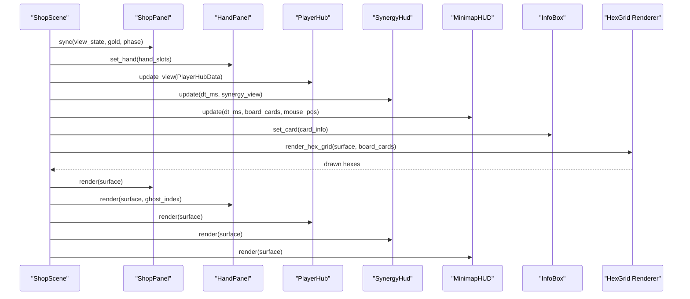
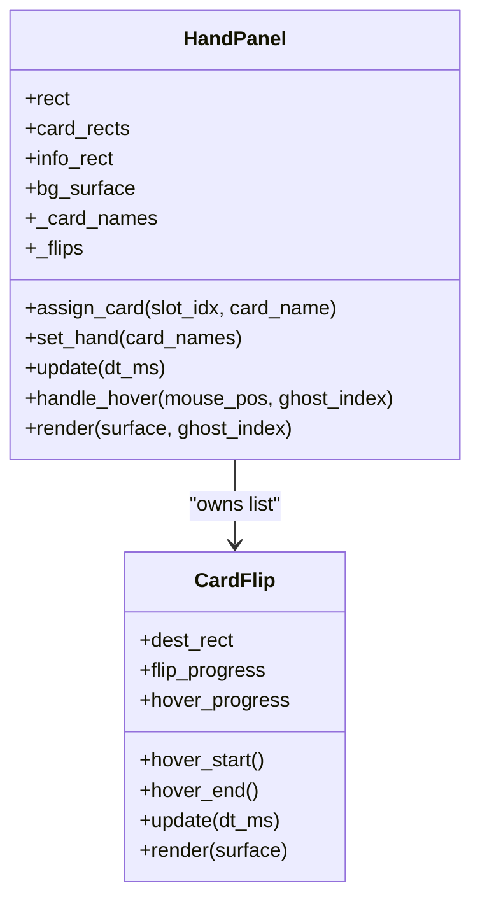
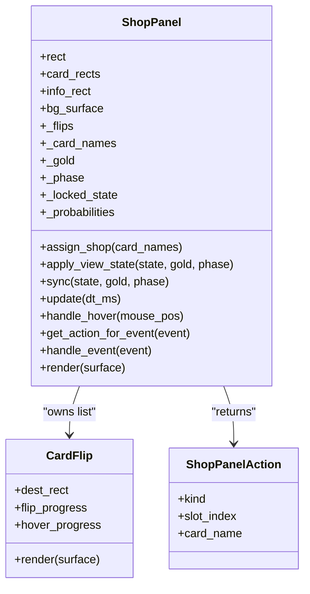
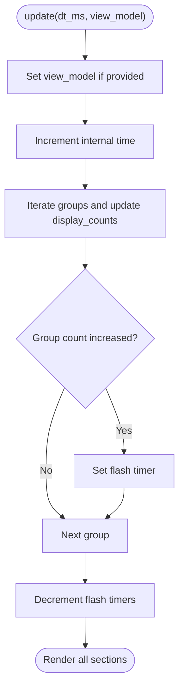
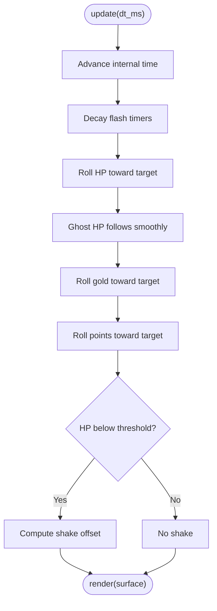
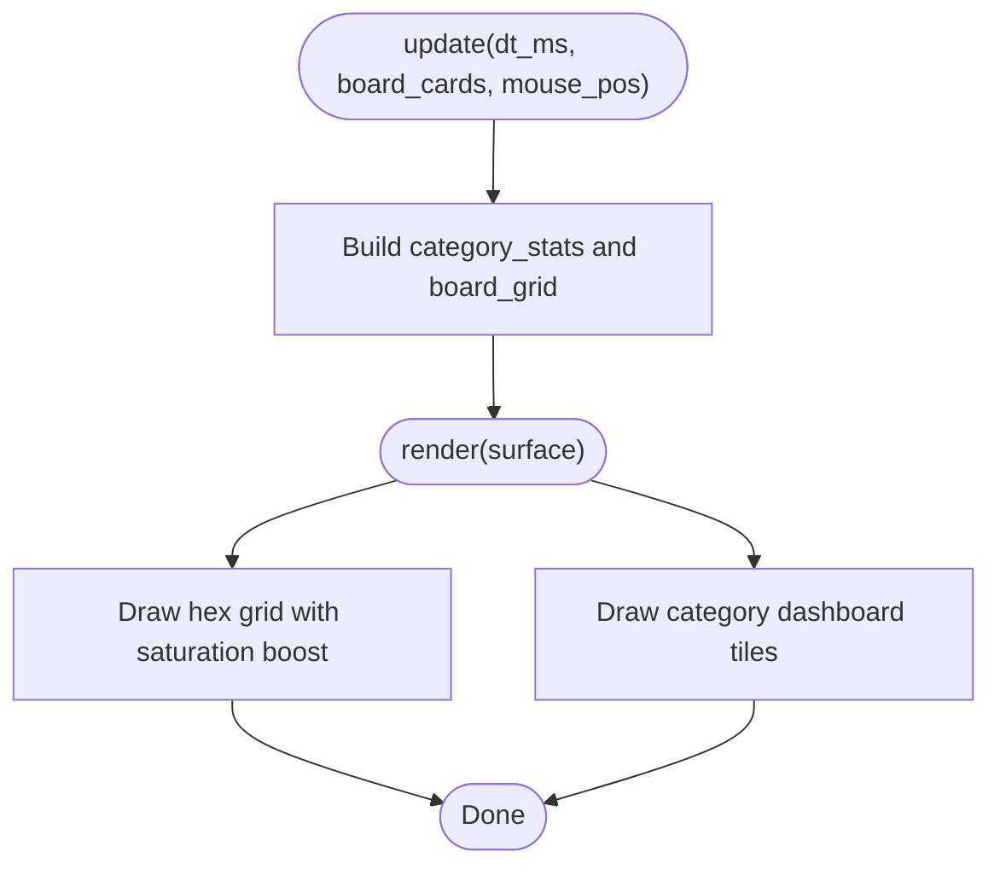
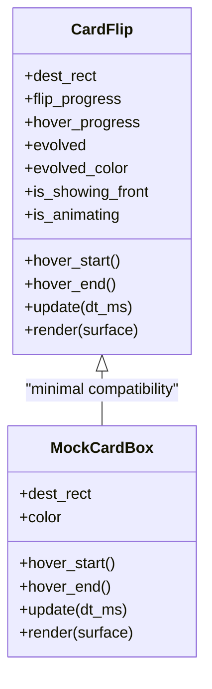
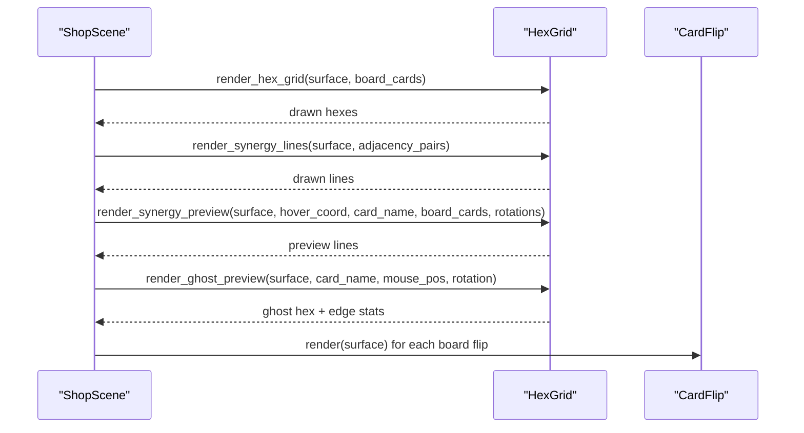
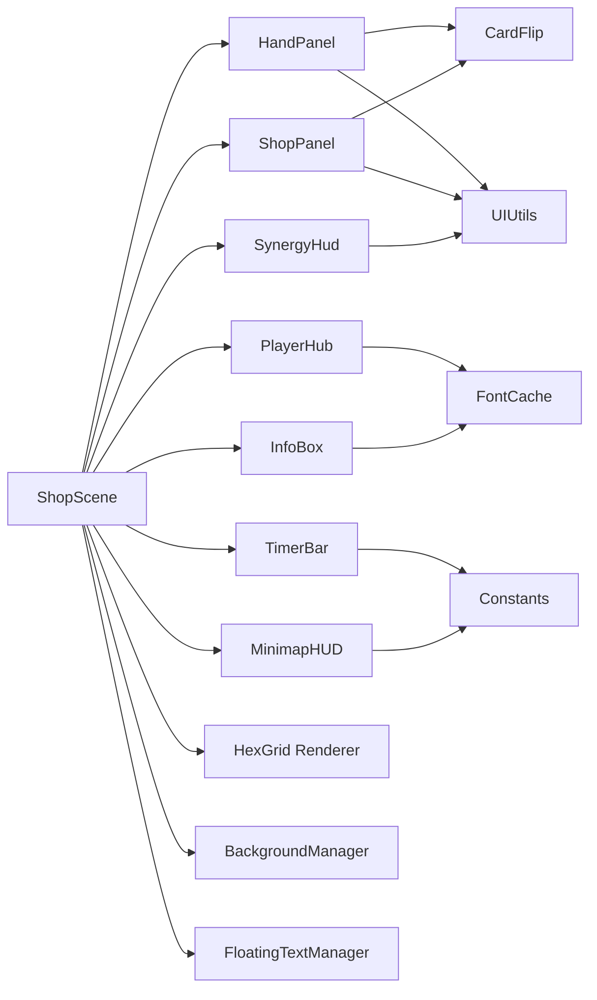

# UI Components

<cite>
**Referenced Files in This Document**
- [hand_panel.py](file://v2/ui/hand_panel.py)
- [shop_panel.py](file://v2/ui/shop_panel.py)
- [combat_terminal.py](file://v2/ui/combat_terminal.py)
- [synergy_hud.py](file://v2/ui/synergy_hud.py)
- [player_hub.py](file://v2/ui/player_hub.py)
- [minimap_hud.py](file://v2/ui/minimap_hud.py)
- [card_flip.py](file://v2/ui/card_flip.py)
- [hex_grid.py](file://v2/ui/hex_grid.py)
- [font_cache.py](file://v2/ui/font_cache.py)
- [ui_utils.py](file://v2/ui/ui_utils.py)
- [widgets.py](file://v2/ui/widgets.py)
- [background_manager.py](file://v2/ui/background_manager.py)
- [info_box.py](file://v2/ui/info_box.py)
- [timer_bar.py](file://v2/ui/timer_bar.py)
- [shop.py](file://v2/scenes/shop.py)
- [constants.py](file://v2/constants.py)
</cite>

## Table of Contents
1. [Introduction](#introduction)
2. [Project Structure](#project-structure)
3. [Core Components](#core-components)
4. [Architecture Overview](#architecture-overview)
5. [Detailed Component Analysis](#detailed-component-analysis)
6. [Dependency Analysis](#dependency-analysis)
7. [Performance Considerations](#performance-considerations)
8. [Troubleshooting Guide](#troubleshooting-guide)
9. [Conclusion](#conclusion)
10. [Appendices](#appendices)

## Introduction
This document describes the UI Components system used in the hybrid game’s shop and combat scenes. It focuses on five primary UI panels and supporting subsystems:
- Hand Panel: displays the player’s hand cards with hover and flip animations.
- Shop Panel: displays available cards, controls (reroll, lock, ready), and shop statistics.
- Synergy HUD: shows active synergy groups, totals, and passive triggers.
- Player Hub: central left-side panel displaying health, gold, streak, and strategy score.
- Minimap HUD: tactical overview of board composition and category distribution.

It also covers shared utilities (fonts, gradients, card flips), scene integration, event handling, state synchronization, animations, theming, and performance.

## Project Structure
The UI system is organized around reusable components and a shared constants module. Scenes orchestrate component lifecycles and synchronize them with public game state.

```mermaid
graph TB
subgraph "Scenes"
ShopScene["ShopScene<br/>v2/scenes/shop.py"]
end
subgraph "UI Panels"
HandPanel["HandPanel<br/>v2/ui/hand_panel.py"]
ShopPanel["ShopPanel<br/>v2/ui/shop_panel.py"]
SynergyHud["SynergyHud<br/>v2/ui/synergy_hud.py"]
PlayerHub["PlayerHub<br/>v2/ui/player_hub.py"]
MinimapHUD["MinimapHUD<br/>v2/ui/minimap_hud.py"]
InfoBox["InfoBox<br/>v2/ui/info_box.py"]
TimerBar["TimerBar<br/>v2/ui/timer_bar.py"]
end
subgraph "Utilities"
CardFlip["CardFlip<br/>v2/ui/card_flip.py"]
HexGrid["HexGrid Rendering<br/>v2/ui/hex_grid.py"]
FontCache["FontCache<br/>v2/ui/font_cache.py"]
UIUtils["UIUtils<br/>v2/ui/ui_utils.py"]
Widgets["Widgets<br/>v2/ui/widgets.py"]
BGMgr["BackgroundManager<br/>v2/ui/background_manager.py"]
end
subgraph "Constants"
Constants["Constants<br/>v2/constants.py"]
end
ShopScene --> HandPanel
ShopScene --> ShopPanel
ShopScene --> SynergyHud
ShopScene --> PlayerHub
ShopScene --> MinimapHUD
ShopScene --> InfoBox
ShopScene --> TimerBar
HandPanel --> CardFlip
ShopPanel --> CardFlip
ShopScene --> HexGrid
ShopScene --> BGMgr
ShopScene --> Widgets
HandPanel --> UIUtils
ShopPanel --> UIUtils
SynergyHud --> UIUtils
PlayerHub --> FontCache
InfoBox --> FontCache
TimerBar --> Constants
MinimapHUD --> Constants
```

**Diagram sources**
- [shop.py:23-71](file://v2/scenes/shop.py#L23-L71)
- [hand_panel.py:25-90](file://v2/ui/hand_panel.py#L25-L90)
- [shop_panel.py:42-119](file://v2/ui/shop_panel.py#L42-L119)
- [synergy_hud.py:29-61](file://v2/ui/synergy_hud.py#L29-L61)
- [player_hub.py:24-64](file://v2/ui/player_hub.py#L24-L64)
- [minimap_hud.py:16-40](file://v2/ui/minimap_hud.py#L16-L40)
- [info_box.py:55-65](file://v2/ui/info_box.py#L55-L65)
- [timer_bar.py:4-13](file://v2/ui/timer_bar.py#L4-L13)
- [card_flip.py:27-56](file://v2/ui/card_flip.py#L27-L56)
- [hex_grid.py:327-411](file://v2/ui/hex_grid.py#L327-L411)
- [font_cache.py:17-48](file://v2/ui/font_cache.py#L17-L48)
- [ui_utils.py:3-66](file://v2/ui/ui_utils.py#L3-L66)
- [widgets.py:21-80](file://v2/ui/widgets.py#L21-L80)
- [background_manager.py:5-35](file://v2/ui/background_manager.py#L5-L35)
- [constants.py:27-67](file://v2/constants.py#L27-L67)

**Section sources**
- [shop.py:23-71](file://v2/scenes/shop.py#L23-L71)
- [constants.py:27-67](file://v2/constants.py#L27-L67)

## Core Components
This section summarizes each component’s purpose, visuals, behavior, and integration points.

- Hand Panel
  - Purpose: Displays the player’s hand cards with hover and flip animations.
  - Visuals: Gradient panel background, inset hexagonal slots, decorative rim light, “HAND_TERMINAL” label.
  - Behavior: Tracks hover per slot, animates CardFlip instances, supports ghost rendering during drag.
  - Interaction: Mouse hover detection, per-slot flip transitions, optional ghost overlay for dragged card.
  - Props/Attributes: rect, card_rects, info_rect, background gradient surface, list of CardFlip.
  - Event Handling: handle_hover(mouse_pos, ghost_index=-1) returns hovered slot index.
  - Customization: Uses UIUtils gradient and font cache; supports evolved card glow via CardFlip.

- Shop Panel
  - Purpose: Displays available shop cards, controls, and shop statistics.
  - Visuals: Gradient bottom border, “SHOP_BAY” label, DCI-style buttons (REROLL, LOCK, READY), tier probabilities.
  - Behavior: Applies view state (gold, phase, locked state, probabilities), purchases cards, renders interactive buttons.
  - Interaction: get_action_for_event(event) parses clicks on buttons or cards; returns ShopPanelAction.
  - Props/Attributes: rect, card_rects, info_rect, button rects, bg_surface, _flips, _card_names, _gold, _phase, _locked_state, _probabilities.
  - Event Handling: handle_event(event) and get_action_for_event(event); renders gold-sensitive button states.
  - Customization: DCI button rendering with hover effects; uses font cache and UIUtils.

- Synergy HUD
  - Purpose: Shows synergy groups, totals, active effects, and passive triggers.
  - Visuals: Three stacked panels (Groups, Effects, Passives) with gradient backgrounds and titles.
  - Behavior: Smoothly interpolates display counts, flashes on increases, renders pulsing pips for active groups.
  - Props/Attributes: rect, groups_rect, effects_rect, passive_feed_rect, cached surfaces, view model, display counts, flash timers.
  - Event Handling: update(dt_ms, view_model) updates counters and timers; render draws all three sections.
  - Customization: Theming via color constants; dynamic panel caching for performance.

- Player Hub
  - Purpose: Central left-side panel showing HP, gold, streak, strategy score, and turn.
  - Visuals: Octagon-shaped panel with void background, scanline, and holographic pulse synchronized with minimap.
  - Behavior: Animated rolling numbers for HP/gold/points; flashes on changes; subtle HP shake when low; renders energy cells as hex array.
  - Props/Attributes: rect, inner_rect, element rects, display values, ghost HP, flashes, time, shake offset.
  - Event Handling: update_view(data) applies incoming PlayerHubData; update(dt_ms) advances animations.
  - Customization: DCI color palette; octagon clipping; scanline animation.

- Minimap HUD
  - Purpose: Tactical overview of board composition and category distribution.
  - Visuals: Two-section layout (hex grid + category dashboard), unified background, category icons and counts.
  - Behavior: Syncs board grid to category stats, boosts saturation for vibrant hex fills, draws category tiles.
  - Props/Attributes: rect, surface, grid_section_h, category_section_h, category_stats, board_grid.
  - Event Handling: update(dt_ms, board_cards, mouse_pos) rebuilds stats; render draws grid and dashboard.
  - Customization: Optimized proportions; category color mapping; mini-hex rendering with highlights.

**Section sources**
- [hand_panel.py:25-221](file://v2/ui/hand_panel.py#L25-L221)
- [shop_panel.py:42-341](file://v2/ui/shop_panel.py#L42-L341)
- [synergy_hud.py:16-266](file://v2/ui/synergy_hud.py#L16-L266)
- [player_hub.py:24-253](file://v2/ui/player_hub.py#L24-L253)
- [minimap_hud.py:16-232](file://v2/ui/minimap_hud.py#L16-L232)

## Architecture Overview
The ShopScene composes and orchestrates UI components, synchronizing them with public state and handling events.



**Diagram sources**
- [shop.py:445-455](file://v2/scenes/shop.py#L445-L455)
- [shop.py:525-584](file://v2/scenes/shop.py#L525-L584)
- [hex_grid.py:327-411](file://v2/ui/hex_grid.py#L327-L411)

**Section sources**
- [shop.py:355-407](file://v2/scenes/shop.py#L355-L407)
- [shop.py:525-584](file://v2/scenes/shop.py#L525-L584)

## Detailed Component Analysis

### Hand Panel Analysis
- Responsibilities
  - Manage six card slots aligned to the center area.
  - Render a decorative background with gradient and rim lighting.
  - Drive CardFlip animations per slot with hover and flip transitions.
  - Support ghost rendering for dragged cards.
- Key Behaviors
  - Slot geometry computed from Layout constants.
  - Per-slot CardFlip instances built from asset loader or fallback surfaces.
  - Hover detection returns hovered slot index; ghost_index disables hover physics for dragged slot.
- Props and Attributes
  - rect, card_rects, info_rect, bg_surface, _card_names, _flips.
- Event Handling
  - handle_hover(mouse_pos, ghost_index=-1) returns hovered slot index.
- Rendering
  - Blits cached bg_surface; renders each CardFlip; optionally overlays semi-transparent ghost layer.



**Diagram sources**
- [hand_panel.py:25-221](file://v2/ui/hand_panel.py#L25-L221)
- [card_flip.py:27-178](file://v2/ui/card_flip.py#L27-L178)

**Section sources**
- [hand_panel.py:25-221](file://v2/ui/hand_panel.py#L25-L221)
- [card_flip.py:27-178](file://v2/ui/card_flip.py#L27-L178)

### Shop Panel Analysis
- Responsibilities
  - Display shop cards with persistent front-facing flip state.
  - Provide interactive controls: REROLL, LOCK, READY.
  - Show tier probabilities and gold-sensitive button states.
- Key Behaviors
  - apply_view_state(...) updates internal state and rebuilds flips when necessary.
  - get_action_for_event(...) parses mouse clicks into ShopPanelAction.
  - Renders DCI-style buttons with hover feedback and icons.
- Props and Attributes
  - rect, card_rects, info_rect, button rects, bg_surface, _flips, _card_names, _gold, _phase, _locked_state, _probabilities.
- Event Handling
  - handle_event(event) delegates to get_action_for_event(...).
- Rendering
  - Blits background, renders flips, draws buttons with dynamic colors and icons.



**Diagram sources**
- [shop_panel.py:42-341](file://v2/ui/shop_panel.py#L42-L341)
- [card_flip.py:27-178](file://v2/ui/card_flip.py#L27-L178)

**Section sources**
- [shop_panel.py:42-341](file://v2/ui/shop_panel.py#L42-L341)
- [card_flip.py:27-178](file://v2/ui/card_flip.py#L27-L178)

### Synergy HUD Analysis
- Responsibilities
  - Visualize active synergy groups, totals, active effects, and passive triggers.
- Key Behaviors
  - Smoothly interpolate display counts toward targets; flash on increases.
  - Render pulsing pips for active groups; show next-tier thresholds.
- Props and Attributes
  - rect, groups_rect, effects_rect, passive_feed_rect, cached surfaces, view model, display counts, flash timers.
- Rendering
  - Draws three stacked panels with titles and gradient backgrounds; renders rows for groups and entries for passive feed.



**Diagram sources**
- [synergy_hud.py:69-86](file://v2/ui/synergy_hud.py#L69-L86)

**Section sources**
- [synergy_hud.py:16-266](file://v2/ui/synergy_hud.py#L16-L266)

### Player Hub Analysis
- Responsibilities
  - Central left panel showing HP, gold, streak, strategy score, and turn.
- Key Behaviors
  - Animated rolling numbers with easing; flashes on gold changes; HP shake when low; octagon clipping with scanline and pulse.
- Props and Attributes
  - rect, inner_rect, element rects, display values, ghost HP, flashes, time, shake offset.
- Rendering
  - Draws octagon panel with gradient and borders; renders header, HP cell with hex energy cells, economy row, and strategy footer.



**Diagram sources**
- [player_hub.py:88-114](file://v2/ui/player_hub.py#L88-L114)

**Section sources**
- [player_hub.py:24-253](file://v2/ui/player_hub.py#L24-L253)

### Minimap HUD Analysis
- Responsibilities
  - Provide a tactical overview of board composition and category distribution.
- Key Behaviors
  - Synchronizes board_cards to compute category stats; boosts saturation for vibrant hex fills; renders category dashboard tiles.
- Props and Attributes
  - rect, surface, grid_section_h, category_section_h, category_stats, board_grid.
- Rendering
  - Draws unified background, header, hex grid with glow/highlight, separator, and category dashboard.



**Diagram sources**
- [minimap_hud.py:47-118](file://v2/ui/minimap_hud.py#L47-L118)

**Section sources**
- [minimap_hud.py:16-232](file://v2/ui/minimap_hud.py#L16-L232)

### Supporting Systems

#### CardFlip Animation System
- Purpose: Provides hover and flip transitions for cards.
- Features
  - Independent hover physics (lift and scale) and flip animation (back-to-front).
  - Optional evolved-card glow and border.
- Usage
  - Construct with back/front surfaces, destination rect, and optional evolved flag.
  - Call update(dt_ms) and render(surface) each frame.



**Diagram sources**
- [card_flip.py:27-178](file://v2/ui/card_flip.py#L27-L178)

**Section sources**
- [card_flip.py:27-178](file://v2/ui/card_flip.py#L27-L178)

#### Hex Grid Rendering and Preview
- Purpose: Render board hex grid, synergy lines, and placement previews.
- Features
  - Dynamic grid with breathing effect, hover highlighting, and tactical borders.
  - Preview synergy connections and edge stats during drag.
- Integration
  - Called by ShopScene draw pipeline.



**Diagram sources**
- [hex_grid.py:51-231](file://v2/ui/hex_grid.py#L51-L231)
- [hex_grid.py:327-411](file://v2/ui/hex_grid.py#L327-L411)
- [shop.py:525-584](file://v2/scenes/shop.py#L525-L584)

**Section sources**
- [hex_grid.py:51-231](file://v2/ui/hex_grid.py#L51-L231)
- [hex_grid.py:327-411](file://v2/ui/hex_grid.py#L327-L411)
- [shop.py:525-584](file://v2/scenes/shop.py#L525-L584)

#### Fonts, Icons, and Theming
- FontCache
  - Centralized font loading with caching; provides bold, regular, mono, icons, and specialized fonts.
  - render_text and render_icon helpers for consistent UI typography.
- UIUtils
  - create_gradient_panel for 3D-like panels with bevels and rounded corners.
  - create_glow for evolved-card and pulse effects.
- Theming
  - Colors and Typography constants define palettes and font families.
  - Panels use consistent color schemes and DCI-inspired styling.

**Section sources**
- [font_cache.py:17-139](file://v2/ui/font_cache.py#L17-L139)
- [ui_utils.py:3-90](file://v2/ui/ui_utils.py#L3-L90)
- [constants.py:111-122](file://v2/constants.py#L111-L122)
- [constants.py:76-89](file://v2/constants.py#L76-L89)

#### Floating Text and Overlays
- FloatingText and FloatingTextManager
  - 3-phase floating text: rise, hold, fade; pill halo and shadow layers.
  - Wagon queue delays for coordinated spawns.
- Usage
  - ShopScene spawns floating text for actions (e.g., reroll cost, copy milestones, synergy gains).

**Section sources**
- [widgets.py:21-279](file://v2/ui/widgets.py#L21-L279)
- [shop.py:603-660](file://v2/scenes/shop.py#L603-L660)

#### Background and Scene Integration
- BackgroundManager
  - Renders a dynamic hex pattern and vignette background.
- Integration
  - Called by ShopScene draw pipeline before board elements.

**Section sources**
- [background_manager.py:5-84](file://v2/ui/background_manager.py#L5-L84)
- [shop.py:525-535](file://v2/scenes/shop.py#L525-L535)

## Dependency Analysis
- Component Coupling
  - ShopScene composes and synchronizes all UI panels.
  - Panels rely on shared utilities (UIUtils, font_cache) and constants.
  - HandPanel and ShopPanel own CardFlip instances; MinimapHUD depends on category mapping; SynergyHud consumes public state.
- External Dependencies
  - AssetLoader for card fronts/back surfaces; fallback rendering when unavailable.
  - Pygame for rendering and events.
- Potential Circularities
  - None observed among UI components; ShopScene acts as orchestrator.



**Diagram sources**
- [shop.py:23-71](file://v2/scenes/shop.py#L23-L71)
- [hand_panel.py:25-90](file://v2/ui/hand_panel.py#L25-L90)
- [shop_panel.py:42-119](file://v2/ui/shop_panel.py#L42-L119)
- [synergy_hud.py:29-61](file://v2/ui/synergy_hud.py#L29-L61)
- [player_hub.py:24-64](file://v2/ui/player_hub.py#L24-L64)
- [minimap_hud.py:16-40](file://v2/ui/minimap_hud.py#L16-L40)
- [info_box.py:55-65](file://v2/ui/info_box.py#L55-L65)
- [timer_bar.py:4-13](file://v2/ui/timer_bar.py#L4-L13)
- [card_flip.py:27-56](file://v2/ui/card_flip.py#L27-L56)
- [hex_grid.py:327-411](file://v2/ui/hex_grid.py#L327-L411)
- [font_cache.py:17-48](file://v2/ui/font_cache.py#L17-L48)
- [ui_utils.py:3-66](file://v2/ui/ui_utils.py#L3-L66)
- [widgets.py:169-279](file://v2/ui/widgets.py#L169-L279)
- [background_manager.py:5-35](file://v2/ui/background_manager.py#L5-L35)
- [constants.py:27-67](file://v2/constants.py#L27-L67)

**Section sources**
- [shop.py:23-71](file://v2/scenes/shop.py#L23-L71)
- [constants.py:27-67](file://v2/constants.py#L27-L67)

## Performance Considerations
- Cached Surfaces
  - Panels precompute and cache gradient backgrounds and text surfaces to avoid repeated drawing.
- Minimal Rebuilds
  - HandPanel and ShopPanel rebuild only changed slots to reduce asset loading overhead.
- Efficient Rendering
  - UIUtils creates gradients via 1D scaling; HexGrid uses clipped rendering and avoids off-screen draws.
- Animation Efficiency
  - Smooth interpolation with fixed time steps; CardFlip and widgets use lightweight state machines.
- Asset Fallbacks
  - Fallback rendering ensures graceful degradation when assets are missing.

[No sources needed since this section provides general guidance]

## Troubleshooting Guide
- Missing Assets
  - If AssetLoader is unavailable, components fall back to procedural hex surfaces; verify asset paths and initialization.
- Hover Not Triggering
  - Ensure mouse coordinates are within card_rects; check ghost_index logic during drag.
- Buttons Disabled Incorrectly
  - Verify gold checks for REROLL and correct phase for READY.
- Minimap Stats Empty
  - Confirm board_cards mapping and category normalization; ensure CardDatabase lookup succeeds.
- Flashing or Stuttering
  - Ensure dt_ms is passed consistently; confirm update order in ShopScene.update.

**Section sources**
- [hand_panel.py:178-192](file://v2/ui/hand_panel.py#L178-L192)
- [shop_panel.py:256-258](file://v2/ui/shop_panel.py#L256-L258)
- [minimap_hud.py:52-87](file://v2/ui/minimap_hud.py#L52-L87)
- [widgets.py:227-252](file://v2/ui/widgets.py#L227-L252)

## Conclusion
The UI Components system is modular, performance-conscious, and thematically cohesive. Panels share common utilities and rendering patterns, while ShopScene orchestrates state synchronization and event handling. The result is a responsive, visually consistent interface that integrates tightly with the game’s board and shop mechanics.

[No sources needed since this section summarizes without analyzing specific files]

## Appendices

### Usage Examples (Code Snippet Paths)
- Instantiate and render HandPanel
  - [hand_panel.py:25-90](file://v2/ui/hand_panel.py#L25-L90)
  - [hand_panel.py:197-221](file://v2/ui/hand_panel.py#L197-L221)
- Update and render ShopPanel
  - [shop_panel.py:199-206](file://v2/ui/shop_panel.py#L199-L206)
  - [shop_panel.py:245-254](file://v2/ui/shop_panel.py#L245-L254)
- Handle hover and purchase actions
  - [shop_panel.py:207-239](file://v2/ui/shop_panel.py#L207-L239)
  - [shop.py:223-248](file://v2/scenes/shop.py#L223-L248)
- Update and render SynergyHud
  - [synergy_hud.py:69-90](file://v2/ui/synergy_hud.py#L69-L90)
- Update and render PlayerHub
  - [player_hub.py:88-114](file://v2/ui/player_hub.py#L88-L114)
  - [player_hub.py:115-151](file://v2/ui/player_hub.py#L115-L151)
- Update and render MinimapHUD
  - [minimap_hud.py:47-51](file://v2/ui/minimap_hud.py#L47-L51)
  - [minimap_hud.py:89-118](file://v2/ui/minimap_hud.py#L89-L118)
- CardFlip usage
  - [card_flip.py:67-86](file://v2/ui/card_flip.py#L67-L86)
  - [card_flip.py:90-145](file://v2/ui/card_flip.py#L90-L145)
- FloatingText spawning
  - [widgets.py:202-224](file://v2/ui/widgets.py#L202-L224)
  - [widgets.py:227-252](file://v2/ui/widgets.py#L227-L252)

### Cross-Component Communication and State Synchronization
- ShopScene.sync_view(...)
  - Updates ShopPanel, HandPanel, PlayerHub, and board CardFlips from public state.
- Hover and InfoBox
  - Hand/Shop hover triggers InfoBox updates with card details.
- Drag and Placement
  - Hand drag updates hover state; drop triggers controller action and spawns floating text.

**Section sources**
- [shop.py:445-455](file://v2/scenes/shop.py#L445-L455)
- [shop.py:271-298](file://v2/scenes/shop.py#L271-L298)
- [shop.py:355-407](file://v2/scenes/shop.py#L355-L407)
- [shop.py:525-584](file://v2/scenes/shop.py#L525-L584)