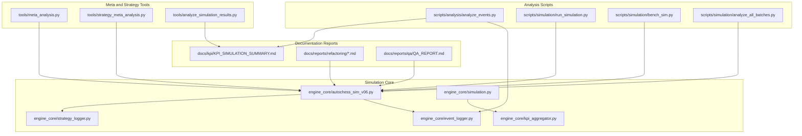
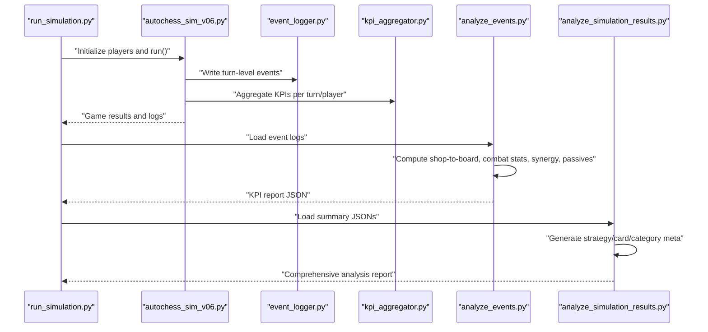
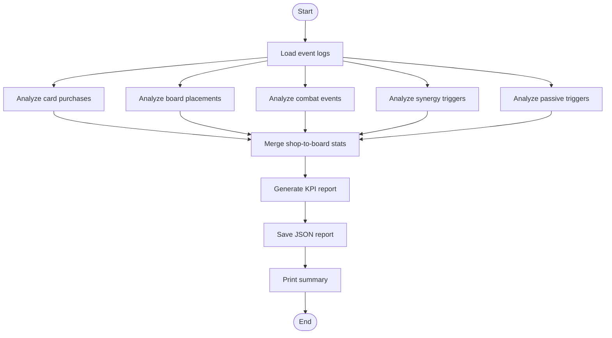
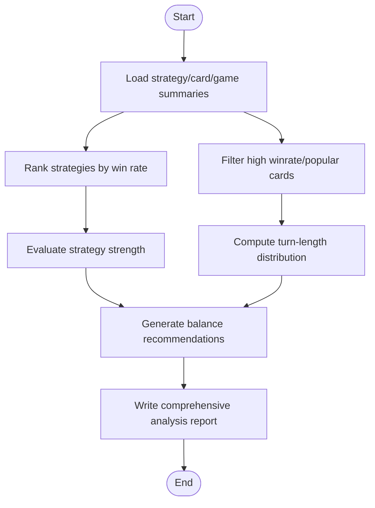
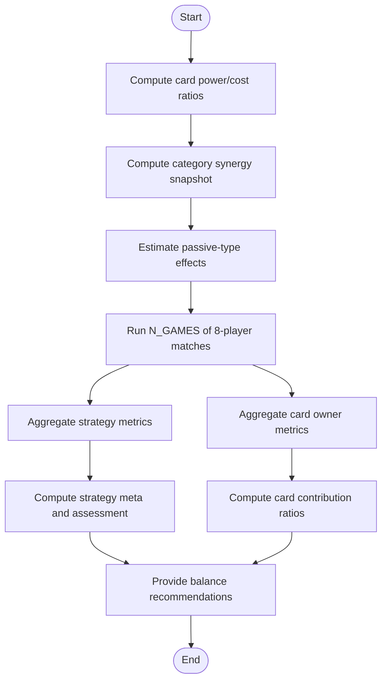
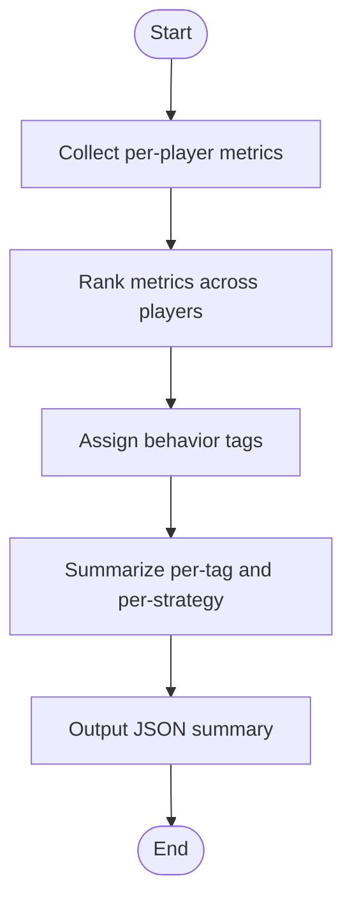
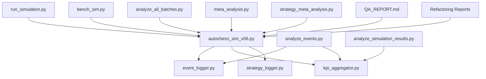

# Analytical Reporting and Data Visualization

<cite>
**Referenced Files in This Document**
- [README.md](file://README.md)
- [AUTOCHESS_HYBRID_FINAL_GDD.md](file://AUTOCHESS_HYBRID_FINAL_GDD.md)
- [scripts/analysis/analyze_events.py](file://scripts/analysis/analyze_events.py)
- [tools/analyze_simulation_results.py](file://tools/analyze_simulation_results.py)
- [tools/meta_analysis.py](file://tools/meta_analysis.py)
- [tools/strategy_meta_analysis.py](file://tools/strategy_meta_analysis.py)
- [docs/kpi/KPI_SIMULATION_SUMMARY.md](file://docs/kpi/KPI_SIMULATION_SUMMARY.md)
- [docs/reports/refactoring/REFACTORING_SUMMARY.md](file://docs/reports/refactoring/REFACTORING_SUMMARY.md)
- [docs/reports/refactoring/FIXED_SIMULATION_SUMMARY.md](file://docs/reports/refactoring/FIXED_SIMULATION_SUMMARY.md)
- [docs/reports/refactoring/CLEANUP_FIXES_SUMMARY.md](file://docs/reports/refactoring/CLEANUP_FIXES_SUMMARY.md)
- [docs/reports/refactoring/STAT_CAPS_SUMMARY.md](file://docs/reports/refactoring/STAT_CAPS_SUMMARY.md)
- [docs/reports/qa/QA_REPORT.md](file://docs/reports/qa/QA_REPORT.md)
- [engine_core/autochess_sim_v06.py](file://engine_core/autochess_sim_v06.py)
- [engine_core/simulation.py](file://engine_core/simulation.py)
- [engine_core/kpi_aggregator.py](file://engine_core/kpi_aggregator.py)
- [engine_core/event_logger.py](file://engine_core/event_logger.py)
- [engine_core/strategy_logger.py](file://engine_core/strategy_logger.py)
- [scripts/simulation/run_simulation.py](file://scripts/simulation/run_simulation.py)
- [scripts/simulation/bench_sim.py](file://scripts/simulation/bench_sim.py)
- [scripts/simulation/analyze_all_batches.py](file://scripts/simulation/analyze_all_batches.py)
- [scripts/validation/verify_results.py](file://scripts/validation/verify_results.py)
- [scripts/refactoring/market_ekonomi_refactor.py](file://scripts/refactoring/market_ekonomi_refactor.py)
- [scripts/analysis/__init__.py](file://scripts/analysis/__init__.py)
- [scripts/sim_hud_analysis.py](file://scripts/sim_hud_analysis.py)
</cite>

## Table of Contents
1. [Introduction](#introduction)
2. [Project Structure](#project-structure)
3. [Core Components](#core-components)
4. [Architecture Overview](#architecture-overview)
5. [Detailed Component Analysis](#detailed-component-analysis)
6. [Dependency Analysis](#dependency-analysis)
7. [Performance Considerations](#performance-considerations)
8. [Troubleshooting Guide](#troubleshooting-guide)
9. [Conclusion](#conclusion)
10. [Appendices](#appendices)

## Introduction
This document explains the analytical reporting and data visualization ecosystem for the Autochess Hybrid simulation engine. It covers result analysis tools, statistical reporting systems, visualization frameworks, simulation result analysis utilities, meta-analysis capabilities, and strategy comparison tools. It also provides practical examples for generating performance reports, analyzing simulation outcomes, extracting insights from large datasets, documenting the reporting framework, automated analysis pipelines, custom report generation, data export formats, visualization integration, interactive analysis tools, QA reporting systems, refactoring analysis tools, and quality assurance metrics. Guidance is included for report interpretation, trend identification, and decision-making based on analytical findings, along with best practices for data presentation, statistical validation, and communicating results effectively.

## Project Structure
The repository organizes analytical capabilities across several areas:
- Simulation and KPI logging in engine_core
- Event-driven analysis in scripts/analysis
- Tools for meta-analysis and strategy profiling in tools/
- Documentation-driven reports in docs/reports and docs/kpi
- Automated batch analysis and benchmarking in scripts/simulation
- Validation and QA reporting in docs/reports/qa and scripts/validation

**Diagram sources**
- [engine_core/autochess_sim_v06.py](file://engine_core/autochess_sim_v06.py)
- [engine_core/simulation.py](file://engine_core/simulation.py)
- [engine_core/kpi_aggregator.py](file://engine_core/kpi_aggregator.py)
- [engine_core/event_logger.py](file://engine_core/event_logger.py)
- [engine_core/strategy_logger.py](file://engine_core/strategy_logger.py)
- [scripts/analysis/analyze_events.py](file://scripts/analysis/analyze_events.py)
- [scripts/simulation/run_simulation.py](file://scripts/simulation/run_simulation.py)
- [scripts/simulation/bench_sim.py](file://scripts/simulation/bench_sim.py)
- [scripts/simulation/analyze_all_batches.py](file://scripts/simulation/analyze_all_batches.py)
- [tools/meta_analysis.py](file://tools/meta_analysis.py)
- [tools/strategy_meta_analysis.py](file://tools/strategy_meta_analysis.py)
- [tools/analyze_simulation_results.py](file://tools/analyze_simulation_results.py)
- [docs/kpi/KPI_SIMULATION_SUMMARY.md](file://docs/kpi/KPI_SIMULATION_SUMMARY.md)
- [docs/reports/refactoring/REFACTORING_SUMMARY.md](file://docs/reports/refactoring/REFACTORING_SUMMARY.md)
- [docs/reports/refactoring/FIXED_SIMULATION_SUMMARY.md](file://docs/reports/refactoring/FIXED_SIMULATION_SUMMARY.md)
- [docs/reports/refactoring/CLEANUP_FIXES_SUMMARY.md](file://docs/reports/refactoring/CLEANUP_FIXES_SUMMARY.md)
- [docs/reports/refactoring/STAT_CAPS_SUMMARY.md](file://docs/reports/refactoring/STAT_CAPS_SUMMARY.md)
- [docs/reports/qa/QA_REPORT.md](file://docs/reports/qa/QA_REPORT.md)

**Section sources**
- [README.md:102-129](file://README.md#L102-L129)
- [engine_core/autochess_sim_v06.py](file://engine_core/autochess_sim_v06.py)
- [engine_core/simulation.py](file://engine_core/simulation.py)
- [engine_core/kpi_aggregator.py](file://engine_core/kpi_aggregator.py)
- [engine_core/event_logger.py](file://engine_core/event_logger.py)
- [engine_core/strategy_logger.py](file://engine_core/strategy_logger.py)
- [scripts/analysis/analyze_events.py](file://scripts/analysis/analyze_events.py)
- [scripts/simulation/run_simulation.py](file://scripts/simulation/run_simulation.py)
- [scripts/simulation/bench_sim.py](file://scripts/simulation/bench_sim.py)
- [scripts/simulation/analyze_all_batches.py](file://scripts/simulation/analyze_all_batches.py)
- [tools/meta_analysis.py](file://tools/meta_analysis.py)
- [tools/strategy_meta_analysis.py](file://tools/strategy_meta_analysis.py)
- [tools/analyze_simulation_results.py](file://tools/analyze_simulation_results.py)
- [docs/kpi/KPI_SIMULATION_SUMMARY.md](file://docs/kpi/KPI_SIMULATION_SUMMARY.md)
- [docs/reports/refactoring/REFACTORING_SUMMARY.md](file://docs/reports/refactoring/REFACTORING_SUMMARY.md)
- [docs/reports/refactoring/FIXED_SIMULATION_SUMMARY.md](file://docs/reports/refactoring/FIXED_SIMULATION_SUMMARY.md)
- [docs/reports/refactoring/CLEANUP_FIXES_SUMMARY.md](file://docs/reports/refactoring/CLEANUP_FIXES_SUMMARY.md)
- [docs/reports/refactoring/STAT_CAPS_SUMMARY.md](file://docs/reports/refactoring/STAT_CAPS_SUMMARY.md)
- [docs/reports/qa/QA_REPORT.md](file://docs/reports/qa/QA_REPORT.md)

## Core Components
- Simulation engine with deterministic logging and KPI aggregation
- Event log analyzer for real-time KPI extraction
- Meta-analysis tools for card, strategy, category, and rarity assessments
- Strategy behavior tagging and batch-run summarization
- Comprehensive simulation result analysis and report generation
- QA and refactoring reports for quality assurance and maintenance tracking
- Automated batch analysis and benchmarking utilities

Key capabilities:
- Turn-by-turn KPI tracking and batch aggregation
- Event-driven analytics for shop-to-board conversion, combat stats, synergy, and passive triggers
- Strategy meta with win rates, placements, and derived behavior archetypes
- Card owner win rate and contribution metrics for balance insights
- Export-ready textual and JSON reports for downstream visualization

**Section sources**
- [engine_core/autochess_sim_v06.py](file://engine_core/autochess_sim_v06.py)
- [engine_core/kpi_aggregator.py](file://engine_core/kpi_aggregator.py)
- [engine_core/event_logger.py](file://engine_core/event_logger.py)
- [engine_core/strategy_logger.py](file://engine_core/strategy_logger.py)
- [scripts/analysis/analyze_events.py:16-253](file://scripts/analysis/analyze_events.py#L16-L253)
- [tools/meta_analysis.py:1-396](file://tools/meta_analysis.py#L1-L396)
- [tools/strategy_meta_analysis.py:1-194](file://tools/strategy_meta_analysis.py#L1-L194)
- [tools/analyze_simulation_results.py:1-278](file://tools/analyze_simulation_results.py#L1-L278)
- [docs/kpi/KPI_SIMULATION_SUMMARY.md:1-210](file://docs/kpi/KPI_SIMULATION_SUMMARY.md#L1-L210)

## Architecture Overview
The analytical pipeline integrates simulation execution, event logging, and post-run analysis to produce actionable reports and insights.

**Diagram sources**
- [scripts/simulation/run_simulation.py](file://scripts/simulation/run_simulation.py)
- [engine_core/autochess_sim_v06.py](file://engine_core/autochess_sim_v06.py)
- [engine_core/event_logger.py](file://engine_core/event_logger.py)
- [engine_core/kpi_aggregator.py](file://engine_core/kpi_aggregator.py)
- [scripts/analysis/analyze_events.py:16-253](file://scripts/analysis/analyze_events.py#L16-L253)
- [tools/analyze_simulation_results.py:1-278](file://tools/analyze_simulation_results.py#L1-L278)

## Detailed Component Analysis

### Event Log KPI Analyzer
Purpose:
- Load and parse event logs and combat logs
- Compute top purchased/placed cards, shop-to-board conversion, combat stats, synergy triggers, and passive triggers
- Produce a structured KPI report and print a human-readable summary

Processing logic:
- Reads JSONL event streams
- Aggregates counters and lists for downstream metrics
- Computes averages and percentiles for combat stats
- Outputs a JSON report and console summary

**Diagram sources**
- [scripts/analysis/analyze_events.py:16-253](file://scripts/analysis/analyze_events.py#L16-L253)

**Section sources**
- [scripts/analysis/analyze_events.py:16-253](file://scripts/analysis/analyze_events.py#L16-L253)

### Simulation Result Analyzer
Purpose:
- Generate a comprehensive analysis report from strategy and card performance summaries
- Provide strategy rankings, card win rates, popularity metrics, and game dynamics distributions
- Offer balance recommendations based on observed dominance or weakness

Processing logic:
- Loads strategy_performance.json, card_performance.json, and game_results.json
- Ranks strategies by win rate and prints evaluation tags
- Filters high-winrate and popular cards with minimum purchase thresholds
- Computes turn-length distributions and generates bar charts as ASCII art
- Produces a detailed text report with balance suggestions

**Diagram sources**
- [tools/analyze_simulation_results.py:17-278](file://tools/analyze_simulation_results.py#L17-L278)

**Section sources**
- [tools/analyze_simulation_results.py:17-278](file://tools/analyze_simulation_results.py#L17-L278)

### Meta-Analysis Tool
Purpose:
- Static card value analysis (power/cost ratio)
- Category synergy snapshot
- Passive-type effect proxies (combat/income trigger means)
- Card owner win rate and strategy meta over N simulated games
- Category and rarity meta with balance hints

Processing logic:
- Iterates CARD_POOL to compute ratios and per-category stats
- Samples trigger_passive for combat/income proxies
- Runs N_GAMES of 8-player matches and aggregates per-strategy/per-card metrics
- Computes contribution ratios against uniform expectation
- Prints strategy assessment, card OP/weak candidates, category and rarity ratings
- Provides balance recommendations

**Diagram sources**
- [tools/meta_analysis.py:1-396](file://tools/meta_analysis.py#L1-L396)

**Section sources**
- [tools/meta_analysis.py:1-396](file://tools/meta_analysis.py#L1-L396)

### Strategy Meta-Analysis Tool
Purpose:
- Infer behavior archetypes per game from observed stats (spending, damage, synergy, combos, buys, final gold)
- Summarize per-tag and per-AI strategy statistics across batches
- Provide placement stability and win-rate summaries

Processing logic:
- Extracts per-player metrics from game logs and stats
- Ranks metrics to infer tags: economist, aggressive, combo_builder, high_rarity, balanced
- Summarizes appearances, wins, win rates, placements, and derived KPIs
- Returns JSON summary for downstream consumption

**Diagram sources**
- [tools/strategy_meta_analysis.py:1-194](file://tools/strategy_meta_analysis.py#L1-L194)

**Section sources**
- [tools/strategy_meta_analysis.py:1-194](file://tools/strategy_meta_analysis.py#L1-L194)

### KPI Simulation Summary
Purpose:
- Document batched KPI simulation results
- Provide structured summaries of strategy performance, board metrics, economy, combo/synergy, combat/win conditions, evolution/copies, luck/market, and momentum
- Include batch-wise analysis and actionable recommendations

Processing logic:
- Summarizes KPIs per 100-game batch
- Presents strategy win rates and top findings
- Offers guidance for balancing tempo dominance, evolver viability, synergy activation, and loop integration

**Section sources**
- [docs/kpi/KPI_SIMULATION_SUMMARY.md:1-210](file://docs/kpi/KPI_SIMULATION_SUMMARY.md#L1-L210)

### QA and Refactoring Reports
Purpose:
- QA reporting for validation and regression tracking
- Refactoring reports for cleanup, fixes, simulation improvements, and stat caps

Processing logic:
- Document outcomes of QA runs and validation checks
- Track refactoring scope, fixes applied, and simulation-related improvements
- Provide summaries for maintainability and quality assurance

**Section sources**
- [docs/reports/qa/QA_REPORT.md](file://docs/reports/qa/QA_REPORT.md)
- [docs/reports/refactoring/REFACTORING_SUMMARY.md](file://docs/reports/refactoring/REFACTORING_SUMMARY.md)
- [docs/reports/refactoring/FIXED_SIMULATION_SUMMARY.md](file://docs/reports/refactoring/FIXED_SIMULATION_SUMMARY.md)
- [docs/reports/refactoring/CLEANUP_FIXES_SUMMARY.md](file://docs/reports/refactoring/CLEANUP_FIXES_SUMMARY.md)
- [docs/reports/refactoring/STAT_CAPS_SUMMARY.md](file://docs/reports/refactoring/STAT_CAPS_SUMMARY.md)

## Dependency Analysis
The analytical stack depends on the simulation engine for deterministic logs and KPIs, and on analysis tools to transform raw logs into actionable insights.

**Diagram sources**
- [engine_core/autochess_sim_v06.py](file://engine_core/autochess_sim_v06.py)
- [engine_core/event_logger.py](file://engine_core/event_logger.py)
- [engine_core/kpi_aggregator.py](file://engine_core/kpi_aggregator.py)
- [engine_core/strategy_logger.py](file://engine_core/strategy_logger.py)
- [scripts/simulation/run_simulation.py](file://scripts/simulation/run_simulation.py)
- [scripts/simulation/bench_sim.py](file://scripts/simulation/bench_sim.py)
- [scripts/simulation/analyze_all_batches.py](file://scripts/simulation/analyze_all_batches.py)
- [scripts/analysis/analyze_events.py](file://scripts/analysis/analyze_events.py)
- [tools/meta_analysis.py](file://tools/meta_analysis.py)
- [tools/strategy_meta_analysis.py](file://tools/strategy_meta_analysis.py)
- [tools/analyze_simulation_results.py](file://tools/analyze_simulation_results.py)
- [docs/reports/qa/QA_REPORT.md](file://docs/reports/qa/QA_REPORT.md)
- [docs/reports/refactoring/REFACTORING_SUMMARY.md](file://docs/reports/refactoring/REFACTORING_SUMMARY.md)

**Section sources**
- [engine_core/autochess_sim_v06.py](file://engine_core/autochess_sim_v06.py)
- [engine_core/event_logger.py](file://engine_core/event_logger.py)
- [engine_core/kpi_aggregator.py](file://engine_core/kpi_aggregator.py)
- [engine_core/strategy_logger.py](file://engine_core/strategy_logger.py)
- [scripts/analysis/analyze_events.py:16-253](file://scripts/analysis/analyze_events.py#L16-L253)
- [tools/meta_analysis.py:1-396](file://tools/meta_analysis.py#L1-L396)
- [tools/strategy_meta_analysis.py:1-194](file://tools/strategy_meta_analysis.py#L1-L194)
- [tools/analyze_simulation_results.py:17-278](file://tools/analyze_simulation_results.py#L17-L278)
- [docs/reports/qa/QA_REPORT.md](file://docs/reports/qa/QA_REPORT.md)
- [docs/reports/refactoring/REFACTORING_SUMMARY.md](file://docs/reports/refactoring/REFACTORING_SUMMARY.md)

## Performance Considerations
- Deterministic seeds ensure reproducible results for statistical comparisons
- Batched KPI logs enable scalable analysis without re-running simulations
- Event-driven parsing avoids recomputation by leveraging pre-aggregated logs
- Strategy meta inference uses ranking-based heuristics to minimize computational overhead
- Recommendations focus on reducing dominant strategies and balancing weak ones to improve long-term engagement

[No sources needed since this section provides general guidance]

## Troubleshooting Guide
Common issues and resolutions:
- Missing event logs: Ensure detailed logging is enabled when running simulations; the event analyzer will prompt to run simulations with detailed logging configured.
- Empty or partial reports: Verify that output directories exist and that the simulation produced logs and KPI files.
- Inconsistent KPIs: Confirm deterministic seeds and identical simulation parameters across runs.
- QA discrepancies: Review QA_REPORT.md for validation outcomes and re-run validation scripts to confirm fixes.

**Section sources**
- [scripts/analysis/analyze_events.py:231-247](file://scripts/analysis/analyze_events.py#L231-L247)
- [docs/reports/qa/QA_REPORT.md](file://docs/reports/qa/QA_REPORT.md)

## Conclusion
The analytical reporting and data visualization framework provides a robust foundation for understanding simulation outcomes, identifying meta trends, and guiding balance decisions. By combining deterministic simulation logs, event-driven KPI extraction, and meta-analysis tools, teams can generate comprehensive reports, track QA and refactoring progress, and iteratively improve the game’s strategic depth and fairness.

[No sources needed since this section summarizes without analyzing specific files]

## Appendices

### Practical Examples

- Generating a performance report from a batch of simulations:
  - Run the simulation runner to produce logs and KPI files
  - Execute the event analyzer to generate a KPI report
  - Use the simulation result analyzer to produce a comprehensive analysis report
  - Interpret strategy rankings, card win rates, and balance recommendations

- Analyzing simulation outcomes:
  - Load strategy_performance.json, card_performance.json, and game_results.json
  - Compute strategy dominance and card contribution ratios
  - Identify overpowered or weak strategies and cards
  - Derive category and rarity balance insights

- Extracting meaningful insights from large datasets:
  - Use turn-length distributions to identify pacing issues
  - Analyze shop-to-board conversion to assess strategy feasibility
  - Track synergy and combo triggers to evaluate system activation

- Reporting framework and automated pipelines:
  - Automate batch analysis with analyze_all_batches.py
  - Integrate KPI aggregation into the simulation loop
  - Generate JSON and text reports for downstream visualization

- Data export formats and visualization integration:
  - JSON reports for programmatic consumption
  - Text summaries for quick review
  - ASCII bar charts for turn-length distributions
  - Strategy and card leaderboards for balance discussions

- Interactive analysis tools:
  - Strategy meta-inference to tag player archetypes per game
  - Meta-analysis to compute card and category contributions
  - QA and refactoring reports for continuous improvement

- QA reporting system and quality assurance metrics:
  - Validate simulation correctness and performance
  - Track regressions and fixes across iterations
  - Monitor refactoring impacts on gameplay balance

- Best practices for data presentation, statistical validation, and communicating results:
  - Use confidence-like metrics (appearance counts) for card meta
  - Normalize metrics against uniform expectations for fair comparisons
  - Provide actionable recommendations with concrete balancing ideas
  - Visualize distributions and trends to support decision-making

**Section sources**
- [scripts/simulation/run_simulation.py](file://scripts/simulation/run_simulation.py)
- [scripts/simulation/analyze_all_batches.py](file://scripts/simulation/analyze_all_batches.py)
- [scripts/analysis/analyze_events.py:16-253](file://scripts/analysis/analyze_events.py#L16-L253)
- [tools/analyze_simulation_results.py:17-278](file://tools/analyze_simulation_results.py#L17-L278)
- [tools/meta_analysis.py:1-396](file://tools/meta_analysis.py#L1-L396)
- [tools/strategy_meta_analysis.py:1-194](file://tools/strategy_meta_analysis.py#L1-L194)
- [docs/kpi/KPI_SIMULATION_SUMMARY.md:1-210](file://docs/kpi/KPI_SIMULATION_SUMMARY.md#L1-L210)
- [docs/reports/qa/QA_REPORT.md](file://docs/reports/qa/QA_REPORT.md)
- [docs/reports/refactoring/REFACTORING_SUMMARY.md](file://docs/reports/refactoring/REFACTORING_SUMMARY.md)