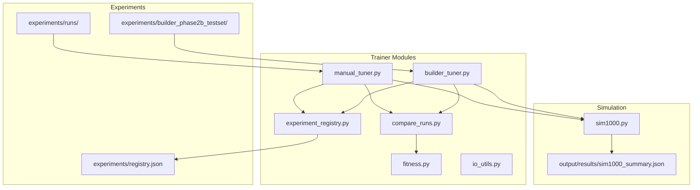
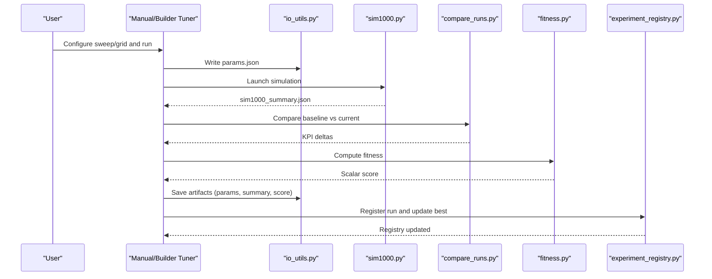
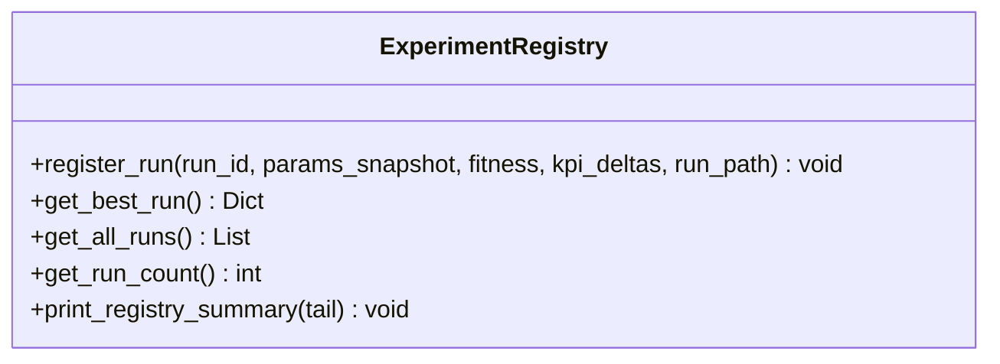
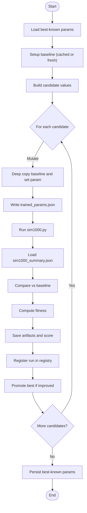
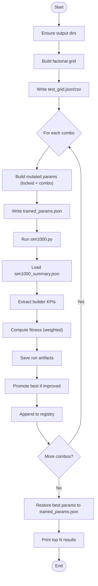
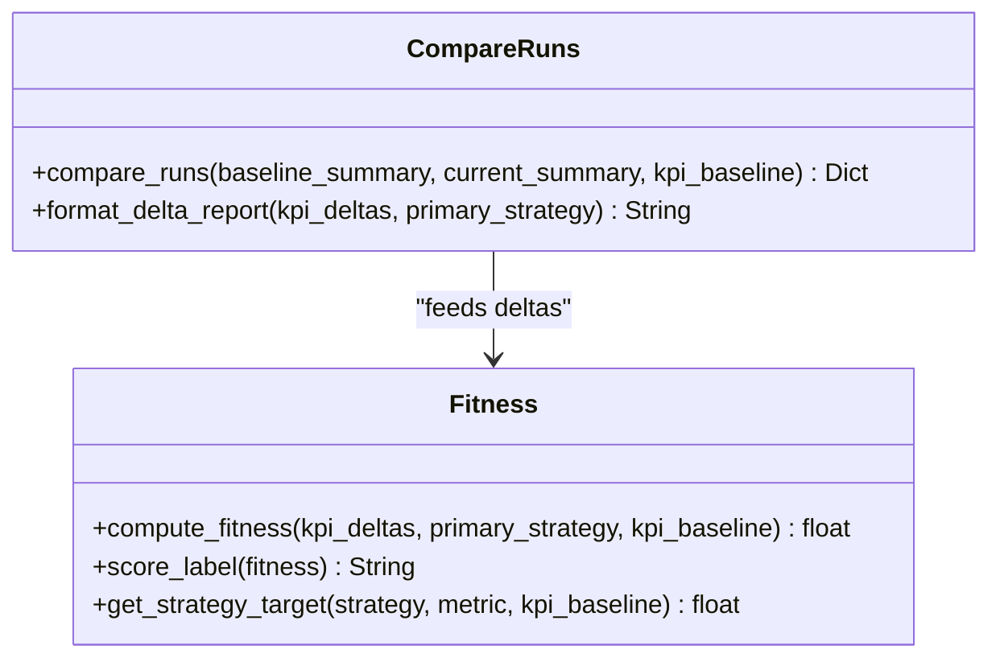
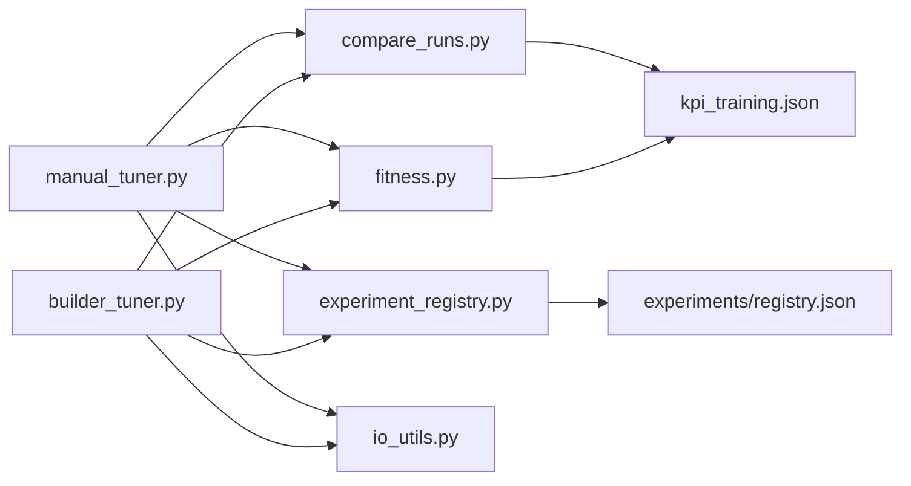

# Experiment Management and Parameter Tuning

<cite>
**Referenced Files in This Document**
- [experiment_registry.py](file://trainer/experiment_registry.py)
- [manual_tuner.py](file://trainer/manual_tuner.py)
- [builder_tuner.py](file://trainer/builder_tuner.py)
- [compare_runs.py](file://trainer/compare_runs.py)
- [fitness.py](file://trainer/fitness.py)
- [io_utils.py](file://trainer/io_utils.py)
- [registry.json](file://experiments/registry.json)
- [test_grid.json](file://experiments/builder_phase2b_testset/test_grid.json)
- [params.json](file://experiments/runs/run_001_tempo_power_center_thresh_55p00_211919/params.json)
- [sim_summary.json](file://experiments/runs/run_001_tempo_power_center_thresh_55p00_211919/sim_summary.json)
- [params.json](file://experiments/builder_phase2b/runs/b2b_001_gold_s12p00_group_0p60_high_r1p10_power_0p40_030339/params.json)
</cite>

## Table of Contents
1. [Introduction](#introduction)
2. [Project Structure](#project-structure)
3. [Core Components](#core-components)
4. [Architecture Overview](#architecture-overview)
5. [Detailed Component Analysis](#detailed-component-analysis)
6. [Dependency Analysis](#dependency-analysis)
7. [Performance Considerations](#performance-considerations)
8. [Troubleshooting Guide](#troubleshooting-guide)
9. [Conclusion](#conclusion)
10. [Appendices](#appendices)

## Introduction
This document explains the Experiment Management and Parameter Tuning framework used to explore parameter spaces, automate tuning workflows, and track results. It covers the experimental architecture, run configuration management, result tracking, and practical guidance for building new experiments, configuring parameter grids, and operating both manual and automated tuning pipelines. It also documents best practices for experiment lifecycle management, result comparison, and preventing performance regressions.

## Project Structure
The experiment system centers around:
- Trainer modules that orchestrate tuning, compute fitness, and manage artifacts
- Experiment directories that persist run configurations, summaries, and registries
- Simulation outputs that feed KPI comparisons and fitness scoring

**Diagram sources**
- [manual_tuner.py:1-566](file://trainer/manual_tuner.py#L1-L566)
- [builder_tuner.py:1-623](file://trainer/builder_tuner.py#L1-L623)
- [compare_runs.py:1-274](file://trainer/compare_runs.py#L1-L274)
- [fitness.py:1-175](file://trainer/fitness.py#L1-L175)
- [experiment_registry.py:1-144](file://trainer/experiment_registry.py#L1-L144)
- [io_utils.py:1-60](file://trainer/io_utils.py#L1-L60)
- [registry.json:1-244](file://experiments/registry.json#L1-L244)
- [test_grid.json:1-534](file://experiments/builder_phase2b_testset/test_grid.json#L1-L534)

**Section sources**
- [manual_tuner.py:1-566](file://trainer/manual_tuner.py#L1-L566)
- [builder_tuner.py:1-623](file://trainer/builder_tuner.py#L1-L623)
- [experiment_registry.py:1-144](file://trainer/experiment_registry.py#L1-L144)
- [io_utils.py:1-60](file://trainer/io_utils.py#L1-L60)

## Core Components
- Experiment Registry: Append-only registry storing run metadata and best-run tracking
- Manual Tuner: Controlled single-parameter sweeps with baseline comparison and fitness scoring
- Builder Tuner: Automated multi-parameter grid sweep for builder strategy with fitness computation and promotion of best runs
- Comparison and Fitness: Delta calculation across strategies and scalar fitness scoring with oracle-driven baselines
- I/O Utilities: Safe JSON read/write, directory creation, and artifact copying

Key responsibilities:
- Persist run artifacts (parameters, summaries, scores)
- Compute KPI deltas and scalar fitness
- Maintain experiment registry and best-run snapshots
- Support dry-run, resume, and custom grid configurations

**Section sources**
- [experiment_registry.py:1-144](file://trainer/experiment_registry.py#L1-L144)
- [manual_tuner.py:1-566](file://trainer/manual_tuner.py#L1-L566)
- [builder_tuner.py:1-623](file://trainer/builder_tuner.py#L1-L623)
- [compare_runs.py:1-274](file://trainer/compare_runs.py#L1-L274)
- [fitness.py:1-175](file://trainer/fitness.py#L1-L175)
- [io_utils.py:1-60](file://trainer/io_utils.py#L1-L60)

## Architecture Overview
The system follows a deterministic pipeline:
- Prepare baseline or load best-known parameters
- Mutate a single or multiple parameters
- Run simulation and capture summary metrics
- Compare against baseline to compute deltas
- Score fitness and persist artifacts
- Update registry and promote best run if improved

**Diagram sources**
- [manual_tuner.py:249-332](file://trainer/manual_tuner.py#L249-L332)
- [builder_tuner.py:411-467](file://trainer/builder_tuner.py#L411-L467)
- [compare_runs.py:35-199](file://trainer/compare_runs.py#L35-L199)
- [fitness.py:48-148](file://trainer/fitness.py#L48-L148)
- [experiment_registry.py:39-94](file://trainer/experiment_registry.py#L39-L94)
- [io_utils.py:23-60](file://trainer/io_utils.py#L23-L60)

## Detailed Component Analysis

### Experiment Registry
The registry maintains:
- Append-only run history with compact KPI snapshots
- Best-run tracking updated when fitness improves
- Summary printer for recent runs and best

**Diagram sources**
- [experiment_registry.py:39-144](file://trainer/experiment_registry.py#L39-L144)

**Section sources**
- [experiment_registry.py:1-144](file://trainer/experiment_registry.py#L1-L144)
- [registry.json:1-244](file://experiments/registry.json#L1-L244)

### Manual Tuner (Single-Parameter Sweep)
- Loads best-known parameters or falls back to hardcoded baseline
- Builds candidate values around a base parameter
- Runs simulation, compares vs baseline, computes fitness, persists artifacts, registers run, and promotes best
- Supports resuming and forcing baseline regeneration

**Diagram sources**
- [manual_tuner.py:415-562](file://trainer/manual_tuner.py#L415-L562)

**Section sources**
- [manual_tuner.py:1-566](file://trainer/manual_tuner.py#L1-L566)

### Builder Tuner (Multi-Parameter Grid Sweep)
- Defines a 4D factorial grid for builder strategy parameters
- Locks selected parameters (e.g., economist.greed_turn_end)
- Computes fitness as a weighted sum of win rate, average kills, and average HP
- Persists run artifacts, updates best run, archives snapshots, and prints top results

**Diagram sources**
- [builder_tuner.py:329-547](file://trainer/builder_tuner.py#L329-L547)

**Section sources**
- [builder_tuner.py:1-623](file://trainer/builder_tuner.py#L1-L623)
- [test_grid.json:1-534](file://experiments/builder_phase2b_testset/test_grid.json#L1-L534)

### Result Comparison and Fitness
- compare_runs: Computes deltas across strategies, adds oracle-derived metrics, and balance/game length/crash counts
- fitness: Scores based on primary strategy direction, target range, secondary health metrics, global balance, and crash safety

**Diagram sources**
- [compare_runs.py:35-274](file://trainer/compare_runs.py#L35-L274)
- [fitness.py:48-175](file://trainer/fitness.py#L48-L175)

**Section sources**
- [compare_runs.py:1-274](file://trainer/compare_runs.py#L1-L274)
- [fitness.py:1-175](file://trainer/fitness.py#L1-L175)

### I/O Utilities
- Safe JSON read/write with error handling
- Directory creation and timestamped path helpers
- Copy JSON utility for artifact duplication

**Section sources**
- [io_utils.py:1-60](file://trainer/io_utils.py#L1-L60)

## Dependency Analysis
The modules exhibit clear separation of concerns:
- manual_tuner.py depends on compare_runs.py, fitness.py, experiment_registry.py, and io_utils.py
- builder_tuner.py depends on compare_runs.py, fitness.py, experiment_registry.py, and io_utils.py
- Both depend on sim1000.py outputs and trained_params.json
- experiment_registry.py depends on io_utils.py and JSON registry files

**Diagram sources**
- [manual_tuner.py:51-57](file://trainer/manual_tuner.py#L51-L57)
- [builder_tuner.py:51-64](file://trainer/builder_tuner.py#L51-L64)
- [compare_runs.py:17-27](file://trainer/compare_runs.py#L17-L27)
- [fitness.py:29-45](file://trainer/fitness.py#L29-L45)
- [experiment_registry.py:18-19](file://trainer/experiment_registry.py#L18-L19)

**Section sources**
- [manual_tuner.py:1-566](file://trainer/manual_tuner.py#L1-L566)
- [builder_tuner.py:1-623](file://trainer/builder_tuner.py#L1-L623)
- [compare_runs.py:1-274](file://trainer/compare_runs.py#L1-L274)
- [fitness.py:1-175](file://trainer/fitness.py#L1-L175)
- [experiment_registry.py:1-144](file://trainer/experiment_registry.py#L1-L144)

## Performance Considerations
- Simulation timeouts and duration limits prevent runaway runs
- Early stopping conditions for success criteria reduce unnecessary computation
- Lightweight fitness computation avoids heavy post-processing overhead
- Artifact persistence and registry updates are batched per run to minimize I/O contention
- Grid size impacts runtime linearly; use resume and dry-run modes to optimize iteration cycles

[No sources needed since this section provides general guidance]

## Troubleshooting Guide
Common issues and resolutions:
- Simulation failures: Check exit codes and logs; ensure sim1000.py is executable and timeout values are sufficient
- Missing outputs: Verify output paths and permissions; confirm simulation completed successfully
- Registry corruption: The registry loader returns defaults on invalid JSON; rebuild registry from artifacts
- Parameter mutation errors: Validate dot-notation keys and numeric ranges before writing params.json
- Best-run promotion: Confirm fitness threshold improvements; review archive snapshots for rollback

**Section sources**
- [manual_tuner.py:147-168](file://trainer/manual_tuner.py#L147-L168)
- [builder_tuner.py:216-238](file://trainer/builder_tuner.py#L216-L238)
- [experiment_registry.py:24-34](file://trainer/experiment_registry.py#L24-L34)

## Conclusion
The Experiment Management and Parameter Tuning framework provides a robust, repeatable pipeline for exploring parameter spaces, comparing results, and promoting improvements. Its modular design supports both manual and automated workflows, while strict artifact and registry management ensures reproducibility and traceability. By following the best practices outlined here, teams can scale tuning efforts efficiently and maintain stability across large parameter spaces.

[No sources needed since this section summarizes without analyzing specific files]

## Appendices

### Experiment Directory Structure
- experiments/
  - baseline/: cached baseline parameters and summary
  - runs/<run_id>/: per-run artifacts (params.json, sim_summary.json, kpi_deltas.json, score.json)
  - best/: symlink or copy of the current best run
  - best_archive/: timestamped snapshots of past best runs
  - registry.json: append-only registry of runs and best
  - builder_phase2b_testset/: builder-specific sweep outputs
    - runs/<run_id>/: per-run artifacts for builder sweep
    - best/: current best builder run
    - best_archive/: archived best builder runs
    - registry.json: builder sweep registry
    - test_grid.json/test_grid.csv: planned parameter combinations

**Section sources**
- [registry.json:1-244](file://experiments/registry.json#L1-L244)
- [test_grid.json:1-534](file://experiments/builder_phase2b_testset/test_grid.json#L1-L534)

### Practical Examples

- Setting up a new manual experiment
  - Choose a parameter key (e.g., tempo.power_center_thresh)
  - Define candidate values or step/count
  - Run the manual tuner; it will:
    - Load best-known params or baseline
    - Mutate the chosen parameter
    - Run simulation and compute deltas and fitness
    - Save artifacts and register the run
    - Promote best if improved

  **Section sources**
  - [manual_tuner.py:415-562](file://trainer/manual_tuner.py#L415-L562)

- Configuring a parameter grid for builder tuning
  - Modify the sweep grid in builder_tuner.py or pass CLI arguments
  - Use --dry-run to preview combinations
  - Use --resume to skip previously completed runs
  - Use --top N to show top results after completion

  **Section sources**
  - [builder_tuner.py:553-622](file://trainer/builder_tuner.py#L553-L622)
  - [test_grid.json:1-534](file://experiments/builder_phase2b_testset/test_grid.json#L1-L534)

- Managing experiment registries
  - Append-only registration preserves history
  - Best-run is overwritten when fitness improves
  - Use print_registry_summary to review recent runs and best

  **Section sources**
  - [experiment_registry.py:39-144](file://trainer/experiment_registry.py#L39-L144)
  - [registry.json:1-244](file://experiments/registry.json#L1-L244)

### Test Set Validation Framework
- Use compare_runs to compute deltas across strategies and balance metrics
- Use fitness to derive a scalar score that accounts for direction, target range, secondary health, global balance, and crash safety
- Optionally integrate oracle baselines from kpi_training.json for strategy-specific targets

**Section sources**
- [compare_runs.py:35-274](file://trainer/compare_runs.py#L35-L274)
- [fitness.py:48-175](file://trainer/fitness.py#L48-L175)

### Experiment Lifecycle Management
- Baseline setup: cached or freshly generated
- Iteration: mutate parameters, run simulations, compute deltas, score fitness
- Persistence: save artifacts, update registry, promote best
- Archiving: timestamped snapshots of best runs
- Restoration: restore best-known params to trained_params.json after sweeps

**Section sources**
- [manual_tuner.py:336-394](file://trainer/manual_tuner.py#L336-L394)
- [builder_tuner.py:475-495](file://trainer/builder_tuner.py#L475-L495)

### Result Comparison Methodologies
- Strategy-level deltas: win rate, damage, kills, HP, synergy, and derived gold efficiency
- Global balance: max deviation and dominant strategy shifts
- Game length: average turns
- Safety: crash counts

**Section sources**
- [compare_runs.py:35-199](file://trainer/compare_runs.py#L35-L199)

### Best Practice Guidelines
- Keep parameter mutations small and incremental for manual tuning
- Use resume mode to avoid repeating completed runs
- Maintain locked constants for stable baselines during grid sweeps
- Monitor fitness labels and top results to guide next iterations
- Prevent regressions by restoring best-known params when no improvement is found

**Section sources**
- [manual_tuner.py:500-510](file://trainer/manual_tuner.py#L500-L510)
- [builder_tuner.py:475-495](file://trainer/builder_tuner.py#L475-L495)

### Scaling Experimental Workflows
- Reduce grid sizes initially; expand gradually
- Use dry-run to estimate total runs and runtime
- Parallelize independent runs externally if hardware permits
- Employ early stopping and success thresholds to prune poor regions
- Archive best runs frequently to safeguard progress

**Section sources**
- [builder_tuner.py:363-376](file://trainer/builder_tuner.py#L363-L376)
- [builder_tuner.py:444-447](file://trainer/builder_tuner.py#L444-L447)

### Example Artifacts
- Run parameters snapshot
  - [params.json:1-42](file://experiments/runs/run_001_tempo_power_center_thresh_55p00_211919/params.json#L1-L42)
  - [params.json:1-44](file://experiments/builder_phase2b/runs/b2b_001_gold_s12p00_group_0p60_high_r1p10_power_0p40_030339/params.json#L1-L44)

- Simulation summary
  - [sim_summary.json:1-113](file://experiments/runs/run_001_tempo_power_center_thresh_55p00_211919/sim_summary.json#L1-L113)