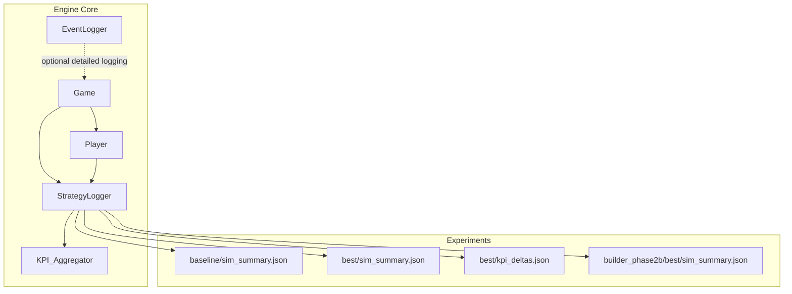
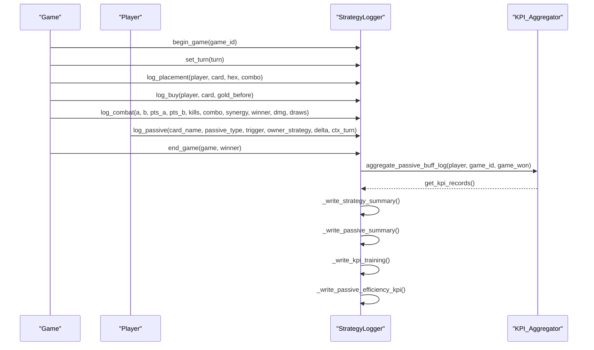
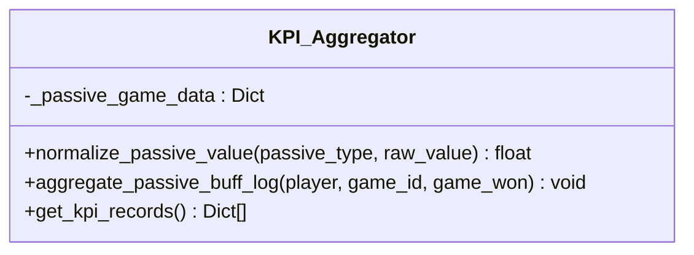
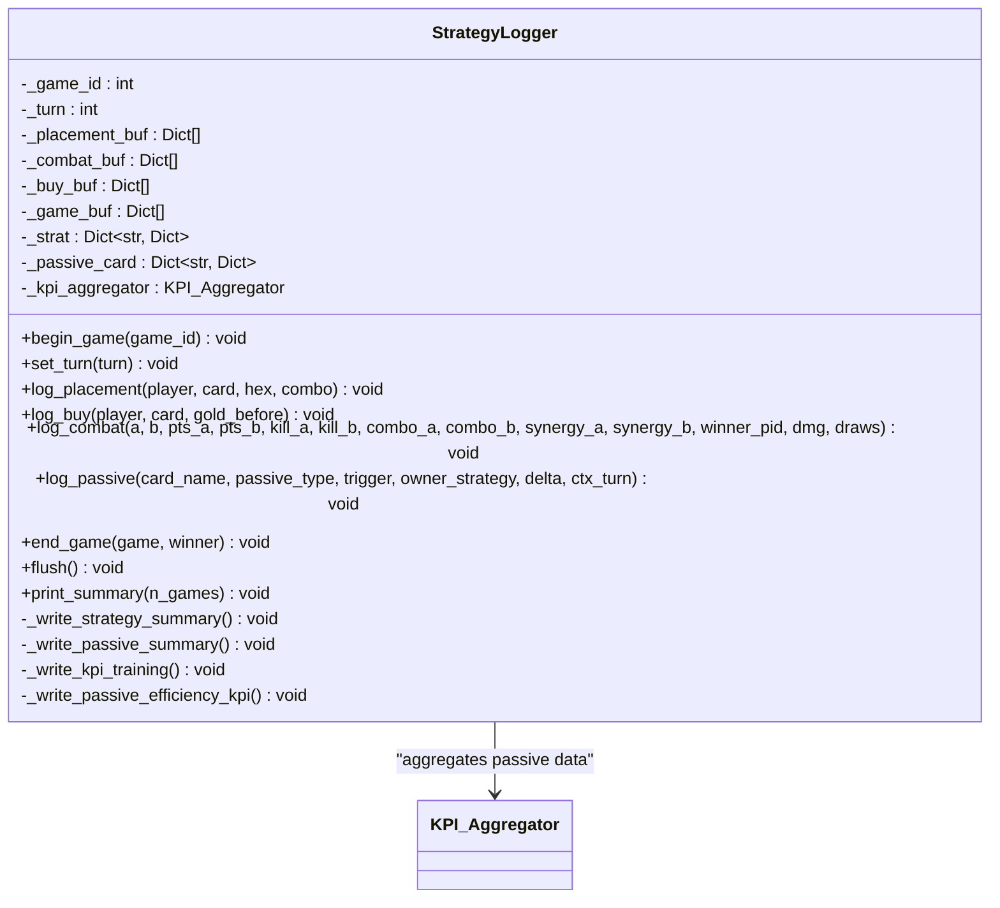
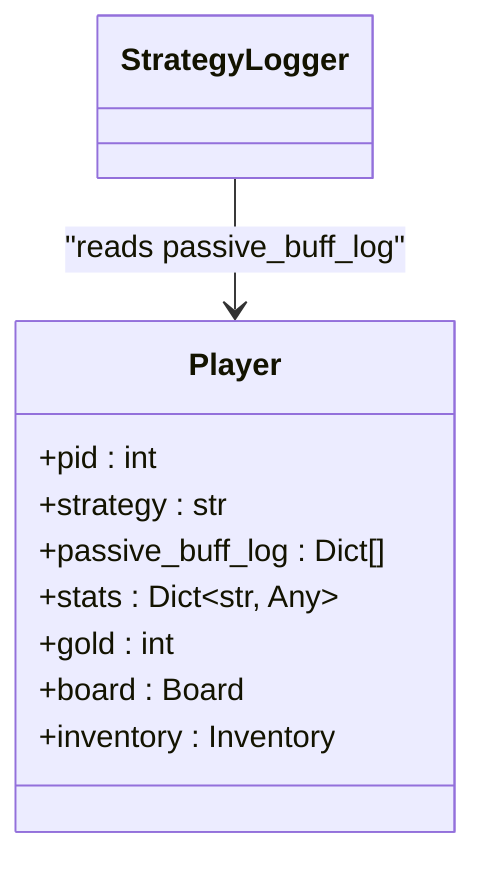
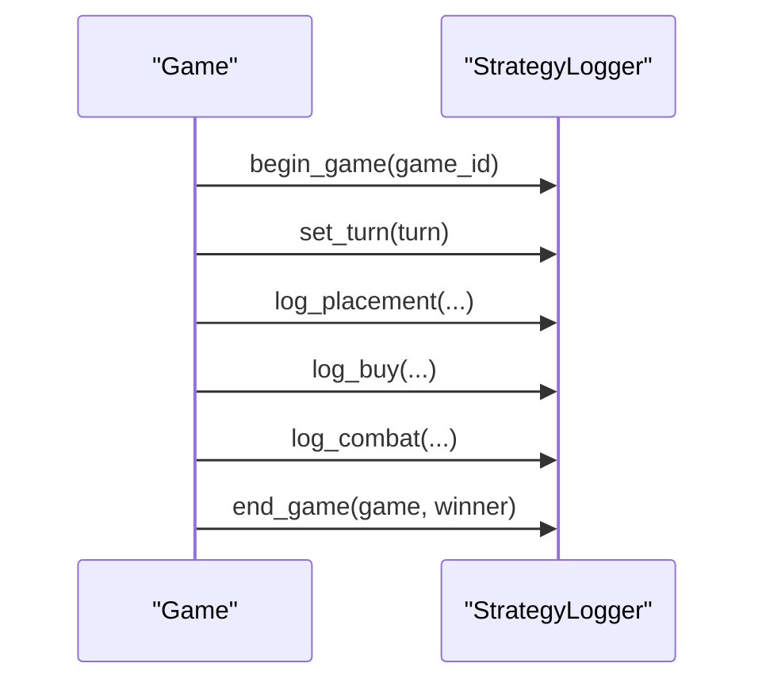
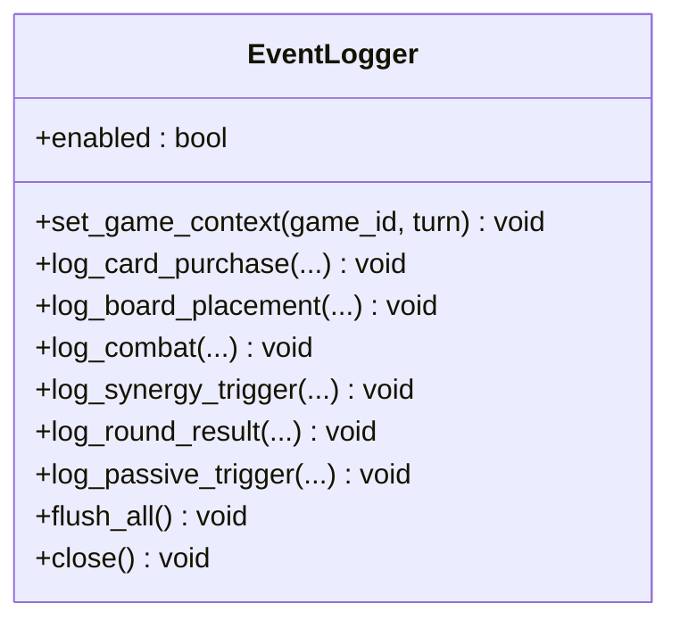
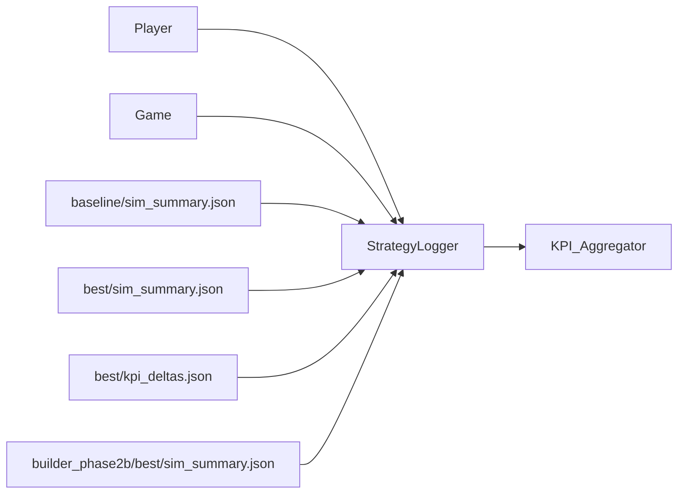

# Performance Metrics and KPI Tracking

<cite>
**Referenced Files in This Document**
- [kpi_aggregator.py](file://engine_core/kpi_aggregator.py)
- [strategy_logger.py](file://engine_core/strategy_logger.py)
- [event_logger.py](file://engine_core/event_logger.py)
- [player.py](file://engine_core/player.py)
- [game.py](file://engine_core/game.py)
- [sim_summary.json (baseline)](file://experiments/baseline/sim_summary.json)
- [sim_summary.json (best)](file://experiments/best/sim_summary.json)
- [kpi_deltas.json (best vs baseline)](file://experiments/best/kpi_deltas.json)
- [sim_summary.json (builder_phase2b best)](file://experiments/builder_phase2b/best/sim_summary.json)
</cite>

## Table of Contents
1. [Introduction](#introduction)
2. [Project Structure](#project-structure)
3. [Core Components](#core-components)
4. [Architecture Overview](#architecture-overview)
5. [Detailed Component Analysis](#detailed-component-analysis)
6. [Dependency Analysis](#dependency-analysis)
7. [Performance Considerations](#performance-considerations)
8. [Troubleshooting Guide](#troubleshooting-guide)
9. [Conclusion](#conclusion)
10. [Appendices](#appendices)

## Introduction
This document explains the Performance Metrics and KPI Tracking system used in the simulation engine. It covers the KPI collection pipeline, strategy analytics framework, and performance benchmarking capabilities. It documents the KPI aggregator functions, metric calculation algorithms, and statistical analysis methods. It also provides examples of KPI categories such as win rates, damage dealt, kill counts, final health averages, synergy averages, and economic efficiency ratios. Additionally, it describes the strategy logger implementation, parameter-based analytics, performance comparison methodologies, metric interpretation, trend analysis, performance regression detection, reporting, visualization opportunities, and integration with experiment frameworks. Guidance is included on metric selection criteria, statistical significance testing, and performance optimization based on KPI insights.

## Project Structure
The KPI tracking system spans several modules:
- Engine core modules handle game state, player actions, passive triggers, and logging.
- Experiment directories store simulation summaries and comparative KPI deltas for performance benchmarking.
- StrategyLogger aggregates and writes strategy-level KPIs and passive efficiency metrics.
- KPI_Aggregator computes normalized values and efficiency scores from passive buff logs.
- EventLogger provides an auxiliary detailed event logging system for deeper diagnostics.

**Diagram sources**
- [strategy_logger.py:52-591](file://engine_core/strategy_logger.py#L52-L591)
- [kpi_aggregator.py:11-161](file://engine_core/kpi_aggregator.py#L11-L161)
- [player.py:22-250](file://engine_core/player.py#L22-L250)
- [game.py:35-224](file://engine_core/game.py#L35-L224)
- [sim_summary.json (baseline):1-114](file://experiments/baseline/sim_summary.json#L1-L114)
- [sim_summary.json (best):1-113](file://experiments/best/sim_summary.json#L1-L113)
- [kpi_deltas.json (best vs baseline):1-214](file://experiments/best/kpi_deltas.json#L1-L214)
- [sim_summary.json (builder_phase2b best):1-113](file://experiments/builder_phase2b/best/sim_summary.json#L1-L113)

**Section sources**
- [strategy_logger.py:52-591](file://engine_core/strategy_logger.py#L52-L591)
- [kpi_aggregator.py:11-161](file://engine_core/kpi_aggregator.py#L11-L161)
- [player.py:22-250](file://engine_core/player.py#L22-L250)
- [game.py:35-224](file://engine_core/game.py#L35-L224)

## Core Components
- StrategyLogger: Central orchestrator for strategy analytics. It buffers and writes multiple KPI artifacts, including strategy summaries, passive summaries, training-ready KPI vectors, and passive efficiency KPI records. It also integrates passive efficiency aggregation via KPI_Aggregator.
- KPI_Aggregator: Computes normalized passive values and efficiency scores from per-player passive buff logs. It ensures cross-category comparability by converting raw deltas into a common scale.
- Player: Maintains per-player stats and passive_buff_log entries that feed into KPI computations.
- Game: Drives the simulation loop and invokes StrategyLogger hooks at key lifecycle events (placement, buy, combat, passive, end-of-game).
- EventLogger: Optional detailed event logging for diagnostics and deep analysis (independent of the primary KPI system).
- Experiment summaries: Provide high-level strategy-level metrics and comparative KPI deltas for performance regression detection and benchmarking.

**Section sources**
- [strategy_logger.py:52-591](file://engine_core/strategy_logger.py#L52-L591)
- [kpi_aggregator.py:11-161](file://engine_core/kpi_aggregator.py#L11-L161)
- [player.py:22-250](file://engine_core/player.py#L22-L250)
- [game.py:35-224](file://engine_core/game.py#L35-L224)
- [event_logger.py:22-251](file://engine_core/event_logger.py#L22-L251)

## Architecture Overview
The KPI tracking architecture separates concerns between data capture/logging and computation/aggregation:
- Data capture/logging occurs during game events (placement, buy, combat, passive triggers, end-of-game).
- Aggregation and normalization occur in KPI_Aggregator.
- StrategyLogger consolidates and serializes strategy-level KPIs and passive efficiency KPIs.

**Diagram sources**
- [strategy_logger.py:127-353](file://engine_core/strategy_logger.py#L127-L353)
- [kpi_aggregator.py:72-161](file://engine_core/kpi_aggregator.py#L72-L161)
- [player.py:40-40](file://engine_core/player.py#L40-L40)
- [game.py:184-223](file://engine_core/game.py#L184-L223)

## Detailed Component Analysis

### KPI Aggregator
KPI_Aggregator transforms raw passive effect deltas into normalized values and computes efficiency scores. It:
- Accepts per-player passive_buff_log entries.
- Normalizes raw values by category-specific conversion factors.
- Aggregates total triggers, raw value, and normalized value per (game_id, strategy, card_name, passive_type).
- Produces records with efficiency_score = normalized_value / total_triggers (with safe division).

**Diagram sources**
- [kpi_aggregator.py:11-161](file://engine_core/kpi_aggregator.py#L11-L161)

**Section sources**
- [kpi_aggregator.py:11-161](file://engine_core/kpi_aggregator.py#L11-L161)

### Strategy Logger
StrategyLogger maintains strategy-level summaries and writes multiple artifacts:
- Placement metrics: center ratio, average combo per placement, placements per game.
- Combat metrics: combat win rate, draw rate, average kills per game, average damage per game.
- Economic metrics: average gold earned/spent, gold efficiency, average cards bought per game.
- Passive metrics: passive triggers per game, passive delta per game.
- Snowball/tempo metrics: win rate, average turn to win, average final HP.
- Card quality metrics: average power per card, r4r5 ratio.
- Passive efficiency KPI: per-trigger normalized value and win correlation.
- Passive summary: per-card trigger counts and delta sums.
- Training-ready KPI vectors for AI pipelines.

It integrates with KPI_Aggregator to produce passive efficiency KPIs and writes consolidated JSON/JSONL outputs.

**Diagram sources**
- [strategy_logger.py:52-591](file://engine_core/strategy_logger.py#L52-L591)
- [kpi_aggregator.py:11-161](file://engine_core/kpi_aggregator.py#L11-L161)

**Section sources**
- [strategy_logger.py:52-591](file://engine_core/strategy_logger.py#L52-L591)

### Player and Passive Buff Logs
Player stores per-turn passive effects in passive_buff_log. These entries are consumed by StrategyLogger and KPI_Aggregator to compute passive efficiency KPIs.

**Diagram sources**
- [player.py:22-250](file://engine_core/player.py#L22-L250)
- [strategy_logger.py:325-340](file://engine_core/strategy_logger.py#L325-L340)

**Section sources**
- [player.py:22-250](file://engine_core/player.py#L22-L250)
- [strategy_logger.py:325-340](file://engine_core/strategy_logger.py#L325-L340)

### Game Lifecycle Hooks
Game drives the simulation and invokes StrategyLogger at key moments:
- begin_game, set_turn
- log_placement, log_buy, log_combat
- end_game (where passive efficiency aggregation is triggered)

**Diagram sources**
- [game.py:157-223](file://engine_core/game.py#L157-L223)
- [strategy_logger.py:127-353](file://engine_core/strategy_logger.py#L127-L353)

**Section sources**
- [game.py:157-223](file://engine_core/game.py#L157-L223)
- [strategy_logger.py:127-353](file://engine_core/strategy_logger.py#L127-L353)

### Event Logger (Optional)
EventLogger provides an independent, detailed event stream for diagnostics. It is disabled by default and controlled by a global flag.

**Diagram sources**
- [event_logger.py:22-251](file://engine_core/event_logger.py#L22-L251)

**Section sources**
- [event_logger.py:22-251](file://engine_core/event_logger.py#L22-L251)

## Dependency Analysis
- StrategyLogger depends on KPI_Aggregator for passive efficiency computation.
- StrategyLogger reads Player.passive_buff_log and Game events to populate strategy-level summaries.
- Experiment JSON files provide comparative KPIs for performance regression detection and benchmarking.

**Diagram sources**
- [strategy_logger.py:52-591](file://engine_core/strategy_logger.py#L52-L591)
- [kpi_aggregator.py:11-161](file://engine_core/kpi_aggregator.py#L11-L161)
- [player.py:22-250](file://engine_core/player.py#L22-L250)
- [game.py:35-224](file://engine_core/game.py#L35-L224)
- [sim_summary.json (baseline):1-114](file://experiments/baseline/sim_summary.json#L1-L114)
- [sim_summary.json (best):1-113](file://experiments/best/sim_summary.json#L1-L113)
- [kpi_deltas.json (best vs baseline):1-214](file://experiments/best/kpi_deltas.json#L1-L214)
- [sim_summary.json (builder_phase2b best):1-113](file://experiments/builder_phase2b/best/sim_summary.json#L1-L113)

**Section sources**
- [strategy_logger.py:52-591](file://engine_core/strategy_logger.py#L52-L591)
- [kpi_aggregator.py:11-161](file://engine_core/kpi_aggregator.py#L11-L161)
- [player.py:22-250](file://engine_core/player.py#L22-L250)
- [game.py:35-224](file://engine_core/game.py#L35-L224)

## Performance Considerations
- StrategyLogger employs buffering and periodic flushing to minimize I/O overhead during simulations.
- A ghost-load filter suppresses near-zero passive deltas to reduce unnecessary updates.
- Local caching of nested dictionary access reduces repeated dictionary lookups for hot paths.
- KPI_Aggregator avoids file I/O, keeping computation separate from persistence for performance and testability.
- EventLogger is opt-in and disabled by default to avoid impacting simulation performance.

**Section sources**
- [strategy_logger.py:58-70](file://engine_core/strategy_logger.py#L58-L70)
- [strategy_logger.py:244-265](file://engine_core/strategy_logger.py#L244-L265)
- [kpi_aggregator.py:11-161](file://engine_core/kpi_aggregator.py#L11-L161)
- [event_logger.py:14-16](file://engine_core/event_logger.py#L14-L16)

## Troubleshooting Guide
- Missing passive_buff_log: The aggregator checks for the presence of passive_buff_log on Player and skips entries if absent.
- Malformed passive entries: The aggregator catches errors and continues without crashing.
- Write failures: StrategyLogger logs warnings for passive efficiency KPI write failures and continues.
- EventLogger errors: Flush routines catch exceptions and print messages to stderr.

Recommendations:
- Verify that passive trigger callbacks populate Player.passive_buff_log consistently.
- Validate that passive types and deltas conform to expected schemas.
- Monitor output directory permissions and disk space for flush operations.
- Enable EventLogger selectively for targeted diagnostics.

**Section sources**
- [kpi_aggregator.py:84-122](file://engine_core/kpi_aggregator.py#L84-L122)
- [strategy_logger.py:327-339](file://engine_core/strategy_logger.py#L327-L339)
- [strategy_logger.py:519-522](file://engine_core/strategy_logger.py#L519-L522)
- [event_logger.py:194-207](file://engine_core/event_logger.py#L194-L207)

## Conclusion
The KPI tracking system provides a robust, modular pipeline for capturing, normalizing, and analyzing strategy performance. StrategyLogger centralizes artifact generation, while KPI_Aggregator focuses on computation. Experiment summaries enable performance comparisons and regression detection. The system’s design supports scalability, maintainability, and integration with AI training pipelines.

## Appendices

### KPI Categories and Examples
- Win rate: Strategy-level wins divided by total games.
- Damage dealt: Average damage per game.
- Kill counts: Average kills per game.
- Final health averages: Average final HP per game.
- Synergy averages: Average synergy per game.
- Economic efficiency ratios: Gold efficiency (spent/earned), average gold spent/earned, average cards bought per game.
- Passive efficiency: Normalized passive value per trigger and efficiency score.

These metrics are computed and serialized by StrategyLogger into strategy_summary.json, kpi_training.json, and passive_efficiency_kpi.jsonl.

**Section sources**
- [strategy_logger.py:366-500](file://engine_core/strategy_logger.py#L366-L500)
- [strategy_logger.py:504-523](file://engine_core/strategy_logger.py#L504-L523)
- [kpi_aggregator.py:124-161](file://engine_core/kpi_aggregator.py#L124-L161)

### Strategy Analytics Framework
- Grouped KPIs:
  - G1 Placement: Center ratio, average combo per placement, placements per game.
  - G2 Combat: Combat win rate, draw rate, average kills per game, average damage per game.
  - G3 Economy: Average gold earned/spent, gold efficiency, average cards per game.
  - G4 Passive: Passive triggers per game, passive delta per game.
  - G5 Snowball/tempo: Win rate, average turn to win, average final HP.
  - G6 Card quality: Average power per card, r4r5 ratio.
- Training-ready vector format: {strategy: {feature_name: float}} for AI pipelines.

**Section sources**
- [strategy_logger.py:448-500](file://engine_core/strategy_logger.py#L448-L500)

### Performance Benchmarking and Comparison Methodologies
- Baseline vs new configuration: Compare strategy_summary.json and kpi_deltas.json to detect regressions or improvements.
- Turn-based comparisons: Use experiment summaries to compare average turns, crashes, and bug counts.
- Dominance and deviation: Track dominant strategy and max deviation to assess balance stability.

Examples:
- Baseline vs Best: Compare win rates, average damage, average final HP, and gold efficiency across strategies.
- Builder Phase 2b Best: Assess balance improvements and strategy distributions.

**Section sources**
- [sim_summary.json (baseline):1-114](file://experiments/baseline/sim_summary.json#L1-L114)
- [sim_summary.json (best):1-113](file://experiments/best/sim_summary.json#L1-L113)
- [kpi_deltas.json (best vs baseline):1-214](file://experiments/best/kpi_deltas.json#L1-L214)
- [sim_summary.json (builder_phase2b best):1-113](file://experiments/builder_phase2b/best/sim_summary.json#L1-L113)

### Metric Interpretation and Trend Analysis
- Strategy ranking: Sort strategies by win rate or combat WR to identify leaders and underperformers.
- Passive trigger analysis: Identify top triggering cards and their delta contributions.
- Efficiency trends: Monitor normalized passive efficiency over time to assess balancing effectiveness.

**Section sources**
- [strategy_logger.py:526-571](file://engine_core/strategy_logger.py#L526-L571)
- [strategy_logger.py:414-444](file://engine_core/strategy_logger.py#L414-L444)

### Performance Regression Detection
- Use kpi_deltas.json to quantify changes in key metrics (win rate, damage, kills, final HP, synergy, gold efficiency).
- Track balance indicators (max deviation, dominant strategy) to detect shifts in strategy dominance.

**Section sources**
- [kpi_deltas.json (best vs baseline):1-214](file://experiments/best/kpi_deltas.json#L1-L214)

### Reporting and Visualization Opportunities
- Strategy summary charts: Win rate vs average damage, average final HP, and gold efficiency.
- Passive efficiency plots: Top cards by normalized value and trigger frequency.
- Training vectors: Feature importance for AI models.
- Experiment dashboards: Compare baseline vs best configurations.

**Section sources**
- [strategy_logger.py:366-500](file://engine_core/strategy_logger.py#L366-L500)
- [strategy_logger.py:504-523](file://engine_core/strategy_logger.py#L504-L523)

### Integration with Experiment Frameworks
- Run multiple configurations and persist outputs in experiment directories.
- Use sim_summary.json and kpi_deltas.json for automated reporting and regression detection.
- Feed kpi_training.json into ML pipelines for strategy optimization.

**Section sources**
- [sim_summary.json (baseline):1-114](file://experiments/baseline/sim_summary.json#L1-L114)
- [sim_summary.json (best):1-113](file://experiments/best/sim_summary.json#L1-L113)
- [kpi_deltas.json (best vs baseline):1-214](file://experiments/best/kpi_deltas.json#L1-L214)

### Metric Selection Criteria and Statistical Significance Testing
- Choose metrics aligned with game objectives (win rate, damage, final HP, synergy, economic efficiency).
- Apply significance tests (e.g., bootstrap confidence intervals) to detect meaningful differences between configurations.
- Control for variance by running sufficient games per strategy and using paired comparisons (before/after) to isolate changes.

[No sources needed since this section provides general guidance]

### Performance Optimization Based on KPI Insights
- Focus on passive efficiency improvements to enhance card value and strategy viability.
- Adjust economic parameters to improve gold efficiency and card acquisition rates.
- Optimize placement strategies to increase center ratio and combo density.
- Monitor combat metrics to refine synergy and damage scaling.

[No sources needed since this section provides general guidance]