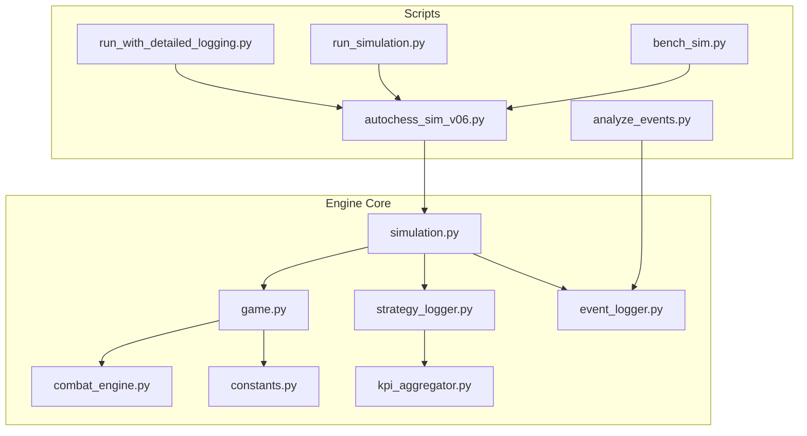
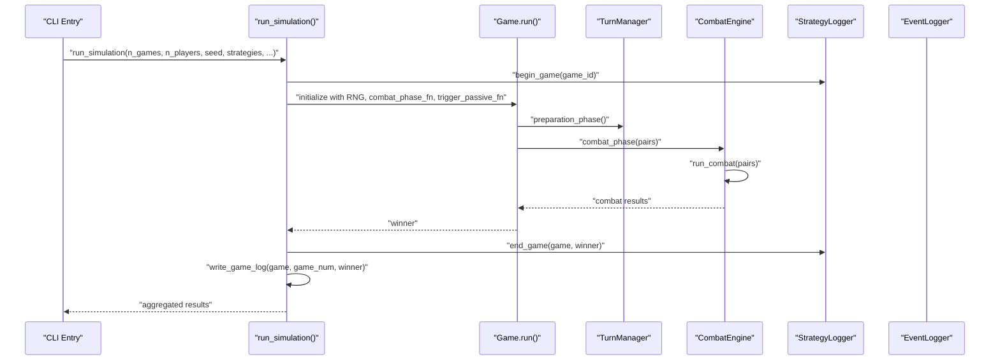
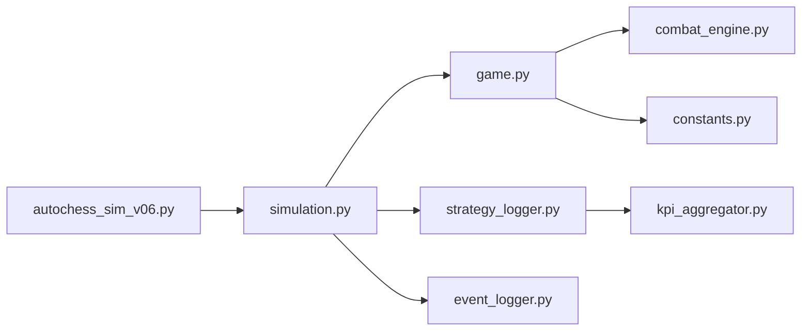
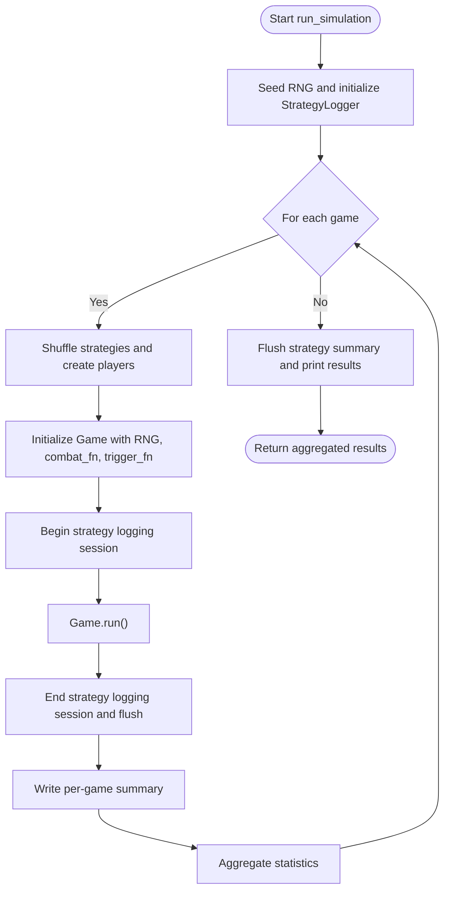

# Simulation Framework

<cite>
**Referenced Files in This Document**
- [simulation.py](file://engine_core/simulation.py)
- [autochess_sim_v06.py](file://engine_core/autochess_sim_v06.py)
- [game.py](file://engine_core/game.py)
- [strategy_logger.py](file://engine_core/strategy_logger.py)
- [event_logger.py](file://engine_core/event_logger.py)
- [combat_engine.py](file://engine_core/combat_engine.py)
- [constants.py](file://engine_core/constants.py)
- [run_simulation.py](file://scripts/simulation/run_simulation.py)
- [run_with_detailed_logging.py](file://scripts/simulation/run_with_detailed_logging.py)
- [bench_sim.py](file://scripts/simulation/bench_sim.py)
- [analyze_events.py](file://scripts/analysis/analyze_events.py)
- [kpi_aggregator.py](file://engine_core/kpi_aggregator.py)
</cite>

## Table of Contents
1. [Introduction](#introduction)
2. [Project Structure](#project-structure)
3. [Core Components](#core-components)
4. [Architecture Overview](#architecture-overview)
5. [Detailed Component Analysis](#detailed-component-analysis)
6. [Dependency Analysis](#dependency-analysis)
7. [Performance Considerations](#performance-considerations)
8. [Troubleshooting Guide](#troubleshooting-guide)
9. [Conclusion](#conclusion)
10. [Appendices](#appendices)

## Introduction
This document explains the Simulation Framework used to execute large-scale AutoChess Hybrid matches. It covers the simulation runner architecture, batch processing capabilities, and the end-to-end game execution pipeline. It documents the run_simulation function parameters, configuration options, and execution flow. Practical examples show how to run different simulation scenarios, configure player strategies, and manage random seeds for reproducibility. It also details the logging systems, per-game summaries, and output file management, along with performance optimization, memory management during batch processing, debugging techniques, and integration with strategy analytics and event triggers.

## Project Structure
The Simulation Framework spans several modules:
- Engine core: simulation runner, game orchestration, combat engine, strategy logger, event logger, constants, and KPI aggregation.
- Scripts: entry points for batch simulations, deterministic checks, detailed logging, benchmarking, and event analysis.

**Diagram sources**
- [simulation.py](file://engine_core/simulation.py)
- [autochess_sim_v06.py](file://engine_core/autochess_sim_v06.py)
- [game.py](file://engine_core/game.py)
- [combat_engine.py](file://engine_core/combat_engine.py)
- [strategy_logger.py](file://engine_core/strategy_logger.py)
- [event_logger.py](file://engine_core/event_logger.py)
- [kpi_aggregator.py](file://engine_core/kpi_aggregator.py)
- [run_simulation.py](file://scripts/simulation/run_simulation.py)
- [run_with_detailed_logging.py](file://scripts/simulation/run_with_detailed_logging.py)
- [bench_sim.py](file://scripts/simulation/bench_sim.py)
- [analyze_events.py](file://scripts/analysis/analyze_events.py)

**Section sources**
- [simulation.py](file://engine_core/simulation.py)
- [autochess_sim_v06.py](file://engine_core/autochess_sim_v06.py)
- [run_simulation.py](file://scripts/simulation/run_simulation.py)
- [run_with_detailed_logging.py](file://scripts/simulation/run_with_detailed_logging.py)
- [bench_sim.py](file://scripts/simulation/bench_sim.py)
- [analyze_events.py](file://scripts/analysis/analyze_events.py)

## Core Components
- Simulation Runner: orchestrates N games, shuffles strategies, initializes RNG, logs per-game summaries, and aggregates statistics.
- Game Orchestration: manages turns, preparation, combat, and end-of-game winner determination.
- Combat Engine: resolves pairwise combat, computes scores, updates stats, and handles card returns to the market pool.
- Strategy Analytics Logger: comprehensive KPI logging for placements, combat, economy, passives, and training-ready metrics.
- Event Logger: independent, detailed event logging for purchases, placements, combat, synergies, and passive triggers.
- Constants and KPI Aggregator: define game rules and convert raw passive effects into normalized values for cross-comparison.

**Section sources**
- [simulation.py](file://engine_core/simulation.py)
- [game.py](file://engine_core/game.py)
- [combat_engine.py](file://engine_core/combat_engine.py)
- [strategy_logger.py](file://engine_core/strategy_logger.py)
- [event_logger.py](file://engine_core/event_logger.py)
- [constants.py](file://engine_core/constants.py)
- [kpi_aggregator.py](file://engine_core/kpi_aggregator.py)

## Architecture Overview
The simulation pipeline integrates the runner, game engine, combat resolution, and logging subsystems. The runner delegates to the Game class, which coordinates TurnManager and CombatEngine. StrategyLogger and EventLogger are injected into the runner and Game to capture analytics and detailed events respectively.

**Diagram sources**
- [simulation.py](file://engine_core/simulation.py)
- [game.py](file://engine_core/game.py)
- [combat_engine.py](file://engine_core/combat_engine.py)
- [strategy_logger.py](file://engine_core/strategy_logger.py)
- [event_logger.py](file://engine_core/event_logger.py)

## Detailed Component Analysis

### Simulation Runner: run_simulation
Purpose:
- Execute N games with configurable parameters.
- Manage RNG seeding for reproducibility.
- Assign strategies per game (shuffled each game).
- Inject combat phase and passive trigger functions.
- Enable strategy analytics logging.
- Aggregate per-strategy averages and per-game metrics.
- Write per-game summaries to a consolidated log.

Parameters:
- n_games: number of games to run.
- n_players: number of players per game.
- verbose: whether to print first game details.
- seed: random seed for reproducibility.
- strategies: list of strategy names to use (defaults to STRATEGIES).
- combat_phase_fn: callable to resolve pairwise combat.
- enable_strategy_logging: toggles strategy analytics logging.

Execution flow:
- Seed RNG deterministically.
- Initialize StrategyLogger if enabled.
- For each game:
  - Shuffle strategies and construct players.
  - Create Game with RNG, combat function, passive trigger function, and card pool.
  - Begin strategy logging session for the game.
  - Run Game.run() to completion.
  - End strategy logging session and flush buffers.
  - Append per-game summary to simulation_log.txt.
  - Aggregate statistics per strategy.
- Flush strategy analytics and print summary.

Outputs:
- Aggregated statistics dictionary.
- Per-game summary log file.
- Strategy analytics logs (when enabled).

Practical examples:
- Reproducible 500-game run with fixed seed and verbose first game.
- Batch runs with varying player counts and strategy lists.
- Determinism checks by rerunning small subsets with identical seeds.

**Section sources**
- [simulation.py](file://engine_core/simulation.py)
- [autochess_sim_v06.py](file://engine_core/autochess_sim_v06.py)
- [run_simulation.py](file://scripts/simulation/run_simulation.py)
- [run_with_detailed_logging.py](file://scripts/simulation/run_with_detailed_logging.py)

### Game Execution Pipeline
The Game class encapsulates the lifecycle of a single match:
- Initialization: builds Market, sets RNG, injects combat and passive-trigger functions, creates TurnManager and CombatEngine.
- Turn management: delegates preparation and finishing to TurnManager.
- Combat resolution: delegates to CombatEngine with Swiss-system pairing.
- End-of-game: determines winner by highest HP among survivors or among all players if none remain.

Key behaviors:
- Infinite-loop guard after 50 turns.
- Board state cleanup before and after combat.
- Logs and last combat results for UI bridge.

**Section sources**
- [game.py](file://engine_core/game.py)

### Combat Phase Injection and Resolution
CombatEngine:
- Clears transient board state before and after combat.
- Triggers pre-combat passives for all board cards.
- Computes combo and synergy bonuses.
- Invokes injected combat_phase_fn to compute kills/draws.
- Updates player stats (kills, combo triggers, synergy sums, damage dealt).
- Handles elimination by returning cards to the market pool with copy limits.
- Maintains last combat results for UI.

Integration points:
- combat_phase_fn injected by the runner (e.g., engine_core.board.combat_phase).
- trigger_passive_fn injected by the runner (e.g., engine_core.passive_trigger.trigger_passive).

**Section sources**
- [combat_engine.py](file://engine_core/combat_engine.py)

### Strategy Analytics Logging
StrategyLogger:
- Captures placement events (coordinates, center/rim, combo score).
- Records buy events (cost, gold after).
- Logs combat outcomes (scores, winners, draws, damage).
- Aggregates per-strategy KPIs (win rate, combat stats, economy, passive triggers, final HP).
- Produces strategy_summary.json, passive_summary.json, kpi_training.json, and passive_efficiency_kpi.jsonl.
- Flushes buffers periodically and writes summaries at the end.

KPI Aggregation:
- KPI_Aggregator normalizes raw passive deltas by type (economy, combat, combo, copy, synergy_field, survival) for cross-comparison.

**Section sources**
- [strategy_logger.py](file://engine_core/strategy_logger.py)
- [kpi_aggregator.py](file://engine_core/kpi_aggregator.py)

### Event Logging System
EventLogger:
- Independent logging system that captures detailed events without interfering with existing logs.
- Supports purchase, placement, combat, synergy, and passive trigger events.
- Buffered writes with flush thresholds and final flush/close.
- Two output streams: simulation_events.jsonl and combat_events.jsonl.

Usage:
- Enabled via a global flag; initialized with init_event_logger(enabled=True).
- Works alongside the standard simulation runner.

**Section sources**
- [event_logger.py](file://engine_core/event_logger.py)
- [run_with_detailed_logging.py](file://scripts/simulation/run_with_detailed_logging.py)
- [analyze_events.py](file://scripts/analysis/analyze_events.py)

### Batch Processing and Output Management
Batch processing:
- Scripts support deterministic runs, 500-game reliability tests, and benchmarking.
- Benchmarks measure warmup and repeated runs to estimate throughput.

Output files:
- Consolidated per-game log: simulation_log.txt.
- Strategy analytics: strategy_summary.json, passive_summary.json, kpi_training.json, passive_efficiency_kpi.jsonl.
- Event logs: simulation_events.jsonl, combat_events.jsonl.
- CSV/JSON results for external analysis.

**Section sources**
- [run_simulation.py](file://scripts/simulation/run_simulation.py)
- [bench_sim.py](file://scripts/simulation/bench_sim.py)
- [simulation.py](file://engine_core/simulation.py)
- [strategy_logger.py](file://engine_core/strategy_logger.py)
- [event_logger.py](file://engine_core/event_logger.py)

### Practical Examples

- Running a reproducible 500-game batch:
  - Use a fixed seed and run the dedicated script to collect per-game metrics and write summary JSON and CSV.
  - Verify determinism by re-running a small subset with the same seed.

- Configuring player strategies:
  - Pass a comma-separated list of strategies via command-line or runner parameters.
  - Strategies are shuffled each game to diversify assignments.

- Managing random seeds:
  - Set seed in the runner to ensure reproducible outcomes across runs.
  - Use separate seeds for different batches to avoid unintended correlations.

- Enabling strategy analytics:
  - Toggle enable_strategy_logging to activate StrategyLogger and produce detailed KPI files.

- Enabling detailed event logging:
  - Initialize EventLogger with enabled=True to capture granular events for downstream analysis.

- Benchmarking:
  - Use bench_sim.py to measure average time and games-per-second with warmup and repeated runs.

**Section sources**
- [autochess_sim_v06.py](file://engine_core/autochess_sim_v06.py)
- [run_simulation.py](file://scripts/simulation/run_simulation.py)
- [run_with_detailed_logging.py](file://scripts/simulation/run_with_detailed_logging.py)
- [bench_sim.py](file://scripts/simulation/bench_sim.py)

## Dependency Analysis
High-level dependencies:
- autochess_sim_v06.py depends on run_simulation and print_results from simulation.py.
- simulation.py depends on Game, Player, STRATEGIES, trigger_passive, get_card_pool, and StrategyLogger.
- game.py depends on TurnManager, CombatEngine, Market, Board, AI, constants, and combat_phase.
- combat_engine.py depends on Board utilities and constants.
- strategy_logger.py depends on KPI_Aggregator for normalized passive metrics.
- event_logger.py is independent and writes to output/logs.

**Diagram sources**
- [autochess_sim_v06.py](file://engine_core/autochess_sim_v06.py)
- [simulation.py](file://engine_core/simulation.py)
- [game.py](file://engine_core/game.py)
- [combat_engine.py](file://engine_core/combat_engine.py)
- [strategy_logger.py](file://engine_core/strategy_logger.py)
- [event_logger.py](file://engine_core/event_logger.py)
- [kpi_aggregator.py](file://engine_core/kpi_aggregator.py)
- [constants.py](file://engine_core/constants.py)

**Section sources**
- [autochess_sim_v06.py](file://engine_core/autochess_sim_v06.py)
- [simulation.py](file://engine_core/simulation.py)
- [game.py](file://engine_core/game.py)
- [combat_engine.py](file://engine_core/combat_engine.py)
- [strategy_logger.py](file://engine_core/strategy_logger.py)
- [event_logger.py](file://engine_core/event_logger.py)
- [kpi_aggregator.py](file://engine_core/kpi_aggregator.py)
- [constants.py](file://engine_core/constants.py)

## Performance Considerations
- Deterministic RNG: Fix seed once per batch to avoid expensive re-seeding inside loops.
- Buffer flushing: StrategyLogger flushes at thresholds; tune for throughput vs disk IO.
- Event logging: EventLogger buffers and flushes; keep ENABLE_DETAILED_LOGGING disabled for heavy batch runs unless needed.
- Memory management during batch processing:
  - Reuse Game instances conceptually; in practice, new Game is constructed per iteration.
  - Avoid retaining large per-game objects beyond aggregation.
  - Periodic flushes reduce peak memory usage.
- Throughput measurement: Use bench_sim.py to estimate games/sec and identify bottlenecks.

[No sources needed since this section provides general guidance]

## Troubleshooting Guide
Common issues and remedies:
- Non-determinism:
  - Symptom: Different outcomes across runs with the same seed.
  - Action: Run determinism checks with small subsets; ensure seed is applied consistently before constructing players and RNG.
  - Reference: Determinism check logic in the batch script.

- Logging gaps:
  - Symptom: Missing per-game summaries or analytics.
  - Action: Confirm StrategyLogger is enabled and flushed; verify output directories exist; check for exceptions during flush/print_summary.

- Event logging not captured:
  - Symptom: Empty or missing event logs.
  - Action: Ensure EventLogger is initialized with enabled=True; verify ENABLE_DETAILED_LOGGING flag; confirm close_event_logger is called to flush remaining buffers.

- Performance bottlenecks:
  - Symptom: Low games/sec or long runtimes.
  - Action: Disable detailed logging; reduce verbose output; benchmark with bench_sim.py; review flush thresholds.

- Output file management:
  - Symptom: Old results interfering with new runs.
  - Action: Clean previous output files before starting a new batch; scripts remove old artifacts automatically.

**Section sources**
- [run_simulation.py](file://scripts/simulation/run_simulation.py)
- [run_with_detailed_logging.py](file://scripts/simulation/run_with_detailed_logging.py)
- [bench_sim.py](file://scripts/simulation/bench_sim.py)
- [strategy_logger.py](file://engine_core/strategy_logger.py)
- [event_logger.py](file://engine_core/event_logger.py)

## Conclusion
The Simulation Framework provides a robust, configurable, and extensible pipeline for running large-scale AutoChess Hybrid simulations. It supports reproducibility via deterministic RNG, comprehensive analytics via StrategyLogger, and detailed event capture via EventLogger. The runner’s batch processing, combined with efficient logging and KPI aggregation, enables reliable performance evaluation and strategy analysis.

[No sources needed since this section summarizes without analyzing specific files]

## Appendices

### API and Execution Flow Reference

**Diagram sources**
- [simulation.py](file://engine_core/simulation.py)

### Configuration Options Summary
- run_simulation parameters:
  - n_games, n_players, verbose, seed, strategies, combat_phase_fn, enable_strategy_logging.
- CLI entry:
  - --games, --players, --strategies, --verbose, --verify.
- Event logging:
  - init_event_logger(enabled=True) to enable detailed event capture.

**Section sources**
- [simulation.py](file://engine_core/simulation.py)
- [autochess_sim_v06.py](file://engine_core/autochess_sim_v06.py)
- [run_with_detailed_logging.py](file://scripts/simulation/run_with_detailed_logging.py)