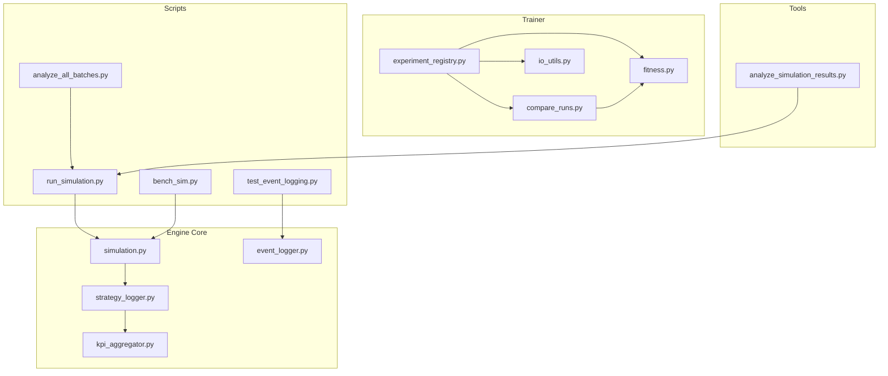
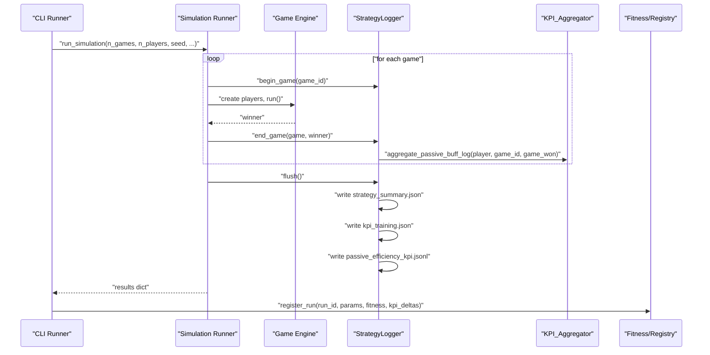
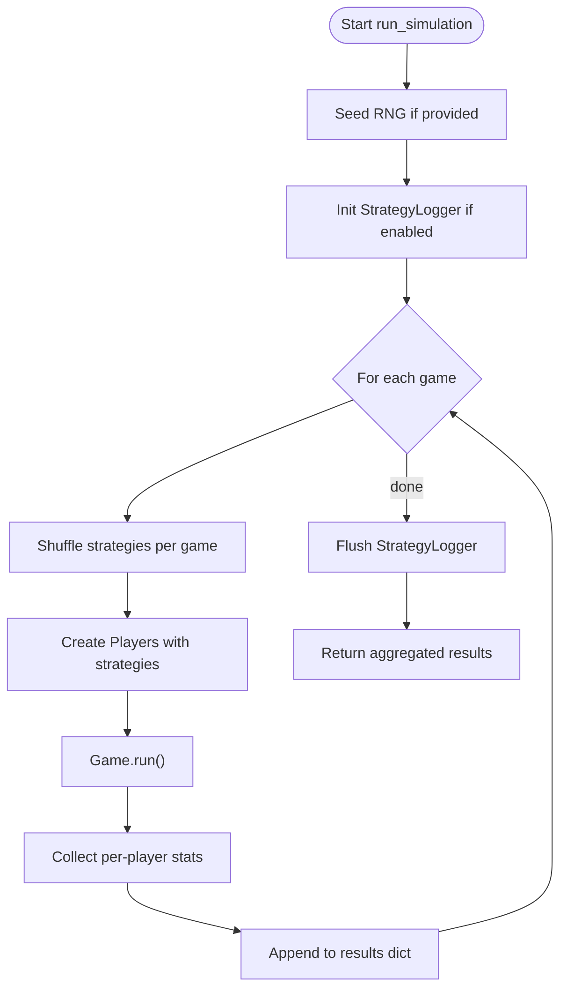
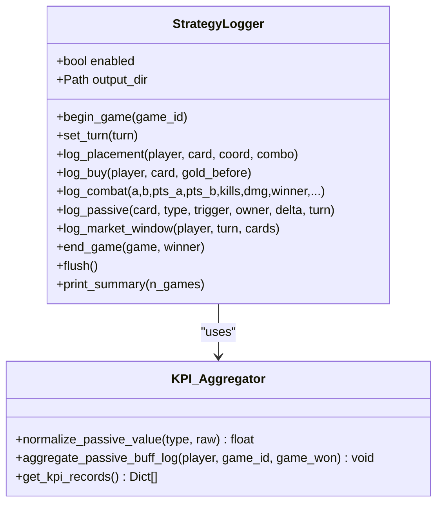
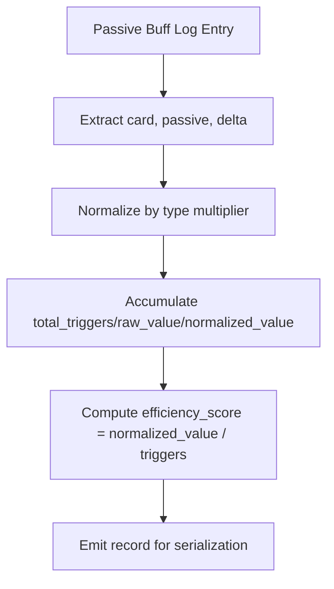
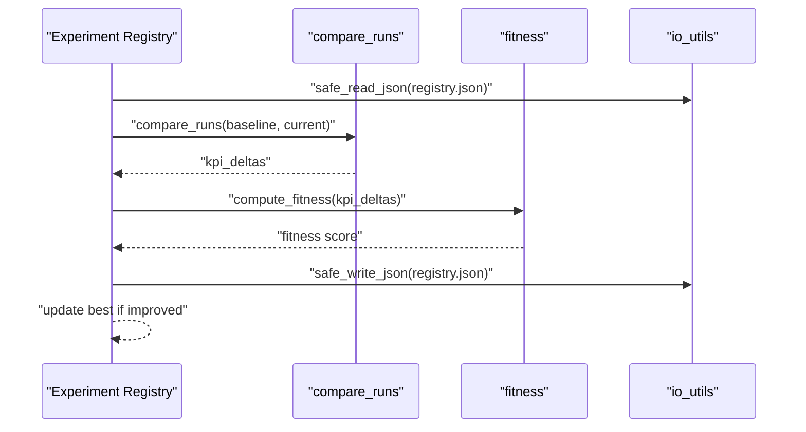
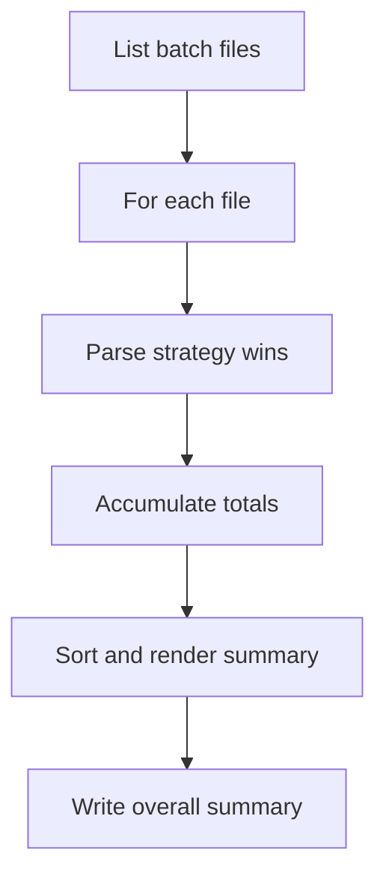
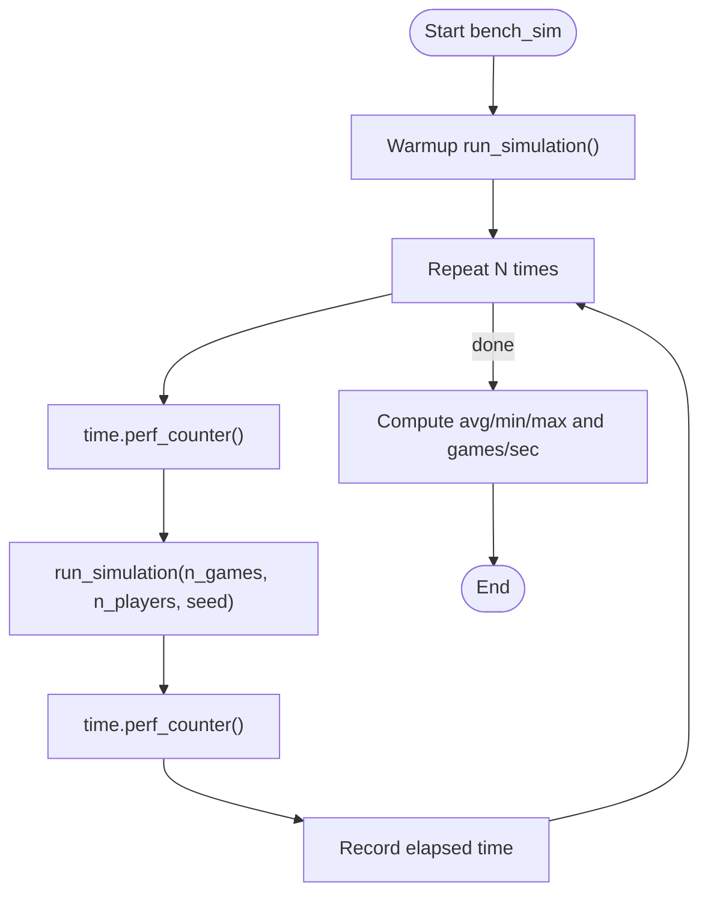
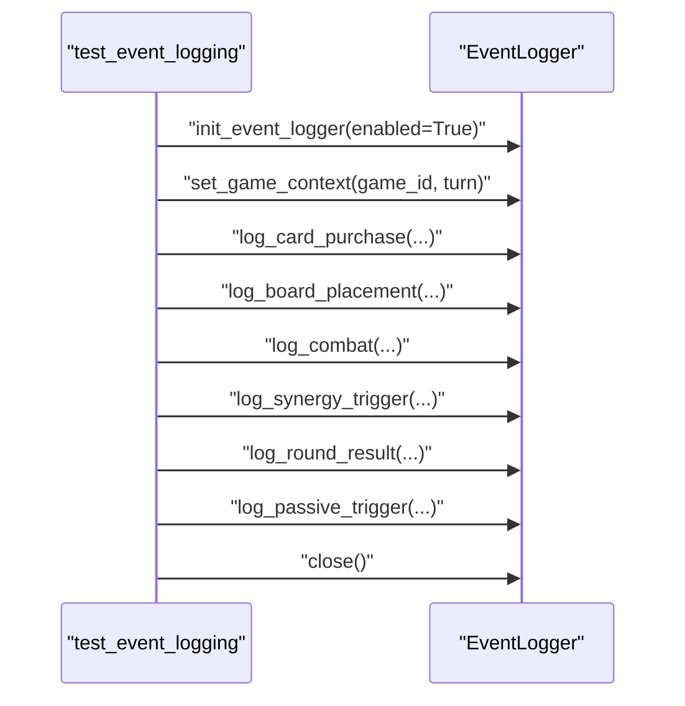
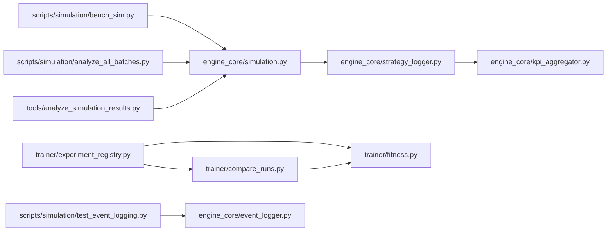

# Simulation and Analytics

<cite>
**Referenced Files in This Document**
- [simulation.py](file://engine_core/simulation.py)
- [strategy_logger.py](file://engine_core/strategy_logger.py)
- [kpi_aggregator.py](file://engine_core/kpi_aggregator.py)
- [run_simulation.py](file://scripts/simulation/run_simulation.py)
- [bench_sim.py](file://scripts/simulation/bench_sim.py)
- [experiment_registry.py](file://trainer/experiment_registry.py)
- [fitness.py](file://trainer/fitness.py)
- [compare_runs.py](file://trainer/compare_runs.py)
- [io_utils.py](file://trainer/io_utils.py)
- [analyze_all_batches.py](file://scripts/simulation/analyze_all_batches.py)
- [analyze_simulation_results.py](file://tools/analyze_simulation_results.py)
- [event_logger.py](file://engine_core/event_logger.py)
- [test_event_logging.py](file://scripts/simulation/test_event_logging.py)
</cite>

## Table of Contents
1. [Introduction](#introduction)
2. [Project Structure](#project-structure)
3. [Core Components](#core-components)
4. [Architecture Overview](#architecture-overview)
5. [Detailed Component Analysis](#detailed-component-analysis)
6. [Dependency Analysis](#dependency-analysis)
7. [Performance Considerations](#performance-considerations)
8. [Troubleshooting Guide](#troubleshooting-guide)
9. [Conclusion](#conclusion)
10. [Appendices](#appendices)

## Introduction
This document explains the Simulation and Analytics subsystem with a focus on batch processing, performance metrics collection, and strategy analytics. It covers the simulation runner, KPI aggregation, strategy evaluation, experiment orchestration, parameter tuning workflows, and analytical reporting. The goal is to help beginners understand simulation workflows and provide experienced developers with technical insights for optimizing AI strategies and performance.

## Project Structure
The Simulation and Analytics domain spans several modules:
- Engine core: simulation runner, strategy analytics logger, KPI aggregator, and event logging
- Scripts: batch runners, benchmarks, and batch analysis
- Trainer: experiment registry, fitness scoring, and run comparison
- Tools: comprehensive result analysis utilities

**Diagram sources**
- [simulation.py:113-218](file://engine_core/simulation.py#L113-L218)
- [strategy_logger.py:52-591](file://engine_core/strategy_logger.py#L52-L591)
- [kpi_aggregator.py:11-161](file://engine_core/kpi_aggregator.py#L11-L161)
- [run_simulation.py:65-211](file://scripts/simulation/run_simulation.py#L65-L211)
- [bench_sim.py:1-24](file://scripts/simulation/bench_sim.py#L1-L24)
- [experiment_registry.py:39-144](file://trainer/experiment_registry.py#L39-L144)
- [fitness.py:48-148](file://trainer/fitness.py#L48-L148)
- [compare_runs.py:35-199](file://trainer/compare_runs.py#L35-L199)
- [io_utils.py:12-60](file://trainer/io_utils.py#L12-L60)
- [analyze_all_batches.py:31-111](file://scripts/simulation/analyze_all_batches.py#L31-L111)
- [analyze_simulation_results.py:49-278](file://tools/analyze_simulation_results.py#L49-L278)
- [event_logger.py:22-251](file://engine_core/event_logger.py#L22-L251)
- [test_event_logging.py:15-134](file://scripts/simulation/test_event_logging.py#L15-L134)

**Section sources**
- [simulation.py:113-218](file://engine_core/simulation.py#L113-L218)
- [strategy_logger.py:52-591](file://engine_core/strategy_logger.py#L52-L591)
- [kpi_aggregator.py:11-161](file://engine_core/kpi_aggregator.py#L11-L161)
- [run_simulation.py:65-211](file://scripts/simulation/run_simulation.py#L65-L211)
- [bench_sim.py:1-24](file://scripts/simulation/bench_sim.py#L1-L24)
- [experiment_registry.py:39-144](file://trainer/experiment_registry.py#L39-L144)
- [fitness.py:48-148](file://trainer/fitness.py#L48-L148)
- [compare_runs.py:35-199](file://trainer/compare_runs.py#L35-L199)
- [io_utils.py:12-60](file://trainer/io_utils.py#L12-L60)
- [analyze_all_batches.py:31-111](file://scripts/simulation/analyze_all_batches.py#L31-L111)
- [analyze_simulation_results.py:49-278](file://tools/analyze_simulation_results.py#L49-L278)
- [event_logger.py:22-251](file://engine_core/event_logger.py#L22-L251)
- [test_event_logging.py:15-134](file://scripts/simulation/test_event_logging.py#L15-L134)

## Core Components
- Simulation Runner: Executes N games, collects per-game metrics, and aggregates statistics for strategy evaluation.
- Strategy Analytics Logger: Produces detailed per-event logs and strategy summaries, including passive efficiency KPIs.
- KPI Aggregator: Normalizes passive values and computes efficiency scores for strategy evaluation.
- Experiment Registry: Tracks runs, best configurations, and KPI snapshots for iterative tuning.
- Fitness Calculator: Computes scalar fitness from KPI deltas relative to a dynamic baseline.
- Run Comparison: Generates structured delta reports for strategy and balance analysis.
- Batch Processing Utilities: Parse and summarize batched simulation outputs.
- Performance Benchmarking: Measures throughput and stability for reliability testing.
- Event Logging: Optional detailed event stream for debugging and deep analysis.

**Section sources**
- [simulation.py:113-218](file://engine_core/simulation.py#L113-L218)
- [strategy_logger.py:52-591](file://engine_core/strategy_logger.py#L52-L591)
- [kpi_aggregator.py:11-161](file://engine_core/kpi_aggregator.py#L11-L161)
- [experiment_registry.py:39-144](file://trainer/experiment_registry.py#L39-L144)
- [fitness.py:48-148](file://trainer/fitness.py#L48-L148)
- [compare_runs.py:35-199](file://trainer/compare_runs.py#L35-L199)
- [analyze_all_batches.py:31-111](file://scripts/simulation/analyze_all_batches.py#L31-L111)
- [bench_sim.py:1-24](file://scripts/simulation/bench_sim.py#L1-L24)
- [event_logger.py:22-251](file://engine_core/event_logger.py#L22-L251)

## Architecture Overview
The system orchestrates batch processing of games, captures rich event streams, and produces strategy analytics and KPIs. The flow integrates deterministic simulation runs, strategy logging, passive efficiency aggregation, and experiment tracking.

**Diagram sources**
- [simulation.py:113-218](file://engine_core/simulation.py#L113-L218)
- [strategy_logger.py:277-353](file://engine_core/strategy_logger.py#L277-L353)
- [kpi_aggregator.py:72-161](file://engine_core/kpi_aggregator.py#L72-L161)
- [experiment_registry.py:39-94](file://trainer/experiment_registry.py#L39-L94)

## Detailed Component Analysis

### Simulation Runner
The simulation runner executes N games, shuffles strategies per game, and aggregates per-strategy averages for damage, kills, final HP, synergy, and economy efficiency. It optionally enables strategy logging and writes per-game logs and a final formatted results table.

**Diagram sources**
- [simulation.py:113-218](file://engine_core/simulation.py#L113-L218)

**Section sources**
- [simulation.py:113-218](file://engine_core/simulation.py#L113-L218)

### Strategy Analytics Logger
The StrategyLogger buffers and writes multiple event streams and summaries:
- Placement events
- Buy events
- Combat events
- Game endings
- Strategy summary (per-strategy KPIs)
- Passive summary
- KPI training dataset
- Passive efficiency KPI stream

It delegates passive efficiency aggregation to KPI_Aggregator and supports a configurable flush threshold and ghost-load filtering for performance.

**Diagram sources**
- [strategy_logger.py:52-591](file://engine_core/strategy_logger.py#L52-L591)
- [kpi_aggregator.py:11-161](file://engine_core/kpi_aggregator.py#L11-L161)

**Section sources**
- [strategy_logger.py:52-591](file://engine_core/strategy_logger.py#L52-L591)
- [kpi_aggregator.py:11-161](file://engine_core/kpi_aggregator.py#L11-L161)

### KPI Aggregation and Normalization
KPI_Aggregator normalizes raw passive values by type (economy, combat, combo, copy, synergy_field, survival) using conversion factors derived from simulation analysis. It computes efficiency scores per passive-trigger record and exposes them for downstream analysis and model training.

**Diagram sources**
- [kpi_aggregator.py:31-161](file://engine_core/kpi_aggregator.py#L31-L161)

**Section sources**
- [kpi_aggregator.py:31-161](file://engine_core/kpi_aggregator.py#L31-L161)

### Experiment Framework and Parameter Tuning
The experiment framework tracks runs, best configurations, and compact KPI snapshots. Fitness scoring compares current runs to baselines using a dynamic oracle and applies penalties or bonuses for balance, crashes, and strategy-specific health metrics.

**Diagram sources**
- [experiment_registry.py:39-94](file://trainer/experiment_registry.py#L39-L94)
- [compare_runs.py:35-199](file://trainer/compare_runs.py#L35-L199)
- [fitness.py:48-148](file://trainer/fitness.py#L48-L148)
- [io_utils.py:12-35](file://trainer/io_utils.py#L12-L35)

**Section sources**
- [experiment_registry.py:39-144](file://trainer/experiment_registry.py#L39-L144)
- [compare_runs.py:35-199](file://trainer/compare_runs.py#L35-L199)
- [fitness.py:48-148](file://trainer/fitness.py#L48-L148)
- [io_utils.py:12-35](file://trainer/io_utils.py#L12-L35)

### Batch Processing and Reporting
Batch processing utilities parse and summarize multiple simulation outputs. They aggregate strategy wins across batches and produce an overall summary and batch-by-batch breakdown.

**Diagram sources**
- [analyze_all_batches.py:31-111](file://scripts/simulation/analyze_all_batches.py#L31-L111)

**Section sources**
- [analyze_all_batches.py:31-111](file://scripts/simulation/analyze_all_batches.py#L31-L111)

### Performance Benchmarking
Benchmarking measures throughput and stability by running repeated simulations with a fixed seed and computing average, min, and max runtimes.

**Diagram sources**
- [bench_sim.py:10-23](file://scripts/simulation/bench_sim.py#L10-L23)

**Section sources**
- [bench_sim.py:1-24](file://scripts/simulation/bench_sim.py#L1-L24)

### Event Logging for Debugging
Optional detailed event logging captures card purchases, placements, combat outcomes, synergies, round results, and passive triggers. It is independent of the main strategy logging and flushes buffers periodically.

**Diagram sources**
- [test_event_logging.py:15-97](file://scripts/simulation/test_event_logging.py#L15-L97)
- [event_logger.py:22-251](file://engine_core/event_logger.py#L22-L251)

**Section sources**
- [test_event_logging.py:15-134](file://scripts/simulation/test_event_logging.py#L15-L134)
- [event_logger.py:22-251](file://engine_core/event_logger.py#L22-L251)

## Dependency Analysis
The following diagram highlights key dependencies among core modules involved in simulation, analytics, and experiment orchestration.

**Diagram sources**
- [simulation.py:113-218](file://engine_core/simulation.py#L113-L218)
- [strategy_logger.py:52-591](file://engine_core/strategy_logger.py#L52-L591)
- [kpi_aggregator.py:11-161](file://engine_core/kpi_aggregator.py#L11-L161)
- [experiment_registry.py:39-144](file://trainer/experiment_registry.py#L39-L144)
- [fitness.py:48-148](file://trainer/fitness.py#L48-L148)
- [compare_runs.py:35-199](file://trainer/compare_runs.py#L35-L199)
- [bench_sim.py:1-24](file://scripts/simulation/bench_sim.py#L1-L24)
- [analyze_all_batches.py:31-111](file://scripts/simulation/analyze_all_batches.py#L31-L111)
- [analyze_simulation_results.py:49-278](file://tools/analyze_simulation_results.py#L49-L278)
- [test_event_logging.py:15-134](file://scripts/simulation/test_event_logging.py#L15-L134)
- [event_logger.py:22-251](file://engine_core/event_logger.py#L22-L251)

**Section sources**
- [simulation.py:113-218](file://engine_core/simulation.py#L113-L218)
- [strategy_logger.py:52-591](file://engine_core/strategy_logger.py#L52-L591)
- [kpi_aggregator.py:11-161](file://engine_core/kpi_aggregator.py#L11-L161)
- [experiment_registry.py:39-144](file://trainer/experiment_registry.py#L39-L144)
- [fitness.py:48-148](file://trainer/fitness.py#L48-L148)
- [compare_runs.py:35-199](file://trainer/compare_runs.py#L35-L199)
- [bench_sim.py:1-24](file://scripts/simulation/bench_sim.py#L1-L24)
- [analyze_all_batches.py:31-111](file://scripts/simulation/analyze_all_batches.py#L31-L111)
- [analyze_simulation_results.py:49-278](file://tools/analyze_simulation_results.py#L49-L278)
- [test_event_logging.py:15-134](file://scripts/simulation/test_event_logging.py#L15-L134)
- [event_logger.py:22-251](file://engine_core/event_logger.py#L22-L251)

## Performance Considerations
- Strategy logging overhead: StrategyLogger can be disabled to avoid I/O and buffering costs when not needed.
- Buffer thresholds: Adjust flush thresholds to balance I/O frequency and memory usage.
- Determinism: Use seeds for reproducible runs; a determinism checker validates repeatability across runs.
- Throughput: Benchmarking scripts measure average runtime and games per second to track regressions.
- Event logging: Detailed event logging is optional and adds I/O; enable only for targeted debugging.

[No sources needed since this section provides general guidance]

## Troubleshooting Guide
- Determinism failures: Use the built-in determinism check to compare identical seeds across runs and surface mismatches.
- Error capture and logging: Centralized scripts capture exceptions during batch runs and write detailed error logs for diagnosis.
- Event logging verification: Use the event logging test script to confirm that event streams are produced and flushed correctly.
- Registry integrity: Safe I/O utilities ensure robust JSON reads/writes for experiment registries.

**Section sources**
- [run_simulation.py:34-62](file://scripts/simulation/run_simulation.py#L34-L62)
- [run_simulation.py:172-186](file://scripts/simulation/run_simulation.py#L172-L186)
- [test_event_logging.py:15-134](file://scripts/simulation/test_event_logging.py#L15-L134)
- [io_utils.py:12-35](file://trainer/io_utils.py#L12-L35)

## Conclusion
The Simulation and Analytics subsystem provides a robust pipeline for batch processing, strategy analytics, and performance benchmarking. It combines a flexible simulation runner, comprehensive strategy logging, KPI aggregation, and experiment orchestration to support iterative tuning and reliable evaluation of AI strategies.

[No sources needed since this section summarizes without analyzing specific files]

## Appendices

### Practical Examples

- Running a reliability test with 500 games and deterministic seeds
  - See [run_simulation.py:65-211](file://scripts/simulation/run_simulation.py#L65-L211)
- Benchmarking simulation throughput
  - See [bench_sim.py:1-24](file://scripts/simulation/bench_sim.py#L1-L24)
- Analyzing batched simulation outputs
  - See [analyze_all_batches.py:31-111](file://scripts/simulation/analyze_all_batches.py#L31-L111)
- Generating comprehensive simulation result reports
  - See [analyze_simulation_results.py:49-278](file://tools/analyze_simulation_results.py#L49-L278)
- Enabling and verifying detailed event logging
  - See [test_event_logging.py:15-134](file://scripts/simulation/test_event_logging.py#L15-L134) and [event_logger.py:22-251](file://engine_core/event_logger.py#L22-L251)

### Simulation Configuration and Strategy Evaluation
- Configure simulation runner parameters (number of games, players, verbosity, seed)
  - See [simulation.py:113-127](file://engine_core/simulation.py#L113-L127)
- Enable strategy analytics logging for KPI aggregation and summaries
  - See [simulation.py:135-139](file://engine_core/simulation.py#L135-L139) and [strategy_logger.py:52-70](file://engine_core/strategy_logger.py#L52-L70)
- Compute fitness from KPI deltas using dynamic baseline
  - See [fitness.py:48-148](file://trainer/fitness.py#L48-L148)
- Compare current run against baseline and produce delta report
  - See [compare_runs.py:35-199](file://trainer/compare_runs.py#L35-L199)