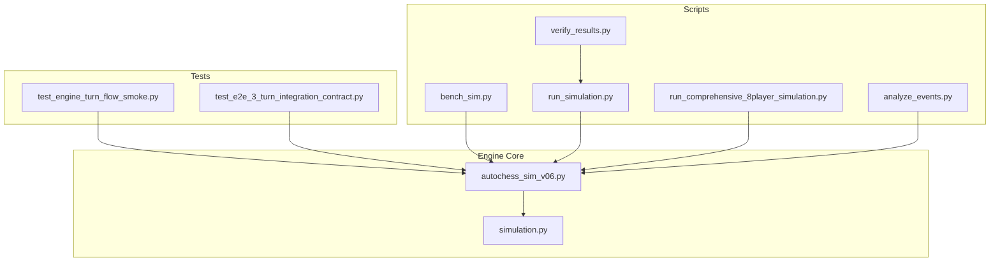
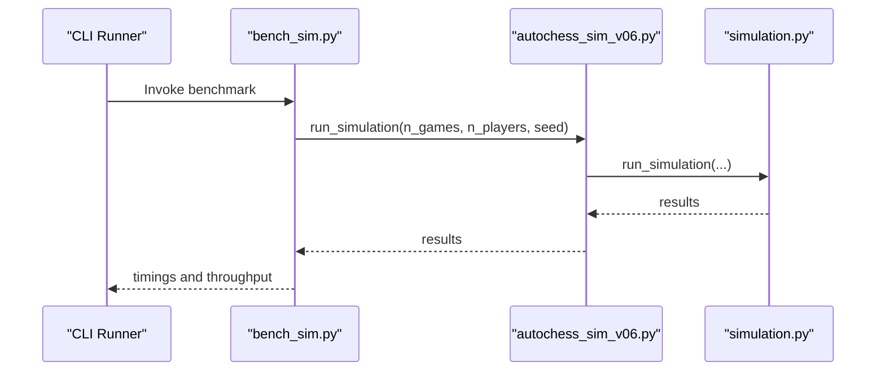
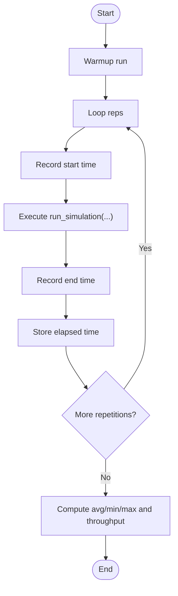
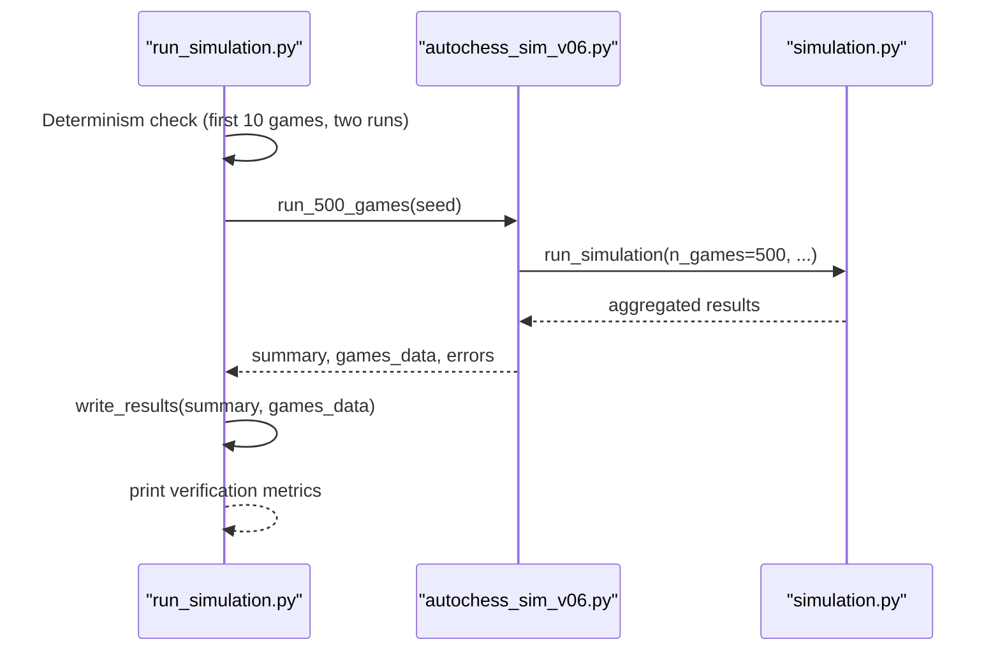
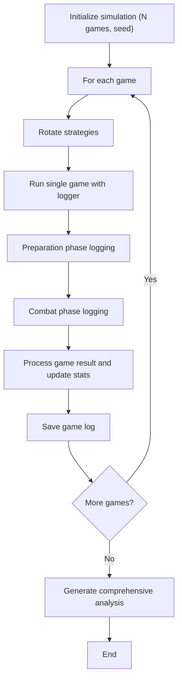
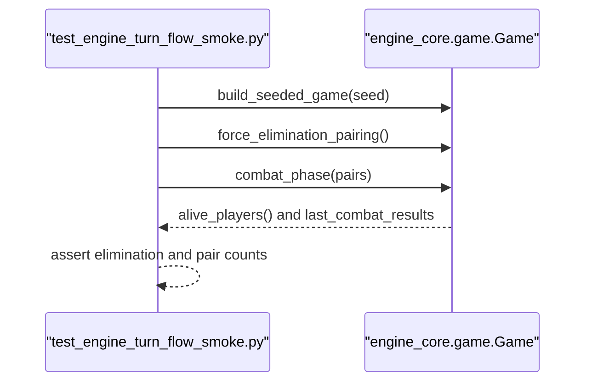
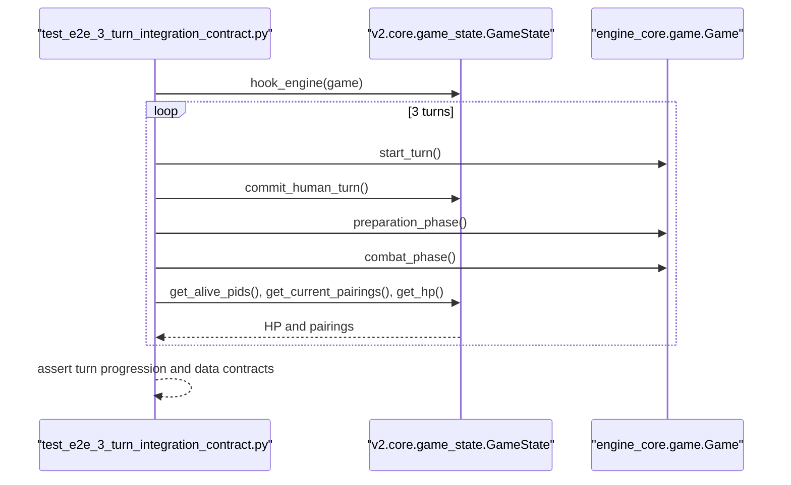
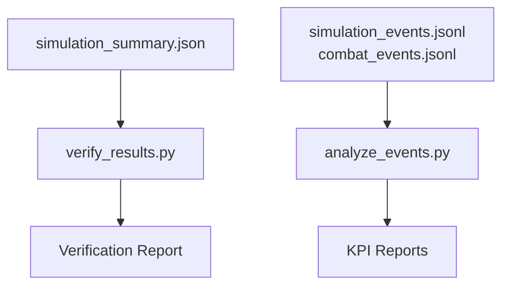
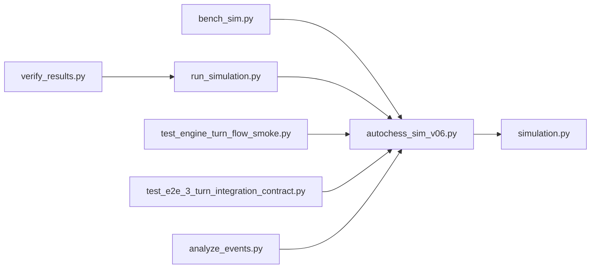

# Performance Testing

<cite>
**Referenced Files in This Document**
- [bench_sim.py](file://scripts/simulation/bench_sim.py)
- [run_simulation.py](file://scripts/simulation/run_simulation.py)
- [autochess_sim_v06.py](file://engine_core/autochess_sim_v06.py)
- [simulation.py](file://engine_core/simulation.py)
- [run_comprehensive_8player_simulation.py](file://tools/run_comprehensive_8player_simulation.py)
- [test_engine_turn_flow_smoke.py](file://tests/test_engine_turn_flow_smoke.py)
- [test_e2e_3_turn_integration_contract.py](file://tests/test_e2e_3_turn_integration_contract.py)
- [verify_results.py](file://scripts/validation/verify_results.py)
- [analyze_events.py](file://scripts/analysis/analyze_events.py)
- [implementation_plan_v2.md](file://implementation_plan_v2.md)
- [conftest.py](file://tests/conftest.py)
</cite>

## Table of Contents
1. [Introduction](#introduction)
2. [Project Structure](#project-structure)
3. [Core Components](#core-components)
4. [Architecture Overview](#architecture-overview)
5. [Detailed Component Analysis](#detailed-component-analysis)
6. [Dependency Analysis](#dependency-analysis)
7. [Performance Considerations](#performance-considerations)
8. [Troubleshooting Guide](#troubleshooting-guide)
9. [Conclusion](#conclusion)
10. [Appendices](#appendices)

## Introduction
This document defines performance testing procedures for the Autochess Hybrid simulation engine. It covers smoke testing for turn flow validation, integration testing for complex scenarios, the 8-player simulation framework, benchmarking and load testing methodologies, automated validation workflows, regression testing for performance metrics, optimization validation, profiling techniques, memory usage testing, and concurrent simulation validation for multi-strategy AI testing. Practical examples show how to execute tests, interpret results, and identify bottlenecks.

## Project Structure
The performance testing stack centers around:
- Simulation runners that execute many games under deterministic seeds and collect metrics
- Turn-flow smoke tests and end-to-end integration tests that validate engine correctness under performance-sensitive conditions
- Tools that generate comprehensive reports and event logs for deeper analysis
- Automated verification scripts that confirm requirements are met

**Diagram sources**
- [bench_sim.py:1-24](file://scripts/simulation/bench_sim.py#L1-L24)
- [run_simulation.py:1-269](file://scripts/simulation/run_simulation.py#L1-L269)
- [run_comprehensive_8player_simulation.py:1-548](file://tools/run_comprehensive_8player_simulation.py#L1-L548)
- [autochess_sim_v06.py:1-107](file://engine_core/autochess_sim_v06.py#L1-L107)
- [simulation.py:1-284](file://engine_core/simulation.py#L1-L284)
- [test_engine_turn_flow_smoke.py:1-136](file://tests/test_engine_turn_flow_smoke.py#L1-L136)
- [test_e2e_3_turn_integration_contract.py:1-124](file://tests/test_e2e_3_turn_integration_contract.py#L1-L124)
- [verify_results.py:1-30](file://scripts/validation/verify_results.py#L1-L30)
- [analyze_events.py:1-253](file://scripts/analysis/analyze_events.py#L1-L253)

**Section sources**
- [bench_sim.py:1-24](file://scripts/simulation/bench_sim.py#L1-L24)
- [run_simulation.py:1-269](file://scripts/simulation/run_simulation.py#L1-L269)
- [autochess_sim_v06.py:1-107](file://engine_core/autochess_sim_v06.py#L1-L107)
- [simulation.py:1-284](file://engine_core/simulation.py#L1-L284)
- [run_comprehensive_8player_simulation.py:1-548](file://tools/run_comprehensive_8player_simulation.py#L1-L548)
- [test_engine_turn_flow_smoke.py:1-136](file://tests/test_engine_turn_flow_smoke.py#L1-L136)
- [test_e2e_3_turn_integration_contract.py:1-124](file://tests/test_e2e_3_turn_integration_contract.py#L1-L124)
- [verify_results.py:1-30](file://scripts/validation/verify_results.py#L1-L30)
- [analyze_events.py:1-253](file://scripts/analysis/analyze_events.py#L1-L253)

## Core Components
- Benchmarking runner: Executes repeated simulations to measure throughput and timing
- Reliability and metrics runner: Runs a fixed number of games, collects per-game and aggregated metrics, and validates determinism
- 8-player comprehensive simulation: Full logging and analysis pipeline for multi-strategy AI
- Turn-flow smoke tests: Validates engine state transitions and pairings under stress
- Integration tests: Ensures end-to-end turn loop stability and data contracts
- Validation and analysis: Automated verification of outputs and event log KPI extraction

**Section sources**
- [bench_sim.py:1-24](file://scripts/simulation/bench_sim.py#L1-L24)
- [run_simulation.py:1-269](file://scripts/simulation/run_simulation.py#L1-L269)
- [run_comprehensive_8player_simulation.py:1-548](file://tools/run_comprehensive_8player_simulation.py#L1-L548)
- [test_engine_turn_flow_smoke.py:1-136](file://tests/test_engine_turn_flow_smoke.py#L1-L136)
- [test_e2e_3_turn_integration_contract.py:1-124](file://tests/test_e2e_3_turn_integration_contract.py#L1-L124)
- [verify_results.py:1-30](file://scripts/validation/verify_results.py#L1-L30)
- [analyze_events.py:1-253](file://scripts/analysis/analyze_events.py#L1-L253)

## Architecture Overview
The performance testing architecture ties together deterministic simulation runs, engine-level turn flow validation, and post-run analysis.

**Diagram sources**
- [bench_sim.py:1-24](file://scripts/simulation/bench_sim.py#L1-L24)
- [autochess_sim_v06.py:78-107](file://engine_core/autochess_sim_v06.py#L78-L107)
- [simulation.py:113-218](file://engine_core/simulation.py#L113-L218)

## Detailed Component Analysis

### Benchmarking Runner (bench_sim.py)
- Purpose: Repeatedly run a fixed-size simulation to compute average/min/max runtime and games-per-second
- Methodology: Warm-up run, multiple timed runs, averaging across repetitions
- Outputs: Average time, min/max time, throughput in games/sec

**Diagram sources**
- [bench_sim.py:1-24](file://scripts/simulation/bench_sim.py#L1-L24)
- [autochess_sim_v06.py:99-106](file://engine_core/autochess_sim_v06.py#L99-L106)
- [simulation.py:113-218](file://engine_core/simulation.py#L113-L218)

**Section sources**
- [bench_sim.py:1-24](file://scripts/simulation/bench_sim.py#L1-L24)

### Reliability and Metrics Runner (run_simulation.py)
- Purpose: Execute a fixed number of games (e.g., 500), collect per-game and aggregated metrics, enforce determinism, and produce structured outputs
- Determinism: Runs a small subset twice with identical seeds and compares outcomes
- Metrics: Runtime, games/sec, average/median/fastest/longest game length, strategy win rates, economy indicators, and error tracking
- Outputs: Summary JSON, per-game CSV, and error logs

**Diagram sources**
- [run_simulation.py:34-268](file://scripts/simulation/run_simulation.py#L34-L268)
- [autochess_sim_v06.py:99-106](file://engine_core/autochess_sim_v06.py#L99-L106)
- [simulation.py:113-218](file://engine_core/simulation.py#L113-L218)

**Section sources**
- [run_simulation.py:1-269](file://scripts/simulation/run_simulation.py#L1-L269)

### 8-Player Comprehensive Simulation (run_comprehensive_8player_simulation.py)
- Purpose: Run a large-scale simulation with 8 players per game, full chronological logging, and comprehensive analysis
- Features: Deterministic seeds per game, rotation of strategies to avoid positional bias, detailed per-action logging, and multi-report generation (strategy, card, economy, meta, balance recommendations, executive summary)
- Outputs: Game results JSON, strategy and card analysis text files, economy and meta analysis, balance recommendations, and executive summary

**Diagram sources**
- [run_comprehensive_8player_simulation.py:78-300](file://tools/run_comprehensive_8player_simulation.py#L78-L300)
- [run_comprehensive_8player_simulation.py:302-501](file://tools/run_comprehensive_8player_simulation.py#L302-L501)

**Section sources**
- [run_comprehensive_8player_simulation.py:1-548](file://tools/run_comprehensive_8player_simulation.py#L1-L548)

### Turn-Flow Smoke Tests (test_engine_turn_flow_smoke.py)
- Purpose: Validate engine turn flow correctness under deterministic fixtures and minimal randomness
- Coverage: Elimination propagation, alive filters, and single-winner assertion within a bounded number of turns
- Determinism: Uses seeded RNG and controlled player HP fixtures

**Diagram sources**
- [test_engine_turn_flow_smoke.py:13-115](file://tests/test_engine_turn_flow_smoke.py#L13-L115)

**Section sources**
- [test_engine_turn_flow_smoke.py:1-136](file://tests/test_engine_turn_flow_smoke.py#L1-L136)

### End-to-End Integration Tests (test_e2e_3_turn_integration_contract.py)
- Purpose: Validate end-to-end turn loop stability and data contracts across preparation and combat phases
- Coverage: Turn incrementing, pairings freezing within a turn, HP synchronization, and combat result shape validation
- Determinism: Uses seeded RNG and explicit fixture strategies

**Diagram sources**
- [test_e2e_3_turn_integration_contract.py:12-124](file://tests/test_e2e_3_turn_integration_contract.py#L12-L124)

**Section sources**
- [test_e2e_3_turn_integration_contract.py:1-124](file://tests/test_e2e_3_turn_integration_contract.py#L1-L124)

### Automated Validation and Reporting
- Verification script reads the summary JSON produced by the metrics runner and prints a verification report
- Event log analyzer consumes event streams to produce KPI reports for shop-to-board conversion, combat stats, synergy triggers, and passive triggers

**Diagram sources**
- [verify_results.py:1-30](file://scripts/validation/verify_results.py#L1-L30)
- [analyze_events.py:140-248](file://scripts/analysis/analyze_events.py#L140-L248)

**Section sources**
- [verify_results.py:1-30](file://scripts/validation/verify_results.py#L1-L30)
- [analyze_events.py:1-253](file://scripts/analysis/analyze_events.py#L1-L253)

## Dependency Analysis
- The benchmark and metrics runners depend on the engine’s simulation entry point
- Turn-flow smoke tests and integration tests depend on the real engine to validate contracts
- Validation and analysis scripts depend on outputs produced by the runners

**Diagram sources**
- [bench_sim.py:1-24](file://scripts/simulation/bench_sim.py#L1-L24)
- [run_simulation.py:1-269](file://scripts/simulation/run_simulation.py#L1-L269)
- [autochess_sim_v06.py:78-107](file://engine_core/autochess_sim_v06.py#L78-L107)
- [simulation.py:113-218](file://engine_core/simulation.py#L113-L218)
- [test_engine_turn_flow_smoke.py:1-136](file://tests/test_engine_turn_flow_smoke.py#L1-L136)
- [test_e2e_3_turn_integration_contract.py:1-124](file://tests/test_e2e_3_turn_integration_contract.py#L1-L124)
- [verify_results.py:1-30](file://scripts/validation/verify_results.py#L1-L30)
- [analyze_events.py:1-253](file://scripts/analysis/analyze_events.py#L1-L253)

**Section sources**
- [implementation_plan_v2.md:954-1339](file://implementation_plan_v2.md#L954-L1339)
- [conftest.py:1-26](file://tests/conftest.py#L1-L26)

## Performance Considerations
- Determinism: Use fixed seeds and deterministic fixtures to eliminate noise in measurements
- Warm-up: Perform a warm-up run before timing loops to account for JIT or cache effects
- Repetitions: Average multiple runs to reduce variance; track min/max to detect outliers
- Output volume: Large-scale simulations (e.g., 2000 games) generate substantial logs; ensure disk I/O is considered in throughput calculations
- Memory: Monitor growth during long-running simulations; consider periodic flushing and log rotation
- Concurrency: When validating multi-strategy AI, ensure strategy execution remains deterministic and isolated

[No sources needed since this section provides general guidance]

## Troubleshooting Guide
- Determinism failures: If the determinism check detects mismatches, inspect RNG seeding and ensure no external randomness leaks into the game state
- Excessive runtime: Review logs for pathological loops or infinite retries; validate turn progression assertions
- Output validation: Use the verification script to confirm required metrics and outputs are present and correct
- Event log analysis: If event logs are missing, enable detailed logging and rerun; use the event analyzer to produce KPI reports

**Section sources**
- [run_simulation.py:34-62](file://scripts/simulation/run_simulation.py#L34-L62)
- [verify_results.py:1-30](file://scripts/validation/verify_results.py#L1-L30)
- [analyze_events.py:231-248](file://scripts/analysis/analyze_events.py#L231-L248)

## Conclusion
The performance testing suite combines deterministic simulation runs, turn-flow smoke tests, and comprehensive analysis to validate engine stability, throughput, and correctness. By leveraging benchmarking, reliability runs, and detailed reporting, teams can automate performance validation, regressions, and optimization validation for the Autochess Hybrid simulation engine.

[No sources needed since this section summarizes without analyzing specific files]

## Appendices

### Practical Execution Examples
- Benchmarking: Run the benchmark script to compute average time and throughput for a fixed simulation size
  - Example command: [bench_sim.py:1-24](file://scripts/simulation/bench_sim.py#L1-L24)
- Reliability and metrics: Execute the metrics runner to run a fixed number of games, collect metrics, and produce outputs
  - Example command: [run_simulation.py:229-268](file://scripts/simulation/run_simulation.py#L229-L268)
- 8-player simulation: Run the comprehensive simulation to generate extensive logs and analysis
  - Example command: [run_comprehensive_8player_simulation.py:503-548](file://tools/run_comprehensive_8player_simulation.py#L503-L548)
- Turn-flow smoke test: Execute the smoke test to validate elimination and pairing logic
  - Example command: [test_engine_turn_flow_smoke.py:1-136](file://tests/test_engine_turn_flow_smoke.py#L1-L136)
- Integration test: Execute the integration test to validate end-to-end turn loop stability
  - Example command: [test_e2e_3_turn_integration_contract.py:1-124](file://tests/test_e2e_3_turn_integration_contract.py#L1-L124)
- Automated verification: Run the verification script to validate outputs
  - Example command: [verify_results.py:1-30](file://scripts/validation/verify_results.py#L1-L30)
- Event log analysis: Run the analyzer to produce KPI reports from event logs
  - Example command: [analyze_events.py:250-253](file://scripts/analysis/analyze_events.py#L250-L253)

### Result Interpretation and Bottleneck Identification
- Throughput: games/sec indicates engine efficiency; drops suggest CPU-bound or memory pressure
- Determinism: mismatches imply non-deterministic state updates or external randomness
- Logs: excessive I/O or slow disk can inflate runtime; monitor log sizes and flush intervals
- KPIs: low shop-to-board conversion or high combat durations may indicate AI inefficiencies or balancing issues

[No sources needed since this section provides general guidance]

### Automated Performance Validation Workflows
- Pre-merge gate: Run smoke and integration tests against the real engine to prevent regressions
- Nightly runs: Execute the metrics runner and 8-player simulation to track performance trends
- Regression alerts: Compare games/sec and runtime deltas against baselines; alert on significant deviations

**Section sources**
- [implementation_plan_v2.md:954-1339](file://implementation_plan_v2.md#L954-L1339)
- [conftest.py:1-26](file://tests/conftest.py#L1-L26)

### Optimization Validation Procedures
- Warm-up and repeat: Use the benchmark runner to validate improvements after code changes
- Baseline comparison: Store previous metrics and compare averages and variances
- Profiling: Use Python profiling tools to identify hotspots; focus on combat phase and board operations

[No sources needed since this section provides general guidance]

### Performance Profiling Techniques
- CPU profiling: Measure function-level time consumption during combat and preparation phases
- Memory profiling: Track allocations during long simulations; watch for leaks or excessive caching
- I/O profiling: Monitor log writes and CSV exports; consider batching or compression

[No sources needed since this section provides general guidance]

### Concurrent Simulation Validation for Multi-Strategy AI
- Strategy rotation: Ensure strategies are rotated to avoid positional bias and evenly distribute load
- Deterministic seeds: Use per-game seeds to maintain reproducibility across concurrent runs
- Resource isolation: Limit concurrency to avoid contention; validate with smaller batches first

[No sources needed since this section provides general guidance]