# Testing Framework

<cite>
**Referenced Files in This Document**
- [pytest.ini](file://pytest.ini)
- [conftest.py](file://tests/conftest.py)
- [test_combat_engine_contract.py](file://tests/test_combat_engine_contract.py)
- [test_engine_core_contracts.py](file://tests/test_engine_core_contracts.py)
- [test_engine_mock.py](file://tests/test_engine_mock.py)
- [engine_mock.py](file://v2/mock/engine_mock.py)
- [test_e2e_3_turn_integration_contract.py](file://tests/test_e2e_3_turn_integration_contract.py)
- [test_synergy_single_source_contract.py](file://tests/test_synergy_single_source_contract.py)
- [test_turn_manager_contract.py](file://tests/test_turn_manager_contract.py)
- [test_engine_bridge_contracts.py](file://tests/test_engine_bridge_contracts.py)
- [test_shop_scene_integration.py](file://tests/test_shop_scene_integration.py)
- [test_c5_error_handling_safety_net.py](file://tests/test_c5_error_handling_safety_net.py)
- [test_player_cards_bought_single_source.py](file://tests/test_player_cards_bought_single_source.py)
- [test_refactor_safety_net_c1_c2_c4.py](file://tests/test_refactor_safety_net_c1_c2_c4.py)
- [test_engine_turn_flow_smoke.py](file://tests/test_engine_turn_flow_smoke.py)
- [test_spectate_tdd.py](file://tests/test_spectate_tdd.py)
- [test_engine_board_market.py](file://tests/test_engine_board_market.py)
- [test_engine_combat_contract.py](file://tests/test_engine_combat_contract.py)
- [test_game_state_engine_contract.py](file://tests/test_game_state_engine_contract.py)
- [test_phase5_integration.py](file://tests/test_phase5_integration.py)
</cite>

## Update Summary
**Changes Made**
- Added comprehensive error handling validation tests covering invalid player reads, mutation failures, and graceful error handling
- Expanded player data synchronization tests validating single-source consistency and property synchronization
- Enhanced refactor safety net tests with C1, C2, and C4 validation patterns for board state, synergy parity, and legacy assignment sync
- Added smoke tests for engine turn flow including elimination logic and game completion
- Included spectator mode TDD tests validating view switching and action gating security
- Expanded board and market contract tests with damage calculation, combo detection, and rarity weight validation
- Added phase 5 integration tests validating split-turn architecture and state synchronization

## Table of Contents
1. [Introduction](#introduction)
2. [Project Structure](#project-structure)
3. [Core Components](#core-components)
4. [Architecture Overview](#architecture-overview)
5. [Detailed Component Analysis](#detailed-component-analysis)
6. [Expanded Test Coverage Areas](#expanded-test-coverage-areas)
7. [Dependency Analysis](#dependency-analysis)
8. [Performance Considerations](#performance-considerations)
9. [Troubleshooting Guide](#troubleshooting-guide)
10. [Conclusion](#conclusion)

## Introduction
This document explains the pytest-based testing infrastructure used across the project, now expanded with comprehensive validation patterns and contract testing approaches. The framework covers fixture configuration, environment isolation, headless testing setup, and robust contract testing that ensures system stability and correctness across multiple validation domains including error handling, player data synchronization, and refactor safety nets.

## Project Structure
The testing system centers around pytest with a dedicated configuration and an extensive suite of contract, integration, and validation tests organized across multiple specialized categories:
- pytest configuration defines the test discovery path and custom markers for known bug documentation
- A session-scoped fixture initializes a headless Pygame environment to avoid hardware dependencies
- Tests are organized by functional validation areas: engine contracts, turn manager contracts, UI integration, mock-based contracts, error handling safety nets, and refactor safety validations

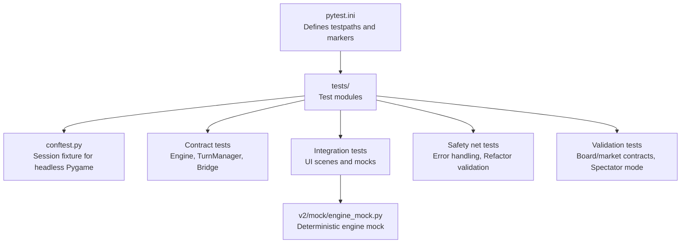

**Diagram sources**
- [pytest.ini:1-5](file://pytest.ini#L1-L5)
- [conftest.py:1-27](file://tests/conftest.py#L1-L27)
- [engine_mock.py:1-173](file://v2/mock/engine_mock.py#L1-L173)

**Section sources**
- [pytest.ini:1-5](file://pytest.ini#L1-L5)
- [conftest.py:1-27](file://tests/conftest.py#L1-L27)

## Core Components
- Headless Pygame initialization: Ensures tests run without a physical display by setting SDL_VIDEODRIVER to a dummy backend and initializing a minimal hidden surface. This prevents hardware-dependent failures and enables CI compatibility.
- Environment isolation: Hard-coded environment variables are set at session scope to neutralize local overrides and prevent state leakage from the host environment into tests.
- Comprehensive contract tests: Validate invariants across engine subsystems, ensuring that behavior remains consistent as the codebase evolves.
- Robust error handling validation: Systematically test error conditions, graceful degradation, and crash prevention mechanisms.
- Player data synchronization validation: Ensure single-source consistency across engine and UI layers.
- Deterministic mock-based engine: Provides controlled scenarios for UI and integration tests without relying on the full engine stack.

Key fixture and configuration responsibilities:
- Session-scoped autouse fixture initializes and tears down the headless environment
- Per-test fixtures reset stateful singletons and databases to maintain isolation
- Specialized fixtures handle mock engine initialization and state cleanup

**Section sources**
- [conftest.py:15-26](file://tests/conftest.py#L15-L26)

## Architecture Overview
The testing architecture has evolved to support multiple validation domains while maintaining separation of concerns between:
- Engine contracts: Validate engine behavior invariants and cross-module interactions
- Turn manager contracts: Validate turn lifecycle and delegation boundaries
- Bridge contracts: Validate Game-to-TurnManager delegation and synchronization
- UI integration: Validate UI scenes with deterministic mocks and asset loaders
- Error handling safety nets: Validate graceful error handling and crash prevention
- Refactor safety validations: Ensure backward compatibility during architectural changes
- Spectator mode validation: Test view switching and access control mechanisms
- Board/market contracts: Validate game mechanics and mathematical correctness

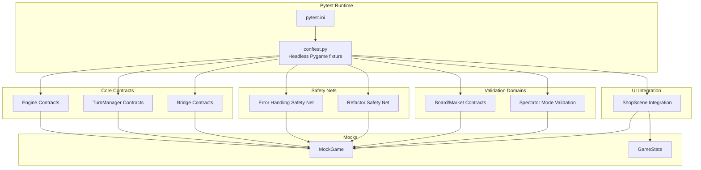

**Diagram sources**
- [pytest.ini:1-5](file://pytest.ini#L1-L5)
- [conftest.py:15-26](file://tests/conftest.py#L15-L26)
- [test_c5_error_handling_safety_net.py:1-73](file://tests/test_c5_error_handling_safety_net.py#L1-L73)
- [test_refactor_safety_net_c1_c2_c4.py:1-126](file://tests/test_refactor_safety_net_c1_c2_c4.py#L1-L126)
- [test_spectate_tdd.py:1-53](file://tests/test_spectate_tdd.py#L1-L53)
- [test_engine_board_market.py:1-142](file://tests/test_engine_board_market.py#L1-L142)
- [engine_mock.py:61-173](file://v2/mock/engine_mock.py#L61-L173)

## Detailed Component Analysis

### Headless Pygame Fixture
Purpose:
- Initialize a dummy video driver and a minimal hidden display to satisfy Pygame's rendering requirements without a physical monitor
- Ensure AssetLoader and related UI code can operate in CI and headless environments

Behavior:
- Sets SDL_VIDEODRIVER to a dummy backend
- Initializes Pygame and creates a tiny hidden surface
- Yields control to tests; cleans up after the session

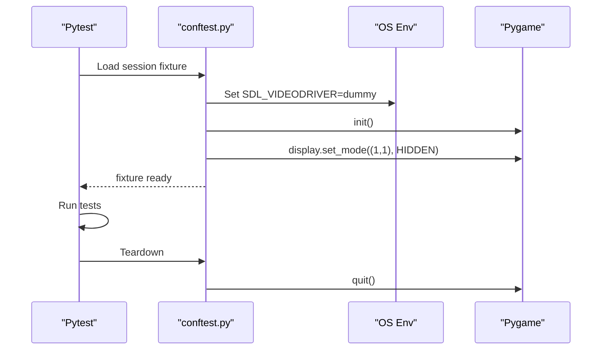

**Diagram sources**
- [conftest.py:15-26](file://tests/conftest.py#L15-L26)

**Section sources**
- [conftest.py:15-26](file://tests/conftest.py#L15-L26)

### Environment Isolation and State Leak Protection
Scope:
- Session-level environment variables override host-specific settings to prevent accidental state leakage from .env or local configs

Mechanism:
- Hard-coded values for debug mode, vsync, and fps are applied at import time, before any other test code runs

Impact:
- Tests remain deterministic across machines and CI runners
- Reduces flakiness caused by differing graphics or audio settings

**Section sources**
- [conftest.py:8-11](file://tests/conftest.py#L8-L11)

### Contract Testing Approach
Contract tests enforce behavioral guarantees and cross-module invariants. They are structured to:
- Define required interfaces and outputs
- Validate deterministic behavior under controlled conditions
- Protect against regressions during refactors

Representative contracts:
- Engine contracts: Validate CombatEngine instantiation, output format, and delegation behavior
- TurnManager contracts: Validate lifecycle transitions, pair generation, and state invariants
- Bridge contracts: Validate Game-to-TurnManager delegation and synchronization
- Single-source contracts: Validate engine/UI parity for synergy calculations
- Integration contracts: Validate end-to-end turn flow and state synchronization

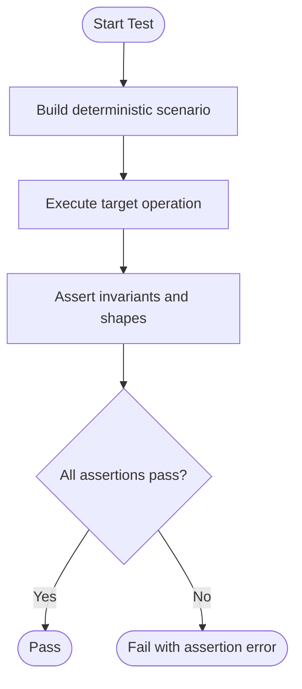

**Section sources**
- [test_combat_engine_contract.py:1-355](file://tests/test_combat_engine_contract.py#L1-L355)
- [test_turn_manager_contract.py:1-418](file://tests/test_turn_manager_contract.py#L1-L418)
- [test_engine_bridge_contracts.py:1-403](file://tests/test_engine_bridge_contracts.py#L1-L403)
- [test_synergy_single_source_contract.py:1-75](file://tests/test_synergy_single_source_contract.py#L1-L75)
- [test_e2e_3_turn_integration_contract.py:1-124](file://tests/test_e2e_3_turn_integration_contract.py#L1-L124)

### Enhanced Error Handling Validation
The expanded error handling safety net validates systematic failure modes and graceful degradation:
- Invalid player reads return safe defaults instead of crashing
- Mutation operations fail with explicit error results rather than exceptions
- Missing components are handled gracefully with shim implementations
- Invalid indices return appropriate error codes

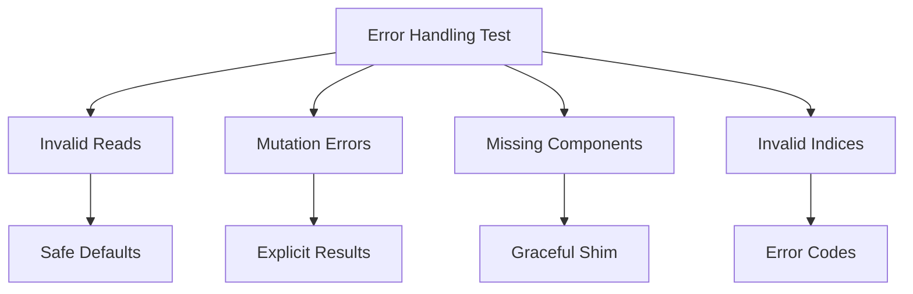

**Diagram sources**
- [test_c5_error_handling_safety_net.py:27-73](file://tests/test_c5_error_handling_safety_net.py#L27-L73)

**Section sources**
- [test_c5_error_handling_safety_net.py:1-73](file://tests/test_c5_error_handling_safety_net.py#L1-L73)

### Player Data Synchronization Validation
Tests ensure single-source consistency across engine and UI layers:
- Cards bought counter maintains synchronization between internal state and stats dictionary
- Property setters update both internal state and statistics consistently
- Legacy assignment patterns preserve single-source integrity during income resets

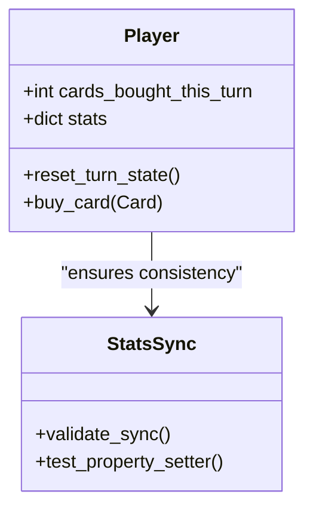

**Diagram sources**
- [test_player_cards_bought_single_source.py:21-42](file://tests/test_player_cards_bought_single_source.py#L21-L42)

**Section sources**
- [test_player_cards_bought_single_source.py:1-42](file://tests/test_player_cards_bought_single_source.py#L1-L42)

### Refactor Safety Net Patterns
C1, C2, and C4 validation patterns ensure architectural changes don't break existing functionality:
- C1: Direct board remove invalidation updates public state correctly
- C2: Engine-UI synergy parity validation across multiple board layouts
- C4: Legacy assignment and income reset maintain single-source synchronization

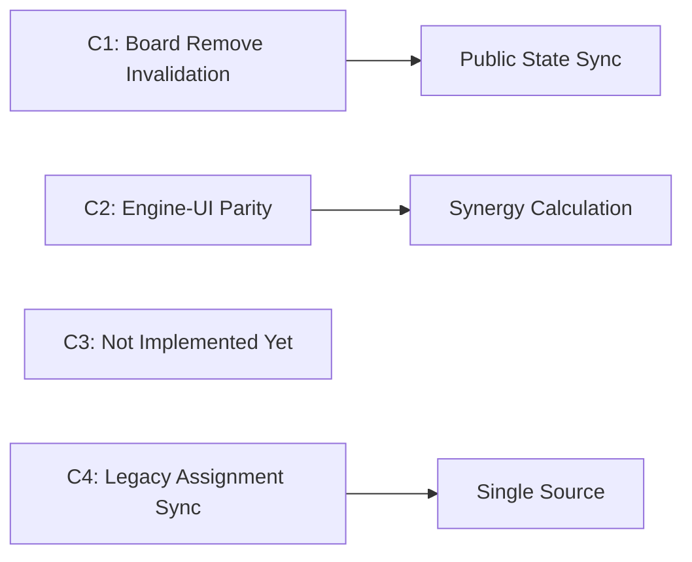

**Diagram sources**
- [test_refactor_safety_net_c1_c2_c4.py:67-126](file://tests/test_refactor_safety_net_c1_c2_c4.py#L67-L126)

**Section sources**
- [test_refactor_safety_net_c1_c2_c4.py:1-126](file://tests/test_refactor_safety_net_c1_c2_c4.py#L1-L126)

### Spectator Mode TDD Validation
Tests validate spectator mode functionality with strict security guarantees:
- View switching accurately reflects data from selected player
- Action gating prevents unauthorized modifications when not viewing own player
- Security model maintains data integrity across view transitions

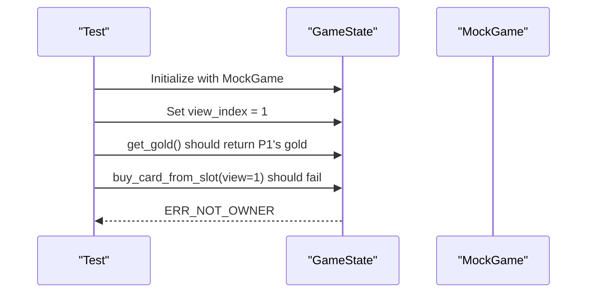

**Diagram sources**
- [test_spectate_tdd.py:15-53](file://tests/test_spectate_tdd.py#L15-L53)

**Section sources**
- [test_spectate_tdd.py:1-53](file://tests/test_spectate_tdd.py#L1-L53)

### Board and Market Contract Validation
Comprehensive validation of game mechanics and mathematical correctness:
- Rarity weight curves match expected turn-based distributions
- Market window deals respect early-game rarity gates
- Board placement and removal maintain coordinate index synchronization
- Combo detection counts unique neighbor pairs correctly
- Damage calculation applies early and late game caps appropriately

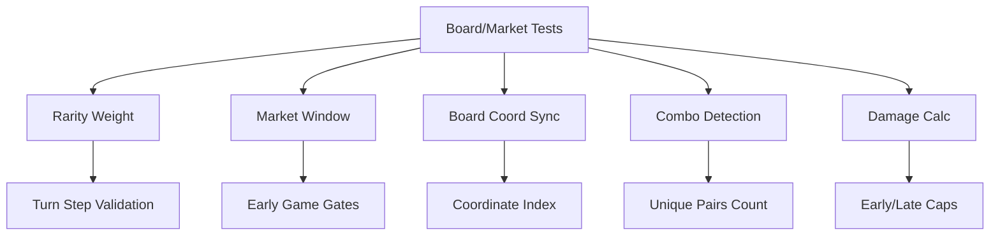

**Diagram sources**
- [test_engine_board_market.py:44-142](file://tests/test_engine_board_market.py#L44-L142)

**Section sources**
- [test_engine_board_market.py:1-142](file://tests/test_engine_board_market.py#L1-L142)

### Mock-Based Engine Contracts
Purpose:
- Provide a deterministic engine substitute for UI and integration tests without requiring the full engine stack
- Enable rapid iteration and visual verification of UI components

Key capabilities:
- Deterministic initial state and player setup
- Shop operations, hand management, and basic combat stubbing
- Stable pair generation and result shaping for UI overlays

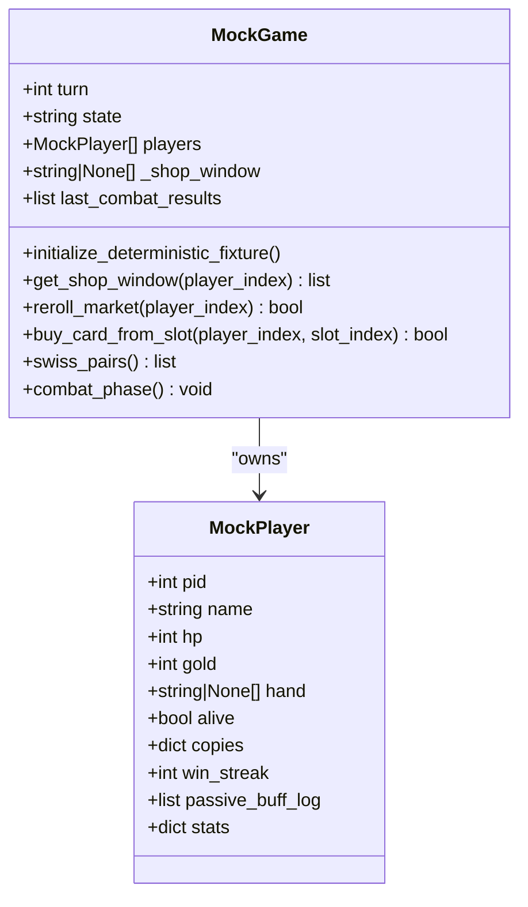

**Diagram sources**
- [engine_mock.py:40-173](file://v2/mock/engine_mock.py#L40-L173)

**Section sources**
- [test_engine_mock.py:1-90](file://tests/test_engine_mock.py#L1-L90)
- [engine_mock.py:61-173](file://v2/mock/engine_mock.py#L61-L173)

### UI Integration and Asset Loading
Purpose:
- Validate UI scenes integrate with GameState and asset loaders without runtime crashes
- Provide manual verification hooks for visual features

Highlights:
- ShopScene asset loading and panel composition checks
- FloatingText spawning and lifecycle
- Evolved card rendering with special effects
- Audio loader preloading and availability

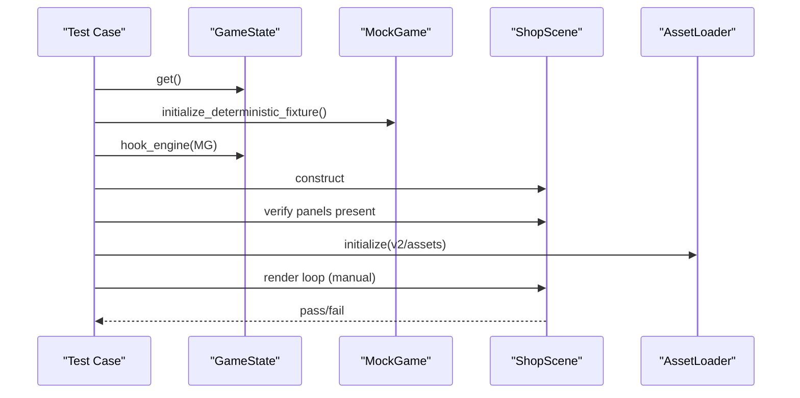

**Diagram sources**
- [test_shop_scene_integration.py:18-163](file://tests/test_shop_scene_integration.py#L18-L163)

**Section sources**
- [test_shop_scene_integration.py:1-163](file://tests/test_shop_scene_integration.py#L1-L163)

## Expanded Test Coverage Areas

### Smoke Testing for Engine Turn Flow
Validates fundamental game mechanics and edge cases:
- Elimination logic removes players from alive filters and cleans up state
- Pair count adjusts correctly after eliminations in subsequent turns
- Game completion reaches single winner within reasonable turn limits
- Elimination order exposure validation (pending Phase 4 bridge implementation)

**Section sources**
- [test_engine_turn_flow_smoke.py:55-136](file://tests/test_engine_turn_flow_smoke.py#L55-L136)

### Phase 5 Integration Validation
Ensures modern architecture compatibility:
- Split-turn architecture validation with proper preparation vs finish distinction
- ShopScene transition to versus phase after commit
- State synchronization pulling HP and gold from real engine
- Mock engine integration with proper method signatures

**Section sources**
- [test_phase5_integration.py:29-91](file://tests/test_phase5_integration.py#L29-L91)

### Enhanced Combat Contract Validation
Extends combat mechanics testing:
- Combat results reset each turn with correct pair counts
- Result snapshot shape validation with expected key sets
- Damage calculation validation following winner state
- Kill bucket composition validation allowing non-kill points

**Section sources**
- [test_engine_combat_contract.py:62-141](file://tests/test_engine_combat_contract.py#L62-L141)

### GameState-Engine Contract Validation
Validates state synchronization and access patterns:
- Real engine accessors expose turn, alive players, and stats correctly
- Turn progression tracking and interest multiplier validation
- Pairing snapshot stability within same turn
- Passive buff log and copy milestone shape stability
- Public state cache invalidation on direct board mutations

**Section sources**
- [test_game_state_engine_contract.py:64-182](file://tests/test_game_state_engine_contract.py#L64-L182)

## Dependency Analysis
The testing suite exhibits clear separation of concerns with expanded validation domains:
- pytest.ini governs discovery and markers
- conftest.py centralizes environment and headless initialization
- Contract tests depend on engine modules and Game abstractions
- Integration tests depend on GameState and mocks
- Safety net tests validate error handling and refactor compatibility
- Validation domain tests cover specialized game mechanics
- Mocks are self-contained and expose deterministic APIs

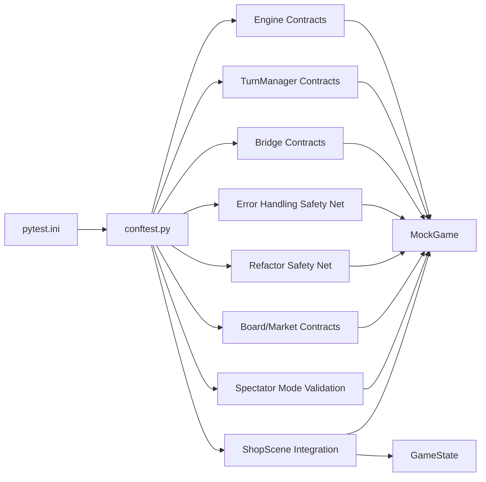

**Diagram sources**
- [pytest.ini:1-5](file://pytest.ini#L1-L5)
- [conftest.py:15-26](file://tests/conftest.py#L15-L26)
- [test_c5_error_handling_safety_net.py:1-73](file://tests/test_c5_error_handling_safety_net.py#L1-L73)
- [test_refactor_safety_net_c1_c2_c4.py:1-126](file://tests/test_refactor_safety_net_c1_c2_c4.py#L1-L126)
- [test_engine_board_market.py:1-142](file://tests/test_engine_board_market.py#L1-L142)
- [engine_mock.py:61-173](file://v2/mock/engine_mock.py#L61-L173)

**Section sources**
- [pytest.ini:1-5](file://pytest.ini#L1-L5)
- [conftest.py:15-26](file://tests/conftest.py#L15-L26)

## Performance Considerations
- Headless rendering avoids GPU overhead and reduces flakiness in CI
- Deterministic mocks minimize IO and network dependencies, speeding up tests
- Fixture reuse (session scope) amortizes setup costs across tests
- Specialized fixtures for mock engines and state cleanup optimize resource usage
- Parameterized tests reduce code duplication while maintaining test coverage
- Prefer small, focused assertions to keep suites fast and maintainable

## Troubleshooting Guide
Common issues and remedies:
- Missing display driver in CI:
  - Ensure the headless fixture runs before any Pygame-dependent code
  - Confirm SDL_VIDEODRIVER is set to dummy and Pygame is initialized before importing UI modules
- State leakage from environment:
  - Verify environment variables are overridden at import time
  - Avoid reading host .env files inside tests; rely on explicit fixtures
- Flaky UI tests:
  - Use deterministic mocks and fixed seeds for RNG
  - Reset singletons and caches via autouse fixtures
- Assertion failures in contract tests:
  - Review required output shapes and keys
  - Validate delegation boundaries and synchronization invariants
- Error handling test failures:
  - Verify error codes match expected ActionResult enums
  - Check that graceful degradation paths are properly implemented
- Spectator mode security violations:
  - Ensure view_index controls access to write operations
  - Validate that ERR_NOT_OWNER is returned for unauthorized actions
- Refactor safety net failures:
  - Confirm single-source consistency between engine and UI states
  - Verify that legacy assignment patterns maintain synchronization

**Section sources**
- [conftest.py:8-26](file://tests/conftest.py#L8-L26)
- [test_c5_error_handling_safety_net.py:27-73](file://tests/test_c5_error_handling_safety_net.py#L27-L73)
- [test_spectate_tdd.py:35-53](file://tests/test_spectate_tdd.py#L35-L53)

## Conclusion
The testing framework leverages pytest with a robust headless setup, comprehensive error handling validation, deterministic mocks, and an extensive suite of contract tests spanning multiple validation domains. The expanded test coverage now includes systematic error handling validation, player data synchronization tests, refactor safety nets, smoke testing for core mechanics, spectator mode validation, and specialized board/market contract testing. These practices ensure reliability across environments, protect invariants during refactors, enable efficient UI integration validation, and provide comprehensive safety nets for architectural changes. By adhering to the fixture scopes, isolation strategies, and expanded validation patterns outlined here, teams can maintain a stable, trustworthy, and thoroughly tested codebase.