# Testing and Quality Assurance

<cite>
**Referenced Files in This Document**
- [pytest.ini](file://pytest.ini)
- [conftest.py](file://tests/conftest.py)
- [test_combat_engine_contract.py](file://tests/test_combat_engine_contract.py)
- [test_engine_core_contracts.py](file://tests/test_engine_core_contracts.py)
- [test_e2e_3_turn_integration_contract.py](file://tests/test_e2e_3_turn_integration_contract.py)
- [test_synergy_single_source_contract.py](file://tests/test_synergy_single_source_contract.py)
- [test_turn_manager_contract.py](file://tests/test_turn_manager_contract.py)
- [test_engine_bridge_contracts.py](file://tests/test_engine_bridge_contracts.py)
- [test_engine_mock.py](file://tests/test_engine_mock.py)
- [test_ghost_and_drag_edge.py](file://tests/test_ghost_and_drag_edge.py)
- [test_edge_cases.py](file://_archive/old_dirs/tests/unit/test_edge_cases.py)
- [test_task_3_1_edge_stats.py](file://archive_legacy/test_task_3_1_edge_stats.py)
- [qa_passive_coverage.py](file://tools/qa_passive_coverage.py)
- [autochess_qa_validation.py](file://_archive/old_dirs/tests/qa/autochess_qa_validation.py)
</cite>

## Table of Contents
1. [Introduction](#introduction)
2. [Project Structure](#project-structure)
3. [Core Components](#core-components)
4. [Architecture Overview](#architecture-overview)
5. [Detailed Component Analysis](#detailed-component-analysis)
6. [Dependency Analysis](#dependency-analysis)
7. [Performance Considerations](#performance-considerations)
8. [Troubleshooting Guide](#troubleshooting-guide)
9. [Conclusion](#conclusion)
10. [Appendices](#appendices)

## Introduction
This document describes the comprehensive testing and quality assurance framework for the project. It covers unit tests, integration tests, contract testing, QA validation, edge case handling, regression strategies, and continuous quality processes. The framework emphasizes “contract testing” to define stable interfaces between engine components and UI, “test coverage” to ensure behavioral guarantees, and “QA validation” to maintain product quality across features and regressions.

## Project Structure
The testing system is organized around pytest with a dedicated test suite under tests/, supporting fixtures, markers, and headless initialization. Legacy and archived tests are preserved for historical regression coverage.

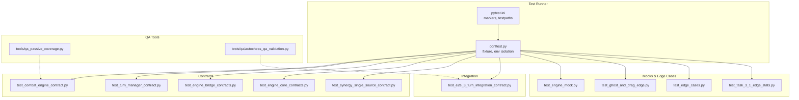

**Diagram sources**
- [pytest.ini:1-5](file://pytest.ini#L1-L5)
- [conftest.py:1-27](file://tests/conftest.py#L1-L27)
- [test_combat_engine_contract.py:1-355](file://tests/test_combat_engine_contract.py#L1-L355)
- [test_turn_manager_contract.py:1-418](file://tests/test_turn_manager_contract.py#L1-L418)
- [test_engine_bridge_contracts.py:1-403](file://tests/test_engine_bridge_contracts.py#L1-L403)
- [test_engine_core_contracts.py:1-314](file://tests/test_engine_core_contracts.py#L1-L314)
- [test_synergy_single_source_contract.py:1-75](file://tests/test_synergy_single_source_contract.py#L1-L75)
- [test_e2e_3_turn_integration_contract.py:1-124](file://tests/test_e2e_3_turn_integration_contract.py#L1-L124)
- [test_engine_mock.py:1-90](file://tests/test_engine_mock.py#L1-L90)
- [test_ghost_and_drag_edge.py](file://tests/test_ghost_and_drag_edge.py)
- [test_edge_cases.py](file://_archive/old_dirs/tests/unit/test_edge_cases.py)
- [test_task_3_1_edge_stats.py](file://archive_legacy/test_task_3_1_edge_stats.py)
- [qa_passive_coverage.py](file://tools/qa_passive_coverage.py)
- [autochess_qa_validation.py](file://_archive/old_dirs/tests/qa/autochess_qa_validation.py)

**Section sources**
- [pytest.ini:1-5](file://pytest.ini#L1-L5)
- [conftest.py:1-27](file://tests/conftest.py#L1-L27)

## Core Components
- Contract tests define stable interfaces between engine subsystems and UI, ensuring behavior invariants across refactor cycles.
- Integration tests validate end-to-end flows and cross-module synchronization.
- Edge case tests capture boundary conditions and UI/UX constraints.
- QA tools automate coverage and validation checks for passive mechanics and broader scenarios.

Key responsibilities:
- Contract testing: engine-core contracts, turn manager contracts, engine-UI synergy contracts, and engine-bridge contracts.
- Integration testing: full 3-turn loop, HP sync, pairings stability, and real engine hooks.
- Edge case validation: drag/drop boundaries, zero/nonzero visibility, clash highlighting, and passive thresholds.
- QA validation: passive coverage reporting and autochess QA validation.

**Section sources**
- [test_combat_engine_contract.py:1-355](file://tests/test_combat_engine_contract.py#L1-L355)
- [test_engine_core_contracts.py:1-314](file://tests/test_engine_core_contracts.py#L1-L314)
- [test_synergy_single_source_contract.py:1-75](file://tests/test_synergy_single_source_contract.py#L1-L75)
- [test_engine_bridge_contracts.py:1-403](file://tests/test_engine_bridge_contracts.py#L1-L403)
- [test_turn_manager_contract.py:1-418](file://tests/test_turn_manager_contract.py#L1-L418)
- [test_e2e_3_turn_integration_contract.py:1-124](file://tests/test_e2e_3_turn_integration_contract.py#L1-L124)
- [test_engine_mock.py:1-90](file://tests/test_engine_mock.py#L1-L90)
- [test_ghost_and_drag_edge.py](file://tests/test_ghost_and_drag_edge.py)
- [test_edge_cases.py](file://_archive/old_dirs/tests/unit/test_edge_cases.py)
- [test_task_3_1_edge_stats.py](file://archive_legacy/test_task_3_1_edge_stats.py)
- [qa_passive_coverage.py](file://tools/qa_passive_coverage.py)
- [autochess_qa_validation.py](file://_archive/old_dirs/tests/qa/autochess_qa_validation.py)

## Architecture Overview
The testing architecture separates concerns into contract-driven unit tests, integration validations, and QA automation. Fixtures isolate environments and enforce deterministic behavior. Markers annotate known bugs for traceability.

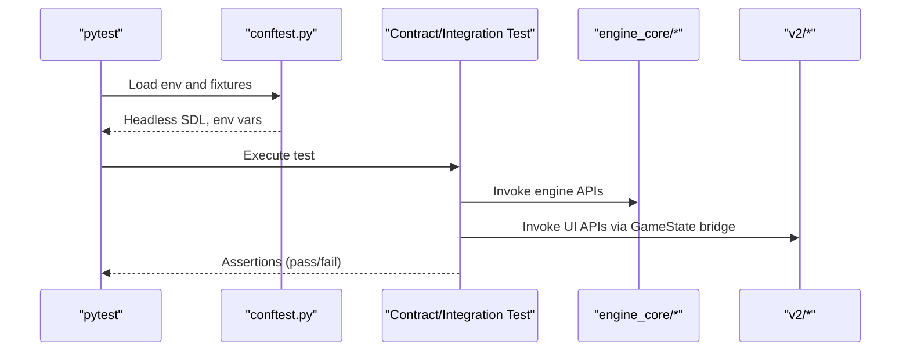

**Diagram sources**
- [conftest.py:15-26](file://tests/conftest.py#L15-L26)
- [test_engine_core_contracts.py:46-54](file://tests/test_engine_core_contracts.py#L46-L54)
- [test_e2e_3_turn_integration_contract.py:26-34](file://tests/test_e2e_3_turn_integration_contract.py#L26-L34)

## Detailed Component Analysis

### Contract Testing: Combat Engine Isolation
Contract tests ensure the CombatEngine is independently instantiable and its outputs match expected formats. They also verify delegation from Game to CombatEngine and synchronization of last combat results.

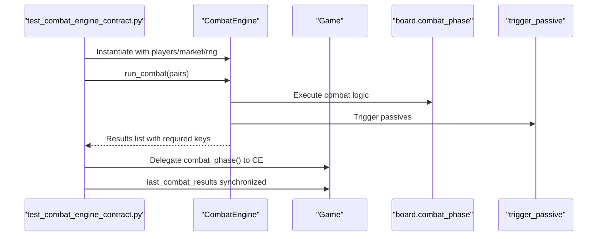

**Diagram sources**
- [test_combat_engine_contract.py:82-105](file://tests/test_combat_engine_contract.py#L82-L105)
- [test_combat_engine_contract.py:249-309](file://tests/test_combat_engine_contract.py#L249-L309)
- [test_combat_engine_contract.py:315-355](file://tests/test_combat_engine_contract.py#L315-L355)

**Section sources**
- [test_combat_engine_contract.py:1-355](file://tests/test_combat_engine_contract.py#L1-L355)

### Contract Testing: Turn Manager Isolation
TurnManager contract tests verify independent instantiation, lifecycle methods, Swiss pairing correctness, and preparation-phase equivalence to start + finish.

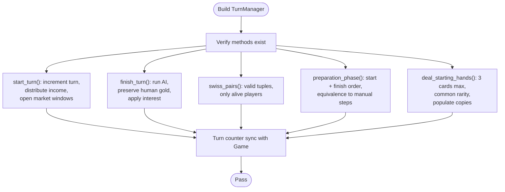

**Diagram sources**
- [test_turn_manager_contract.py:76-117](file://tests/test_turn_manager_contract.py#L76-L117)
- [test_turn_manager_contract.py:123-183](file://tests/test_turn_manager_contract.py#L123-L183)
- [test_turn_manager_contract.py:189-242](file://tests/test_turn_manager_contract.py#L189-L242)
- [test_turn_manager_contract.py:248-307](file://tests/test_turn_manager_contract.py#L248-L307)
- [test_turn_manager_contract.py:313-362](file://tests/test_turn_manager_contract.py#L313-L362)
- [test_turn_manager_contract.py:368-418](file://tests/test_turn_manager_contract.py#L368-L418)

**Section sources**
- [test_turn_manager_contract.py:1-418](file://tests/test_turn_manager_contract.py#L1-L418)

### Contract Testing: Engine-UI Bridge Contracts
Bridge contracts validate that Game delegates to TurnManager and CombatEngine, and that shared state remains consistent across modules.

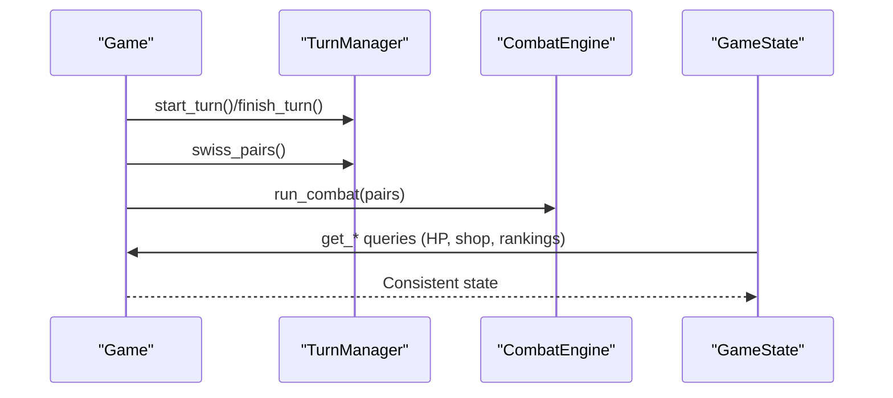

**Diagram sources**
- [test_engine_bridge_contracts.py:49-87](file://tests/test_engine_bridge_contracts.py#L49-L87)
- [test_engine_bridge_contracts.py:96-145](file://tests/test_engine_bridge_contracts.py#L96-L145)
- [test_engine_bridge_contracts.py:154-209](file://tests/test_engine_bridge_contracts.py#L154-L209)
- [test_engine_bridge_contracts.py:221-276](file://tests/test_engine_bridge_contracts.py#L221-L276)
- [test_engine_bridge_contracts.py:313-347](file://tests/test_engine_bridge_contracts.py#L313-L347)
- [test_engine_bridge_contracts.py:359-402](file://tests/test_engine_bridge_contracts.py#L359-L402)

**Section sources**
- [test_engine_bridge_contracts.py:1-403](file://tests/test_engine_bridge_contracts.py#L1-L403)

### Contract Testing: Engine Core Behavior Invariants
Core contracts validate mathematical formulas, deterministic pairings, gold synchronization, and run-loop guards.

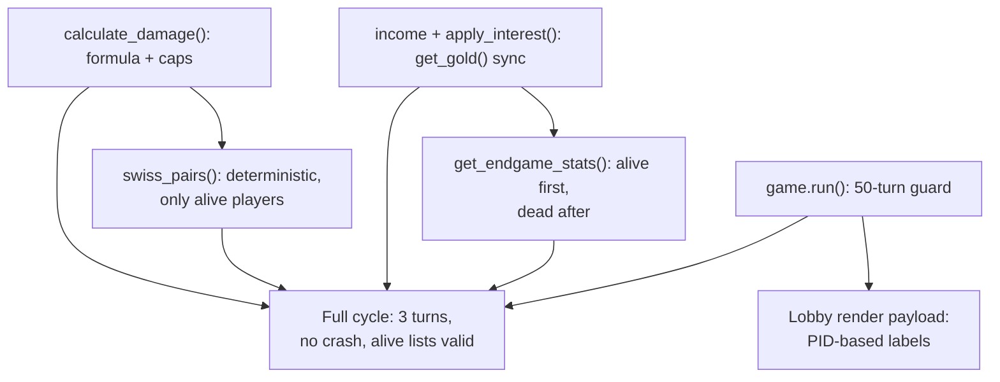

**Diagram sources**
- [test_engine_core_contracts.py:59-100](file://tests/test_engine_core_contracts.py#L59-L100)
- [test_engine_core_contracts.py:138-174](file://tests/test_engine_core_contracts.py#L138-L174)
- [test_engine_core_contracts.py:179-208](file://tests/test_engine_core_contracts.py#L179-L208)
- [test_engine_core_contracts.py:213-249](file://tests/test_engine_core_contracts.py#L213-L249)
- [test_engine_core_contracts.py:254-277](file://tests/test_engine_core_contracts.py#L254-L277)
- [test_engine_core_contracts.py:282-314](file://tests/test_engine_core_contracts.py#L282-L314)
- [test_e2e_3_turn_integration_contract.py:103-124](file://tests/test_e2e_3_turn_integration_contract.py#L103-L124)

**Section sources**
- [test_engine_core_contracts.py:1-314](file://tests/test_engine_core_contracts.py#L1-L314)
- [test_e2e_3_turn_integration_contract.py:1-124](file://tests/test_e2e_3_turn_integration_contract.py#L1-L124)

### Contract Testing: Engine-UI Synergy Score Alignment
Single-source contract ensures engine-side synergy calculation matches UI-side SynergyCalculator for identical board states.

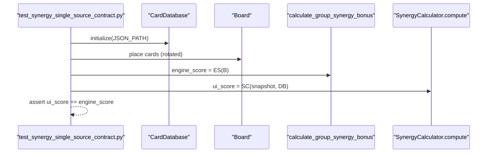

**Diagram sources**
- [test_synergy_single_source_contract.py:45-75](file://tests/test_synergy_single_source_contract.py#L45-L75)

**Section sources**
- [test_synergy_single_source_contract.py:1-75](file://tests/test_synergy_single_source_contract.py#L1-L75)

### Integration Testing: Full 3-Turn Loop and Freeze Guarantees
Integration tests validate end-to-end behavior, including turn increments, pairings stability, HP synchronization, and result shape.

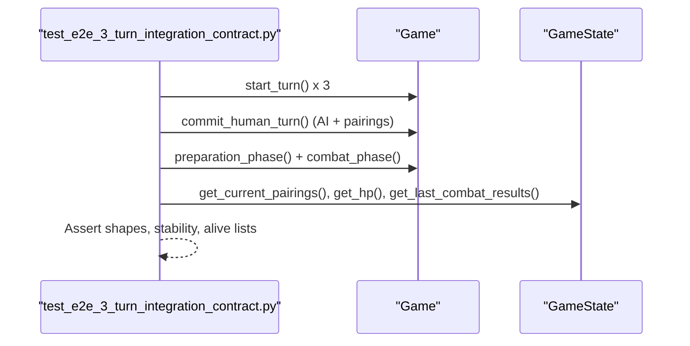

**Diagram sources**
- [test_e2e_3_turn_integration_contract.py:36-59](file://tests/test_e2e_3_turn_integration_contract.py#L36-L59)
- [test_e2e_3_turn_integration_contract.py:61-74](file://tests/test_e2e_3_turn_integration_contract.py#L61-L74)
- [test_e2e_3_turn_integration_contract.py:76-89](file://tests/test_e2e_3_turn_integration_contract.py#L76-L89)
- [test_e2e_3_turn_integration_contract.py:91-101](file://tests/test_e2e_3_turn_integration_contract.py#L91-L101)
- [test_e2e_3_turn_integration_contract.py:103-124](file://tests/test_e2e_3_turn_integration_contract.py#L103-L124)

**Section sources**
- [test_e2e_3_turn_integration_contract.py:1-124](file://tests/test_e2e_3_turn_integration_contract.py#L1-L124)

### Edge Case Validation and Regression Strategies
Edge case tests target UI/UX constraints and boundary behaviors:
- Drag and ghost edge handling
- Visibility rules for zero/nonzero states
- Clash and match highlighting properties
- Passive thresholds and edge statistics

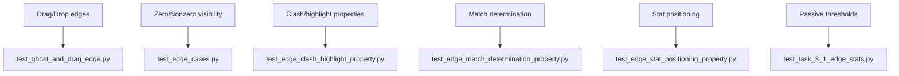

**Diagram sources**
- [test_ghost_and_drag_edge.py](file://tests/test_ghost_and_drag_edge.py)
- [test_edge_cases.py](file://_archive/old_dirs/tests/unit/test_edge_cases.py)
- [test_task_3_1_edge_stats.py](file://archive_legacy/test_task_3_1_edge_stats.py)

**Section sources**
- [test_ghost_and_drag_edge.py](file://tests/test_ghost_and_drag_edge.py)
- [test_edge_cases.py](file://_archive/old_dirs/tests/unit/test_edge_cases.py)
- [test_task_3_1_edge_stats.py](file://archive_legacy/test_task_3_1_edge_stats.py)

### QA Validation and Automated Coverage
QA tools support ongoing validation:
- Passive coverage analyzer to track mechanics coverage
- Autochess QA validation for broader scenario checks

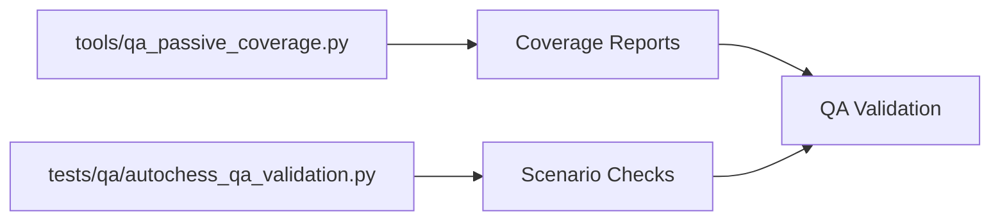

**Diagram sources**
- [qa_passive_coverage.py](file://tools/qa_passive_coverage.py)
- [autochess_qa_validation.py](file://_archive/old_dirs/tests/qa/autochess_qa_validation.py)

**Section sources**
- [qa_passive_coverage.py](file://tools/qa_passive_coverage.py)
- [autochess_qa_validation.py](file://_archive/old_dirs/tests/qa/autochess_qa_validation.py)

## Dependency Analysis
The test suite depends on:
- pytest configuration and fixtures for environment isolation
- engine_core modules for contract and integration tests
- v2 GameState bridge for UI/engine synchronization
- MockGame for controlled deterministic scenarios

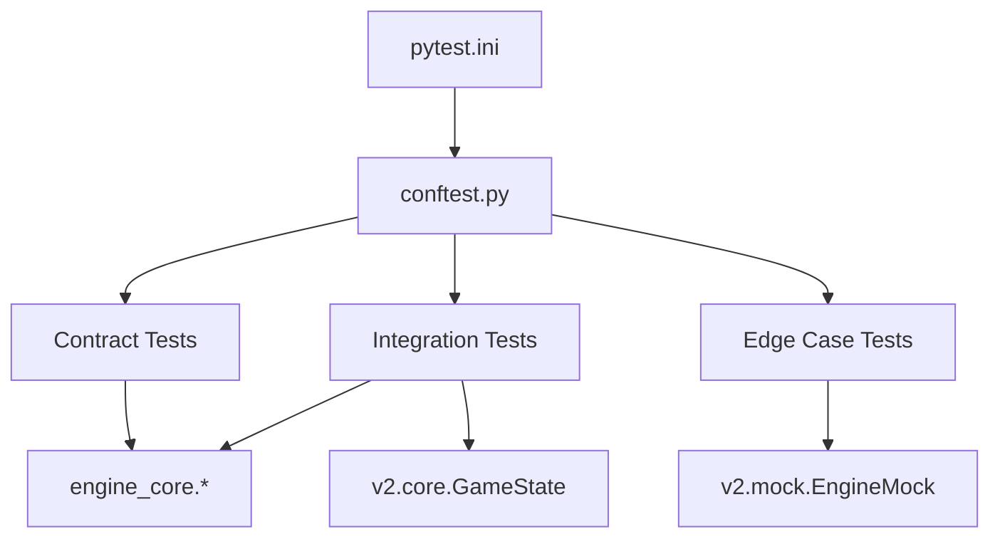

**Diagram sources**
- [pytest.ini:1-5](file://pytest.ini#L1-L5)
- [conftest.py:1-27](file://tests/conftest.py#L1-L27)
- [test_engine_core_contracts.py:20-28](file://tests/test_engine_core_contracts.py#L20-L28)
- [test_e2e_3_turn_integration_contract.py:9-9](file://tests/test_e2e_3_turn_integration_contract.py#L9-L9)
- [test_engine_mock.py](file://tests/test_engine_mock.py#L2)

**Section sources**
- [pytest.ini:1-5](file://pytest.ini#L1-L5)
- [conftest.py:1-27](file://tests/conftest.py#L1-L27)

## Performance Considerations
- Prefer contract tests over heavy integration tests to reduce flakiness and improve speed.
- Use deterministic seeds and mocks to stabilize expensive computations.
- Keep fixtures minimal and scoped to session or module to avoid repeated setup costs.
- Run headless tests to eliminate GPU/CPU contention during CI.

## Troubleshooting Guide
Common issues and resolutions:
- Environment leakage: Ensure headless SDL and environment variables are set via fixtures.
- Known bug markers: Use the known_bug marker to track documented failures and verify fixes.
- Fixture teardown: Verify pygame initialization and cleanup to prevent lingering state.

Practical steps:
- Re-run failing tests in isolation to confirm determinism.
- Temporarily disable markers to reproduce baseline behavior.
- Inspect GameState hooks and engine injection points for synchronization errors.

**Section sources**
- [conftest.py:15-26](file://tests/conftest.py#L15-L26)
- [pytest.ini:3-5](file://pytest.ini#L3-L5)

## Conclusion
The testing and QA framework employs contract testing to safeguard interface stability, integration tests to validate end-to-end flows, and edge case tests to enforce UX constraints. QA tools and markers support long-term maintainability and regression prevention. Adopting these practices ensures robust quality across refactor cycles and continuous delivery.

## Appendices

### Test Execution and Debugging Workflow
- Run all tests: pytest
- Run with markers: pytest -m known_bug
- Run specific contract suites: pytest tests/test_combat_engine_contract.py tests/test_turn_manager_contract.py
- Debug a single test: pytest tests/test_synergy_single_source_contract.py -sv
- Headless mode: rely on conftest fixture for SDL dummy driver

### Continuous Integration Patterns
- Use pytest.ini to define test paths and markers.
- Keep fixtures isolated to avoid cross-test interference.
- Treat contract test failures as blockers to preserve architectural invariants.

### Guidelines for Test Maintenance
- Add new contract tests for each major engine/UI integration point.
- Keep edge case tests focused and deterministic.
- Update QA tools when new mechanics or thresholds are introduced.