# Validation and Verification

<cite>
**Referenced Files in This Document**
- [pytest.ini](file://pytest.ini)
- [conftest.py](file://tests/conftest.py)
- [test_combat_engine_contract.py](file://tests/test_combat_engine_contract.py)
- [test_engine_core_contracts.py](file://tests/test_engine_core_contracts.py)
- [test_engine_combat_contract.py](file://tests/test_engine_combat_contract.py)
- [test_engine_board_market.py](file://tests/test_engine_board_market.py)
- [test_engine_bridge_contracts.py](file://tests/test_engine_bridge_contracts.py)
- [test_engine_mock.py](file://tests/test_engine_mock.py)
- [test_engine_turn_flow_smoke.py](file://tests/test_engine_turn_flow_smoke.py)
- [test_spectate_tdd.py](file://tests/test_spectate_tdd.py)
- [test_refactor_safety_net_c1_c2_c4.py](file://tests/test_refactor_safety_net_c1_c2_c4.py)
- [test_c5_error_handling_safety_net.py](file://tests/test_c5_error_handling_safety_net.py)
- [test_player_cards_bought_single_source.py](file://tests/test_player_cards_bought_single_source.py)
- [test_synergy_single_source_contract.py](file://tests/test_synergy_single_source_contract.py)
- [engine_core/combat_engine.py](file://engine_core/combat_engine.py)
- [engine_core/game.py](file://engine_core/game.py)
- [engine_core/board.py](file://engine_core/board.py)
- [engine_core/market.py](file://engine_core/market.py)
- [engine_core/player.py](file://engine_core/player.py)
- [engine_core/event_logger.py](file://engine_core/event_logger.py)
- [engine_core/strategy_logger.py](file://engine_core/strategy_logger.py)
- [v2/core/game_state.py](file://v2/core/game_state.py)
- [v2/core/engine_adapter.py](file://v2/core/engine_adapter.py)
- [v2/core/action_result.py](file://v2/core/action_result.py)
- [v2/mock/engine_mock.py](file://v2/mock/engine_mock.py)
- [tools/debug_sim.py](file://tools/debug_sim.py)
</cite>

## Update Summary
**Changes Made**
- Enhanced error handling validation with comprehensive logging improvements
- Added new test coverage for state synchronization safety nets
- Expanded contract testing for single-source data integrity
- Documented new test files covering error handling safety nets and player data synchronization
- Updated QA safety nets section with improved error handling patterns
- Added comprehensive logging framework documentation for debugging and monitoring

## Table of Contents
1. [Introduction](#introduction)
2. [Project Structure](#project-structure)
3. [Core Components](#core-components)
4. [Architecture Overview](#architecture-overview)
5. [Detailed Component Analysis](#detailed-component-analysis)
6. [Dependency Analysis](#dependency-analysis)
7. [Performance Considerations](#performance-considerations)
8. [Troubleshooting Guide](#troubleshooting-guide)
9. [Conclusion](#conclusion)
10. [Appendices](#appendices)

## Introduction
This document defines the Validation and Verification strategy for the hybrid AutoChess engine and UI stack. It covers contract testing, edge-case validation, regression safeguards, QA processes, test coverage expectations, and systematic verification approaches. It also documents how to validate game engine contracts, UI component behavior, and AI strategy correctness, along with debugging tools and quality gates for code changes. The goal is to ensure deterministic, repeatable, and trustworthy validation across unit, integration, and end-to-end scenarios.

**Updated** Enhanced with comprehensive logging improvements, state synchronization safety nets, and expanded single-source data integrity validation.

## Project Structure
The validation surface spans:
- Unit-level contracts for engine subsystems (board, market, combat, turn flow)
- Integration contracts ensuring Game, TurnManager, and CombatEngine collaboration
- Engine/UI parity checks for synergy scoring and state synchronization
- QA safety nets for error handling and robustness with comprehensive logging
- Mock-based contracts for deterministic UI and engine interactions
- Spectate/TDD contracts for view isolation and action gating
- Smoke tests validating end-to-end turn flow and elimination mechanics
- Single-source data integrity contracts for player state synchronization

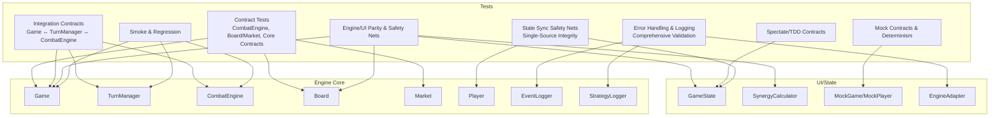

**Diagram sources**
- [test_combat_engine_contract.py:1-355](file://tests/test_combat_engine_contract.py#L1-L355)
- [test_engine_board_market.py:1-142](file://tests/test_engine_board_market.py#L1-L142)
- [test_engine_core_contracts.py:1-314](file://tests/test_engine_core_contracts.py#L1-L314)
- [test_engine_bridge_contracts.py:1-403](file://tests/test_engine_bridge_contracts.py#L1-L403)
- [test_refactor_safety_net_c1_c2_c4.py:1-126](file://tests/test_refactor_safety_net_c1_c2_c4.py#L1-L126)
- [test_c5_error_handling_safety_net.py:1-73](file://tests/test_c5_error_handling_safety_net.py#L1-L73)
- [test_player_cards_bought_single_source.py:1-42](file://tests/test_player_cards_bought_single_source.py#L1-L42)
- [test_synergy_single_source_contract.py:1-75](file://tests/test_synergy_single_source_contract.py#L1-L75)
- [test_engine_mock.py:1-90](file://tests/test_engine_mock.py#L1-L90)
- [test_spectate_tdd.py:1-53](file://tests/test_spectate_tdd.py#L1-L53)
- [test_engine_turn_flow_smoke.py:1-136](file://tests/test_engine_turn_flow_smoke.py#L1-L136)

**Section sources**
- [pytest.ini:1-5](file://pytest.ini#L1-L5)
- [conftest.py:1-27](file://tests/conftest.py#L1-L27)

## Core Components
- Contract tests define strict behavioral invariants for engine subsystems and cross-module interactions. They ensure output shapes, score decomposition invariants, and delegation contracts between Game, TurnManager, and CombatEngine remain intact across refactor cycles.
- Integration contracts verify that Game delegates lifecycle events to TurnManager and that CombatEngine receives correct inputs and produces outputs compatible with Game's state.
- Engine/UI parity tests validate that engine computations (e.g., synergy bonuses) match UI calculations, preventing divergence between engine and UI logic.
- QA safety nets protect against null references, invalid indices, and missing subsystems by returning explicit error results instead of crashing, with comprehensive logging for debugging.
- Mock contracts enforce deterministic fixtures and state for UI and engine interactions, enabling reproducible validation of UI behaviors.
- Spectate/TDD contracts ensure view isolation and action gating so that spectator views cannot mutate state unintentionally.
- Smoke/regression tests exercise full turn flows, elimination mechanics, and end-of-game conditions under controlled fixtures.
- State synchronization safety nets ensure single-source data integrity for player state variables, preventing inconsistent state across different access methods.
- Comprehensive logging framework provides detailed event tracking for debugging, monitoring, and performance analysis.

**Updated** Enhanced error handling validation with comprehensive logging improvements, new test coverage for state synchronization safety nets, and expanded contract testing for single-source data integrity.

**Section sources**
- [test_combat_engine_contract.py:1-355](file://tests/test_combat_engine_contract.py#L1-L355)
- [test_engine_core_contracts.py:1-314](file://tests/test_engine_core_contracts.py#L1-L314)
- [test_engine_board_market.py:1-142](file://tests/test_engine_board_market.py#L1-L142)
- [test_engine_bridge_contracts.py:1-403](file://tests/test_engine_bridge_contracts.py#L1-L403)
- [test_refactor_safety_net_c1_c2_c4.py:1-126](file://tests/test_refactor_safety_net_c1_c2_c4.py#L1-L126)
- [test_c5_error_handling_safety_net.py:1-73](file://tests/test_c5_error_handling_safety_net.py#L1-L73)
- [test_player_cards_bought_single_source.py:1-42](file://tests/test_player_cards_bought_single_source.py#L1-L42)
- [test_synergy_single_source_contract.py:1-75](file://tests/test_synergy_single_source_contract.py#L1-L75)
- [test_engine_mock.py:1-90](file://tests/test_engine_mock.py#L1-L90)
- [test_spectate_tdd.py:1-53](file://tests/test_spectate_tdd.py#L1-L53)
- [test_engine_turn_flow_smoke.py:1-136](file://tests/test_engine_turn_flow_smoke.py#L1-L136)

## Architecture Overview
The validation architecture centers on three pillars:
- Deterministic fixtures and mocks to isolate and stabilize test inputs
- Strict contract assertions that act as regression checkpoints
- Cross-layer bridges validated via integration tests (Game ↔ TurnManager ↔ CombatEngine)
- Comprehensive logging and error handling for robust debugging and monitoring

**Updated** Added comprehensive logging framework and enhanced error handling validation throughout the architecture.

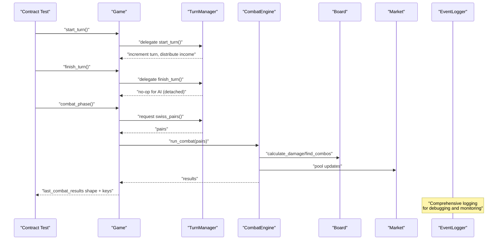

**Diagram sources**
- [test_engine_bridge_contracts.py:93-146](file://tests/test_engine_bridge_contracts.py#L93-L146)
- [test_engine_bridge_contracts.py:215-276](file://tests/test_engine_bridge_contracts.py#L215-L276)
- [test_combat_engine_contract.py:249-355](file://tests/test_combat_engine_contract.py#L249-L355)
- [engine_core/game.py](file://engine_core/game.py)
- [engine_core/combat_engine.py](file://engine_core/combat_engine.py)
- [engine_core/board.py](file://engine_core/board.py)
- [engine_core/market.py](file://engine_core/market.py)
- [engine_core/event_logger.py](file://engine_core/event_logger.py)

## Detailed Component Analysis

### Contract Testing: CombatEngine Isolation and Output Invariants
- Purpose: Validate that CombatEngine can be instantiated independently of Game, produces results with a fixed schema, and that Game delegates combat execution to CombatEngine.
- Key validations:
  - Instantiation without Game
  - run_combat returns list with expected keys per pair
  - Score decomposition invariants (points equal kill + combo + synergy)
  - Winner and HP snapshot invariants
  - Delegation from Game.combat_phase to CombatEngine.run_combat
  - last_combat_results synchronization and reset semantics

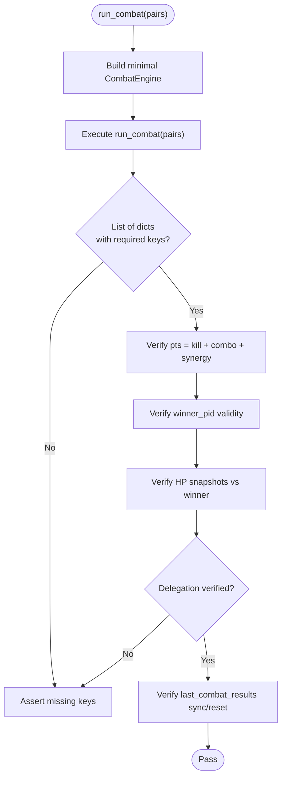

**Diagram sources**
- [test_combat_engine_contract.py:82-171](file://tests/test_combat_engine_contract.py#L82-L171)
- [test_combat_engine_contract.py:177-243](file://tests/test_combat_engine_contract.py#L177-L243)
- [test_combat_engine_contract.py:249-355](file://tests/test_combat_engine_contract.py#L249-L355)

**Section sources**
- [test_combat_engine_contract.py:1-355](file://tests/test_combat_engine_contract.py#L1-L355)

### Integration Contracts: Game ↔ TurnManager ↔ CombatEngine
- Purpose: Enforce that Game delegates lifecycle and pairing responsibilities to TurnManager and that CombatEngine remains the authoritative combat executor.
- Key validations:
  - Game has TurnManager and CombatEngine attributes
  - start_turn/finish_turn delegate to TurnManager
  - combat_phase obtains pairs from TurnManager and delegates to CombatEngine
  - Turn counter synchronization across Game and TurnManager
  - Smoke test via game_factory build_game()

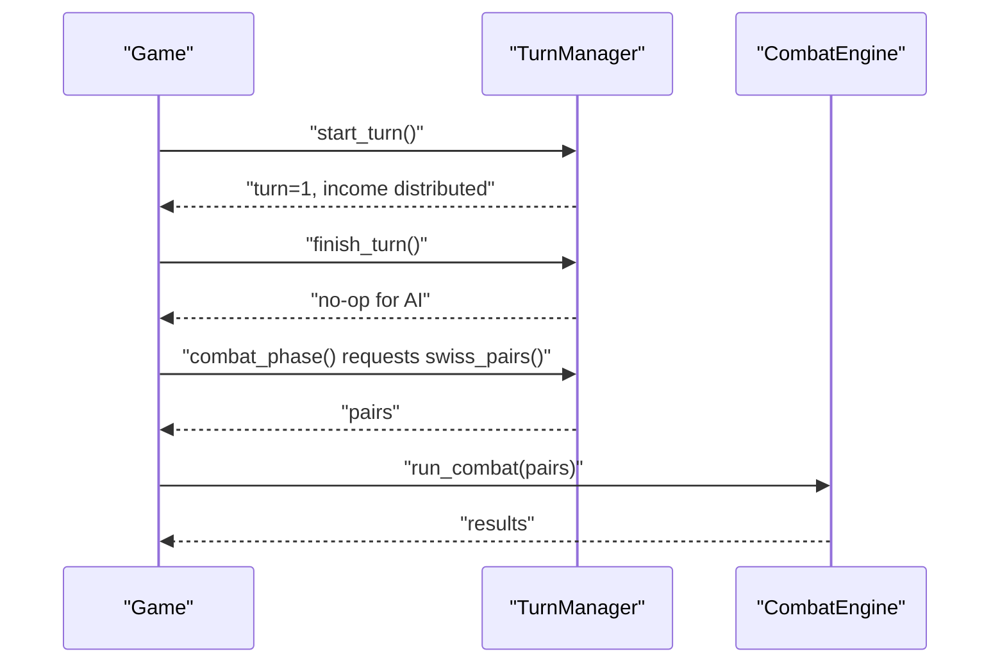

**Diagram sources**
- [test_engine_bridge_contracts.py:49-87](file://tests/test_engine_bridge_contracts.py#L49-L87)
- [test_engine_bridge_contracts.py:93-146](file://tests/test_engine_bridge_contracts.py#L93-L146)
- [test_engine_bridge_contracts.py:151-210](file://tests/test_engine_bridge_contracts.py#L151-L210)
- [test_engine_bridge_contracts.py:215-276](file://tests/test_engine_bridge_contracts.py#L215-L276)
- [test_engine_bridge_contracts.py:307-348](file://tests/test_engine_bridge_contracts.py#L307-L348)
- [test_engine_bridge_contracts.py:354-403](file://tests/test_engine_bridge_contracts.py#L354-L403)

**Section sources**
- [test_engine_bridge_contracts.py:1-403](file://tests/test_engine_bridge_contracts.py#L1-L403)

### Core Engine Contracts: Damage Formula, Market Bridge, Swiss Pairs, Gold Sync, Endgame Stats, Loop Guard
- Purpose: Establish invariants for core systems and their bridges to UI/GameState.
- Key validations:
  - calculate_damage formula, caps, and turn scaling
  - Market → GameState.get_shop() bridge behavior
  - Swiss pairing determinism and exclusion of eliminated players
  - Income and interest synchronization with UI
  - Endgame ranking and inclusion of all players
  - game.run() loop guard and winner selection logic

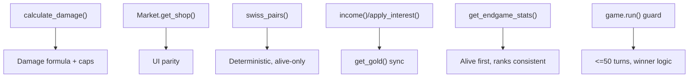

**Diagram sources**
- [test_engine_core_contracts.py:59-100](file://tests/test_engine_core_contracts.py#L59-L100)
- [test_engine_core_contracts.py:105-133](file://tests/test_engine_core_contracts.py#L105-L133)
- [test_engine_core_contracts.py:138-174](file://tests/test_engine_core_contracts.py#L138-L174)
- [test_engine_core_contracts.py:179-208](file://tests/test_engine_core_contracts.py#L179-L208)
- [test_engine_core_contracts.py:213-249](file://tests/test_engine_core_contracts.py#L213-L249)
- [test_engine_core_contracts.py:254-277](file://tests/test_engine_core_contracts.py#L254-L277)

**Section sources**
- [test_engine_core_contracts.py:1-314](file://tests/test_engine_core_contracts.py#L1-L314)

### Board and Market Contracts: Rarity Gates, Window Handling, Coord Indexing, Combo Scoring, Damage Scaling
- Purpose: Validate board placement, combo detection, market window mechanics, and damage calculation behavior.
- Key validations:
  - Rarity weight curve steps by turn
  - Market window respects early-game gates and updates roll stats
  - Return unsold restores only non-bought cards
  - Board place/remove keeps coordinate index synchronized
  - Combo counting counts unique neighbor pairs once
  - Prefix bonus distribution in single combat
  - Early/late damage caps and scaling

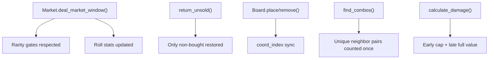

**Diagram sources**
- [test_engine_board_market.py:44-64](file://tests/test_engine_board_market.py#L44-L64)
- [test_engine_board_market.py:67-84](file://tests/test_engine_board_market.py#L67-L84)
- [test_engine_board_market.py:87-102](file://tests/test_engine_board_market.py#L87-L102)
- [test_engine_board_market.py:104-121](file://tests/test_engine_board_market.py#L104-L121)
- [test_engine_board_market.py:123-142](file://tests/test_engine_board_market.py#L123-L142)

**Section sources**
- [test_engine_board_market.py:1-142](file://tests/test_engine_board_market.py#L1-L142)

### Engine/UI Parity and Refactor Safety Nets
- Purpose: Ensure engine computations match UI calculations and that legacy assignments remain synchronized with single-source-of-truth stats.
- Key validations:
  - Direct board remove invalidation updates public state
  - Engine synergy score equals UI SynergyCalculator computation across layouts
  - Legacy assignment and income reset keep stats synchronized

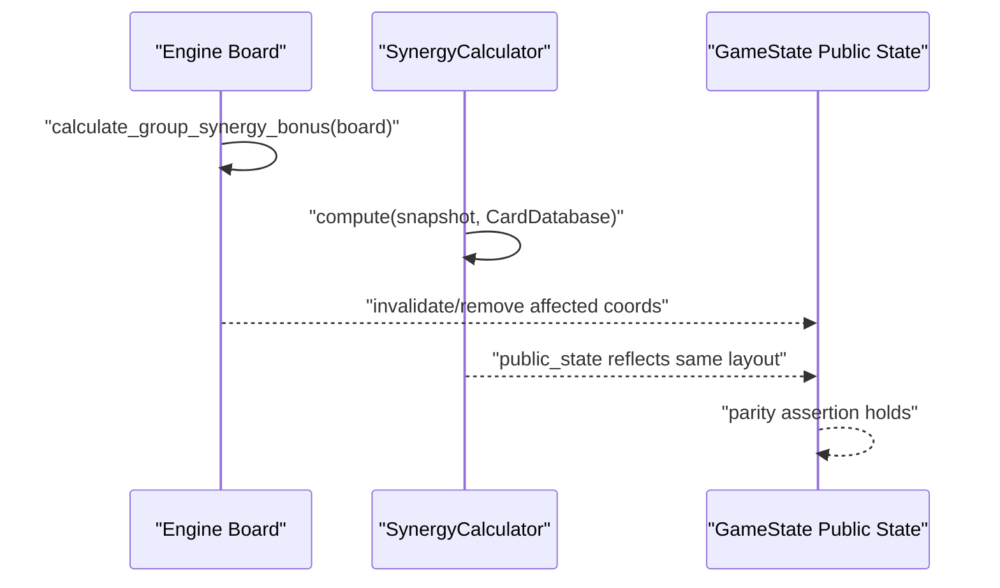

**Diagram sources**
- [test_refactor_safety_net_c1_c2_c4.py:67-82](file://tests/test_refactor_safety_net_c1_c2_c4.py#L67-L82)
- [test_refactor_safety_net_c1_c2_c4.py:92-110](file://tests/test_refactor_safety_net_c1_c2_c4.py#L92-L110)
- [test_refactor_safety_net_c1_c2_c4.py:112-126](file://tests/test_refactor_safety_net_c1_c2_c4.py#L112-L126)

**Section sources**
- [test_refactor_safety_net_c1_c2_c4.py:1-126](file://tests/test_refactor_safety_net_c1_c2_c4.py#L1-L126)

### State Synchronization Safety Nets: Single-Source Data Integrity
- Purpose: Ensure single-source-of-truth data integrity for player state variables across different access methods and prevent inconsistent state.
- Key validations:
  - Player cards_bought_this_turn property setter keeps stats dictionary synchronized
  - Property getter and setter maintain consistent state
  - Reset operations clear both internal counter and stats dictionary
  - EngineAdapter gracefully handles missing player state with fallbacks

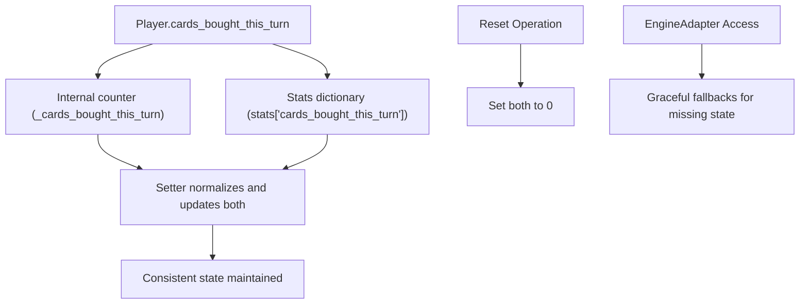

**Diagram sources**
- [test_player_cards_bought_single_source.py:21-42](file://tests/test_player_cards_bought_single_source.py#L21-L42)
- [engine_core/player.py:99-108](file://engine_core/player.py#L99-L108)
- [v2/core/engine_adapter.py:55-60](file://v2/core/engine_adapter.py#L55-L60)

**Section sources**
- [test_player_cards_bought_single_source.py:1-42](file://tests/test_player_cards_bought_single_source.py#L1-L42)
- [engine_core/player.py:1-250](file://engine_core/player.py#L1-L250)

### QA Safety Nets: Enhanced Error Handling and Graceful Degradation
- Purpose: Prevent crashes on invalid reads/writes and missing subsystems; return explicit error results with comprehensive logging for debugging.
- Key validations:
  - Invalid player reads return safe defaults with warning logs
  - Mutation calls fail gracefully with explicit error codes and exception logs
  - Missing market handled with safe fallbacks and graceful degradation
  - Missing board shim during placement succeeds deterministically with logging
  - EngineAdapter provides comprehensive error handling with structured logging

**Updated** Enhanced with comprehensive logging improvements and structured error handling patterns.

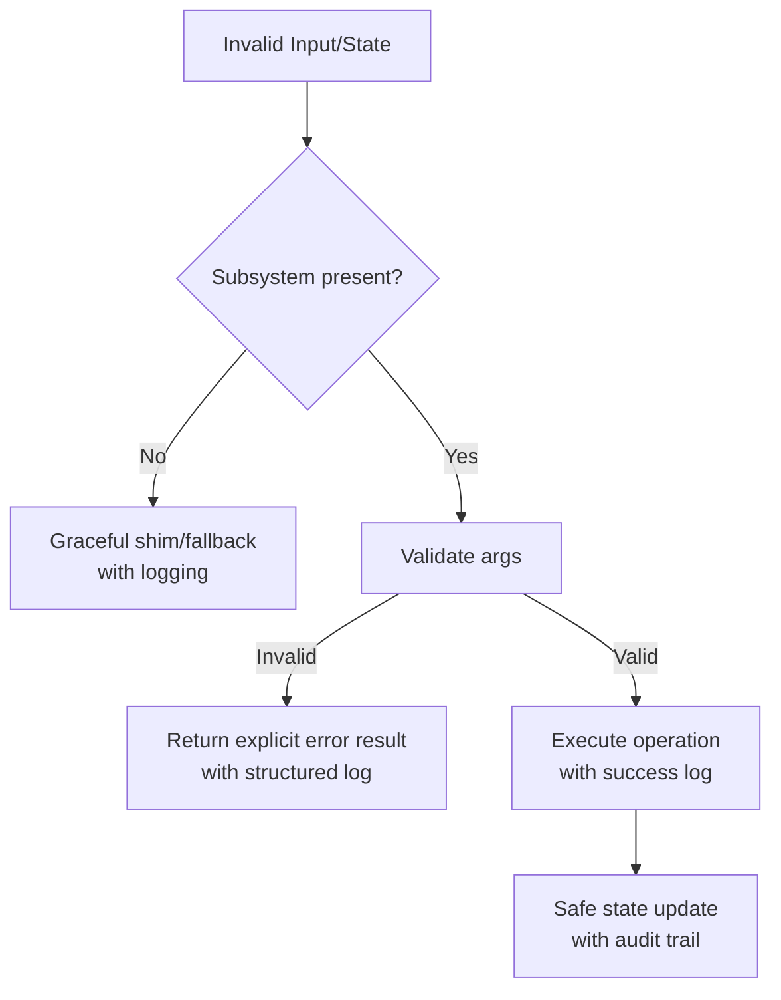

**Diagram sources**
- [test_c5_error_handling_safety_net.py:27-73](file://tests/test_c5_error_handling_safety_net.py#L27-L73)
- [v2/core/engine_adapter.py:55-175](file://v2/core/engine_adapter.py#L55-L175)
- [v2/core/action_result.py:1-14](file://v2/core/action_result.py#L1-L14)

**Section sources**
- [test_c5_error_handling_safety_net.py:1-73](file://tests/test_c5_error_handling_safety_net.py#L1-L73)
- [v2/core/engine_adapter.py:1-301](file://v2/core/engine_adapter.py#L1-L301)
- [v2/core/action_result.py:1-14](file://v2/core/action_result.py#L1-L14)

### Comprehensive Logging Framework: Debugging and Monitoring
- Purpose: Provide detailed event tracking, debugging capabilities, and performance monitoring for production and testing environments.
- Key validations:
  - EventLogger captures detailed card purchase, board placement, combat, and synergy events
  - StrategyLogger tracks strategic analytics, passive triggers, and performance metrics
  - Structured logging with JSONL format for efficient processing and analysis
  - Buffer management and automatic flushing for performance optimization
  - Comprehensive game lifecycle tracking from start to completion

**Updated** Added comprehensive logging framework documentation for debugging and monitoring.

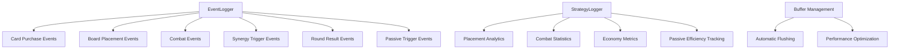

**Diagram sources**
- [engine_core/event_logger.py:22-251](file://engine_core/event_logger.py#L22-L251)
- [engine_core/strategy_logger.py:52-591](file://engine_core/strategy_logger.py#L52-L591)

**Section sources**
- [engine_core/event_logger.py:1-251](file://engine_core/event_logger.py#L1-L251)
- [engine_core/strategy_logger.py:1-591](file://engine_core/strategy_logger.py#L1-L591)

### Mock Contracts: Deterministic Fixtures and State
- Purpose: Provide deterministic engine fixtures for UI and engine interactions, ensuring reproducible validation of UI behaviors.
- Key validations:
  - Initial state determinism (turn, state, players)
  - Deterministic player fixture with known HP/Gold
  - New MockPlayer fields (win_streak, alive, copies, stats, passive_buff_log)
  - New MockGame fields (last_combat_results)
  - Buy card updates copies; reroll updates market_rolls

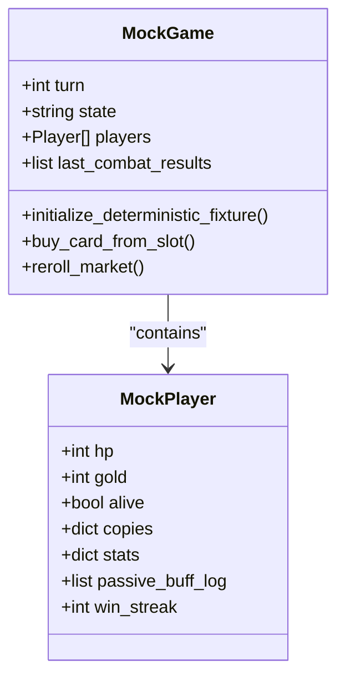

**Diagram sources**
- [test_engine_mock.py:4-25](file://tests/test_engine_mock.py#L4-L25)
- [test_engine_mock.py:29-58](file://tests/test_engine_mock.py#L29-L58)
- [test_engine_mock.py:61-90](file://tests/test_engine_mock.py#L61-L90)

**Section sources**
- [test_engine_mock.py:1-90](file://tests/test_engine_mock.py#L1-L90)

### Spectate/TDD Contracts: View Isolation and Action Gating
- Purpose: Ensure spectator views cannot mutate state and that data getters follow the current view index.
- Key validations:
  - Data getters reflect view_index
  - Write operations fail with ownership error when view_index != 0

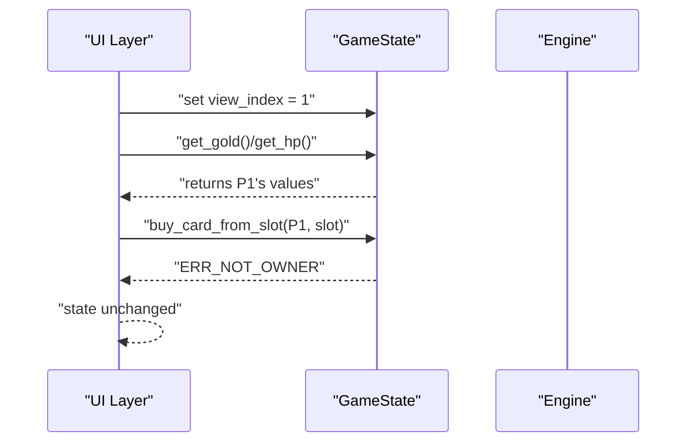

**Diagram sources**
- [test_spectate_tdd.py:15-34](file://tests/test_spectate_tdd.py#L15-L34)
- [test_spectate_tdd.py:35-53](file://tests/test_spectate_tdd.py#L35-L53)

**Section sources**
- [test_spectate_tdd.py:1-53](file://tests/test_spectate_tdd.py#L1-L53)

### Smoke and Regression: Turn Flow, Elimination, and End-of-Game
- Purpose: Exercise full turn cycles, elimination mechanics, and end-of-game conditions under controlled fixtures.
- Key validations:
  - Eliminated players drop out of alive filters and cleanup state
  - Pair count adjusts on subsequent turns after elimination
  - game.run() reaches a single winner within loop guard

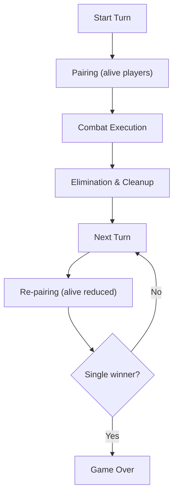

**Diagram sources**
- [test_engine_turn_flow_smoke.py:55-96](file://tests/test_engine_turn_flow_smoke.py#L55-L96)
- [test_engine_turn_flow_smoke.py:98-115](file://tests/test_engine_turn_flow_smoke.py#L98-L115)

**Section sources**
- [test_engine_turn_flow_smoke.py:1-136](file://tests/test_engine_turn_flow_smoke.py#L1-L136)

### Single-Source Contract Validation: Engine vs UI Synergy Calculation
- Purpose: Ensure engine-side synergy calculations match UI-side calculations for identical board states, maintaining single-source-of-truth integrity.
- Key validations:
  - Engine calculate_group_synergy_bonus matches SynergyCalculator compute
  - Card database integration for real card data validation
  - Connected shape testing with rotations and edge matches
  - Consistent scoring across different board configurations

**Updated** Added comprehensive single-source contract validation for engine/UI parity.

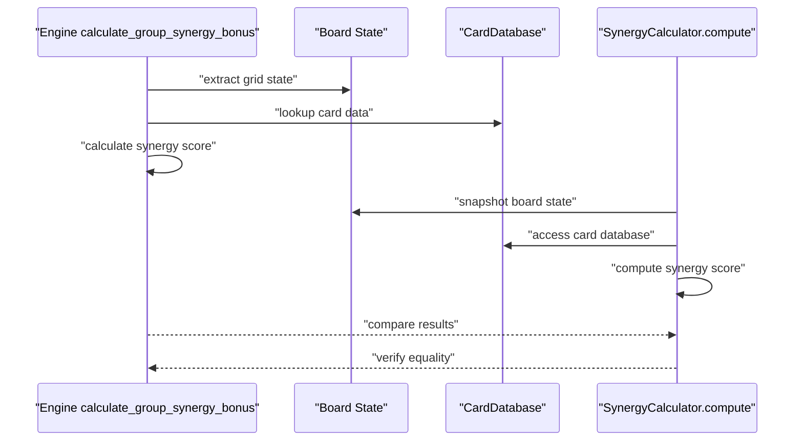

**Diagram sources**
- [test_synergy_single_source_contract.py:45-75](file://tests/test_synergy_single_source_contract.py#L45-L75)
- [engine_core/board.py:196-248](file://engine_core/board.py#L196-L248)

**Section sources**
- [test_synergy_single_source_contract.py:1-75](file://tests/test_synergy_single_source_contract.py#L1-L75)
- [engine_core/board.py:1-449](file://engine_core/board.py#L1-L449)

## Dependency Analysis
- Test harness configuration sets environment variables and initializes a headless Pygame display to avoid hardware dependencies during tests.
- Markers define known bug categories to track regressions and guide triage.
- Tests import engine modules directly to validate contracts and integration points.
- Comprehensive logging framework supports both development and production monitoring.
- Enhanced error handling provides structured logging for debugging and monitoring.

**Updated** Enhanced with comprehensive logging framework and structured error handling dependencies.

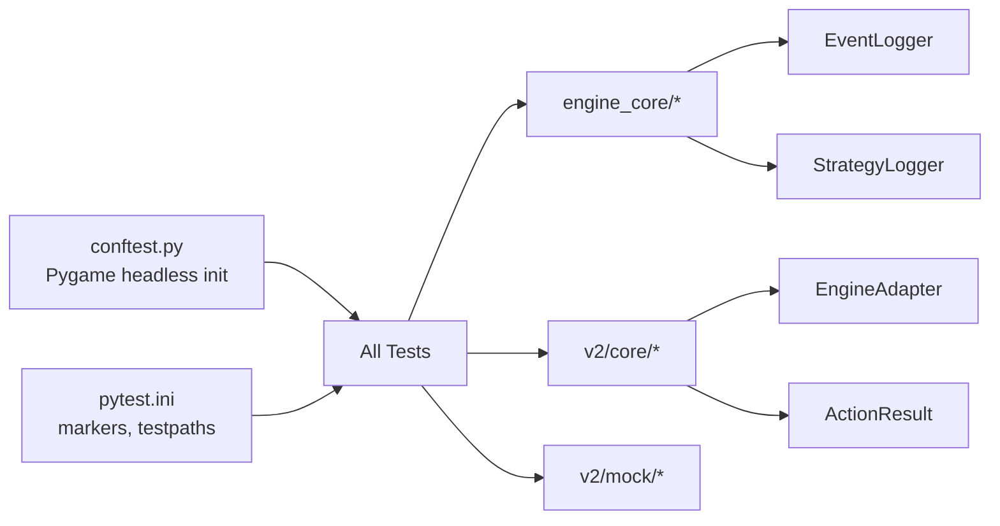

**Diagram sources**
- [conftest.py:15-27](file://tests/conftest.py#L15-L27)
- [pytest.ini:1-5](file://pytest.ini#L1-L5)
- [engine_core/event_logger.py:22-35](file://engine_core/event_logger.py#L22-L35)
- [engine_core/strategy_logger.py:52-82](file://engine_core/strategy_logger.py#L52-L82)
- [v2/core/engine_adapter.py:38-46](file://v2/core/engine_adapter.py#L38-L46)
- [v2/core/action_result.py:3-14](file://v2/core/action_result.py#L3-L14)

**Section sources**
- [conftest.py:1-27](file://tests/conftest.py#L1-L27)
- [pytest.ini:1-5](file://pytest.ini#L1-L5)

## Performance Considerations
- Prefer deterministic fixtures and small seeds to reduce flakiness and improve repeatability.
- Use targeted mocks (e.g., MockGame) to avoid expensive UI initialization during validation.
- Keep integration tests focused on delegation contracts and result shapes to minimize runtime overhead while maximizing coverage of critical paths.
- Leverage comprehensive logging framework for performance monitoring without impacting test execution speed.
- Implement buffer management and automatic flushing for optimal logging performance.

**Updated** Added performance considerations for comprehensive logging framework.

## Troubleshooting Guide
Common validation challenges and resolutions:
- Headless rendering failures: Ensure SDL_VIDEODRIVER is set to dummy via the test fixture initialization.
- Known bugs: Use the known_bug marker to categorize and track tests that document known behavior until fixed.
- Null subsystems: Utilize the enhanced error handling safety net tests to confirm graceful degradation and explicit error codes with comprehensive logging.
- Determinism: Initialize deterministic fixtures for MockGame and use fixed seeds for RNG to stabilize tests.
- Logging issues: Configure EventLogger and StrategyLogger for detailed debugging information and performance monitoring.
- State synchronization problems: Use single-source contract tests to validate engine/UI parity and data integrity.

**Updated** Enhanced troubleshooting guide with logging and state synchronization guidance.

Debugging tools and techniques:
- Use the debug simulation utility to step through engine simulations and inspect intermediate states.
- Leverage comprehensive logging framework for detailed event tracking and performance analysis.
- Add targeted print statements or logging around critical paths in engine_core modules for quick local inspection.
- Utilize EngineAdapter with structured logging for comprehensive error tracking and debugging.
- Monitor StrategyLogger output for performance metrics and strategic analytics during validation.

**Section sources**
- [conftest.py:15-27](file://tests/conftest.py#L15-L27)
- [pytest.ini:3-5](file://pytest.ini#L3-L5)
- [test_c5_error_handling_safety_net.py:27-52](file://tests/test_c5_error_handling_safety_net.py#L27-L52)
- [engine_core/event_logger.py:22-251](file://engine_core/event_logger.py#L22-L251)
- [engine_core/strategy_logger.py:52-591](file://engine_core/strategy_logger.py#L52-L591)
- [tools/debug_sim.py](file://tools/debug_sim.py)

## Conclusion
The validation and verification strategy combines strict contract tests, integration validations, engine/UI parity checks, QA safety nets, deterministic mocks, and smoke/regression tests. The enhanced framework now includes comprehensive logging improvements, state synchronization safety nets, and expanded single-source data integrity validation. Together, these ensure that Game, TurnManager, and CombatEngine collaborate correctly, that engine computations align with UI logic, and that the system remains robust under invalid inputs and missing subsystems. The comprehensive logging framework provides detailed debugging capabilities, while structured error handling ensures graceful degradation with informative logging. Automated test runs, quality gates, and markers support continuous validation and regression prevention across refactor cycles.

**Updated** Enhanced conclusion reflecting comprehensive logging improvements, state synchronization safety nets, and expanded single-source data integrity validation.

## Appendices
- Example test references for validation procedures:
  - Contract tests for CombatEngine: [test_combat_engine_contract.py:1-355](file://tests/test_combat_engine_contract.py#L1-L355)
  - Core engine contracts: [test_engine_core_contracts.py:1-314](file://tests/test_engine_core_contracts.py#L1-L314)
  - Board and market contracts: [test_engine_board_market.py:1-142](file://tests/test_engine_board_market.py#L1-L142)
  - Integration contracts (Game ↔ TurnManager ↔ CombatEngine): [test_engine_bridge_contracts.py:1-403](file://tests/test_engine_bridge_contracts.py#L1-L403)
  - Engine/UI parity and safety nets: [test_refactor_safety_net_c1_c2_c4.py:1-126](file://tests/test_refactor_safety_net_c1_c2_c4.py#L1-L126)
  - Enhanced QA safety nets with logging: [test_c5_error_handling_safety_net.py:1-73](file://tests/test_c5_error_handling_safety_net.py#L1-L73)
  - State synchronization safety nets: [test_player_cards_bought_single_source.py:1-42](file://tests/test_player_cards_bought_single_source.py#L1-L42)
  - Single-source contract validation: [test_synergy_single_source_contract.py:1-75](file://tests/test_synergy_single_source_contract.py#L1-L75)
  - Mock contracts: [test_engine_mock.py:1-90](file://tests/test_engine_mock.py#L1-L90)
  - Spectate/TDD contracts: [test_spectate_tdd.py:1-53](file://tests/test_spectate_tdd.py#L1-L53)
  - Smoke/regression: [test_engine_turn_flow_smoke.py:1-136](file://tests/test_engine_turn_flow_smoke.py#L1-L136)
  - Comprehensive logging framework: [engine_core/event_logger.py:1-251](file://engine_core/event_logger.py#L1-L251), [engine_core/strategy_logger.py:1-591](file://engine_core/strategy_logger.py#L1-L591)